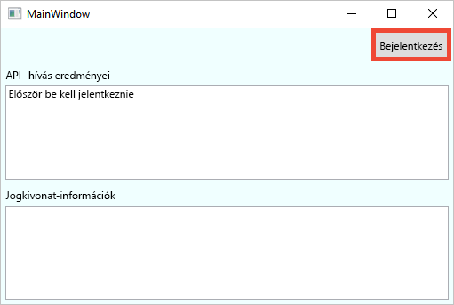
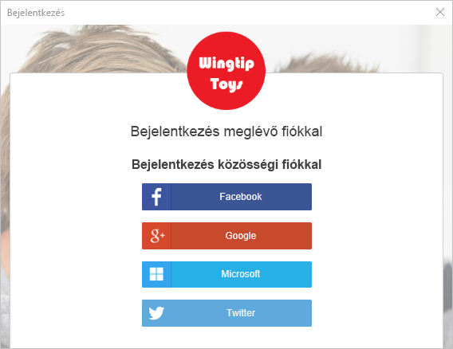
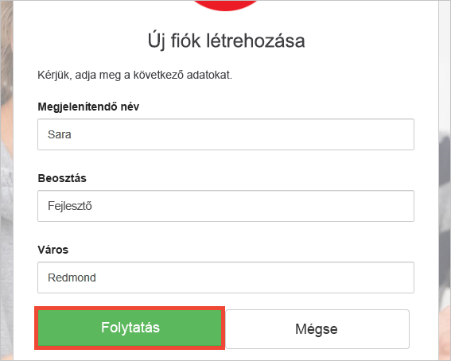
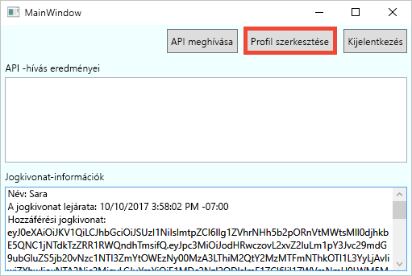
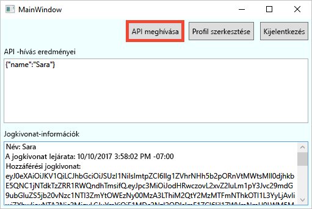

# <a name="quickstart-test-drive-an-azure-ad-b2c-enabled-desktop-app"></a>Gyors útmutató: Egy Azure AD B2C-kompatibilis asztali alkalmazás kipróbálása

Az Azure Active Directory (Azure AD) B2C felhőalapú identitáskezelést nyújt az alkalmazás, az üzlet és az ügyfelek védelme érdekében. Az Azure AD B2C nyílt szabványú protokollokkal teszi lehetővé az alkalmazások hitelesítését közösségi hálózati és vállalati fiókokon.

Ebben a gyors útmutatóban Azure AD B2C minta Windows Presentation Foundation (WPF) asztali alkalmazással jelentkezik be egy közösségi identitásszolgáltatóval, és az Azure AD B2C által védett webes API-t hív meg.

[!INCLUDE [quickstarts-free-trial-note](../../includes/quickstarts-free-trial-note.md)]

## <a name="prerequisites"></a>Előfeltételek

* [Visual Studio 2017](https://www.visualstudio.com/downloads/) az **ASP.NET és webfejlesztési** számítási feladattal. 
* Egy Facebook, Google, Microsoft vagy Twitter közösségi fiók.

## <a name="download-the-sample"></a>A minta letöltése

[Töltse le a zip-fájlt](https://github.com/Azure-Samples/active-directory-b2c-dotnet-desktop/archive/master.zip), vagy a klónozza a mintául szolgáló webalkalmazást a GitHubról.

```
git clone https://github.com/Azure-Samples/active-directory-b2c-dotnet-desktop.git
```

## <a name="run-the-app-in-visual-studio"></a>Az alkalmazás futtatása a Visual Studióban

A mintaalkalmazás projektmappájában nyissa meg a `active-directory-b2c-wpf.sln` megoldást a Visual Studióban.

Nyomja le az **F5** billentyűt az alkalmazás hibakereséséhez.

## <a name="create-an-account"></a>Fiók létrehozása

Kattintson a **Sign in** (Bejelentkezés) gombra a **Sign Up or Sign In** (Regisztráció vagy bejelentkezés) munkafolyamat elindításához Azure AD B2C szabályzat alapján.



A minta több regisztrációs beállítást is támogat, beleértve a közösségi identitásszolgáltató használatát vagy helyi fiók e-mail-címmel való létrehozását. Ehhez a gyors útmutatóhoz Facebook, Google vagy Twitter közösségi identitásszolgáltatótól származó fiókot használjon. 

### <a name="sign-up-using-a-social-identity-provider"></a>Regisztráció közösségi identitásszolgáltatóval

Az Azure AD B2C a minta-webalkalmazáshoz egy Wingtip Toys nevű fiktív márka egyéni bejelentkezési lapját jeleníti meg. 

1. Ha közösségi identitásszolgáltatóval szeretne regisztrálni, kattintson a használni kívánt identitásszolgáltató gombjára. 

    

    Hitelesíti magát (bejelentkezik) a közösségi fiók hitelesítő adataival, és feljogosítja az alkalmazást, hogy beolvassa a közösségi fiók adatait. A hozzáférés biztosításával az alkalmazás profiladatokat kérhet le a közösségi fiókból, például a nevét és a települését. 

2. Fejezze be az identitásszolgáltató bejelentkezési folyamatát. Ha például a Twittert választotta, írja be a Twitter-fiók hitelesítő adatait, majd kattintson **Sign in** (Bejelentkezés) gombra.

    

    Az új fiókprofil részletei előre ki vannak töltve a közösségi fiókja adataival. 

3. Ha szeretné, módosítsa az adatokat, majd kattintson a **Folytatás** lehetőségre. A rendszer a beírt értékeket használja az Azure AD B2C felhasználói fiókprofilhoz.

    

    Sikeresen létrehozott egy új, identitásszolgáltatót használó Azure AD B2C felhasználói fiókot. A bejelentkezés után a *Token info* (Jogkivonat adatai) szövegmezőben megjelenik a hozzáférési jogkivonat. A hozzáférési jogkivonatot a rendszer az API-erőforráshoz való hozzáféréskor használja.

## <a name="edit-your-profile"></a>Saját profil szerkesztése

Az Azure Active Directory B2C-funkcióival a felhasználók frissíthetik a profiljukat.  A minta-webalkalmazás Azure AD B2C-profilszerkesztési szabályzatot használ a munkafolyamathoz. 

1. Kattintson az **Edit profile** (Profil szerkesztése) gombra a létrehozott profil szerkesztéséhez.

    

2. Válassza ki a létrehozott fiókhoz rendelt identitásszolgáltatót. Ha például a Twittert használta identitásszolgáltatóként a fiók létrehozásakor, válassza a Twittert a hozzárendelt profil adatainak módosításához.

3. Módosítsa a **Display name** (Megjelenített név) és a **City** (Város) mezőket, majd kattintson a **Continue** (Folytatás) gombra.

    Ekkor a *Token info* (Jogkivonat adatai) szövegmezőben megjelenik egy új hozzáférési jogkivonat. Ha szeretné ellenőrizni a profilján végzett módosításokat, másolja és illessze be a hozzáférési jogkivonatot a https://jwt.ms jogkivonat-dekóderbe.

## <a name="access-a-protected-web-api-resource"></a>Védett webes API-erőforrás elérése

Kattintson az **API meghívása** elemre, amellyel kérést küldhet az Azure AD B2C által védett https://fabrikamb2chello.azurewebsites.net/hello erőforrásnak. 



Az alkalmazás a védett webes API-erőforrás felé küldött kérésbe belefoglalja az Azure AD hozzáférési jogkivonatot. A webes API a hozzáférési jogkivonatban található megjelenített nevet küldi vissza.

Az Azure AD B2C felhasználói fiókkal sikeresen végzett hitelesített hívást egy Azure AD B2C által védett webes API-n.

## <a name="clean-up-resources"></a>Az erőforrások eltávolítása

Az Azure AD B2C-bérlőt ahhoz is használhatja, ha más Azure AD B2C gyors útmutatókat vagy oktatóanyagokat is ki szeretne próbálni. Ha már nincs szüksége rá, akkor [törölheti az Azure AD B2C-bérlőt](active-directory-b2c-faqs.md#how-do-i-delete-my-azure-ad-b2c-tenant).

## <a name="next-steps"></a>További lépések

A következő lépés egy saját Azure AD B2C-bérlő létrehozása és a minta konfigurálása a bérlővel való futtatáshoz. 

> [!div class="nextstepaction"]
> [Azure Active Directory B2C-bérlő létrehozása az Azure Portalon](active-directory-b2c-get-started.md)
