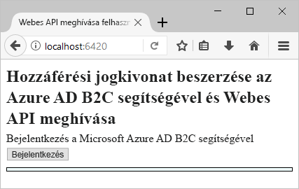
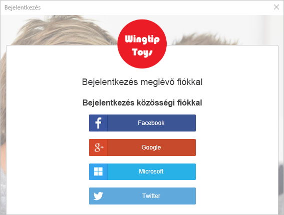
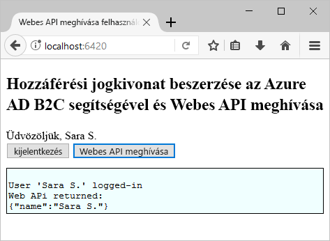

# <a name="quickstart-set-up-sign-in-for-a-single-page-app-using-azure-active-directory-b2c"></a>Gyors útmutató: Jelentkezzen be az Azure Active Directory B2C egyoldalas alkalmazás beállítása

Az Azure Active Directory (Azure AD) B2C felhőalapú identitáskezelést nyújt az alkalmazás, az üzlet és az ügyfelek védelme érdekében. Az Azure AD B2C nyílt szabványú protokollokkal teszi lehetővé az alkalmazások hitelesítését közösségi hálózati és vállalati fiókokon. Ebben a rövid útmutatóban egy egyoldalas alkalmazással és egy közösségi identitásszolgáltatóval fog bejelentkezni, és meghív egy, az Azure AD B2C által védett webes API-t.

[!INCLUDE [quickstarts-free-trial-note](../../includes/quickstarts-free-trial-note.md)]

## <a name="prerequisites"></a>Előfeltételek

- [Visual Studio 2017](https://www.visualstudio.com/downloads/) az **ASP.NET és webfejlesztési** számítási feladattal.
- [Node.js](https://nodejs.org/en/download/) telepítése
- Egy Facebook, Google, Microsoft vagy Twitter közösségi fiók.
- [Töltse le a zip-fájlt](https://github.com/Azure-Samples/active-directory-b2c-javascript-msal-singlepageapp/archive/master.zip), vagy a klónozza a mintául szolgáló webalkalmazást a GitHubról.

    ```
    git clone https://github.com/Azure-Samples/active-directory-b2c-javascript-msal-singlepageapp.git
    ```

## <a name="run-the-application"></a>Az alkalmazás futtatása

1. Indítsa el a kiszolgálót úgy, hogy futtatja a következő parancsokat a Node.js-parancssorban: 

    ```
    cd active-directory-b2c-javascript-msal-singlepageapp
    npm install && npm update
    node server.js
    ```

    A Server.js megadja a helyi gazdagépen figyelt port számát.

    ```
    Listening on port 6420...
    ```

2. Nyissa meg az alkalmazás URL-címét. Például: `http://localhost:6420`.

## <a name="sign-in-using-your-account"></a>Bejelentkezés saját fiókkal

1. A munkafolyamat indításához kattintson a **bejelentkezési** gombra.

    

    A minta több regisztrációs beállítást is támogat, beleértve a közösségi identitásszolgáltató használatát vagy helyi fiók e-mail-címmel való létrehozását. Ehhez a gyors útmutatóhoz Facebook, Google vagy Twitter közösségi identitásszolgáltatótól származó fiókot használjon. 

2. Az Azure AD B2C a minta-webalkalmazáshoz egy Wingtip Toys nevű fiktív márka egyéni bejelentkezési lapját jeleníti meg. Ha közösségi identitásszolgáltatóval szeretne regisztrálni, kattintson a használni kívánt identitásszolgáltató gombjára.

    

    Hitelesíti magát (bejelentkezik) a közösségi fiók hitelesítő adataival, és feljogosítja az alkalmazást, hogy beolvassa a közösségi fiók adatait. A hozzáférés biztosításával az alkalmazás profiladatokat kérhet le a közösségi fiókból, például a nevét és a települését. 

3. Fejezze be az identitásszolgáltató bejelentkezési folyamatát.

## <a name="access-a-protected-api-resource"></a>Védett API-erőforrás elérése

Kattintson a **webes API-t meghívó** gombra a megjelenítendő név JSON-objektumként való visszaadásához a webes API meghívásából. 



Az egyoldalas mintaalkalmazás a védett webes API-erőforrás felé küldött kérésbe belefoglal egy hozzáférési jogkivonatot.

## <a name="clean-up-resources"></a>Az erőforrások eltávolítása

Az Azure AD B2C-bérlőt ahhoz is használhatja, ha más Azure AD B2C gyors útmutatókat vagy oktatóanyagokat is ki szeretne próbálni. Ha már nincs szüksége rá, akkor [törölheti az Azure AD B2C-bérlőt](active-directory-b2c-faqs.md#how-do-i-delete-my-azure-ad-b2c-tenant).

## <a name="next-steps"></a>További lépések

Ebben a rövid útmutatóban egy egyoldalas mintaalkalmazással bejelentkezett egy egyéni bejelentkezési oldalon egy közösségi identitásszolgáltatóval, létrehozott egy Azure AD B2C-fiókot, és meghívott egy, az Azure AD B2C által védett webes API-t. 

Most már hozzákezdhet saját Azure AD B2C-bérlőjének létrehozásához.

> [!div class="nextstepaction"]
> [Azure Active Directory B2C-bérlő létrehozása az Azure Portalon](tutorial-create-tenant.md)