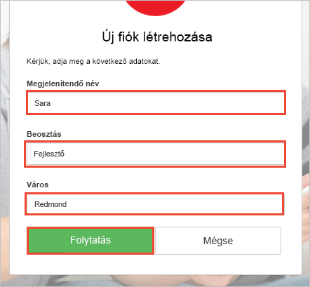

# <a name="quickstart-set-up-sign-in-for-an-aspnet-application-using-azure-active-directory-b2c"></a>Gyors útmutató: ASP.NET-alkalmazásba való bejelentkezés konfigurálása Azure Active Directory B2C-vel

Az Azure Active Directory (Azure AD) B2C felhőalapú identitáskezelést nyújt az alkalmazás, az üzlet és az ügyfelek védelme érdekében. Az Azure AD B2C nyílt szabványú protokollokkal teszi lehetővé az alkalmazások hitelesítését közösségi hálózati és vállalati fiókokon.

Ebben a gyors útmutatóban az Azure AD B2C-t használó, mintául szolgáló ASP.NET-es alkalmazással jelentkezik be egy közösségi identitásszolgáltatót használva, és az Azure AD B2C által védett webes API-t hív meg.

[!INCLUDE [quickstarts-free-trial-note](../../includes/quickstarts-free-trial-note.md)]

## <a name="prerequisites"></a>Előfeltételek

* [Visual Studio 2017](https://www.visualstudio.com/downloads/) az **ASP.NET és webfejlesztési** számítási feladattal. 
* Egy Facebook, Google, Microsoft vagy Twitter közösségi fiók.

## <a name="download-the-sample"></a>A minta letöltése

[Töltse le a zip-fájlt](https://github.com/Azure-Samples/active-directory-b2c-dotnet-webapp-and-webapi/archive/master.zip), vagy a klónozza a mintául szolgáló webalkalmazást a GitHubról.

```
git clone https://github.com/Azure-Samples/active-directory-b2c-dotnet-webapp-and-webapi.git
```

## <a name="run-the-app-in-visual-studio"></a>Az alkalmazás futtatása a Visual Studióban

A mintaalkalmazás projektmappájában nyissa meg a `B2C-WebAPI-DotNet.sln` megoldást a Visual Studióban.

Két projekt szerepel a mintául szolgáló megoldásban:

**Mintául szolgáló webalkalmazás (TaskWebApp):** webalkalmazás feladatlista létrehozáshoz és szerkesztéséhez. A webalkalmazás a **regisztrálási vagy bejelentkezési** szabályzatot használja a felhasználók regisztrálásához és bejelentkeztetéséhez.

**Mintául szolgáló webes API-alkalmazás (TaskService):** webes API, amely támogatja a feladatlista létrehozását, olvasását, frissítését és törlését. A webes API-nak az Azure AD B2C biztosít védelmet, és a webalkalmazással hívható meg.

Ebben a gyors útmutatóban egyidőben futtatja a `TaskWebApp` és a `TaskService` projektet is. 

1. Válassza ki a `B2C-WebAPI-DotNet` megoldást a Megoldáskezelőben.
2. A Visual Studio menüjében válassza a **Project > Set StartUp Projects…** (Projekt > Indítási projektek beállítása…) elemet. 
3. Válassza ki a **Több kezdőprojekt** választógombot.
4. Mindkét projektnél módosítsa a **Művelet** értékét **Indításra**. Kattintson az **OK** gombra.

Nyomja le az **F5** billentyűt mindkét alkalmazás hibakereséséhez. Mindegyik alkalmazás saját böngészőlapon nyílik meg:

`https://localhost:44316/` – Ez a lap az ASP.NET-es webalkalmazás. A gyors útmutatóban közvetlenül kommunikál az alkalmazással.
`https://localhost:44332/` – Ez a lap az ASP.NET-es webalkalmazás által meghívott webes API.

## <a name="create-an-account"></a>Fiók létrehozása

Kattintson a **Sign up / Sign in** (Regisztráció/Bejelentkezés) hivatkozásra az ASP.NET-es webalkalmazásban a **regisztrációs vagy bejelentkezési** munkafolyamat elindításához egy Azure AD B2C-szabályzat alapján.


A minta több regisztrációs beállítást is támogat, beleértve a közösségi identitásszolgáltató használatát vagy helyi fiók e-mail-címmel való létrehozását. Ehhez a gyors útmutatóhoz Facebook, Google vagy Twitter közösségi identitásszolgáltatótól származó fiókot használjon. 

### <a name="sign-up-using-a-social-identity-provider"></a>Regisztráció közösségi identitásszolgáltatóval

Az Azure AD B2C a minta-webalkalmazáshoz egy Wingtip Toys nevű fiktív márka egyéni bejelentkezési lapját jeleníti meg. 

1. Ha közösségi identitásszolgáltatóval szeretne regisztrálni, kattintson a használni kívánt identitásszolgáltató gombjára.

    

    Hitelesíti magát (bejelentkezik) a közösségi fiók hitelesítő adataival, és feljogosítja az alkalmazást, hogy beolvassa a közösségi fiók adatait. A hozzáférés biztosításával az alkalmazás profiladatokat kérhet le a közösségi fiókból, például a nevét és a települését. 

2. Fejezze be az identitásszolgáltató bejelentkezési folyamatát. Ha például a Twittert választotta, írja be a Twitter-fiók hitelesítő adatait, majd kattintson **Sign in** (Bejelentkezés) gombra.

    

    A rendszer előre kitölti az új Azure AD B2C-fiókprofil adatait a közösségi hálózati fiók adataival.

3. Frissítse a Display Name (Megjelenített név), a Job Title (Beosztás) és a City (Város) mezőt, majd kattintson a **Continue** (Folytatás) gombra.  A rendszer a beírt értékeket használja az Azure AD B2C felhasználói fiókprofilhoz.

    

    Az Azure AD B2C-szabályzatot használó, mintául szolgáló webalkalmazással sikeresen hajtott végre hitelesítést egy identitásszolgáltató használatával, és létrehozott egy Azure AD B2C-beli felhasználói fiókot. 

## <a name="edit-your-profile"></a>Saját profil szerkesztése

Az Azure Active Directory B2C-funkcióival a felhasználók frissíthetik a profiljukat. A minta-webalkalmazás Azure AD B2C-profilszerkesztési szabályzatot használ a munkafolyamathoz. 

1. A webalkalmazás menüsávján kattintson a profil nevére, és válassza az **Edit profile** (Profil szerkesztése) parancsot a létrehozott profil szerkesztéséhez.

    

2. Módosítsa a **Display name** (Megjelenített név) és a **City** (Város) mezőt.  
3. Kattintson a **Continue** (Folytatás) gombra a profil frissítéséhez. Az új megjelenített név a webalkalmazás kezdőlapjának jobb felső részén jelenik meg.

## <a name="access-a-protected-web-api-resource"></a>Védett webes API-erőforrás elérése

1. Kattintson a **To-Do List** (Feladatlista) elemre a feladatlista elemeinek megadásához és módosításához. 

2. Adjon meg szöveget a **New Item** (Új elem) szövegmezőben. Kattintson az **Add** (Hozzáadás) gombra az Azure AD B2C által védett, feladatlista-elemet hozzáadó webes API meghívásához.

    

    Az ASP.NET-es webalkalmazás a védett webes API-erőforrás felé küldött, a felhasználó feladatlista-elemeire vonatkozó műveletek végrehajtására irányuló kérésbe belefoglalja az Azure AD hozzáférési jogkivonatot.

Az Azure AD B2C felhasználói fiókkal sikeresen végzett hitelesített hívást egy Azure AD B2C által védett webes API-n.

## <a name="clean-up-resources"></a>Az erőforrások eltávolítása

Az Azure AD B2C-bérlőt ahhoz is használhatja, ha más Azure AD B2C gyors útmutatókat vagy oktatóanyagokat is ki szeretne próbálni. Ha már nincs szüksége rá, akkor [törölheti az Azure AD B2C-bérlőt](active-directory-b2c-faqs.md#how-do-i-delete-my-azure-ad-b2c-tenant).

## <a name="next-steps"></a>További lépések

Ebben a gyors útmutatóban az Azure AD B2C-t használó, mintául szolgáló ASP.NET-es alkalmazással bejelentkezett egy egyéni bejelentkezési oldalon, bejelentkezett egy közösségi identitásszolgáltatót használva, létrehozott egy Azure AD B2C-fiókot, és meghívott egy, az Azure AD B2C által védett webes API-t. 

Folytassa azzal az oktatóanyaggal, amely bemutatja, hogyan konfigurálhatja a mintául szolgáló ASP.NET-es alkalmazást a saját Azure AD B2C-bérlő használatára.

> [!div class="nextstepaction"]
> [Azure Active Directory B2C-bérlő létrehozása az Azure Portalon](tutorial-create-tenant.md)