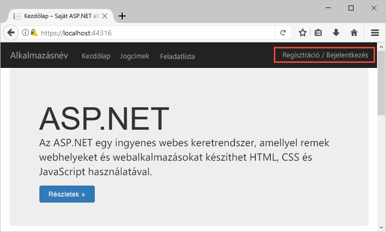
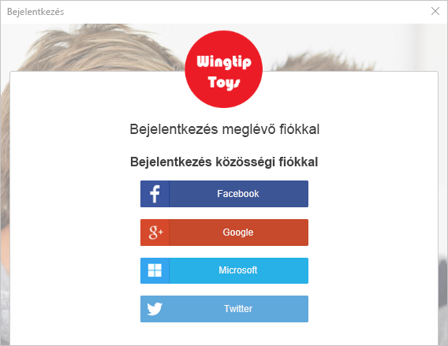
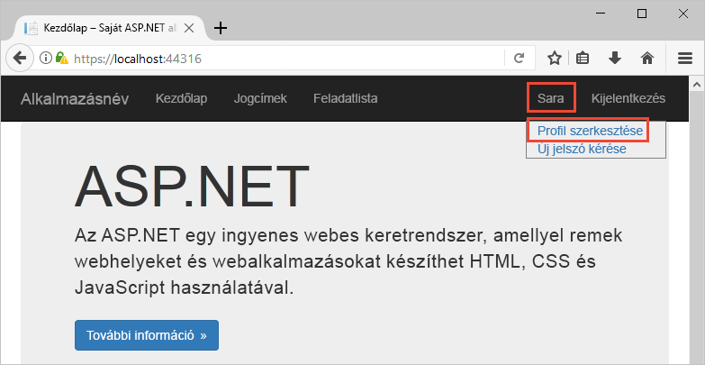
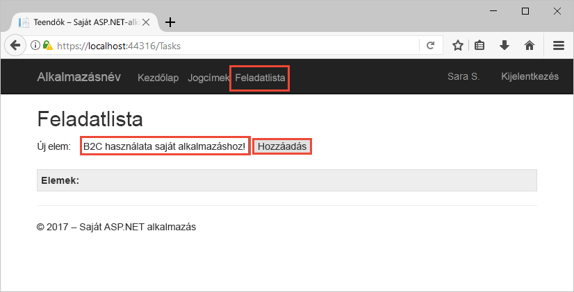

# <a name="quickstart-set-up-sign-in-for-an-aspnet-application-using-azure-active-directory-b2c"></a>Gyors útmutató: ASP.NET-alkalmazásba való bejelentkezés konfigurálása Azure Active Directory B2C-vel

Az Azure Active Directory (Azure AD) B2C felhőalapú identitáskezelést nyújt az alkalmazás, az üzlet és az ügyfelek védelme érdekében. Az Azure AD B2C nyílt szabványú protokollokkal teszi lehetővé az alkalmazások hitelesítését közösségi hálózati és vállalati fiókokon. Ebben a rövid útmutatóban egy ASP.NET-alkalmazással és egy közösségi identitásszolgáltatóval fog bejelentkezni, és meghív egy, az Azure AD B2C által védett webes API-t.

[!INCLUDE [quickstarts-free-trial-note](../../includes/quickstarts-free-trial-note.md)]

## <a name="prerequisites"></a>Előfeltételek

- [Visual Studio 2017](https://www.visualstudio.com/downloads/) az **ASP.NET és webfejlesztési** számítási feladattal. 
- Egy Facebook, Google, Microsoft vagy Twitter közösségi fiók.
- [Töltse le a zip-fájlt](https://github.com/Azure-Samples/active-directory-b2c-dotnet-webapp-and-webapi/archive/master.zip), vagy klónozza a mintául szolgáló webalkalmazást a GitHubról.

    ```
    git clone https://github.com/Azure-Samples/active-directory-b2c-dotnet-webapp-and-webapi.git
    ```

    A mintául szolgáló megoldás az alábbi két projektet tartalmazza:

    - **TaskWebApp** – Ez a webalkalmazás egy feladatlistát hoz létre és szerkeszt. A webalkalmazás a **regisztrálási vagy bejelentkezési** felhasználók regisztrálási vagy bejelentkezési felhasználói folyamata.
    - **TaskService** – Ez a webes API a feladatlista-funkciók létrehozását, olvasását, frissítését és törlését támogatja. A webes API-nak az Azure AD B2C biztosít védelmet, és a webalkalmazással hívható meg.

## <a name="run-the-application-in-visual-studio"></a>Az alkalmazás futtatása a Visual Studióban

1. A mintaalkalmazás projektmappájában nyissa meg a **B2C-WebAPI-DotNet.sln** megoldást a Visual Studióban.
2. Ebben a rövid útmutatóban egy időben futtatja a **TaskWebApp** és a **TaskService** projektet. Kattintson a jobb gombbal a **B2C-WebAPI-DotNet** megoldásra a Megoldáskezelőben, majd válassza az **Indítási projektek beállítása** lehetőséget. 
3. Válassza a **Több kezdőprojekt** elemet, és mindkét projektnél módosítsa a **Művelet** értékét **Indításra**. 
4. Kattintson az **OK** gombra.
5. Nyomja le az **F5** billentyűt mindkét alkalmazás hibakereséséhez. Mindegyik alkalmazás saját böngészőlapon nyílik meg:

    - `https://localhost:44316/` – Az ASP.NET-es webalkalmazás. A gyors útmutatóban közvetlenül kommunikál az alkalmazással.
    - `https://localhost:44332/` – Az ASP.NET-es webalkalmazás által meghívott webes API.

## <a name="sign-in-using-your-account"></a>Bejelentkezés saját fiókkal

1. Kattintson a **Sign up / Sign in** (Regisztráció/Bejelentkezés) hivatkozásra az ASP.NET-es webalkalmazásban a munkafolyamat elindításához.

    

    A minta több regisztrációs beállítást is támogat, beleértve a közösségi identitásszolgáltató használatát vagy helyi fiók e-mail-címmel való létrehozását. Ehhez a gyors útmutatóhoz Facebook, Google vagy Twitter közösségi identitásszolgáltatótól származó fiókot használjon.

2. Az Azure AD B2C a mintául szolgáló webalkalmazáshoz egy Wingtip Toys nevű fiktív márka egyéni bejelentkezési lapját jeleníti meg. Ha közösségi identitásszolgáltatóval szeretne regisztrálni, kattintson a használni kívánt identitásszolgáltató gombjára.

    

    Hitelesíti magát (bejelentkezik) a közösségi fiók hitelesítő adataival, és feljogosítja az alkalmazást, hogy beolvassa a közösségi fiók adatait. A hozzáférés biztosításával az alkalmazás profiladatokat kérhet le a közösségi fiókból, például a nevét és a települését. 

3. Fejezze be az identitásszolgáltató bejelentkezési folyamatát.

## <a name="edit-your-profile"></a>Saját profil szerkesztése

Az Azure Active Directory B2C-funkcióival a felhasználók frissíthetik a profiljukat. A mintául szolgáló webalkalmazás a munkafolyamat az Azure AD B2C-vel szerkesztési profil felhasználói folyamatot használ. 

1. Az alkalmazás menüsávján kattintson a profil nevére, és válassza az **Edit profile** (Profil szerkesztése) parancsot a létrehozott profil szerkesztéséhez.

    

2. Módosítsa a **Display name** (Megjelenített név) és a **City** (Város) mezőket, majd kattintson a **Continue** (Folytatás) gombra a profil frissítéséhez. 

    A módosított profil a webalkalmazás kezdőlapjának jobb felső részén jelenik meg.

## <a name="access-a-protected-api-resource"></a>Védett API-erőforrás elérése

1. Kattintson a **To-Do List** (Feladatlista) elemre a feladatlista elemeinek megadásához és módosításához. 

2. Adjon meg szöveget a **New Item** (Új elem) szövegmezőben. Kattintson az **Add** (Hozzáadás) gombra az Azure AD B2C által védett, feladatlista-elemet hozzáadó webes API meghívásához.

    

    Az ASP.NET-es webalkalmazás a védett webes API-erőforrás felé küldött, a felhasználó feladatlista-elemeire vonatkozó műveletek végrehajtására irányuló kérésbe belefoglalja az Azure AD hozzáférési jogkivonatot.

Az Azure AD B2C felhasználói fiókkal sikeresen intézett hitelesített hívást egy Azure AD B2C által védett webes API-hoz.

## <a name="clean-up-resources"></a>Az erőforrások eltávolítása

Az Azure AD B2C-bérlőt ahhoz is használhatja, ha más Azure AD B2C gyors útmutatókat vagy oktatóanyagokat is ki szeretne próbálni. Ha már nincs szüksége rá, akkor [törölheti az Azure AD B2C-bérlőt](active-directory-b2c-faqs.md#how-do-i-delete-my-azure-ad-b2c-tenant).

## <a name="next-steps"></a>További lépések

Ebben a rövid útmutatóban egy ASP.NET-mintaalkalmazással bejelentkezett egy egyéni bejelentkezési oldalon egy közösségi identitásszolgáltatóval, létrehozott egy Azure AD B2C-fiókot, és meghívott egy, az Azure AD B2C által védett webes API-t. 

Most már hozzákezdhet saját Azure AD B2C-bérlőjének létrehozásához.

> [!div class="nextstepaction"]
> [Azure Active Directory B2C-bérlő létrehozása az Azure Portalon](tutorial-create-tenant.md)