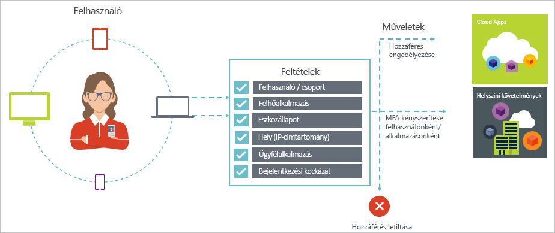

# Feltételes hozzáférés az Azure Active Directoryban

A biztonság az elsődleges szempont a szervezetek számára a felhővel. Egyik fontos szempontja a felhő biztonsági esetén identitások és hozzáférések – a felhőben lévő erőforrások kezelése. A mobileszköz-first, a felhő-első világ felhasználók férhetnek hozzá a szervezet erőforrásaihoz segítségével számos különféle eszközök és az alkalmazások bárhonnan. Ennek eredményeként csak összpontosító hozzáférő felhasználók erőforrás már nem elegendő. Fő biztonsági és a termelékenység közötti egyensúly, informatikai szakemberek számára is kell számításba hogyan erőforrás be egy hozzáférés-vezérlési döntési is hozzáférnek. A feltételes hozzáférés az Azure AD meg lehet oldani ennek a követelménynek. Feltételes hozzáférés egy olyan képességet, az Azure Active Directory, amely lehetővé teszi a környezetben, egy központi helyről a megadott feltételek alapján alkalmazásokhoz való hozzáférés vezérlőit érvényesítését. 

Ez a cikk biztosít a feltételes hozzáférés elméleti áttekintése Azure AD-ben.

## Gyakori forgatókönyvek

Mobileszköz-first, a felhő-első világában Azure Active Directory lehetővé teszi, hogy az egyszeri bejelentkezés eszközök, alkalmazások és szolgáltatások bárhonnan. (Beleértve a BYOD) eszközök elterjedésével működjenek ki a vállalati hálózathoz, és a külső Szolgáltatottszoftver-alkalmazásoknál, informatikai szakemberek számára két másik célt szemben:

- A felhasználók tetszőleges helyről és időben képesek legyenek hatékonyan dolgozni
- A vállalati eszközök védelme bármikor

Feltételes hozzáférési házirendek használatával is alkalmazhatja a megfelelő hozzáférés-vezérlést az előírt feltételek mellett. Azure AD feltételes hozzáférés a nagyobb biztonság, amikor szükséges, és a felhasználó útból marad, abban az esetben, ha még nem biztosít. 

Az alábbiakban néhány gyakori hozzáférési vonatkozik tartalmaz, amely a feltételes hozzáférés segítségével a:

- **[Bejelentkezési kockázati](active-directory-conditional-access-conditions.md#sign-in-risk)**: Azure AD Identity Protection bejelentkezési kockázatokat észleli. Hogyan tegye korlátozza a hozzáférést észlelt bejelentkezési kockázatot jelent a hibás szereplő azt jelzi, ha? Mi történik, ha szeretné erősebb bizonyító adatok, hogy a bejelentkezés történt a hiteles felhasználó, vagy a kétséges megfelelőek-e még akkor is letilthatja bizonyos felhasználók hozzáférését az alkalmazás eléréséhez?

- **[Hálózati hely](active-directory-conditional-access-locations.md)**: bárhonnan elérhető Azure AD-e. Mi történik, ha a hozzáférési kísérlet egy hálózati helyről, amely nincs az informatikai részleg felügyelete alatt történik? Felhasználónév és jelszó kombinációjával elég jó lehet, mint identitásigazolás a hozzáférés a vállalati hálózatról megkísérli az erőforrások. Mi történik, ha, igény szerint egy erősebb identitásigazolás hozzáférési próbál, amely más váratlan országokban vagy régiókban a világ kezdeményezett? Mi történik, ha még szeretné letiltja a hozzáférést bizonyos helyekre kísérlete?  

- **[Eszközkezelés](active-directory-conditional-access-conditions.md#device-platforms)**: az Azure AD-felhasználók érhetik el felhőalkalmazások eszközt, beleértve a mobil, és személyes eszközök széles skáláját. Mi történik, ha a hozzáférési kísérlet igényt csak kell elvégezni használatával az informatikai részleg által felügyelt eszközök felhasználói? Mi történik, ha még szeretné letiltja a bizonyos eszköz típusok űrlap hozzáférést a felhőalapú alkalmazások vannak a környezetében? 

- **[Ügyfélalkalmazás](active-directory-conditional-access-conditions.md#client-apps)**: Ma, hozzáférhet a különböző típusú alkalmazás például a web alapú alkalmazásokra, mobilalkalmazások vagy asztali alkalmazások sok felhőalapú alkalmazások. Mi történik, ha egy hozzáférési kísérlet használatával történik egy alkalmazás ügyféltípus ismert problémák fordulnak? Mi történik, ha egy bizonyos alkalmazás esetében az informatikai részleg által kezelt eszköz van szüksége? 

Ezeket a kérdéseket és a kapcsolódó válaszok megfelelnek az általános hozzáférési forgatókönyvek az Azure AD feltételes hozzáférésével. Feltételes hozzáférés egy olyan képességet, az Azure Active Directory, amely lehetővé teszi egy csoportházirend-alapú módszer használatával hozzáférési forgatókönyvek kezeléséhez.

## Feltételes hozzáférési szabályzatok

A feltételes hozzáférési házirend egy hozzáférési forgatókönyv a következő minta használatával definíciója:

**Majd ehhez** határozza meg a szabályzat adott válaszokat. Fontos megjegyezni, hogy a feltételes hozzáférési házirend célja nem engedélyezheti a hozzáférést a felhőalapú alkalmazásokhoz. Az Azure AD-felhasználó hozzárendelések tárgya felhőalapú alkalmazásokba való hozzáférés biztosítása. Feltételes hozzáférési házirenddel, meghatározhatja, hogyan jogosult felhasználók (felhasználók, amely rendelkezik hozzáféréssel a cloud app) férhetnek hozzá meghatározott feltételek felhőalapú alkalmazásokat. A válaszban szereplő kényszeríti a például a többtényezős hitelesítés további követelmények, egy felügyelt eszközt és mások számára. A követelmények, a házirend érvénybe lépteti a feltételes hozzáférés az Azure AD a környezetben, hozzáférés-vezérlést nevezik. A szigorúbb képernyőn a házirend képes blokkolni a hozzáférést. További információkért lásd: [hozzáférés-szabályozási az Azure Active Directory feltételes hozzáférés](active-directory-conditional-access-controls.md).
     

**Ha ez történik** határozza meg a házirend kiváltó okát. Ezért a feltételek teljesülnek csoportja által jellemzőek. Az Azure AD feltételes hozzáférés a két hozzárendelés feltételek szerepet speciális:

- **[Felhasználók](active-directory-conditional-access-conditions.md#users-and-groups)**: A felhasználók hozzáférési kísérlet végrehajtása (**ki**). 

- **[A felhőalapú alkalmazások](active-directory-conditional-access-conditions.md#cloud-apps)**: hozzáférési kísérlet céljai (**mi**).    

E két feltételek kötelezőek egy feltételes hozzáférési házirendben. A két kötelező feltételek mellett is hozzáadhat további feltételeket, amelyek ismertetik, hogyan megy végbe a hozzáférési kísérlet. Gyakori példák mobileszközök vagy helyeken, amelyek a vállalati hálózaton kívül vannak használ. További információkért lásd: [az Azure Active Directory feltételes hozzáférési feltételek](active-directory-conditional-access-conditions.md).   

A hozzáférés-vezérlést a feltételek kombinációját jelenti. a feltételes hozzáférési szabályzat. 

Az Azure AD feltételes hozzáférést, szabályozhatja, hogyan jogosult felhasználók úgy férhetnek hozzá a felhőalapú alkalmazásokhoz. A feltételes hozzáférési házirend célja kényszerítéséhez további hozzáférésének felhőalapú alkalmazásokhoz, amelyek célja a hogyan megy végbe egy hozzáférési kísérlet hozzáférési kísérlet.

Egy olyan csoportházirend-alapú módszer használatával a felhőalapú alkalmazásokhoz való hozzáférés előnye, hogy elkezdheti a házirend követelményeinek, a környezetnek a struktúra, anélkül, hogy a technikai kivitelezés a cikkben ismertetett használata elkészítése. 

## Mit kell tudnia

### A feltételes hozzáférés használatának vonatkozó általános követelmények

Az Azure AD feltételes hozzáférés segítségével felhőalapú alkalmazások védelme, ha a hitelesítési kísérletet származik:

- Webböngésző

- A modern hitelesítést használó ügyfélalkalmazás

- Exchange ActiveSync

További információkért lásd: [ügyfélalkalmazások](active-directory-conditional-access-conditions.md#client-apps).

Néhány [felhőalapú alkalmazásokba](active-directory-conditional-access-conditions.md#cloud-apps) is támogatja az örökölt hitelesítési protokollok megvalósítását végzi. Ez vonatkozik, például a SharePoint Online és Exchange online-hoz. Amikor egy ügyfél-alkalmazás egy régebbi hitelesítési protokoll használatával is hozzáférhetnek a felhőalapú alkalmazások, az Azure AD a hozzáférési kísérlet a feltételes hozzáférési házirend nem érvényesíthetők. Egy ügyfélalkalmazás házirendek érvénybe léptetése megkerülése érdekében ellenőrizni kell, hogy lehetőség csak a az érintett felhőalkalmazások a modern hitelesítés engedélyezése.

Az ügyfél alkalmazások feltételes hozzáférés nem vonatkozik például a következők:

- Office 2010-es és korábbi verziók

- Office 2013, ha nincs engedélyezve a modern hitelesítés

További információkért lásd: [beállítása az Azure Active Directory feltételes hozzáférés SharePoint Online és az Exchange Online](active-directory-conditional-access-no-modern-authentication.md).

### Feltételes hozzáférés használatának követelményei licenc

Feltételes hozzáférés a használatához a prémium szintű Azure AD / nagyvállalati mobilitási + biztonsági licenc. A követelmények teljesítéséhez a megfelelő licenc megkereséséhez lásd: [nagyvállalati mobilitási + biztonsági árképzési beállítások](https://www.microsoft.com/cloud-platform/enterprise-mobility-security-pricing).

## További lépések

- Ha szeretne többet tudni:
    - Tekintse meg a feltételeket, [az Azure Active Directory feltételes hozzáférési feltételek](active-directory-conditional-access-conditions.md).

    - Hozzáférés-szabályozási című [hozzáférés-szabályozási az Azure Active Directory feltételes hozzáférés](active-directory-conditional-access-controls.md).

- Ha szeretné beolvasni tapasztalattal a feltételes hozzáférési szabályzatok konfigurálása című [Ismerkedés a feltételes hozzáférés az Azure Active Directoryban](active-directory-conditional-access-azure-portal-get-started.md).

- Ha készen áll a környezet feltételes hozzáférési házirend-beállításokkal, tekintse meg a [ajánlott eljárások a feltételes hozzáférés az Azure Active Directoryban](active-directory-conditional-access-best-practices.md). 
