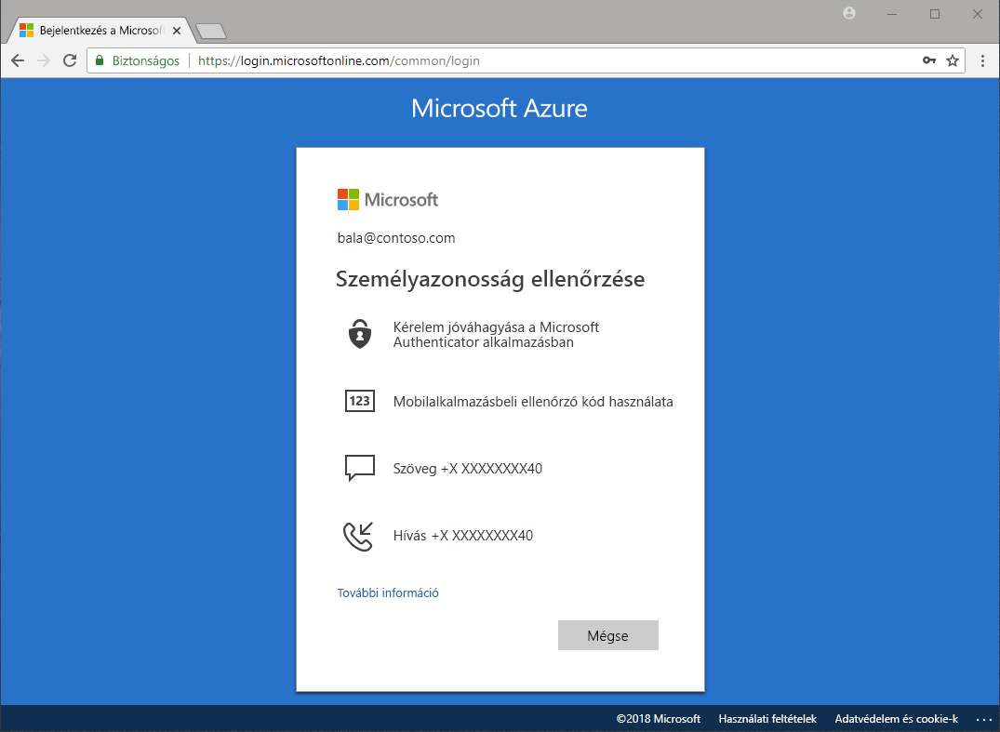

# Milyen hitelesítési módszerek érhetők el?

A hírekben folyamatosan azt lehet hallani, hogy a jelszavakat ellopják, és az identitásokat feltörik. A jelszó mellett egy második hitelesítési tényező megkövetelése azonnal növeli a vállalat biztonságát. A Microsoft Azure Active Directory (Azure AD) különféle szolgáltatásaival, mint az Azure Multi-Factor Authentication (Azure MFA) és az új Azure AD-jelszó önkiszolgáló kérése (SSPR) a rendszergazdák kiegészítő hitelesítési módszerekkel gondoskodhatnak a vállalat és a felhasználók védelméről.

Számos olyan tartalmazó: bejelentkezés egy alkalmazásba, új engedélyezése a Windows Hello, és a jelszó, a felhasználók felkérheti további ellenőrzésének biztosításához, hogy mondják, akik azok.

A további azonosítás különféle hitelesítési módszerekkel történhet, például a következőkkel:

* E-mailben vagy szöveges üzenetben kapott kód
* Telefonhívás
* A telefonra kapott értesítés vagy kód
* Biztonsági kérdések megválaszolása

Az Azure MFA és az új Azure AD-jelszó önkiszolgáló kérése révén a rendszergazdák nagyobb kontrollt kapnak a konfiguráció, a szabályzatok, a monitorozás és a jelentéskészítés felett az Azure AD és az Azure Portal használatával a vállalat védelme érdekében.

## Új jelszó önkiszolgáló kérése

Az új jelszó önkiszolgáló kérésével a felhasználók a rendszergazda beavatkozása nélkül kérhetnek új jelszót, ahol és amikor szükségük van rá.

> [!VIDEO https://www.youtube.com/embed/hc97Yx5PJiM]

Az új jelszó önkiszolgáló kérése a következőkből áll:

* **Jelszó módosítása:** Tudom a jelszavam, de új módosítani szeretné.
* **Jelszó-visszaállítás:** Nem lehet jelentkezzen be és alaphelyzetbe állítja a jelszó legalább egy jóváhagyott hitelesítési módszerek használatával.
* **Fiók zárolásának feloldása:** Nem tudok bejelentkezni, mert a fiók zárolva van, és szeretném zárolásának feloldásához, egy vagy több jóváhagyott hitelesítési módszerek használatával.

## Multi-Factor Authentication

Az Azure Multi-Factor Authentication (MFA) a Microsoft kétlépéses hitelesítési megoldása. A rendszergazda által engedélyezett hitelesítési módszerek használatával az Azure MFA segíti az adatok és alkalmazások védelmét az illetéktelen hozzáféréssel szemben, miközben lehetővé teszi az igényeknek megfelelő, egyszerű bejelentkezési folyamat használatát.

## További lépések

Következő lépésként konfiguráljuk az új jelszó önkiszolgáló kérését és az Azure Multi-Factor Authenticationt.

Az új jelszó önkiszolgáló kérése használatának megkezdéséhez tekintse meg [az SSPR engedélyezését bemutató rövid útmutató cikket](quickstart-sspr.md).

További információ az önkiszolgáló jelszó-visszaállítást a cikkben, [működését: Az Azure AD önkiszolgáló jelszó-visszaállítás](concept-sspr-howitworks.md)

A cikk az Azure multi-factor Authentication többet [működését: Azure Multi-Factor Authentication](concept-mfa-howitworks.md)
