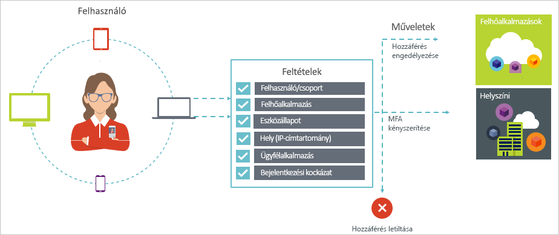

# Mi az a feltételes hozzáférés az Azure Active Directoryban?

A biztonság elsődleges szempont a felhőt használó szervezetek számára. A felhő biztonságának egyik fontos eleme az identitás és a hozzáférés a felhőbeli erőforrások felügyelete során. Korunk mobileszközökre és felhőre építkező világában a felhasználók a legkülönfélébb eszközökről és alkalmazásokból érhetik el a szervezet erőforrásait. Ebből kifolyólag már nem elég csak azt figyelni, hogy ki próbálja elérni az adott erőforrást. A biztonság és a hatékonyság közötti megfelelő egyensúly eléréséhez a hozzáférés-vezérlési döntésekben azt is figyelembe kell venni, hogyan próbálják elérni az erőforrást. Az Azure Active Directory (Azure AD) feltételes hozzáférésével megfelelhet ennek a követelménynek. A feltételes hozzáférés az Azure Active Directory egyik képessége. A feltételes hozzáférés segítségével automatikus döntéshozatali képességeket valósíthat meg a felhőalkalmazásai eléréséhez különféle feltételek alapján. 

Az első többtényezős hitelesítés befejezése után a rendszer érvényesíti a feltételes hozzáférési szabályzatokat. Ezért a feltételes hozzáférés nem célja az első sor védelmi például-szolgáltatásmegtagadásos (DDoS-) támadások, de használhat fel ezeket az eseményeket (például a bejelentkezési kockázati szintet, helyét a kérelmet, és így tovább) érkező általi hozzáférés megállapításához.  

Ez a cikk fogalmi áttekintést nyújt az Azure AD feltételes hozzáférés funkciójáról.

## Gyakori forgatókönyvek

Korunk mobil- és felhőalapú világában az Azure Active Directory egyszeri bejelentkezés szolgáltatásával a felhasználók bárhonnan bejelentkezhetnek az eszközökre, alkalmazásokba és szolgáltatásokba. A különféle (esetenként saját tulajdonú) eszközök, a vállalati hálózatokon kívüli munkavégzés, valamint a külső SaaS-alkalmazások terjedésével két ellentétes cél kerülhet előtérbe:

- A felhasználók hatékony munkájának támogatása bárhol és bármikor
- A vállalati tulajdon védelme bármikor

A feltételes hozzáférési szabályzatokkal mindig a megfelelő hozzáférés-vezérlés alkalmazható a követelményeknek megfelelően. Az Azure AD feltételes hozzáférés fokozott védelmet biztosít, amikor szükséges, és nem akadályozza a felhasználót, ahol nem fontos. 

Íme néhány gyakoribb hozzáférési probléma, amelyek megoldásában a feltételes hozzáférés segíthet:

- **[Bejelentkezési kockázati](conditions.md#sign-in-risk)**: Az Azure AD Identity Protection észleli a bejelentkezési kockázat. Hogyan korlátozhatja a hozzáférést, ha egy észlelt bejelentkezési kockázat egy kártékony elemet jelez? Mit tehet, ha erősebb bizonyítékra van szüksége, hogy a bejelentkezést egy legitim felhasználó hajtotta végre? Mi történik, ha a kételyei elég megalapozottak, hogy akár adott felhasználók hozzáférését is letiltsa egy alkalmazáshoz?  

- **[Hálózati hely](location-condition.md)**: Azure AD egy bárhonnan elérhető. Mi a teendő, ha a hozzáférési kísérlet egy olyan hálózati helyről történik, amely nem tartozik az informatikai részleg irányítása alá? A felhasználónév és a jelszó kombinációja megfelelő bizonyíték lehet az identitás igazolására a vállalati hálózatról megkísérelt hozzáférések esetén. Mi a teendő, ha erősebb identitásigazolást szeretne az olyan hozzáférési kísérleteknél, amelyeket a világ más, váratlan országaiból vagy régióiból kezdeményeznek? Mi a teendő, ha egyes helyekről akár blokkolni is szeretné a hozzáférést?  

- **[Eszközkezelés](conditions.md#device-platforms)**: Azure ad-felhasználók érhessék el a felhőalapú alkalmazások az széles körét, beleértve a mobil eszközök és személyes eszközök is. Mi a teendő, ha azt szeretné, hogy csak a vállalat informatikai részlege által felügyelt eszközökről lehessen megkísérelni a hozzáférést? Mi a teendő, ha meg szeretné tiltani, hogy egyes eszköztípusok hozzáférhessenek a környezetében lévő felhőalkalmazásokhoz? 

- **[Ügyfélalkalmazás](conditions.md#client-apps)**: Ma számos olyan felhőalkalmazások, például a webes alkalmazások, mobilalkalmazások és asztali alkalmazások különböző alkalmazástípust használatával is elérheti. Mi a teendő, ha olyan típusú ügyfélalkalmazással történik hozzáférési kísérlet, amely ismert hibákat okoz? Mi a teendő, ha azt szeretné, hogy bizonyos típusú alkalmazásokat csak az informatikai részleg által felügyelt eszközökről lehessen elérni? 

Ezek a kérdések és a kapcsolódó válaszok gyakori hozzáférési forgatókönyveket vázolnak fel az Azure AD feltételes hozzáféréshez. A feltételes hozzáférés az Azure Active Directory egyik képessége, amellyel szabályzatalapú módon kezelheti a hozzáférés-kezelési forgatókönyveket.

  

> [!VIDEO https://www.youtube.com/embed/eLAYBwjCGoA]

## Feltételes hozzáférési szabályzatok

A feltételes hozzáférési szabályzat egy olyan hozzáférési forgatókönyv, amely az alábbi mintát követi:

Az **Akkor ezt tegye** címszó alatt határozhatja meg a szabályzat válaszát. Fontos megjegyezni, hogy a feltételes hozzáférési szabályzatok célja nem az, hogy hozzáférést adjanak egy felhőalkalmazáshoz. Az Azure AD-ben a felhőalkalmazások hozzáférésének engedélyezése a felhasználó-hozzárendelések függvénye. A feltételes hozzáférési szabályzatokkal vezérelheti, hogy az engedéllyel rendelkező felhasználók (azok a felhasználók, akik hozzáférést kaptak egy adott felhőalkalmazáshoz) hogyan férhetnek hozzá bizonyos feltételek mellett a felhőalapú alkalmazásokhoz. A válaszban további követelményeket határozhat meg, például többtényezős hitelesítést, felügyelt eszközök használatát stb. Az Azure AD feltételes hozzáférés kontextusában a szabályzatok által előírt követelményeket hozzáférés-vezérlésnek nevezzük. A legszigorúbb formájukban a szabályzatokkal blokkolható a hozzáférés. További információ: [Hozzáférés-vezérlés az Azure Active Directory feltételes hozzáféréssel](controls.md).
     

Az **Amikor ez történik** címszó alatt adhatja meg a szabályzatot aktiváló okokat. Az okokat az jellemzi, hogy több feltétel teljesül. Az Azure AD feltételes hozzáférésekben a két hozzárendelési feltétel speciális szerepet játszik:

- **[Felhasználók](conditions.md#users-and-groups)**: A felhasználó által végzett hozzáférési kísérlet (**akik**). 

- **[Felhőalkalmazások](conditions.md#cloud-apps)**: Egy hozzáférési kísérlet kereszthivatkozásoknak (**mi**).    

Ennek a két feltételnek a megadása kötelező a feltételes hozzáférési szabályzatokban. A két kötelező feltétel mellett további feltételeket is megadhat, amelyek a hozzáférési kísérlet körülményeit írják le. Gyakori példa a mobileszközök használatával vagy a vállalati hálózaton kívüli helyekről megkísérelt hozzáférés. További információ: [Az Azure Active Directory feltételes hozzáférésének feltételei](conditions.md).   

A hozzáférés-vezérlés feltételekhez való kötésével hozhat létre feltételes hozzáférési szabályzatot. 

Az Azure AD feltételes hozzáférésével szabályozhatja, hogy az engedéllyel rendelkező felhasználók hogyan érhetik el a felhőalkalmazásokat. A feltételes hozzáférési szabályzatok célja, hogy a felhőalkalmazások elérésekor további hozzáférés-vezérléseket kényszerítsenek ki a hozzáférési kísérlet körülményei alapján.

A felhőbeli alkalmazásokhoz való hozzáférések szabályzatalapú korlátozása lehetővé teszi, hogy a jelen cikkben ismertetett struktúra alapján elkezdje kidolgozni a szabályzatok követelményeit anélkül, hogy foglalkoznia kellene a műszaki megvalósítás részleteivel. 

## Az Azure AD feltételes hozzáférése és összevont hitelesítése

Feltételes hozzáférési szabályzatok zökkenőmentesen működnek az [összevont hitelesítéssel](../../security/azure-ad-choose-authn.md#federated-authentication). Ez a támogatás az összes támogatott feltételt és vezérlőt magában foglalja, valamint rálátást biztosít a szabályzatnak az aktív felhasználói bejelentkezésekre való alkalmazására [az Azure AD-jelentéskészítés](../reports-monitoring/concept-sign-ins.md) segítségével.

Az *Azure AD-vel történő összevont hitelesítés* azt jelenti, hogy egy megbízható hitelesíti szolgáltatás végzi a felhasználók hitelesítését az Azure AD felé. Megbízható hitelesíti szolgáltatásnak számítanak például az Active Directory összevonási szolgáltatások (AD FS) vagy bármilyen más összevonási szolgáltatás. Ebben a konfigurációban a felhasználók elsődleges hitelesítése a szolgáltatásban történik, majd az egyes alkalmazásokba való bejelentkezés az Azure AD segítségével zajlik. Az Azure AD feltételes hitelesítésének alkalmazása az előtt történik, hogy a rendszer megadná a hozzáférést a felhasználó által elérni kívánt alkalmazáshoz. 

Ha a konfigurált feltételes elérési szabályzat többtényezős hitelesítést követel meg, az Azure AD alapesetben az Azure MFA-t használja. Ha az MFA-hoz az összevonási szolgáltatást használja, az Azure AD konfigurálható az összevonási szolgáltatásra történő átirányításra, ha az MFA-ra van szükség. Ehhez állítsa a `-SupportsMFA` paramétert `$true` értékűre a [PowerShellben](https://docs.microsoft.com/powershell/module/msonline/set-msoldomainfederationsettings). Ez a beállítás az olyan összevont hitelesítési szolgáltatások esetében működik, amelyek támogatják Azure AD által a `wauth= http://schemas.microsoft.com/claims/multipleauthn` használatával kiadott MFA-kérdést.

Miután a felhasználó bejelentkezett az összevont hitelesítés szolgáltatásba, az Azure AD kezeli a további szabályzatkövetelményeket, például az eszközmegfelelőséget vagy a jóváhagyott alkalmazásokat.

## A feltételes hozzáférések használatához szükséges licencek

A feltételes hozzáférés használatához Azure AD Prémium szintű licenc szükséges. A követelményeinek leginkább megfelelő licenc kiválasztásáról lásd [az ingyenes, alapszintű és prémium kiadások általánosan elérhető szolgáltatásait összehasonlító cikket](https://azure.microsoft.com/pricing/details/active-directory/).

## További lépések

- Ha többet szeretne megtudni:
    - a feltételekről, olvassa el [az Azure Active Directory feltételes hozzáférések feltételeit ismertető cikket](conditions.md).

    - a hozzáférés-vezérlésről, olvassa el [az Azure Active Directory feltételes hozzáférés-vezérlését ismertető cikket](controls.md).

- Ha szeretne gyakorlatot szerezni a feltételes hozzáférési szabályzatok konfigurálásában, lásd: [Többtényezős hitelesítés megkövetelése adott alkalmazásokhoz az Azure Active Directory feltételes hozzáféréssel](app-based-mfa.md).

- Ha át szeretne tekinteni egy részletes üzembehelyezési tervet a javasolt szabályzatokkal, tekintse meg a [feltételes hozzáférés üzembe helyezésére vonatkozó tervet](https://aka.ms/conditionalaccessdeploymentplan).
