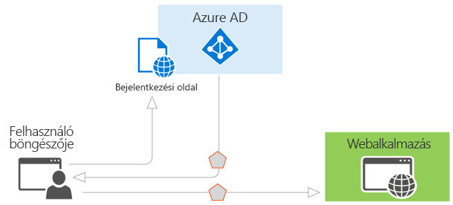
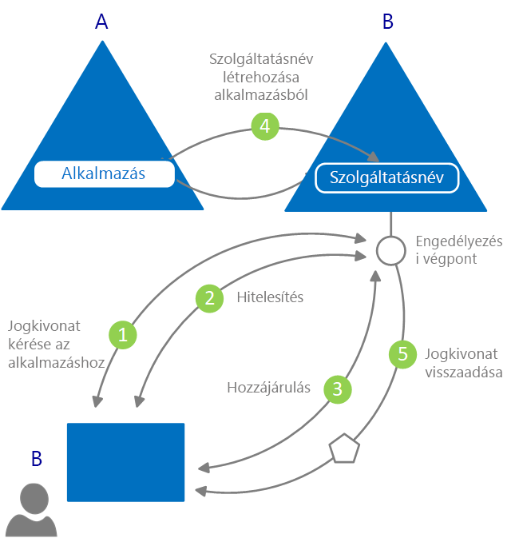

# Mi a hitelesítés?

A *hitelesítési* valamely fél érvényes hitelesítő adatainak bekérése, amely egy identitás- és hozzáférés-vezérléshez használható rendszerbiztonsági tag létrehozását eredményezi. Egyszerűbb megfogalmazásban a hitelesítés az a folyamat, amelynek során a felhasználó bebizonyítja, hogy az, akinek vallja magát. A hitelesítést (angolul authentication) szokás az AuthN rövidítéssel is jelölni.

Az *engedélyezés* egy műveletre jogosító engedély megadása egy hitelesített rendszerbiztonsági tag számára. Meghatározza az elérhető adatok körét és az azokon végrehajtható műveleteket. Az engedélyezést (angolul authorization) szokás az AuthZ rövidítéssel is jelölni.

Az Azure Active Directory (Azure AD) használatával a hitelesítés egyszerűbb az alkalmazásfejlesztők számára, mivel ez az iparágban elterjedt protokollokat, például az OAuth 2.0-t és az OpenID Connectet támogató identitásszolgáltatást biztosít nyílt forrású kódtárakkal a különböző platformokhoz, amelyekkel gyorsan megkezdhető a kód megírása.

Az Azure AD programozási modellben két alapvető használati eset létezik:

* Az OAuth 2.0 engedélyezési folyamat – amikor az erőforrás tulajdonosa adja meg az engedélyt az ügyfélalkalmazás számára, hogy az elérhesse az erőforrás-tulajdonos erőforrásait.
* Az erőforrások ügyfél általi elérése – ezt az erőforrás-kiszolgáló valósítja meg a hozzáférési jogkivonatokban foglalt jogcímértékek alapján, amelyek a vonatkozó hozzáférés-vezérlési döntések meghozatalát irányítják.

## Az Azure Active Directory-hitelesítés alapjai

Vegyük a legalapvetőbb forgatókönyvet, amelyben az identitásokat alkalmazni kell: a felhasználónak a böngészőben hitelesítenie kell magát egy webalkalmazásban. Az alábbi ábra ezt a forgatókönyvet mutatja be:

Az ábrán lévő összetevőkről a következőket érdemes tudni:

* Az Azure AD az identitásszolgáltató. Az identitásszolgáltató feladata a szervezet címtárában lévő felhasználók és alkalmazások identitásának ellenőrzése, majd a felhasználók és alkalmazások sikeres hitelesítését követően a biztonsági jogkivonatok kiadása.
* A hitelesítést az Azure AD-vel végeztető alkalmazásokat regisztrálni kell az Azure AD-ben. Az Azure AD regisztrálja és egyedileg azonosítja az alkalmazást a címtárban.
* A fejlesztők az Azure AD nyílt forrású hitelesítési kódtáraival egyszerűen valósíthatják meg a hitelesítést, mivel a protokolladatok kezelését az Azure AD végzi. További információkért lásd az Azure AD [2.0-s](reference-v2-libraries.md) és [1.0-s verziójú hitelesítési kódtárait](active-directory-authentication-libraries.md).
* A felhasználó hitelesítését követően az alkalmazásnak ellenőriznie kell a felhasználó biztonsági jogkivonatát, hogy megbizonyosodhasson róla a hitelesítés sikeréről. A rövid útmutatók, oktatóanyagok és a különböző nyelvekhez és keretrendszerekhez elérhető kódminták mutatják be, hogy az alkalmazásnak mit kell tennie.
  * Az alkalmazások gyors felépítésével és a jogkivonatok beszerzését és frissítését, a felhasználók bejelentkeztetését és a felhasználóadatok megjelenítését végző funkcionalitás hozzáadásával kapcsolatban lásd a dokumentáció **Rövid útmutatók** szakaszát.
  * A hitelesítéssel kapcsolatos legfontosabb fejlesztői feladatok elvégzéséhez, például a hozzáférési jogkivonatok beszerzéséhez és azok Microsoft Graph API és egyéb API-k hívásaiban való használatához, a hagyományos böngészőalapú alkalmazásokon belüli, OpenID Connect használatával végzett Microsoft-bejelentkezések megvalósításához, valamint hasonló feladatokhoz használható részletes, forgatókönyv-alapú eljárásokat a dokumentáció **Oktatóanyagok** szakaszában találja.
  * A kódminták letöltéséhez látogasson el a [GitHubra](https://github.com/Azure-Samples?q=active-directory).
* A hitelesítési folyamathoz használt kérés-válasz folyamatot az alkalmazott hitelesítési protokoll határozza meg, például az OAuth 2.0, az OpenID Connect, a WS-Federation vagy az SAML 2.0. A protokollokkal kapcsolatos további információkért lásd a dokumentáció **Fogalmak > Protokollok** szakaszát.

A fenti példaforgatókönyvben az alkalmazásokat az alábbi két szerepkör szerint osztályozhatjuk:

* Olyan alkalmazások, amelyeknek biztonságosan kell hozzáférniük az erőforrásokhoz
* Olyan alkalmazások, amelyek az erőforrások szerepét töltik be

Most, hogy az alapokat áttekintettük, a továbbiakban megismerkedhet az identitáskezelési alkalmazásmodellel és API-val, valamint az Azure AD-beli kiépítés működésével, továbbá az Azure AD által támogatott gyakori forgatókönyvekre mutató hivatkozásokat találhat.

## Alkalmazásmodell

Az Azure AD az alkalmazásokat egy specifikus modell szerint képezi le, amely két fő funkció kiszolgálására lett kialakítva:

* **Az alkalmazás azonosítása a támogatott hitelesítési protokollnak megfelelően** – Ez az összes azonosító, URL-cím, titkos kulcs és a hitelesítés alkalmával szükséges összes vonatkozó információ számba vételét jelenti. Az Azure AD ebben az esetben:

    * Tárolja a futásidejű hitelesítés támogatásához szükséges összes adatot.
    * Tárolja a szükséges adatokat annak eldöntéséhez, hogy az alkalmazásoknak milyen erőforrásokat kellhet elérniük, és az adott kéréseket teljesíteni kell-e, illetve milyen körülmények között kell teljesíteni.
    * Biztosítja az infrastruktúrát az alkalmazásregisztráció megvalósításához az alkalmazásfejlesztő bérlőjén és a többi Azure AD-bérlőn.

* **Felhasználói hozzájárulás kezelése a jogkivonat-igénylés alkalmával és az alkalmazások dinamikus kiépítésének elősegítése a bérlők közt** – Az Azure AD ebben az esetben:

    * Lehetővé teszi, hogy a felhasználó vagy a rendszergazda dinamikusan megadhassa vagy megtagadhassa a hozzájárulást, hogy az alkalmazás a nevében elérhesse az erőforrásokat.
    * Lehetővé teszi, hogy a rendszergazda alapvetően meghatározhassa, hogy az alkalmazások mely tevékenységei engedélyezettek, mely felhasználók mely alkalmazásokat használhatják, és hogy a címtárerőforrások hogyan érhetők el.

Az Azure AD az alkalmazásokat absztrakt entitásokként, **alkalmazásobjektumokkal** írja le. A fejlesztők alkalmazásokkal dolgoznak. Az üzembe helyezés során az Azure AD az adott alkalmazásobjektumot tervként használva létrehoz egy **szolgáltatásnevet**, amely az alkalmazás konkrét példányát jelöli egy adott címtárban vagy bérlőn. Ez a szolgáltatásnév határozza meg, hogy az alkalmazás ténylegesen milyen tevékenységeket hajthat végre az adott célcímtárban, mely erőforrásokat érheti el, és így tovább. Az Azure AD a szolgáltatásneveket az alkalmazásobjektumokból **hozzájárulás** alapján hozza létre.

Az alábbi ábrán az Azure AD hozzájárulás-alapú kiépítési folyamatának egyszerűsített vázát mutatja.

A kiépítési folyamat:

|   |   |
|---|---|
| 1 | Egy B-beli felhasználó megkísérel bejelentkezni az alkalmazásba |
| 2 | A rendszer kéri és ellenőrzi a felhasználó hitelesítő adatait |
| 3 | A rendszer kéri a felhasználó hozzájárulását ahhoz, hogy az alkalmazás hozzáférjen a B bérlőhöz |
| 4 | Az Azure AD az A-beli alkalmazásobjektumot tervként használva létrehoz egy szolgáltatásnevet a B-ben |
| 5 | A felhasználó megkapja az igényelt jogkivonatot |
|   |   |

A folyamat tetszőleges mennyiségben ismételhető a többi bérlőre (C, D és így tovább) vonatkozóan. Az A címtár tárolja az alkalmazás tervét (az alkalmazásobjektumot). A többi bérlőn, amelyekre az alkalmazás hozzájárulást kapott, továbbra is a felhasználók és a rendszergazdák határozhatják meg az egyedi bérlőkön lévő megfelelő szolgáltatásnév-objektumokon keresztül, hogy az alkalmazás milyen tevékenységeket hajthat végre. További információkért lásd [az Azure AD alkalmazás- és szolgáltatásnév-objektumait](app-objects-and-service-principals.md) ismertető cikket.

## Jogcímek az Azure AD biztonsági jogkivonataiban

Az Azure AD által kiadott biztonsági jogkivonatok (hozzáférési és azonosító jogkivonatok) jogcímeket, azaz a hitelesített alanyra vonatkozó megerősített információkat tartalmaznak. Az alkalmazások a jogcímeket különféle műveletekhez használhatják:

* A jogkivonat érvényesítése
* Az alany címtárbérlőjének azonosítása
* A felhasználó adatainak megjelenítése
* Az alany engedélyezésének meghatározása

Az egyes biztonsági jogkivonatokban lévő jogcímek a jogkivonat típusától, a felhasználó hitelesítéséhez használt hitelesítő adatoktól és az alkalmazás konfigurációjától függenek.

Az Azure AD által kibocsátott egyes jogcímek rövid leírását az alábbi táblázat tartalmazza. Részletesebb információkat az Azure AD által kibocsátott [hozzáférési jogkivonatok](access-tokens.md) és [azonosító jogkivonatok](id-tokens.md) leírásában talál.

| Jogcím | Leírás |
| --- | --- |
| Alkalmazásazonosító | A jogkivonatot használó alkalmazást azonosítja. |
| Célközönség | A fogadó erőforrást azonosítja, amelynek a jogkivonat szól. |
| Alkalmazáshitelesítési környezet osztályhivatkozása | Az ügyfél hitelesítési módját adja meg (nyilvános vagy bizalmas ügyfél). |
| Hitelesítési időpont | A hitelesítés megtörténtének dátumát és időpontját rögzíti. |
| Hitelesítési módszer | A jogkivonatalany hitelesítésének módját adja meg (jelszó, tanúsítvány stb.). |
| Utónév | A felhasználó Azure AD-ben beállított utónevét adja meg. |
| Csoportok | Az olyan Azure AD-csoportok objektumazonosítóit adja meg, amelyeknek az adott felhasználó tagja. |
| Identitásszolgáltató | A jogkivonat alanyát hitelesítő identitásszolgáltatót adja meg. |
| Kibocsátás időpontja | A jogkivonat kibocsátásának időpontját rögzíti, amely alapján általában a jogkivonat frissességét szokás elbírálni. |
| Kiállító | A jogkivonatot kiadó biztonsági jegykiadó szolgáltatást, valamint az Azure AD-bérlőt azonosítja. |
| Vezetéknév | A felhasználó Azure AD-ben beállított vezetéknevét adja meg. |
| Név | A jogkivonat alanyát azonosító, ember által olvasható értéket ad meg. |
| Objektumazonosító | Az alany Azure AD-beli megváltoztathatatlan egyedi azonosítóját adja meg. |
| Szerepkörök | A felhasználónak kiosztott Azure AD-beli alkalmazás-szerepkörök rövid neveit adja meg. |
| Hatókör | Az ügyfélalkalmazás számára megadott engedélyeket jelzi. |
| Tárgy | Azt a szolgáltatásnevet adja meg, amelynek az adatait a jogkivonat hitelesíti. |
| Bérlőazonosító | A jogkivonatot kibocsátó címtárbérlő megváltoztathatatlan egyedi azonosítóját adja meg. |
| Jogkivonat élettartama | A jogkivonat érvényességi idejét határozza meg. |
| Felhasználó egyszerű neve | Az alany egyszerű felhasználónevét adja meg. |
| Verzió | A jogkivonat verziószámát adja meg. |

## További lépések

* Ismerje meg [az Azure Active Directory által támogatott alkalmazástípusokat és forgatókönyveket](app-types.md)
