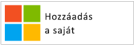
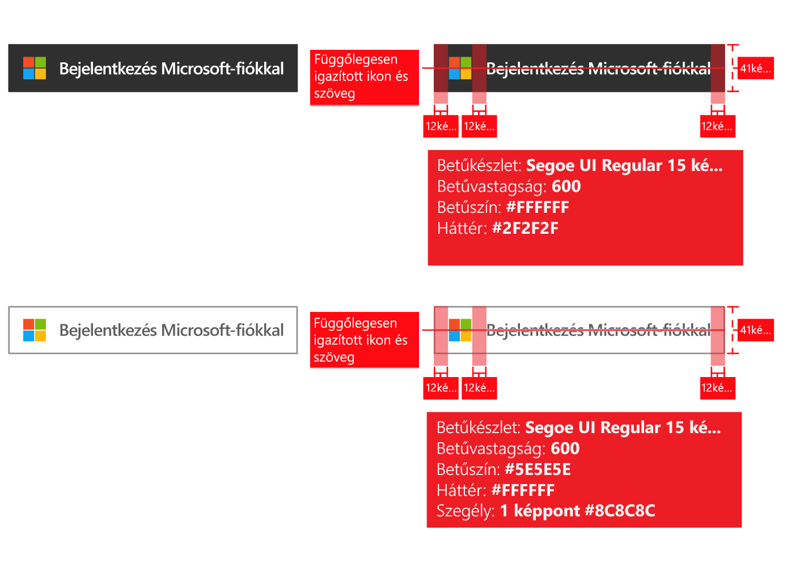
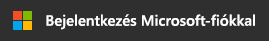
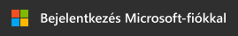
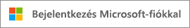
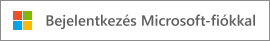
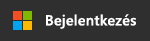
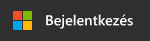
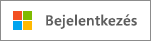

# Védjegyzési útmutató az alkalmazásokhoz

Ha az Azure Active Directoryval (Azure AD) fejleszt alkalmazásokat, segítenie kell az ügyfeleknek eligazodni, ha a munkahelyi vagy iskolai fiókjukkal (amelyek felügyelete az Azure AD-ben történik), illetve személyes fiókjukkal szeretnének regisztrálni vagy bejelentkezni az Ön által fejlesztett alkalmazásba.

Ebben a cikkben:

- Megismerheti a Microsoft által felügyelt felhasználói fiók két fajtáját, illetve hogy miként hivatkozhat az Azure AD-fiókokra az alkalmazásában.
- Megtudhatja, hogy mit kell tennie a Microsoft embléma az alkalmazásban való használatához történő hozzáadásához.
- Letölti a hivatalos **Bejelentkezés** és **Bejelentkezés Microsoft-fiókkal** képet az alkalmazásban való használathoz.
- Megismerheti a védjegyzéssel és navigálással kapcsolatban ajánlott és kerülendő műveleteket.

## Személyes fiókok és munkahelyi vagy iskolai Microsoft-fiókok összehasonlítása

A Microsoft kétféle felhasználói fiókot kezel:

- **Személyes fiókok** (korábban Windows Live ID). Ezek az *egyes* felhasználók és a Microsoft közötti kapcsolatot képviselik, és a Microsoft fogyasztói eszközökhöz és szolgáltatásokhoz való hozzáférését biztosítják. Ezek a fiókok személyes használatra vannak szánva.
- **Munkahelyi vagy iskolai fiókok.** A fiókokat a Microsoft felügyeli az Azure Active Directory-t használó vállalatok nevében. A fiókok az Office 365-be és a Microsoft egyéb üzleti szolgáltatásaiba való bejelentkezésre szolgálnak.

A Microsoft munkahelyi vagy iskolai fiókokat a szervezetek (vállalatok, iskolák, kormányhivatalok) jellemzően a végfelhasználókhoz (alkalmazottak, diákok, köztisztviselők) rendelik. Ezeket a fiókokat közvetlenül a felhőben (az Azure AD platformon) vagy Azure AD-val szinkronizálva kezelik egy helyszíni címtárból, például a Windows Server Active Directoryból. A Microsoft a munkahelyi vagy iskolai fiókok *felügyelője*, de azok a szervezetek tulajdonában állnak, és a szervezetek felügyelik őket.

## Azure AD-fiókok hivatkozása az alkalmazásban

A Microsoft nem jeleníti meg a végfelhasználóknak az Azure vagy az Active Directory márkaneveket, és Ön se tegye.

- Bejelentkezett felhasználó esetén, ha csak teheti, használja a szervezet nevét és emblémáját. Ez jobb megoldás, mint az általános, „az Ön szervezete” jellegű kifejezések.
- Ha a felhasználó nincs bejelentkezve, hivatkozzon a fiókra „Munkahelyi vagy iskolai fiók” néven, és használja a Microsoft emblémáját annak jelzésére, hogy a fiókokat a Microsoft kezeli. Ne használja a „vállalati fiók”, „üzleti fiók”, „céges fiók” vagy az ehhez hasonló kifejezéseket, mert ezek összezavarhatják a felhasználót.

## A felhasználói fiók piktogramja

Az irányelvek korábbi verziójában a „kék jelvény” piktogram használatát javasoltuk. A felhasználói és fejlesztői visszajelzések alapján ehelyett jelenleg a Microsoft embléma használatát javasoljuk. A Microsoft embléma elősegíti, hogy a felhasználók könnyebben felismerjék, hogy az Office 365-höz vagy más Microsoft üzleti szolgáltatásokhoz használt fiókjukat is használhatják, ha be szeretnének lépni az alkalmazásba.

## Regisztrálás és bejelentkezés az Azure AD szolgáltatással

Az alkalmazása eltérően működhet regisztráció és bejelentkezés esetén. A következő szakaszokban vizuális útmutatást talál mindkét esethez.

**Ha az alkalmazás támogatja a végfelhasználói regisztrációt (például „free to trial” vagy „freemium” modellek)**: Megjeleníthet egy **Bejelentkezés** gombot, amelyen keresztül a felhasználók a munkahelyi vagy személyes fiókjukkal elérhetik az alkalmazást. Az Azure AD az alkalmazásba való első bejelentkezéskor a jóváhagyásukat fogja kérni.

**Ha az alkalmazás kizárólag rendszergazdák által hozzáférhető engedélyeket, vagy szervezeti licencet igényel**: Különítse el a rendszergazdai beszerzést a felhasználói bejelentkezéstől. Az **„Alkalmazás beszerzése” gomb** átirányítja a rendszergazdákat a bejelentkezéshez, majd a hozzájárulásukat kéri a szervezet felhasználói nevében, aminek az a további előnye, hogy megszünteti a végfelhasználóktól az alkalmazáshoz érkező hozzájárulási kérelmeket.

## Vizuális útmutató az alkalmazásbeszerzéshez

Az „Alkalmazás beszerzése” hivatkozás átirányítja a felhasználót az Azure AD hozzáférési megadása (engedélyezés) oldalra, hogy a szervezet rendszergazdája engedélyezhesse, hogy az alkalmazás hozzáférhessen a szervezet Microsoft által szolgáltatott adataihoz. További részletek a hozzáférés kéréséről az [Alkalmazások integrálása az Azure Active Directoryval](quickstart-v1-integrate-apps-with-azure-ad.md) cikkben találhatók.

Miután a rendszergazda engedélyezi az alkalmazást, eldöntheti, hogy hozzáadja-e a felhasználó Office 365 alkalmazásindító élményéhez (elérhető a gofri alkalmazásindítóból és innen: [https://portal.office.com/myapps](https://portal.office.com/myapps)). Ha hirdetni szeretné ezt a képességet, használja az „Adja a szervezetéhez ezt az alkalmazást” vagy egy hasonló kifejezést, és jelenítsen meg egy, a példához hasonló gombot:

Gombok használata helyett inkább magyarázó szövegek írását ajánljuk. Például:

> *Ha már használja az Office 365-öt vagy a Microsoft más üzleti szolgáltatását, engedélyezheti a(z) <alkalmazás_neve> alkalmazásnak, hogy hozzáférjen a szervezet adataihoz. Így a felhasználók elérhetik a(z) <alkalmazás_neve> alkalmazást a már létező munkahelyi fiókjukkal.*

A hivatalos Microsoft embléma letöltéséhez az alkalmazáshoz kattintson a jobb gombbal a választott emblémára, majd mentse a gépére.

| Objektum                                | PNG formátum | SVG formátum |
| ------------------------------------ | ---------- | ---------- |
| Microsoft embléma  |  |  |

## Vizuális útmutató a bejelentkezéshez

Az alkalmazás jelenítsen meg egy bejelentkezés gombot, amely átirányítja a felhasználókat a bejelentkezési végpontra, amely megfelel az Azure AD integráláshoz használt protokollnak. A következő szakasz részletesen bemutatja, hogyan nézzen ki a gomb.

### Piktogram és „Bejelentkezés Microsofttal”

A Microsoft embléma és a „Bejelentkezés Microsofttal” kifejezés együttese egyedileg jelöli az Azure AD-t az alkalmazás által támogatott egyéb identitásszolgáltatók között. Ha nincs elég hely a „Bejelentkezés Microsofttal” megjelenítéséhez, használhatja a rövidebb „Bejelentkezés” szöveget. A gombokhoz világos vagy sötét téma használható.

Az alábbi diagramok mutatják a Microsoft által ajánlott korlátozásokat az objektumok alkalmazással való használata esetén. A „Bejelentkezés Microsofttal” vagy a rövidebb „Bejelentkezés” verzióra vonatkozó korlátozások.

Ha hivatalos képeket szeretne letölteni az alkalmazáshoz, kattintson a jobb gombbal a választott képre, majd mentse a számítógépére.

| Objektum                                | PNG formátum | SVG formátum |
| ------------------------------------ | ---------- | ---------- |
| Bejelentkezés Microsofttal (sötét téma)  |  |  |
| Bejelentkezés Microsofttal (világos téma) |  |  |
| Bejelentkezés (sötét téma)                 |  |  |
| Bejelentkezés (világos téma)                |  |  |

## Ajánlott és kerülendő műveletek a védjegyzéssel kapcsolatban

**HASZNÁLJA** a „Munkahelyi vagy iskolai fiók” és „Bejelentkezés Microsofttal” gombok kombinációját, hogy több információt szolgáltasson a végfelhasználóknak arról, hogy használhatják-e a fiókjukat a bejelentkezéshez. **NE HASZNÁLJA** a „vállalati fiók”, „üzleti fiók”, „céges fiók” vagy más ezekhez hasonló kifejezéseket.

**NE HASZNÁLJA** az „Office 365 ID” vagy „Azure ID” kifejezéseket. Az Office 365 egy Microsoft felhasználói ajánlat neve is, amely nem használja az Azure AD-t a hitelesítéshez.

**NE** változtassa meg a Microsoft emblémát.

**NE** jelenítse meg a végfelhasználóknak az Azure vagy az Active Directory márkaneveket. Fejlesztők, informatikai szakemberek és rendszergazdák esetében azonban megengedett a használatuk.

## Ajánlott és kerülendő műveletek a navigációval kapcsolatban

**ADJON** módot arra, hogy a felhasználók kijelentkezhessenek, és másik felhasználói fiókra válthassanak. Bár a legtöbb felhasználó egyetlen személyes Microsoft-/Facebook-/Google-/Twitter-fiókkal rendelkezik, gyakran egynél több szervezettel is kapcsolatban áll. A többszörösen bejelentkezett felhasználók támogatása hamarosan elérhetővé válik.
