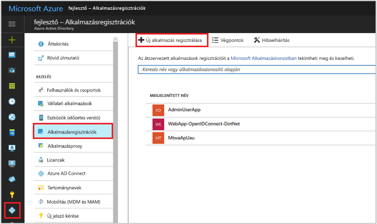
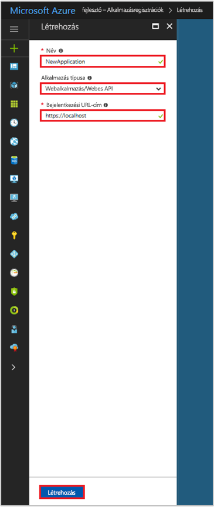

# Rövid útmutató: Alkalmazás regisztrálása az Azure Active Directory 1.0-s verziójú végpontján

[!INCLUDE [active-directory-develop-applies-v1](../../../includes/active-directory-develop-applies-v1.md)]

A nagyvállalati fejlesztők és SaaS-szolgáltatók (szoftverszolgáltatók) az Azure Active Directoryval (Azure AD) integrálható kereskedelmi felhőszolgáltatásokat és üzletági alkalmazásokat fejleszthetnek, hogy a szolgáltatásaikhoz biztonságos bejelentkezést és engedélyezést biztosítsanak. Az alkalmazás vagy szolgáltatás az Azure AD-vel történő integrálásához a fejlesztőnek először regisztrálnia kell az alkalmazást az Azure AD-ben.

Az Azure AD képességeit felhasználó alkalmazásokat először regisztrálni kell egy Azure AD-bérlőben. A regisztrálási folyamat során a következő részleteket kell megadni az Azure AD-nek az alkalmazásról: az URL-cím, amelyen az alkalmazás megtalálható, az URL-cím, amelyre a rendszer a válaszokat küldi egy felhasználó hitelesítését követően, az alkalmazást azonosító URI, és így tovább.

Ez a rövid útmutató bemutatja, hogyan adhat hozzá és regisztrálhat egy alkalmazást az Azure AD-ben.

## Előfeltételek

Először győződjön meg arról, hogy már rendelkezik egy Azure AD-bérlővel, amelyet az alkalmazások regisztrálásához használhat. Ha még nem rendelkezik bérlővel, [itt megtudhatja, hogyan tehet szert egyre](quickstart-create-new-tenant.md).

## Új alkalmazás regisztrálása az Azure Portal használatával

1. Jelentkezzen be az [Azure Portalra](https://portal.azure.com).
1. Ha a fiókja több bérlőhöz is biztosít hozzáférést, válassza ki a fiókot az oldal jobb felső sarkában, és állítsa a portálmunkamenetét a kívánt Azure AD-bérlőre.
1. Válassza ki az **Azure Active Directory** szolgáltatást a bal oldali navigációs panelen.
1. Válassza az **Alkalmazásregisztrációk**, majd az **Új alkalmazás regisztrálása** elemet.

    

1. Amikor megjelenik a **Létrehozás** lap, adja meg az alkalmazás regisztrációs adatait: 

    - **Név:** Adjon meg egy kifejező alkalmazásnevet
    - **Alkalmazás típusa:**
      - Válassza a **Natív** lehetőséget a helyileg vagy eszközre telepített [ügyfélalkalmazások](developer-glossary.md#client-application) esetében. Ez a beállítás használatos a nyilvános OAuth [natív ügyfelekhez](developer-glossary.md#native-client).
      - Válassza a **Webalkalmazás/API** lehetőséget a biztonságos kiszolgálóra telepített [ügyfélalkalmazások](developer-glossary.md#client-application) és [erőforrás-/API-alkalmazások](developer-glossary.md#resource-server) esetében. Ez a beállítás használatos a bizalmas OAuth [webes ügyfelekhez](developer-glossary.md#web-client) és a nyilvános [felhasználóiügynök-alapú ügyfelekhez](developer-glossary.md#user-agent-based-client). Egyazon alkalmazás az ügyfelet és az erőforrást/API-t is elérhetővé teheti.
    - **Bejelentkezési URL-cím:** „Webalkalmazás/API” típusú alkalmazás esetén adja meg annak alap URL-címét. A `http://localhost:31544` például a helyi gépen futó webalkalmazás URL-címe lehet. A felhasználók ezzel az URL-címmel jelentkeznek be egy webes ügyfélalkalmazásba. 
    - **Átirányítási URL-cím:** „Natív” típusú alkalmazások esetében adja meg az URI-t, amelyet az Azure AD a jogkivonatválaszok visszaadására használ. Adjon meg egy, az alkalmazáshoz tartozó értéket, például: `http://MyFirstAADApp`

      

    Ha konkrét példákat szeretne látni a webalkalmazásokra vagy a natív alkalmazásokra, tekintse meg a dokumentáció **Rövid útmutatók** szakaszát.

1. Miután végzett, válassza a **Létrehozás** lehetőséget.

    Az Azure AD egy egyedi alkalmazásazonosítót rendel az alkalmazáshoz, Önt pedig átirányítja az alkalmazás regisztrációs főoldalára. Attól függően, hogy az alkalmazás webes vagy natív, eltérő lehetőségek állnak rendelkezésre az alkalmazás további funkcióinak hozzáadásához.

      > [!NOTE]
      > Alapértelmezés szerint egy újonnan regisztrált webalkalmazás úgy van konfigurálva, hogy **csak** az egyazon bérlőhöz tartozó felhasználók jelentkezhessenek be az alkalmazásba.

## További lépések

- Tekintse meg az [Azure AD hozzájárulási keretrendszer](consent-framework.md) című szakaszt a hozzájárulás áttekintéséhez.
- Az alkalmazásregisztráció további konfigurációs funkcióinak engedélyezéséhez – például hitelesítési adatok, engedélyek, más bérlőkhöz tartozó felhasználók bejelentkezésének engedélyezése – tekintse meg az [Alkalmazás frissítése az Azure AD-ben](quickstart-v1-update-azure-ad-app.md) című szakaszt.
- Ha szeretne többet megtudni a regisztrált alkalmazásokat jelölő két Azure AD-objektumról és azok kapcsolatáról, tekintse meg az [alkalmazás- és szolgáltatásnév-objektumokat](app-objects-and-service-principals.md) ismertető szakaszt.
- Ha szeretne többet megtudni az Azure Active Directoryt használó alkalmazások fejlesztése során alkalmazandó védjegyzési irányelvekről, tekintse meg az [alkalmazások védjegyzési irányelveit](howto-add-branding-in-azure-ad-apps.md) ismertető szakaszt.
