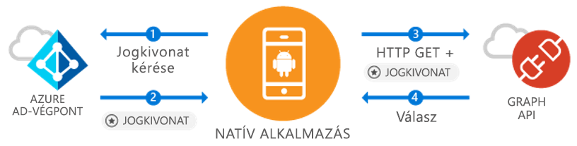

# <a name="azure-ad-android-getting-started"></a>Ismerkedés az Azure AD Android
[!INCLUDE [active-directory-devquickstarts-switcher](../../../includes/active-directory-devquickstarts-switcher.md)]

Ha egy Android-alkalmazást fejleszt, a Microsoft teszi egyszerű és átlátható a felhasználók Azure Active Directory (Azure AD). Az Azure AD lehetővé teszi, hogy az alkalmazás felhasználói adatok elérését a Microsoft Graph vagy a saját védett webes API-t. 

Az Azure AD Authentication Library (ADAL) Androidos függvénytár lehetővé teszi az alkalmazás használatának megkezdéséhez a [Microsoft Azure Felhőszolgáltatásbeli](https://cloud.microsoft.com) & [Microsoft Graph API](https://graph.microsoft.io) támogatásával [ A Microsoft Azure Active Directory-fiókok](https://azure.microsoft.com/services/active-directory/) használatával az iparági szabványos OAuth2 és OpenID Connect. Ez a minta azt mutatja be, a normál életciklusa az alkalmazás működést, többek között:

* A Microsoft Graph egy token beszerzése
* Jogkivonat frissítése
* A Microsoft Graph hívása
* A felhasználó kijelentkeztetése

Első lépésként kell, amelyen létre felhasználókat és regisztrálni egy alkalmazást az Azure AD-bérlővel. Ha még nem rendelkezik egy bérlő [megtudhatja, hogyan tehet szert egy](quickstart-create-new-tenant.md).

## <a name="scenario-sign-in-users-and-call-the-microsoft-graph"></a>Forgatókönyv: Felhasználók Bejelentkeztetéséhez, és hívja a Microsoft Graph



Ez az alkalmazás összes az Azure AD-fiókok esetében használható. (Lépést tárgyalt) is egy vagy több szervezeti forgatókönyveket támogatja. Ebben bemutatjuk, hogyan lehet létrehozni egy fejlesztői vállalati felhasználókat érhet és elérése az Azure és az Office 365-alkalmazások a Microsoft Graph-n keresztül adatokat. A hitelesítési folyamat során a végfelhasználók kell bejelentkezni, és hozzájárul az engedélyeket, az alkalmazás, és bizonyos esetekben szükség lehet a rendszergazdai jóváhagyást az alkalmazáshoz. Ebben a példában a logikai többsége bemutatja, hogyan hitelesítés a felhasználó, és lehetővé teheti egy alapszintű hívja a Microsoft Graph.

## <a name="example-code"></a>Példakód

A minta teljes kódját megtalálja [a Githubon](https://github.com/Azure-Samples/active-directory-android). 

```Java
// Initialize your app with MSAL
AuthenticationContext mAuthContext = new AuthenticationContext(
        MainActivity.this, 
        AUTHORITY, 
        false);


// Perform authentication requests
mAuthContext.acquireToken(
    getActivity(), 
    RESOURCE_ID, 
    CLIENT_ID, 
    REDIRECT_URI,  
    PromptBehavior.Auto, 
    getAuthInteractiveCallback());

// ...

// Get tokens to call APIs like the Microsoft Graph
mAuthResult.getAccessToken()
```

## <a name="steps-to-run"></a>Lépések végrehajtásához

### <a name="register-and-configure-your-app"></a>Regisztráljon, és az alkalmazás konfigurálása 
Regisztrálva a Microsoft használatával natív ügyfélalkalmazás rendelkeznie kell a [az Azure portal](https://portal.azure.com). 

1. Az alkalmazásregisztráció beolvasása
    - Lépjen az [Azure Portalra](https://aad.portal.azure.com). 
    - Válassza ki ***az Azure Active Directory*** > ***Alkalmazásregisztrációk***. 

2. Az alkalmazás létrehozása
    - Válassza az **Új alkalmazás regisztrálása** elemet. 
    - Adja meg az alkalmazás nevét, az a **neve** mező. 
    - A **alkalmazástípus** kiválasztása **natív**. 
    - A **átirányítási URI-t**, adja meg `http://localhost`. 

3. A Microsoft Graph konfigurálása
    - Válassza ki **beállítások > szükséges engedélyek**.
    - Válassza ki **Hozzáadás**, belső **API kiválasztása** kiválasztása ***Microsoft Graph***. 
    - Válassza ki az engedély **jelentkezzen be és felhasználói profil olvasása**, kattintson a gombra **kiválasztása** mentéséhez. 
        - Ezt az engedélyt leképezi a `User.Read` hatókör. 
    - Választható lehetőség: Belső **szükséges engedélyek > Windows Azure Active Directory**, távolítsa el a kiválasztott engedélyt **jelentkezzen be a felhasználói profil olvasása és**. Így elkerülhető, a felhasználói hozzájárulást kérő lap kétszer az engedély listázása. 

4. Gratulálunk! Az alkalmazás konfigurálása sikeresen megtörtént. A következő szakaszban lesz szüksége:
    - `Application ID`
    - `Redirect URI`

### <a name="get-the-sample-code"></a>A mintakód letöltése

1. Klónozza a kódot.
    ```
    git clone https://github.com/Azure-Samples/active-directory-android
    ```
2. Az Android Studióban nyissa meg a mintát.
    - Válassza ki **Android Studio projekt megnyitása**.

### <a name="configure-your-code"></a>A kód konfigurálása

Ez a kódminta, az összes konfigurációját annak a ***src/main/java/com/azuresamples/azuresampleapp/MainActivity.java*** fájlt. 

1. Cserélje le a konstans `CLIENT_ID` együtt a `ApplicationID`.
2. Cserélje le a konstans `REDIRECT URI` együtt a `Redirect URI` korábban beállított (`http://localhost`). 

### <a name="run-the-sample"></a>Minta futtatása

1. Válassza ki **összeállítása > Projekt tiszta**. 
2. Válassza ki **Futtatás > alkalmazás futtatása**. 
3. Az alkalmazás kell hozhat létre, és néhány alapvető UX megjelenítése Amikor rákattint a `Call Graph API` gomb, azt fogja kérni a bejelentkezésre és csendes hívja a Microsoft Graph API az új jogkivonat. 

## <a name="important-info"></a>Fontos információ

1. Kivétel a [ADAL Android Wiki](https://github.com/AzureAD/azure-activedirectory-library-for-android/wiki) kapcsolatos további információért a szalagtár mechanics és új forgatókönyvek és funkciók konfigurálása. 
2. A natív esetben az alkalmazás egy beágyazott WebView-t fogja használni, és nem hagyja az alkalmazás. A `Redirect URI` tetszőleges is lehet. 
3. Keresse meg a problémákat, vagy kérelmek rendelkezik? Probléma létrehozása vagy a közzététel a StackOverflow-n a címkével ellátott `azure-active-directory`. 

### <a name="cross-app-sso"></a>Alkalmazások közötti SSO
Ismerje meg, [az Android alkalmazások közötti SSO engedélyezése ADAL használatával hogyan](howto-v1-enable-sso-on-android.md). 

### <a name="auth-telemetry"></a>Hitelesítési telemetria
az ADAL könyvtár auth telemetriai adatok segítségével az alkalmazásfejlesztők megismerheti, hogyan alkalmazásaikat vezérelhesse és jobb felhasználói környezetek készíthetők tesz elérhetővé. Ez lehetővé teszi, hogy a bejelentkezés sikeres, az aktív felhasználók és számos más érdekes rögzítése. Hitelesítési telemetriai adatok segítségével az alkalmazásfejlesztők egy telemetriai szolgáltatásnak, összesítéséhez és eseményeket létrehozásához igényel.

További információ a hitelesítési telemetriát, kivétele [ADAL Android hitelesítési telemetriai](https://github.com/AzureAD/azure-activedirectory-library-for-android/wiki/Telemetry). 

[!INCLUDE [active-directory-devquickstarts-additional-resources](../../../includes/active-directory-devquickstarts-additional-resources.md)]
