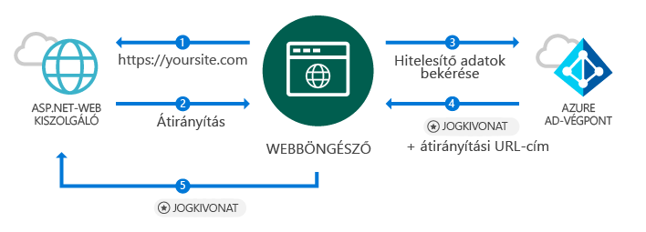
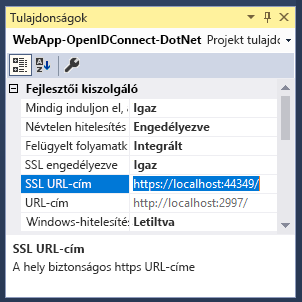
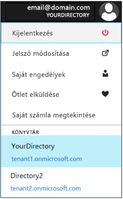
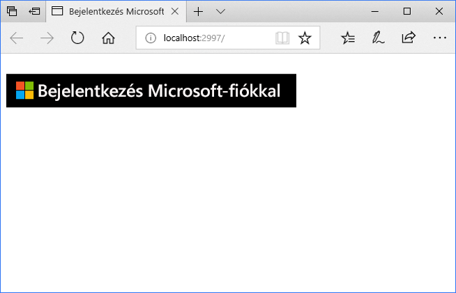
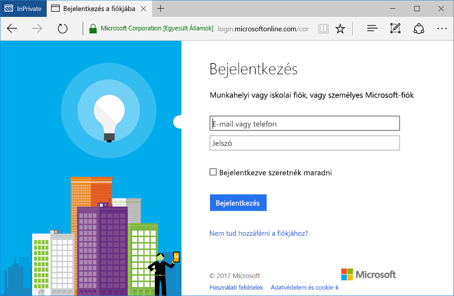

<!--start-intro-->
# <a name="add-sign-in-with-microsoft-to-an-aspnet-web-app"></a>Jelentkezzen be a Microsoft ASP.NET-webalkalmazás hozzáadása

Ez az útmutató bemutatja, hogyan valósíthatók meg jelentkezzen be a Microsoft az OpenID Connect használatával hagyományos webhely böngészőalapú alkalmazást egy ASP.NET MVC-megoldás használatával. 

Ez az útmutató végén az alkalmazás fogad a szervezetek számára, amely integrálva van az Azure Active Directory munkahelyi és iskolai fiókok bejelentkezések.

> [!NOTE]
> Az interaktív telepítés segítségével engedélyezheti az ASP.NET-alkalmazás a munkahelyi és iskolai fiókjába történő bejelentkezések. Ha érdekli, munkahelyi és iskolai fiókok mellett személyes fiókok bejelentkezések engedélyezéséhez, használhatja a [v2 végpont](active-directory-v2-compare.md). Lásd: [az ASP.NET interaktív telepítés a v2 végpont](tutorial-v2-asp-webapp.md) , valamint [ebben a dokumentumban](active-directory-v2-limitations.md) elmagyarázza a v2 végpont érvényes aktuális korlátozásait.
<br/><br/>

<!--separator-->

> Ez az útmutató a Visual Studio 2015 Update 3 vagy a Visual Studio 2017 van szükség.  Nem rendelkezik?  [Az ingyenes Visual Studio 2017 letöltése](https://www.visualstudio.com/downloads/)

## <a name="how-this-guide-works"></a>Ez az útmutató működése



Ez az útmutató alapján a forgatókönyvet, ahol a böngésző fér hozzá az ASP.NET-webhely, egy felhasználó egy bejelentkezési gomb-on keresztül hitelesítendő kér. Ebben a forgatókönyvben megjelenítése a weblap munka nagy részét a kiszolgálói oldalon történik.

> [!NOTE]
> Az interaktív telepítés és a egy ASP.NET-webalkalmazást, egy üres sablonnal kezdve a felhasználók közé tartozik például a bejelentkezési gombra, és minden vezérlő és a módszereket, a közben is az néhány olyan fogalmat ismertető lépéseket mutatja be. Másik megoldásként is létrehozhat egy projektet a bejelentkezéshez az Azure Active Directory felhasználók (munkahelyi és iskolai fiókok esetében) használatával a [Visual Studio web sablon](https://docs.microsoft.com/aspnet/visual-studio/overview/2013/creating-web-projects-in-visual-studio#organizational-account-authentication-options) , és válassza *szervezeti fiókok* , majd az egyik az felhő közül – ezt a lehetőséget egy gazdagabb sablont használ a további vezérlők, a metódusok és a nézetek.

## <a name="libraries"></a>Kódtárak

Ez az útmutató a következő csomagok használja:

|Részletes ismertetés|Leírás|
|---|---|
|[Microsoft.Owin.Security.OpenIdConnect](https://www.nuget.org/packages/Microsoft.Owin.Security.OpenIdConnect/)|Közbenső szoftvert, amely lehetővé teszi az alkalmazások a hitelesítéshez használandó OpenIdConnect|
|[Microsoft.Owin.Security.Cookies](https://www.nuget.org/packages/Microsoft.Owin.Security.Cookies)|Közbenső szoftvert, amely lehetővé teszi az alkalmazások karbantartásához a felhasználói munkamenet cookie-k használatával|
|[Microsoft.Owin.Host.SystemWeb](https://www.nuget.org/packages/Microsoft.Owin.Host.SystemWeb)|Lehetővé teszi az IIS használata az ASP.NET-kérelem folyamata OWIN-alapú alkalmazások|


<!--end-intro-->

<!--start-setup-->

## <a name="set-up-your-project"></a>A projekt beállítása

Ez a szakasz bemutatja a lépéseket, telepítése és konfigurálása a hitelesítési folyamat keresztül OWIN közbenső szoftvert az OpenID Connect hitelesítést használó ASP.NET-projekt. 

> Töltse le ezt a mintát a Visual Studio-projekt ehelyett inkább? [Töltse le a projekt](https://github.com/AzureADQuickStarts/WebApp-OpenIdConnect-DotNet/archive/GuidedSetup.zip) , és ugorjon a [konfigurációs lépés](#configure-your-webconfig-and-register-an-application) konfigurálása a kódminta végrehajtása előtt.

## <a name="create-your-aspnet-project"></a>Az ASP.NET-projekt létrehozása
1. A Visual Studióban: `File` > `New` > `Project`<br/>
2. A *Visual C# \Web*válassza `ASP.NET Web Application (.NET Framework)`.
3. Adjon nevet az alkalmazásnak, és kattintson a *OK*
4. Válassza ki `Empty` , majd adja hozzá a jelölőnégyzet bejelölésével `MVC` referenciák

## <a name="add-authentication-components"></a>Adja hozzá a hitelesítés összetevői

1. A Visual Studióban: `Tools` > `Nuget Package Manager` > `Package Manager Console`
2. Adjon hozzá *OWIN közbenső NuGet-csomagok* a Csomagkezelői konzol ablakában írja be a következőket:

    ```powershell
    Install-Package Microsoft.Owin.Security.OpenIdConnect
    Install-Package Microsoft.Owin.Security.Cookies
    Install-Package Microsoft.Owin.Host.SystemWeb
    ```

<!--start-collapse-->
> ### <a name="about-these-packages"></a>Ezek a csomagok
>A fenti könyvtárak engedélyezése az egyszeri bejelentkezés (SSO) cookie-alapú hitelesítés keresztül OpenID Connect használatával. Hitelesítés elvégzése, majd az alkalmazás továbbítja a felhasználó jelképező jogkivonatot, miután az OWIN közbenső szoftvert egy munkamenetcookie-t hoz létre. A böngésző majd használja a cookie-k további kérések így a felhasználóknak nem kell hitelesítse magát újra, és nincs további ellenőrzés van szükség.
<!--end-collapse-->

## <a name="configure-the-authentication-pipeline"></a>A hitelesítési folyamat konfigurálásához
A következő lépések segítségével hozzon létre egy OWIN közbenső szoftver *indítási osztályt* OpenID Connect-hitelesítés konfigurálása. Ez az osztály automatikusan hajtja végre.

> [!TIP]
> Ha a projekt nem rendelkezik egy `Startup.cs` fájl a gyökérmappában található:<br/>
> 1. Kattintson a jobb gombbal a projektmappa gyökérkönyvtárába a: >    `Add` > `New Item...` > `OWIN Startup class`<br/>
> 2. Nevezze el `Startup.cs`<br/>
>
>> Ellenőrizze, hogy a kiválasztott osztály egy OWIN indítási osztályt, és nem szabványos C# osztály. Látja-e a megerősítés `[assembly: OwinStartup(typeof({NameSpace}.Startup))]` fent a névteret.


1. Adjon hozzá *OWIN* és *Microsoft.IdentityModel* névtereket, hogy a `Startup.cs`:

    [!code-csharp[main](../../../WebApp-OpenIDConnect-DotNet/WebApp-OpenIDConnect-DotNet\Startup.cs?name=AddedNameSpaces "Startup.cs")]

2. Cserélje le az indítási osztályt a következő kóddal:

    [!code-csharp[main](../../../WebApp-OpenIDConnect-DotNet/WebApp-OpenIDConnect-DotNet\Startup.cs?name=Startup "Startup.cs")]
    
<!--start-collapse-->
> [!NOTE]
> A paraméterek meg *OpenIDConnectAuthenticationOptions* koordináták az alkalmazáshoz való kommunikációhoz, az Azure AD szolgálhat. Az OpenID Connect közbenső szoftvert használ cookie-kat, mert azt is meg kell cookie-hitelesítés beállítása az előző kód látható módon. A *ValidateIssuer* értéke közli OpenIdConnect nem korlátozza a hozzáférést egy adott szervezet számára.
<!--end-collapse-->

<!--end-setup-->

<!--start-use-->

## <a name="add-a-controller-to-handle-sign-in-and-sign-out-requests"></a>Bejelentkezési és kijelentkezési kérések kezelésére vezérlő hozzáadása

Ez a lépés bemutatja, hogyan hozhat létre egy új vezérlőt elérhetővé a bejelentkezési és kijelentkezési metódusokat.

1.  Kattintson a jobb gombbal a `Controllers` mappát, és válassza ki `Add` > `Controller`
2.  Válassza a(z) `MVC (.NET version) Controller – Empty` lehetőséget.
3.  Kattintson a *hozzáadása*
4.  Nevezze el `HomeController` kattintson *hozzáadása*
5.  Adjon hozzá *OWIN* névterek az osztályhoz:

    [!code-csharp[main](../../../WebApp-OpenIDConnect-DotNet/WebApp-OpenIDConnect-DotNet\Controllers\HomeController.cs?name=AddedNameSpaces "HomeController.cs")]

6. Adja hozzá a következő módszerek kezeléséhez jelentkezzen be- és kijelentkezés a vezérlő egy hitelesítési ellenőrző kód keresztül kezdeményezi:

    [!code-csharp[main](../../../WebApp-OpenIDConnect-DotNet/WebApp-OpenIDConnect-DotNet\Controllers\HomeController.cs?name=SigInAndSignOut "HomeController.cs")]
    
## <a name="create-the-apps-home-page-to-sign-in-users-via-a-sign-in-button"></a>Hozzon létre a felhasználók keresztül egy bejelentkezés gombot az alkalmazás kezdőlapja

A Visual Studióban a bejelentkezési gomb hozzáadása és a hitelesítés után felhasználói információ megjelenítése új nézet létrehozása:

1.  Kattintson a jobb gombbal a `Views\Home` mappát, és válassza ki `Add View`
2.  Nevezze el a következőképpen: `Index`.
3.  A következő HTML, amely tartalmazza a Bejelentkezés gombra, adja hozzá a fájlhoz:

    [!code-html[main](../../../WebApp-OpenIDConnect-DotNet/WebApp-OpenIDConnect-DotNet/Views/Home/Index.cshtml "Index.cshtml")]

<!--start-collapse-->
> [!NOTE]
> Ezen a lapon fekete háttérrel SVG-formátumban ad hozzá egy bejelentkezés gombot:<br/><br/> Több bejelentkezési gombot, keresse fel [ezt oldal](https://docs.microsoft.com/azure/active-directory/develop/active-directory-branding-guidelines "védjegyzési útmutató").
<!--end-collapse-->

## <a name="display-users-claims-by-adding-a-controller"></a>Felhasználói jogcímek jelenít meg egy vezérlő hozzáadása
Ez a vezérlő bemutatja a felhasználását a `[Authorize]` attribútum egy vezérlő védelme érdekében. Ezt az attribútumot a vezérlő azáltal, hogy csak a hitelesített felhasználók hozzáférését korlátozza. A következő kód megkönnyíti az attribútum segítségével megjelenítheti a felhasználói jogcímeket, amelyek lekérni a bejelentkezés során.

1.  Kattintson a jobb gombbal a `Controllers` mappa: `Add` > `Controller`
2.  Válassza a(z) `MVC {version} Controller – Empty` lehetőséget.
3.  Kattintson a *hozzáadása*
4.  Nevezze el `ClaimsController`
5.  Cserélje le a kódot, a vezérlő osztályhoz a következő kóddal – Ez hozzáadja a `[Authorize]` attribútumot az osztályra:

    [!code-csharp[main](../../../WebApp-OpenIDConnect-DotNet/WebApp-OpenIDConnect-DotNet\Controllers\ClaimsController.cs?name=ClaimsController "ClaimsController.cs")]

<!--start-collapse-->
> [!NOTE]
> A használata miatt a `[Authorize]` attribútum, az összes módszer, ez a vezérlő csak hajtható végre, ha a felhasználó hitelesítését. Ha a felhasználó nincs hitelesítve, és megpróbál hozzáférni a vezérlő, OWIN kezdeményezi egy hitelesítési kérdés, és hitelesíti a felhasználót. A fenti kód megvizsgálja a jogcímek gyűjtemény a felhasználó a felhasználói jogkivonat tartalmazza azokat az attribútumokat. Ezek az attribútumok tartalmazzák a felhasználó teljes neve és a felhasználónevet, valamint a globális felhasználói azonosító tulajdonos. Is tartalmaz, a *Bérlőazonosító*, amely jelöli, hogy a felhasználó szervezete azonosítója. 
<!--end-collapse-->

## <a name="create-a-view-to-display-the-users-claims"></a>A felhasználói jogcímek megjeleníthető nézet létrehozása

A Visual Studióban a felhasználói jogcímek megjelenítése a weblap új nézet létrehozása:

1.  Kattintson a jobb gombbal a `Views\Claims` mappát és: `Add View`
2.  Nevezze el a következőképpen: `Index`.
3.  Adja hozzá a következő HTML-kódot a fájlhoz:

    [!code-html[main](../../../WebApp-OpenIDConnect-DotNet/WebApp-OpenIDConnect-DotNet/Views/Claims/Index.cshtml "Index.cshtml")]
    
<!--end-use-->

<!--start-configure-->
## <a name="configure-your-webconfig-and-register-an-application"></a>Konfigurálja a *web.config* és a egy alkalmazás regisztrálása

1. A Visual Studióban adjon hozzá a következő `web.config` (a gyökérmappában található) szakasz alatt `configuration\appSettings`:

    ```xml
    <add key="ClientId" value="Enter_the_Application_Id_here" />
    <add key="RedirectUrl" value="Enter_the_Redirect_Url_here" />
    <add key="Tenant" value="common" />
    <add key="Authority" value="https://login.microsoftonline.com/{0}" /> 
    ```
2. A Megoldáskezelőben, válassza ki a projektet, és tekintse meg a <i>tulajdonságok</i> (Ha nem látja a Tulajdonságok ablakban, az F4) ablak
3. Módosítsa az SSL engedélyezve <code>True</code>
4. A projekt SSL URL-cím másolása a vágólapra:<br/><br/><br />
5. A <code>web.config</code>, cserélje le <code>Enter_the_Redirect_URL_here</code> az SSL URL-címét a projekthez 

### <a name="register-your-application-in-the-azure-portal-then-add-its-information-to-webconfig"></a>Az alkalmazás regisztrálása az Azure Portalon, majd adja meg a saját adatait *web.config*

1. Nyissa meg a [a Microsoft Azure Portal - alkalmazásregisztrációk](https://portal.azure.com/#blade/Microsoft_AAD_IAM/ActiveDirectoryMenuBlade/RegisteredApps) alkalmazás regisztrálása
2. A következők szerint válasszon: `New application registration`
3. Adjon meg egy nevet az alkalmazásnak
4. Illessze be a Visual Studio-projekt *SSL URL-cím* a `Sign-on URL` (Ez az URL adott is automatikusan regisztrálja az alkalmazás válasz URL-címek listájában)
5. Kattintson a `Create` kell regisztrálni az alkalmazást. Ez a művelet visszatér az elérhető alkalmazások listája
6. Most keresése és/vagy válassza ki az imént létrehozott alkalmazást, és nyissa meg a tulajdonságait
7. Másolja a guid alapján `Application ID` a vágólapra
8. Lépjen vissza a Visual Studióba, és a `web.config`, cserélje le `Enter_the_Application_Id_here` együtt az imént regisztrált alkalmazás Alkalmazásazonosítója

> [!TIP]
> Szeretné-e a fiók több címtár való hozzáférést, ellenőrizze, hogy kiválasztotta a megfelelő címtárat a szervezethez lett konfigurálva az alkalmazás tetején található fióknevére kattintva regisztrálni kell az Azure Portalon jobbra, és ezután ellenőrzése a a kijelölt könyvtár:<br/>

## <a name="configure-sign-in-options"></a>Bejelentkezési beállítások konfigurálása

Beállíthatja, hogy az alkalmazást, hogy csak azok a felhasználók a szervezet egy Azure Active Directory-példány bejelentkezési tartoznak, vagy fogadja el a felhasználók bármilyen szervezethez tartozó felhasználók történő bejelentkezések. Kérjük, kövesse az alábbi lehetőségek egyikét:

### <a name="configure-your-application-to-allow-sign-ins-of-work-and-school-accounts-from-any-company-or-organization-multi-tenant"></a>Lehetővé teszi az alkalmazás konfigurálása a munkahelyi és iskolai fiókok bármely vállalat vagy szervezet (több-bérlős) indított bejelentkezések

Kövesse az alábbi lépéseket, ha elfogadja bejelentkezések bármely vállalat vagy szervezet, amely integrálva van az Azure Active Directory munkahelyi és iskolai fiókjába. Ez gyakran előfordul az *SaaS-alkalmazások*:

1. Lépjen vissza a [a Microsoft Azure Portal - alkalmazásregisztrációk](https://portal.azure.com/#blade/Microsoft_AAD_IAM/ActiveDirectoryMenuBlade/RegisteredApps) , és keresse meg az imént regisztrált alkalmazás
2. A `All Settings` kiválasztása `Properties`
3. Változás `Multi-tenanted` tulajdonságot `Yes` kattintson `Save`

Ez a beállítás és több-bérlős alkalmazások fogalma kapcsolatos további információkért lásd: [Ez a cikk](active-directory-devhowto-multi-tenant-overview.md "több-bérlős áttekintése").

### <a name="restrict-users-from-only-one-organizations-active-directory-instance-to-sign-in-to-your-application-single-tenant"></a>Felhasználók korlátozása a szervezet csak egy Active Directory-példányból, jelentkezzen be az alkalmazás (egybérlős)

Ez a beállítás akkor gyakran előfordul *LOB-alkalmazások*: szeretné-e az alkalmazás csak egy adott Azure Active Directory-példányhoz tartozó számlák történő bejelentkezések fogadására (beleértve a *vendégfiókok*az adott példány), cserélje le a `Tenant` paraméter *web.config* a `Common` a szervezet – a bérlő neve például *contoso.onmicrosoft.com*. Ezt követően módosíthatja a `ValidateIssuer` argumentumot a [ *OWIN indítási osztályt* ](#configure-the-authentication-pipeline) való `true`.

Ahhoz, hogy a felhasználók listájából csak meghatározott szervezetek, állítsa be `ValidateIssuer` igaz értékre, és a `ValidIssuers` szervezetek egy listában megadhatja a paraméterrel.

Egy másik lehetőség az, hogy egy egyéni módszert érvényesítéséhez használja a tanúsítványkibocsátók *IssuerValidator* paraméter. További információ `TokenValidationParameters`, lásd: [MSDN-cikkben](https://msdn.microsoft.com/library/system.identitymodel.tokens.tokenvalidationparameters.aspx "TokenValidationParameters MSDN-cikkben").

<!--end-configure-->

<!--start-configure-arp-->
<!--
## Configure your ASP.NET Web App with the application's registration information

In this step, you will configure your project to use SSL, and then use the SSL URL to configure your application’s registration information. After this, add the application’ registration information to your solution via *web.config*.

1.  In Solution Explorer, select the project and look at the `Properties` window (if you don’t see a Properties window, press F4)
2.  Change `SSL Enabled` to `True`
3.  Copy the value from `SSL URL` above and paste it in the `Redirect URL` field on the top of this page, then click *Update*:<br/><br/><br />
4.  Add the following in `web.config` file located in root’s folder, under section `configuration\appSettings`:

```xml
<add key="ClientId" value="[Enter the application Id here]" />
<add key="RedirectUri" value="[Enter the Redirect URL here]" />
<add key="Tenant" value="common" />
<add key="Authority" value="https://login.microsoftonline.com/{0}" /> 
```
-->
<!--end-configure-arp-->
<!--start-test-->
## <a name="test-your-code"></a>Tesztelheti a kódját

Nyomja meg `F5` , futtassa a projektet a Visual Studióban. A böngészőben megnyílik, és arra utasítja, hogy *http://localhost:{port}* Itt láthatja a *Bejelentkezés Microsoft-fiókkal* gombra. Lépjen tovább, és kattintson rá, hogy jelentkezzen be.

Amikor készen áll a vizsgálat, jelentkezzen be a munkahelyi fiókjával (Azure Active Directory) használatával. 





#### <a name="expected-results"></a>Várt eredmény
Jelentkezzen be, miután a webhely, amely a HTTPS URL-cím, az alkalmazás regisztrációs információit a Microsoft alkalmazásregisztrációs portálon megadott kezdőlapjára átirányítja a felhasználót. Ezen a lapon mostantól látható *Hello {User}* és a egy jelentkezzen ki, és a egy hivatkozásra kattintva megtekintheti a a felhasználói jogcímek – amely egy hivatkozást az engedélyezés vezérlőhöz korábban létrehozott-e.

### <a name="see-users-claims"></a>Tekintse meg a felhasználó jogcímei
Válassza ki a hivatkozásra kattintva tekintse meg a felhasználói jogcímeket. Ez a művelet a vezérlő és a nézetet, amely csak a hitelesített felhasználók számára elérhető vezet.

#### <a name="expected-results"></a>Várt eredmény
 A bejelentkezett felhasználó az alapszintű tulajdonságainak tartalmazó táblát kell megjelennie:

| Tulajdonság | Érték | Leírás|
|---|---|---|
| Name (Név) | {Felhasználó teljes neve} | A felhasználó vezetékneve és neve
|Felhasználónév | <span>user@domain.com</span>| A bejelentkezett felhasználó azonosítására használt felhasználónév
| Tárgy| {Subject}|A karakterlánc egyedi azonosítására szolgál a felhasználó bejelentkezése a weben|
| Bérlőazonosító| {Guid}| A *guid* a felhasználó Azure Active Directory-szervezet egyedi ábrázolásához.|

Emellett tekintse meg egy táblázatot, többek között szerepel a hitelesítési kérelem minden felhasználói jogcímeket. Minden jogcím-azonosító jogkivonat és azok magyarázatát listáját lásd: Ez [cikk](https://docs.microsoft.com/azure/active-directory/develop/active-directory-token-and-claims "jogcímek listája az azonosító jogkivonat").


### <a name="test-accessing-a-method-that-has-an-authorize-attribute-optional"></a>Teszt fér hozzá egyik módszere, amely rendelkezik egy *[engedélyezés]* attribútum (nem kötelező)
Ebben a lépésben meg elérésének tesztelése a jogcímek vezérlő névtelen felhasználóként:<br/>
Válassza ki a felhasználót a Kijelentkezés hivatkozásra, és a kijelentkezési folyamat befejezéséhez.<br/>
Most már a böngészőben, írja be a http://localhost:{port}/claims a tartományvezérlő által védett eléréséhez a `[Authorize]` attribútum

#### <a name="expected-results"></a>Várt eredmény
Meg kell kapnia a rendszer kéri, akkor hitelesíti a nézet megtekintéséhez.

## <a name="additional-information"></a>További információ

<!--start-collapse-->
### <a name="protect-your-entire-web-site"></a>A teljes webhelyet védelme
A teljes webhelyet védelmére, adja hozzá a `AuthorizeAttribute` való `GlobalFilters` a `Global.asax` `Application_Start` módszer:

```csharp
GlobalFilters.Filters.Add(new AuthorizeAttribute());
```
<!--end-collapse-->

<div></div>
<br/>

<!--end-test-->