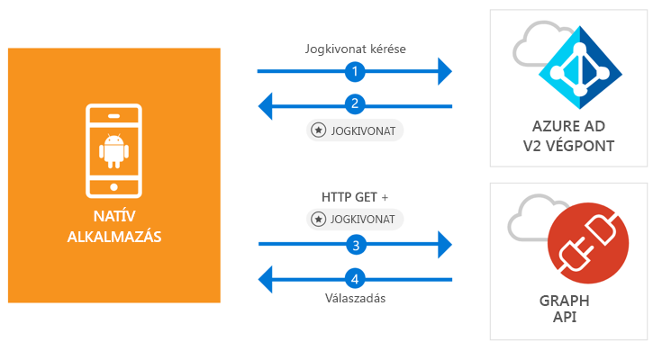

# <a name="quickstart-sign-in-users-and-call-the-microsoft-graph-api-from-an-android-app"></a>Gyors útmutató: A felhasználók és a Microsoft Graph API hívása Androidos alkalmazásokból

[!INCLUDE [active-directory-develop-applies-v2-msal](../../../includes/active-directory-develop-applies-v2-msal.md)]

A jelen rövid útmutatóban található kódmintán azt mutatjuk be, hogyan tud egy Android-alkalmazás bejelentkezni személyes, munkahelyi vagy iskolai fiókokba, lekérni egy hozzáférési jogkivonatot, és meghívni a Microsoft Graph API-t.



> [!NOTE]
> **Előfeltételek**
> * Az Android Studio 3-as vagy újabb verziója
> * 21-es vagy újabb SDK-jú Androidra van szükség (az SDK 27 az ajánlott)

> [!div renderon="docs"]
> ## <a name="register-and-download"></a>Regisztráció és letöltés
> ### <a name="register-and-configure-your-application-and-code-sample"></a>Az alkalmazás és a kódminta regisztrálása és konfigurálása
> #### <a name="step-1-register-your-application"></a>1. lépés: Alkalmazás regisztrálása
> Az alkalmazása regisztrálásához és az alkalmazás regisztrációs információinak a megoldáshoz való hozzáadásához tegye a következőket:
> 1. Az alkalmazás regisztrálásához lépjen a [Microsoft alkalmazásregisztrációs portálra](https://apps.dev.microsoft.com/portal/register-app).
> 1. Az **Alkalmazás neve** mezőben nevezze el az alkalmazását.
> 1. Ügyeljen arra, hogy az **Irányított beállítás** jelölőnégyzet ne legyen bejelölve, majd válassza a **Létrehozás** lehetőséget.
> 1. Válassza a **Platform hozzáadása**, a **Natív alkalmazás**, majd a **Mentés** lehetőséget.

> [!div renderon="portal" class="sxs-lookup"]
> #### <a name="step-1-configure-your-application"></a>1. lépés: Az alkalmazás konfigurálása
> Ahhoz, hogy a rövid útmutatóban szereplő kódminta működjön, hozzá kell adnia egy válasz URL-címet a következő formában: **msal{AppId}://auth** (ahol az {AppId} az alkalmazás azonosítója).
> > [!div renderon="portal" id="makechanges" class="nextstepaction"]
> > [A módosítás alkalmazása]()
>
> > [!div id="appconfigured" class="alert alert-info"]
> >  Az alkalmazás már konfigurálva van ezekkel az attribútumokkal

#### <a name="step-2-download-the-project"></a>2. lépés: Töltse le a projekt

* [Az Android Studio-projekt letöltése](https://github.com/Azure-Samples/active-directory-android-native-v2/archive/master.zip)

#### <a name="step-3-configure-your-project"></a>3. lépés: A projekt konfigurálása

1. Csomagolja ki és nyissa meg a projektet az Android Studióban.
1. Az **app** > **java** > **<i>{gazdagép}.{névtér}</i>** területen nyissa meg a következő elemet: **MainActivity**.
1. Cserélje le a `final static String CLIENT_ID` kezdetű sort a következőre:

    > [!div renderon="portal" class="sxs-lookup"]
    > ```java
    > final static String CLIENT_ID = "ENTER_THE_APPLICATION_ID_HERE";
    > ```

    > [!div renderon="docs"]
    > ```java
    > final static String CLIENT_ID = "<ENTER_THE_APPLICATION_ID_HERE>";
    > ```

1. Nyissa meg az **app** > **manifests** > **AndroidManifest.xml** fájlt.
1. Adja hozzá az alábbi tevékenységet a **manifest\application** csomóponthoz. Ez a kódrészlet egy **BrowserTabActivity** nevű tevékenységet regisztrál, hogy az operációs rendszer a hitelesítés befejezése után folytathassa az alkalmazás futtatását:

    > [!div renderon="docs"]
    > ```xml
    > <!--Intent filter to capture System Browser calling back to our app after Sign In-->
    > <activity
    >     android:name="com.microsoft.identity.client.BrowserTabActivity">
    >     <intent-filter>
    >         <action android:name="android.intent.action.VIEW" />
    >         <category android:name="android.intent.category.DEFAULT" />
    >         <category android:name="android.intent.category.BROWSABLE" />
    > 
    >         <!--Add in your scheme/host from registered redirect URI-->
    >         <!--By default, the scheme should be similar to 'msal[appId]' -->
    >         <data android:scheme="msal<ENTER_THE_APPLICATION_ID_HERE>"
    >             android:host="auth" />
    >     </intent-filter>
    > </activity>
    > ```

    > [!div renderon="portal" class="sxs-lookup"]
    > ```xml
    > <!--Intent filter to capture System Browser calling back to our app after Sign In-->
    > <activity
    >     android:name="com.microsoft.identity.client.BrowserTabActivity">
    >     <intent-filter>
    >         <action android:name="android.intent.action.VIEW" />
    >         <category android:name="android.intent.category.DEFAULT" />
    >         <category android:name="android.intent.category.BROWSABLE" />
    > 
    >         <!--Add in your scheme/host from registered redirect URI-->
    >         <!--By default, the scheme should be similar to 'msal[appId]' -->
    >         <data android:scheme="msalENTER_THE_APPLICATION_ID_HERE"
    >             android:host="auth" />
    >     </intent-filter>
    > </activity>
    > ```

> [!div renderon="docs"]
> <span>6.</span> Az `<ENTER_THE_APPLICATION_ID_HERE>` sztringet cserélje le az alkalmazás *azonosítójára*. Az *alkalmazásazonosítót* az *áttekintési* oldalon találja.

## <a name="more-information"></a>További információ

Az alábbi szakaszok a rövid útmutatóhoz kapcsolódód további információkat tartalmaznak.

### <a name="msal"></a>MSAL

Az MSAL ([com.microsoft.identity.client](https://javadoc.io/doc/com.microsoft.identity.client/msal)) egy olyan kódtár, amely felhasználók beléptetéséhez és egy Microsoft Azure Active Directory (Azure AD) által védett API-hoz való hozzáféréshez használt jogkivonatok kéréséhez használható. A telepítést a Gradle segítségével végezheti el. Ehhez a **Dependencies** (Függőségek) területen hozzá kell adnia a **Gradle Scripts** > **build.gradle (Module: app)** elemhez a következőket:

```gradle  
implementation 'com.android.volley:volley:1.1.1'
implementation 'com.microsoft.identity.client:msal:0.1.+'
```

### <a name="msal-initialization"></a>Az MSAL inicializálása

Az MSAL-re mutató hivatkozás hozzáadásához adja hozzá az alábbi kódot:

```java
import com.microsoft.identity.client.*;
```

Ezután inicializálja az MSAL-t az alábbi kóddal:

```java
sampleApp = new PublicClientApplication(
        this.getApplicationContext(),
        CLIENT_ID);
```

> |Az elemek magyarázata: ||
> |---------|---------|
> |`CLIENT_ID` | A *portal.azure.com* webhelyen regisztrált alkalmazásból származó alkalmazásazonosító |

### <a name="requesting-tokens"></a>Jogkivonatok lekérése

Az MSAL a következő két metódust használja a jogkivonatok beszerzéséhez: `acquireToken` és `acquireTokenSilentAsync`

#### <a name="getting-a-user-token-interactively"></a>Felhasználói jogkivonat interaktív lekérése

Bizonyos helyzetekben elkerülhetetlen, hogy a felhasználók kommunikáljanak az Azure AD 2.0-s végponttal. Ekkor megnyílik a böngésző, ahol érvényesíteni kell a felhasználók hitelesítő adatait, vagy hozzájárulást kell adni. Néhány példa:

* Az első alkalommal, amikor felhasználók bejelentkeznek az alkalmazásba
* Ha a felhasználóknak újból meg kell adniuk a hitelesítési adataikat, mert lejárt a jelszó
* Amikor az alkalmazás olyan erőforráshoz kér hozzáférést, amelyhez szükséges a felhasználó hozzájárulása
* Ha kétfaktoros hitelesítésre van szükség

```java
sampleApp.acquireToken(this, SCOPES, getAuthInteractiveCallback());
```

> |Az elemek magyarázata:||
> |---------|---------|
> | `SCOPES` | Tartalmazza a kért hatóköröket (azaz `{ "user.read" }` Microsoft Graph és `{ "<Application ID URL>/scope" }` egyéni webes API-k esetében) (például `api://<Application ID>/access_as_user`) |
> | `getAuthInteractiveCallback` | Visszahívás, amelyre akkor kerül sor, amikor a hitelesítés után visszakerül a vezérlés az alkalmazáshoz |

#### <a name="getting-a-user-token-silently"></a>Felhasználói jogkivonat csendes beszerzése

Nem érdemes minden egyes alkalommal megkövetelni a felhasználóktól a hitelesítő adatok érvényesítését, amikor hozzá kell férniük egy erőforráshoz. Általában szerencsésebb, ha a jogkivonatok beszerzéséhez és megújításához nincs szükség felhasználói beavatkozásra. Kezdetben használja az `acquireToken` metódust, majd a védett erőforrásokhoz való hozzáféréshez szükséges jogkivonatok beszerzéséhez az `AcquireTokenSilentAsync` metódust használhatja:

```java
sampleApp.acquireToken(getActivity(), SCOPES, getAuthInteractiveCallback());
```

> |Az elemek magyarázata:||
> |---------|---------|
> | `SCOPES` | Tartalmazza a kért hatóköröket (azaz `{ "user.read" }` Microsoft Graph és `{ "<Application ID URL>/scope" }` egyéni webes API-k esetében) (például `api://<Application ID>/access_as_user`) |
> | `getAuthInteractiveCallback` | Visszahívás, amelyre akkor kerül sor, amikor a hitelesítés után visszakerül a vezérlés az alkalmazáshoz |

## <a name="next-steps"></a>További lépések

### <a name="learn-the-steps-to-create-the-application-used-in-this-quickstart"></a>A jelen rövid útmutatóban használt alkalmazás létrehozási lépéseinek ismertetése

Próbálja ki az Androidhoz készült oktatóanyagot, amelyben teljes körű, részletes útmutatót talál az alkalmazások és új szolgáltatások létrehozásához, valamint megtalálja ennek a rövid útmutatónak a teljes magyarázatát is.

> [!div class="nextstepaction"]
> [A Graph API meghívása – oktatóanyag Androidhoz](https://docs.microsoft.com/azure/active-directory/develop/guidedsetups/active-directory-android)

### <a name="msal-for-android-library-wiki"></a>Androidhoz készült MSAL-kódtár – wiki

További információ az Androidhoz készült MSAL-kódtárról:

> [!div class="nextstepaction"]
> [Androidhoz készült MSAL-kódtár – wiki](https://github.com/AzureAD/microsoft-authentication-library-for-android/wiki)

[!INCLUDE [Help and support](../../../includes/active-directory-develop-help-support-include.md)]
