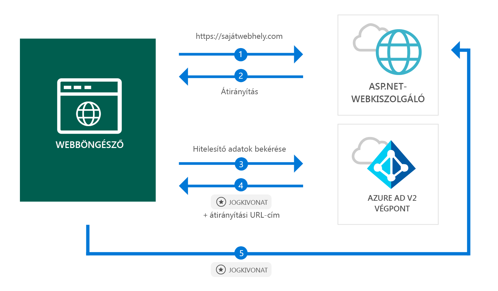

# <a name="quickstart-add-sign-in-with-microsoft-to-an-aspnet-web-app"></a>Gyors útmutató: Jelentkezzen be a Microsoft ASP.NET-webalkalmazás hozzáadása

[!INCLUDE [active-directory-develop-applies-v2](../../../includes/active-directory-develop-applies-v2.md)]

Ebben a rövid útmutatóban megtudhatja, hogyan használhatók egy ASP.NET-webalkalmazásba való bejelentkezéshez személyes fiókok (hotmail.com, outlook.com stb.) és munkahelyi és iskolai fiókok bármilyen Azure Active Directory- (Azure AD-) példányból.



> [!div renderon="docs"]
> ## <a name="register-and-download-your-quickstart-app"></a>A rövid útmutató mintaalkalmazásának regisztrálása és letöltése
> A rövid útmutató mintaalkalmazását kétféleképpen indíthatja el:
> * [Express] [1. lehetőség: Regisztráció és az automatikus állítsa be alkalmazását, és töltse le a kódminta](#option-1-register-and-auto-configure-your-app-and-then-download-your-code-sample)
> * [Manuális] [2. lehetőség: Regisztráljon, és manuális konfigurálása az alkalmazás és a kód a minta](#option-2-register-and-manually-configure-your-application-and-code-sample)
>
> ### <a name="option-1-register-and-auto-configure-your-app-and-then-download-your-code-sample"></a>Option 1: Regisztráció és az automatikus állítsa be alkalmazását, és töltse le a kódminta
>
> 1. Nyissa meg az [Azure Portal – Alkalmazásregisztráció (előzetes verzió)](https://portal.azure.com/#blade/Microsoft_AAD_RegisteredApps/applicationsListBlade/quickStartType/AspNetWebAppQuickstartPage/sourceType/docs) szakaszt.
> 1. Adja meg az alkalmazás nevét, és kattintson a **Regisztráció** elemre.
> 1. Kövesse az új alkalmazás egy kattintással való letöltésére és automatikus konfigurálására vonatkozó utasításokat.
>
> ### <a name="option-2-register-and-manually-configure-your-application-and-code-sample"></a>Option 2: Regisztráljon, és manuális konfigurálása az alkalmazás és a kód a minta
>
> #### <a name="step-1-register-your-application"></a>1. lépés: Alkalmazás regisztrálása
> Az alkalmazás regisztrálásához és az alkalmazás regisztrációs információinak a megoldáshoz való kézi hozzáadásához kövesse az alábbi lépéseket:
>
> 1. Jelentkezzen be egy munkahelyi vagy iskolai fiókkal vagy a személyes Microsoft-fiókjával az [Azure Portalra](https://portal.azure.com).
> 1. Ha a fiókja több bérlőhöz is biztosít hozzáférést, válassza ki a fiókot az oldal jobb felső sarkában, és állítsa a portálmunkamenetét a kívánt Azure AD-bérlőre.
> 1. A bal oldali navigációs panelen válassza az **Azure Active Directory** szolgáltatást, majd válassza az **Alkalmazásregisztrációk (előzetes verzió)** > **Új regisztráció** lehetőséget.
> 1. Amikor megjelenik az **Alkalmazás regisztrálása lap**, adja meg az alkalmazás regisztrációs adatait:
>      - A **Név** szakaszban adja meg az alkalmazás felhasználói számára megjelenített, jelentéssel bíró alkalmazásnevet (például `ASPNET-Quickstart`).
>      - Adja hozzá a `https://localhost:44368/` címet a **Válasz URL-cím** mezőben, és kattintson a **Regisztráció** elemre.
Válassza a **Hitelesítés** menüt, állítsa be az **Azonosító jogkivonatok** értékét az **Implicit engedélyezés** területen, majd válassza a **Mentés** elemet.

> [!div class="sxs-lookup" renderon="portal"]
> #### <a name="step-1-configure-your-application-in-azure-portal"></a>1. lépés: Az alkalmazás konfigurálása az Azure Portalon
> Ahhoz, hogy a rövid útmutatóhoz tartozó kódminta működjön, hozzá kell adnia egy válasz URL-t a következő formában: `https://localhost:44368/`.
> > [!div renderon="portal" id="makechanges" class="nextstepaction"]
> > [A módosítás alkalmazása]()
>
> > [!div id="appconfigured" class="alert alert-info"]
> >  Az alkalmazása már konfigurálva van ezzel az attribútummal

#### <a name="step-2-download-your-project"></a>2. lépés: Töltse le a projekthez

[A Visual Studio 2017-megoldás letöltése](https://github.com/AzureADQuickStarts/AppModelv2-WebApp-OpenIDConnect-DotNet/archive/master.zip)

#### <a name="step-3-configure-your-visual-studio-project"></a>3. lépés: A Visual Studio-projekt konfigurálása

1. Csomagolja ki a zip-fájlt egy helyi mappába a gyökérmappa közelében (például: **C:\Azure-Samples**)
1. Nyissa meg a megoldást (AppModelv2-WebApp-OpenIDConnect-DotNet.sln) a Visual Studióban.
1. Szerkessze a **Web.config** fájlt, és cserélje le a `ClientId` és `Tenant` paramétereket az alábbiakkal:

    ```xml
    <add key="ClientId" value="Enter_the_Application_Id_here" />
    <add key="Tenant" value="Enter_the_Tenant_Info_Here" />
    ```

> [!div renderon="docs"]
> Az elemek magyarázata:
> - `Enter_the_Application_Id_here` – ez a regisztrált alkalmazás alkalmazásazonosítója.
> - `Enter_the_Tenant_Info_Here` – ez az alábbi lehetőségek egyike:
>   - Ha az alkalmazás **csak a saját szervezetet** támogatja, ezt az értéket a **Bérlőazonosítóra** vagy a **Bérlő nevére** cserélje le (például contoso.microsoft.com)
>   - Ha az alkalmazás **bármely szervezeti címtárban lévő fiókot** támogat, ezt az értéket az `organizations` értékre cserélje le
>   - Ha az alkalmazás **minden Microsoft-fiókfelhasználót** támogat, ezt az értéket a `common` értékre cserélje le
>
> > [!TIP]
> > Az *alkalmazásazonosító*, a *címtár (bérlő) azonosítója* és a *támogatott fióktípusok* értékét az **Áttekintés** oldalon találja

## <a name="more-information"></a>További információ

Ez a szakasz a felhasználók bejelentkeztetéséhez szükséges kód áttekintését tartalmazza. Ez hasznos lehet, ha szeretné megérteni a kód működését, a fő argumentumokat, valamint ha bejelentkezést szeretne hozzáadni egy meglévő ASP.NET-alkalmazáshoz.

### <a name="owin-middleware-nuget-packages"></a>OWIN közbenső NuGet-csomagok

Az ASP.NET-ben az OpenID Connecttel végzett, cookie-alapú hitelesítési folyamatot OWIN közbenső csomagokkal valósíthatja meg. E csomagok telepítéséhez futtassa a következő parancsot a Visual Studio **csomagkezelő konzolján**:

```powershell
Install-Package Microsoft.Owin.Security.OpenIdConnect
Install-Package Microsoft.Owin.Security.Cookies
Install-Package Microsoft.Owin.Host.SystemWeb
```

### <a name="owin-startup-class"></a>OWIN indítási osztály

Az OWIN közbenső szoftver egy *indítási osztályt* használ, amelyet a rendszer az üzemeltetési folyamatok inicializálásakor hajt végre (jelen rövid útmutató esetében ez a gyökérmappában található *startup.cs* fájl). Az alábbi kódban a jelen rövid útmutató által használt paraméter látható:

```csharp
public void Configuration(IAppBuilder app)
{
    app.SetDefaultSignInAsAuthenticationType(CookieAuthenticationDefaults.AuthenticationType);

    app.UseCookieAuthentication(new CookieAuthenticationOptions());
    app.UseOpenIdConnectAuthentication(
        new OpenIdConnectAuthenticationOptions
        {
            // Sets the ClientId, authority, RedirectUri as obtained from web.config
            ClientId = clientId,
            Authority = authority,
            RedirectUri = redirectUri,
            // PostLogoutRedirectUri is the page that users will be redirected to after sign-out. In this case, it is using the home page
            PostLogoutRedirectUri = redirectUri,
            Scope = OpenIdConnectScope.OpenIdProfile,
            // ResponseType is set to request the id_token - which contains basic information about the signed-in user
            ResponseType = OpenIdConnectResponseType.IdToken,
            // ValidateIssuer set to false to allow personal and work accounts from any organization to sign in to your application
            // To only allow users from a single organizations, set ValidateIssuer to true and 'tenant' setting in web.config to the tenant name
            // To allow users from only a list of specific organizations, set ValidateIssuer to true and use ValidIssuers parameter
            TokenValidationParameters = new TokenValidationParameters()
            {
                ValidateIssuer = false
            },
            // OpenIdConnectAuthenticationNotifications configures OWIN to send notification of failed authentications to OnAuthenticationFailed method
            Notifications = new OpenIdConnectAuthenticationNotifications
            {
                AuthenticationFailed = OnAuthenticationFailed
            }
        }
    );
}
```

> |Ahol  |  |
> |---------|---------|
> | `ClientId`     | Az Azure Portalon regisztrált alkalmazás azonosítója |
> | `Authority`    | A felhasználó által hitelesítendő STS-végpont. Általában https://login.microsoftonline.com/{tenant}/v2.0 a nyilvános felhőknél, ahol a {tenant} a bérlő neve, a bérlő azonosítója, vagy *common* a közös végpontra való hivatkozáskor (több-bérlős alkalmazások esetében) |
> | `RedirectUri`  | Az URL-cím, ahova a rendszer átirányítja a felhasználókat az Azure AD v2.0-végponton való hitelesítés után |
> | `PostLogoutRedirectUri`     | Az URL-cím, ahová a rendszer átirányítja a felhasználókat kijelentkezés után |
> | `Scope`     | A kért hatókörök felsorolása, szóközökkel elválasztva |
> | `ResponseType`     | Arra vonatkozó kérés, hogy a hitelesítés válasza tartalmazzon egy azonosító jogkivonatot |
> | `TokenValidationParameters`     | A jogkivonatok érvényesítéséhez használatos paraméterek listája. Ebben az esetben a `ValidateIssuer` értéke `false`, ami azt jelzi, hogy a bejelentkezés bármilyen személyes, illetve munkahelyi vagy iskolai típusú fiókkal elfogadott. |
> | `Notifications`     | A különböző *OpenIdConnect* üzenetek esetében végrehajtható delegáltak listája |

### <a name="initiate-an-authentication-challenge"></a>Hitelesítő kérdés kezdeményezése

Előírhatja a felhasználóknak a bejelentkezést, ha a vezérlőben egy hitelesítő kérdést kezdeményez:

```csharp
public void SignIn()
{
    if (!Request.IsAuthenticated)
    {
        HttpContext.GetOwinContext().Authentication.Challenge(
            new AuthenticationProperties{ RedirectUri = "/" },
            OpenIdConnectAuthenticationDefaults.AuthenticationType);
    }
}
```

> [!TIP]
> A hitelesítő kérdés fenti módszerrel történő kérése nem kötelező, és jellemzően arra szokták használni, hogy egy nézetet a hitelesített és nem hitelesített felhasználóknak is elérhetővé tegyenek. Másik megoldásként a vezérlők is védhetők a következő szakaszban leírt módon.

### <a name="protect-a-controller-or-a-controllers-method"></a>Egy vezérlő vagy egy vezérlő metódusának védelme

A vezérlők vagy a vezérlők műveletei az `[Authorize]` attribútummal védhetők. Ez az attribútum úgy korlátozza a vezérlőhöz és a műveleteihez való hozzáférést, hogy csak a hitelesített felhasználóknak engedélyezi a vezérlő műveleteinek elérését. Ezt azt jelenti, hogy a hitelesítő kérdés automatikusan megjelenik, ha egy *nem hitelesített* felhasználó megpróbál hozzáférni az `[Authorize]` attribútummal jelölt bármely művelethez vagy vezérlőhöz.

## <a name="next-steps"></a>További lépések

Próbálja ki az ASP.NET-hez készült oktatóanyagot, amelyben teljes körű, részletes útmutatót talál az alkalmazások és új szolgáltatások létrehozásához, valamint megtalálja ennek a rövid útmutatónak a teljes magyarázatát is.

### <a name="learn-the-steps-to-create-the-application-used-in-this-quickstart"></a>A jelen rövid útmutatóban használt alkalmazás létrehozási lépéseinek ismertetése

> [!div class="nextstepaction"]
> [Bejelentkezési útmutató](./tutorial-v2-asp-webapp.md)

[!INCLUDE [Help and support](../../../includes/active-directory-develop-help-support-include.md)]
