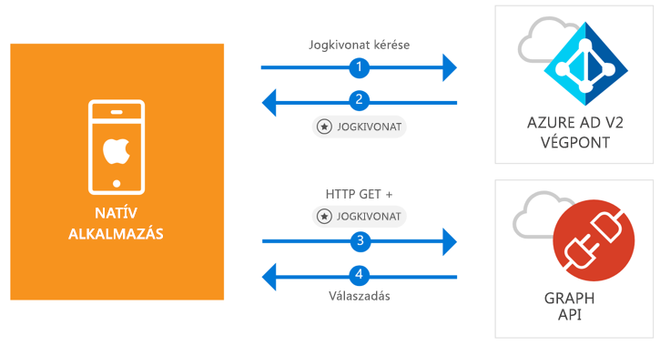

# <a name="quickstart-sign-in-users-and-call-the-microsoft-graph-api-from-an-ios-native-app"></a>Rövid útmutató: Felhasználók bejelentkeztetése és a Microsoft Graph API meghívása natív iOS-alkalmazásból

[!INCLUDE [active-directory-develop-applies-v2-msal](../../../includes/active-directory-develop-applies-v2-msal.md)]

A jelen rövid útmutatóban található kódmintán azt mutatjuk be, hogyan tud egy natív iOS-alkalmazás bejelentkezni személyes, munkahelyi vagy iskolai fiókokba, lekérni egy hozzáférési jogkivonatot, és meghívni a Microsoft Graph API-t.



> [!div renderon="docs"]
> ## <a name="register-and-download"></a>Regisztráció és letöltés
> ### <a name="register-and-configure-your-application-and-code-sample"></a>Az alkalmazás és a kódminta regisztrálása és konfigurálása
> #### <a name="step-1-register-your-application"></a>1. lépés: Alkalmazás regisztrálása
> Az alkalmazása regisztrálásához és az alkalmazás regisztrációs információinak a megoldáshoz való hozzáadásához tegye a következőket:
> 1. Az alkalmazás regisztrálásához lépjen a [Microsoft alkalmazásregisztrációs portálra](https://apps.dev.microsoft.com/portal/register-app).
> 1. Az **Application Name** (Alkalmazás neve) mezőben nevezze el az alkalmazását.
> 1. Ügyeljen arra, hogy a **Guided Setup** (Irányított beállítás) jelölőnégyzet ne legyen bejelölve, majd válassza a **Create** (Létrehozás) lehetőséget.
> 1. Válassza az **Add Platform** (Platform hozzáadása), a **Native Application** (Natív alkalmazás), majd a **Save** (Mentés) elemet.

> [!div renderon="portal" class="sxs-lookup"]
> #### <a name="step-1-configure-your-application"></a>1. lépés: Az alkalmazás konfigurálása
> Ahhoz, hogy a rövid útmutatóhoz tartozó kódminta működjön, hozzá kell adnia egy válasz URL-t a következő formában: `msal<AppId>://auth` (ahol az msal<AppId> ez az alkalmazásazonosító).
> > [!div renderon="portal" id="makechanges" class="nextstepaction"]
> > [A módosítás alkalmazása]()
>
> > [!div id="appconfigured" class="alert alert-info"]
> >  Az alkalmazása már konfigurálva van ezzel az attribútummal

#### <a name="step-2-download-your-web-server-or-project"></a>2. lépés: A webkiszolgáló vagy projekt letöltése

- [Az XCode-projekt letöltése](https://github.com/Azure-Samples/active-directory-ios-swift-native-v2/archive/master.zip)

#### <a name="step-3-configure-your-project"></a>3. lépés: A projekt konfigurálása

1. Csomagolja ki a tömörített fájlt, és nyissa meg a projektet az XCode-ban.
1. Szerkessze a **ViewController.swift** fájlt, és cserélje le a „let kClientID” kezdetű sort a következő kódrészletre:

    > [!div renderon="portal" class="sxs-lookup"]
    > ```swift
    > let kClientID = "Enter_the_Application_Id_here"
    > ```

    > [!div renderon="docs"]
    > ```swift
    > let kClientID = "<ENTER_THE_APPLICATION_ID_HERE>"
    > ```   
1. A Control billentyűt lenyomva kattintson az **Info.plist** elemre a helyi menü megjelenítéséhez, majd válassza az **Open As** > **Source Code** (Megnyitás forráskódként) lehetőséget.
1. A könyvtár gyökércsomópontja alatt adja meg a következő kódot:

    > [!div renderon="portal" class="sxs-lookup"]
    > ```xml
    > <key>CFBundleURLTypes</key>
    > <array>
    >     <dict>
    >         <key>CFBundleTypeRole</key>
    >         <string>Editor</string>
    >         <key>CFBundleURLName</key>
    >         <string>$(PRODUCT_BUNDLE_IDENTIFIER)</string>
    >         <key>CFBundleURLSchemes</key>
    >         <array>
    >             <string>msalEnter_the_Application_Id_here</string>
    >         </array>
    >     </dict>
    > </array>
    > ```

    > [!div renderon="docs"]
    > ```xml
    > <key>CFBundleURLTypes</key>
    > <array>
    >     <dict>
    >         <key>CFBundleTypeRole</key>
    >         <string>Editor</string>
    >         <key>CFBundleURLName</key>
    >         <string>$(PRODUCT_BUNDLE_IDENTIFIER)</string>
    >         <key>CFBundleURLSchemes</key>
    >         <array>
    >             <string>msal<ENTER_THE_APPLICATION_ID_HERE></string>
    >         </array>
    >     </dict>
    > </array>
    > ```
    
> [!div renderon="docs"]
> <span>5.</span> Az `<ENTER_THE_APPLICATION_ID_HERE>` sztringet cserélje le az alkalmazás *azonosítójára*. Az *alkalmazásazonosítót* az *áttekintési* oldalon találja.

## <a name="more-information"></a>További információ

Az erre a rövid útmutatóra vonatkozó további információért tekintse meg ezeket a szakaszokat.

### <a name="msal"></a>MSAL

Az MSAL ([MSAL.framework](https://github.com/AzureAD/microsoft-authentication-library-for-objc)) egy olyan kódtár, amely felhasználók beléptetéséhez és egy Microsoft Azure Active Directory által védett API-hoz való hozzáféréshez használt jogkivonatok kéréséhez használható. Az MSAL-t az alábbi eljárással adhatja hozzá az alkalmazáshoz:

```
$ vi Podfile
```
Adja hozzá a következőt a pod-fájlhoz:

```
 target 'QuickStart' do
   use_frameworks!
 pod 'MSAL'
 end
```

### <a name="msal-initialization"></a>Az MSAL inicializálása

Az MSAL-re mutató hivatkozás hozzáadásához adja hozzá az alábbi kódot:

```swift
import MSAL
```

Ezután inicializálja az MSAL-t az alábbi kóddal:

```swift
let authority = MSALAuthority(url: URL(string: kAuthority)!)
self.applicationContext = try MSALPublicClientApplication(clientId: kClientID, authority: authority)
```

> |Az elemek magyarázata: ||
> |---------|---------|
> | `clientId` | A *portal.azure.com* webhelyen regisztrált alkalmazásból származó alkalmazásazonosító |
> | `authority` | Az Azure AD v2.0-végpont. Ez a legtöbb esetben *https<span/>://login.microsoftonline.com/common* |

### <a name="requesting-tokens"></a>Jogkivonatok lekérése

Az MSAL a következő két metódust használja a jogkivonatok beszerzéséhez: `acquireToken` és `acquireTokenSilent`

#### <a name="getting-an-access-token-interactively"></a>Hozzáférési jogkivonat interaktív lekérése

Bizonyos helyzetekben elkerülhetetlen, hogy a felhasználók kommunikáljanak az Azure Active Directory (Azure AD) 2.0-s végponttal. Ekkor megnyílik a böngésző, ahol érvényesíteni kell a felhasználók hitelesítő adatait, vagy hozzájárulást kell adni. Néhány példa:

* Az első alkalommal, amikor felhasználók bejelentkeznek az alkalmazásba
* Ha a felhasználóknak újból meg kell adniuk a hitelesítési adataikat, mert lejárt a jelszó
* Amikor az alkalmazás olyan erőforráshoz kér hozzáférést, amelyhez szükséges a felhasználó hozzájárulása
* Ha kétfaktoros hitelesítésre van szükség

```swift
applicationContext.acquireToken(forScopes: self.kScopes) { (result, error) in /* Add your handling logic */}
```

> |Az elemek magyarázata:||
> |---------|---------|
> | `forScopes` | Tartalmazza a kért hatóköröket (azaz [ "user.read" ]` for Microsoft Graph or `[ "<Application ID URL>/scope" ]` for custom Web APIs (i.e. `api://<Application ID>/access_as_user`)) |

#### <a name="getting-an-access-token-silently"></a>Hozzáférési jogkivonat csendes lekérése

Nem ajánlott minden egyes alkalommal megkövetelni a felhasználóktól a hitelesítő adatok érvényesítését, amikor hozzá kell férniük egy erőforráshoz. Általában szerencsésebb, ha a jogkivonatok beszerzéséhez és megújításához nincs szükség felhasználói beavatkozásra. Kezdetben használja az `acquireToken` metódust, majd a védett erőforrásokhoz való hozzáféréshez szükséges jogkivonatok beszerzéséhez az `acquireTokenSilent` metódust használhatja:

```swift
applicationContext.acquireTokenSilent(forScopes: self.kScopes, account: applicationContext.allAccounts().first) { (result, error) in /* Add your handling logic */}
```

> |Az elemek magyarázata: ||
> |---------|---------|
> | `forScopes` | Tartalmazza a kért hatóköröket (azaz `[ "user.read" ]` Microsoft Graph és `[ "<Application ID URL>/scope" ]` egyéni webes API-k esetében) (például `api://<Application ID>/access_as_user`) |
> | `account` | A jogkivonatot kérő fiók (az MSAL több fiókot támogat egyetlen alkalmazásban). E rövid útmutató esetében az érték az első fiókra mutat a gyorsítótárban (`applicationContext.allAccounts().first`). |

## <a name="next-steps"></a>További lépések

Próbálja ki az iOS-hez készült oktatóanyagot, amelyben teljes körű, részletes útmutatót talál az alkalmazások és új szolgáltatások létrehozásához, valamint megtalálja ennek a rövid útmutatónak a teljes magyarázatát is.

### <a name="learn-the-steps-to-create-the-application-used-in-this-quickstart"></a>A jelen rövid útmutatóban használt alkalmazás létrehozási lépéseinek ismertetése

> [!div class="nextstepaction"]
> [A Graph API meghívása – iOS-oktatóanyag](https://docs.microsoft.com/azure/active-directory/develop/guidedsetups/active-directory-ios)

[!INCLUDE [Help and support](../../../includes/active-directory-develop-help-support-include.md)]
