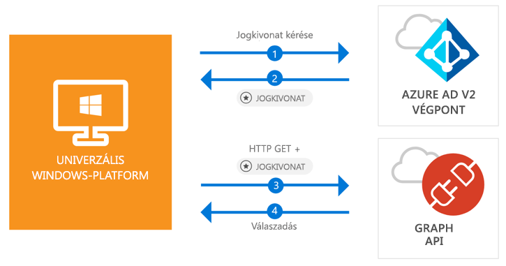

# <a name="quickstart-call-the-microsoft-graph-api-from-a-universal-windows-platform-uwp-application"></a>Rövid útmutató: A Microsoft Graph API meghívása Univerzális Windows-platform- (UWP-) alkalmazásból

[!INCLUDE [active-directory-develop-applies-v2-msal](../../../includes/active-directory-develop-applies-v2-msal.md)]

A jelen rövid útmutatóban szereplő kódmintán azt mutatjuk be, hogyan tud egy Univerzális Windows-platform- (UWP-) alkalmazás felhasználókat bejelentkeztetni személyes, munkahelyi vagy iskolai fiókokkal, lekérni egy hozzáférési jogkivonatot, és meghívni a Microsoft Graph API-t.



> [!div renderon="docs"]
> ## <a name="register-and-download-your-quickstart-app"></a>A rövid útmutató mintaalkalmazásának regisztrálása és letöltése
> [!div renderon="docs" class="sxs-lookup"]
> A rövid útmutató mintaalkalmazását kétféleképpen indíthatja el:
> * [Expressz] [1. lehetőség: Az alkalmazás regisztrálása és automatikus konfigurálása, majd a kódminta letöltése](#option-1-register-and-auto-configure-your-app-and-then-download-your-code-sample)
> * [Kézi] [2. lehetőség: Az alkalmazás és a kódminta regisztrálása és kézi konfigurálása](#option-2-register-and-manually-configure-your-application-and-code-sample)
>
> ### <a name="option-1-register-and-auto-configure-your-app-and-then-download-your-code-sample"></a>1. lehetőség: Az alkalmazás regisztrálása és automatikus konfigurálása, majd a kódminta letöltése
>
> 1. Nyissa meg az [Azure Portal – Alkalmazásregisztráció](https://portal.azure.com/?Microsoft_AAD_RegisteredApps=true#blade/Microsoft_AAD_RegisteredApps) szakaszt.
> 1. Adja meg az alkalmazás nevét, és kattintson a **Regisztráció** elemre.
> 1. Kövesse az új alkalmazás egy kattintással való letöltésére és automatikus konfigurálására vonatkozó utasításokat.
>
> ### <a name="option-2-register-and-manually-configure-your-application-and-code-sample"></a>2. lehetőség: Az alkalmazás és a kódminta regisztrálása és kézi konfigurálása
> [!div renderon="docs"]
> #### <a name="step-1-register-your-application"></a>1. lépés: Alkalmazás regisztrálása
> Az alkalmazás regisztrálásához és az alkalmazás regisztrációs információinak a megoldáshoz való hozzáadásához kövesse az alábbi lépéseket:
> 1. Jelentkezzen be egy munkahelyi vagy iskolai fiókkal vagy a személyes Microsoft-fiókjával az [Azure Portalra](https://portal.azure.com).
> 1. Ha a fiókja több bérlőhöz is biztosít hozzáférést, válassza ki a fiókot az oldal jobb felső sarkában, és állítsa a portálmunkamenetét a kívánt Azure AD-bérlőre.
> 1. A bal oldali navigációs panelen válassza az **Azure Active Directory** szolgáltatást, majd válassza az **Alkalmazásregisztrációk (előzetes verzió)** > **Új regisztráció** lehetőséget.
> 1. Amikor megjelenik az **Alkalmazás regisztrálása lap**, adja meg az alkalmazás regisztrációs adatait:
>      - A **Név** szakaszban adja meg az alkalmazás felhasználói számára megjelenített, jelentéssel bíró alkalmazásnevet (például `UWP-App-calling-MsGraph`).
>      - A **Támogatott fióktípusok** szakaszban jelölje be a **Tetszőleges szervezeti címtárban található fiókok és a Személyes Microsoft-fiókok (például Skype, Xbox, Outlook.com)** beállítást.
>      - Válassza a **Regisztráció** elemet az alkalmazás létrehozásához.
> 1. Az alkalmazás oldalainak listájában válassza a **Hitelesítés** elemet.
> 1. Az **Átirányítási URI-k** szakaszban keresse meg a **Javasolt átirányítási URI-k nyilvános ügyfelek számára (mobil, asztali)** szakaszt, és válassza az **urn: ietf:wg:oauth:2.0:oob** címet.
> 1. Kattintson a **Mentés** gombra.

> [!div renderon="portal" class="sxs-lookup alert alert-info"]
> #### <a name="step-1-configure-your-application"></a>1. lépés: Az alkalmazás konfigurálása
> Ahhoz, hogy a rövid útmutató kódmintája működjön, hozzá kell adnia egy átirányítási URI-t a következő formában: **urn:ietf:wg:oauth:2.0:oob**.
> > [!div renderon="portal" id="makechanges" class="nextstepaction"]
> > [A módosítás alkalmazása]()
>
> > [!div id="appconfigured" class="alert alert-info"]
> >  Az alkalmazása már konfigurálva van ezekkel az attribútumokkal.

#### <a name="step-2-download-your-visual-studio-project"></a>2. lépés: A Visual Studio-projekt letöltése

 - [A Visual Studio 2017-projekt letöltése](https://github.com/Azure-Samples/active-directory-dotnet-native-uwp-v2/archive/master.zip)

#### <a name="step-3-configure-your-visual-studio-project"></a>3. lépés: A Visual Studio-projekt konfigurálása

1. Csomagolja ki a zip-fájlt egy helyi mappába a lemez gyökerének közelében (például: **C:\Azure-Samples**).
1. Nyissa meg a projektet a Visual Studióban.
1. Szerkessze az **App.Xaml.cs** fájlt, és cserélje le a `private static string ClientId` kezdetű sort a következő kódra:

    ```csharp
    private static string ClientId = "Enter_the_Application_Id_here";
    ```

## <a name="more-information"></a>További információ

Ez a szakasz a rövid útmutatóról nyújt további információkat.

### <a name="msalnet"></a>MSAL.NET

Az MSAL ([Microsoft.Identity.Client](https://www.nuget.org/packages/Microsoft.Identity.Client)) egy olyan kódtár, amely felhasználók beléptetéséhez és egy Microsoft Azure Active Directory által védett API-hoz való hozzáféréshez használt jogkivonatok kéréséhez használható. Az MSAL telepítéséhez futtassa a következő parancsot a Visual Studio *Package Manager konzolján*:

```powershell
Install-Package Microsoft.Identity.Client -Pre
```

### <a name="msal-initialization"></a>Az MSAL inicializálása

Az MSAL-re mutató hivatkozás hozzáadásához adja hozzá az alábbi kódot:

```csharp
using Microsoft.Identity.Client;
```

Ezután inicializálhatja az MSAL-t az alábbi kóddal:

```csharp
public static PublicClientApplication PublicClientApp = new PublicClientApplication(ClientId);
```

> |Az elemek magyarázata: ||
> |---------|---------|
> | `ClientId` | Az Azure Portalon regisztrált alkalmazás **alkalmazásazonosítója (ügyfél-azonosítója)**. Ezt az értéket az alkalmazás **Áttekintés** oldalán találja az Azure Portalon. |

### <a name="requesting-tokens"></a>Jogkivonatok lekérése

Az MSAL a következő két metódust használja a jogkivonatok beszerzéséhez: `AcquireTokenAsync` és `AcquireTokenSilentAsync`.

#### <a name="get-a-user-token-interactively"></a>Felhasználói jogkivonat interaktív lekérése

 Bizonyos helyzetekben elkerülhetetlen, hogy a felhasználók kommunikáljanak az Azure Active Directory 2.0-s végponttal egy felugró ablakon keresztül, hogy érvényesítsék a hitelesítő adataikat, vagy hogy megadják a hozzájárulásukat. Néhány példaforgatókönyv:

- Az első alkalom, amikor egy felhasználó bejelentkezik az alkalmazásba
- Amikor egy felhasználónak újból meg kell adnia a hitelesítési adatait, mert a jelszó lejárt
- Az alkalmazás olyan erőforráshoz kér hozzáférést, amelyhez szükséges a felhasználó hozzájárulása
- Ha kétfaktoros hitelesítésre van szükség

```csharp
authResult = await App.PublicClientApp.AcquireTokenAsync(scopes);
```

> |Az elemek magyarázata:||
> |---------|---------|
> | `scopes` | Tartalmazza a kért hatóköröket (például `{ "user.read" }` a Microsoft Graph és `{ "api://<Application ID>/access_as_user" }` az egyéni webes API-k esetében). |

#### <a name="get-a-user-token-silently"></a>Felhasználói jogkivonat csendes beszerzése

Nem érdemes minden egyes alkalommal megkövetelni a felhasználóktól a hitelesítő adatok érvényesítését, amikor hozzá kell férniük egy erőforráshoz. Általában szerencsésebb, ha a jogkivonatok beszerzéséhez és megújításához nincs szükség felhasználói beavatkozásra. Az `AcquireTokenAsync` metódust gyakran használják a kezdeti `AcquireTokenSilentAsync` metódus után a védett erőforrásokhoz való hozzáféréshez szükséges jogkivonatok beszerzéséhez:

```csharp
var accounts = await App.PublicClientApp.GetAccountsAsync();
authResult = await App.PublicClientApp.AcquireTokenSilentAsync(scopes, accounts.FirstOrDefault());
```

> |Az elemek magyarázata: ||
> |---------|---------|
> | `scopes` | Tartalmazza a kért hatóköröket (például `{ "user.read" }` a Microsoft Graph és `{ "api://<Application ID>/access_as_user" }` az egyéni webes API-k esetében). |
> | `accounts.FirstOrDefault()` | A gyorsítótár első felhasználóját határozza meg (az MSAL több felhasználót támogat egy alkalmazásban). |

[!INCLUDE [Help and support](../../../includes/active-directory-develop-help-support-include.md)]

## <a name="next-steps"></a>További lépések

Próbálja ki az asztali Windowshoz készült oktatóanyagot, amelyben teljes körű, részletes útmutatót talál az alkalmazások és új szolgáltatások létrehozásához, valamint megtalálja ennek a rövid útmutatónak a teljes magyarázatát is:

> [!div class="nextstepaction"]
> [UWP: A Graph API meghívása – oktatóanyag](tutorial-v2-windows-uwp.md)
