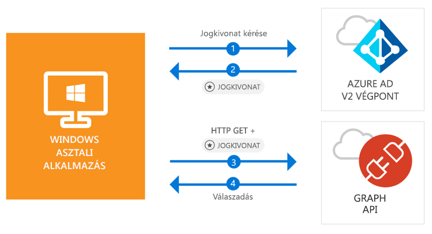

# <a name="quickstart-acquire-a-token-and-call-microsoft-graph-api-from-a-windows-desktop-app"></a>Rövid útmutató: Jogkivonat lekérése és a Microsoft Graph API meghívása egy Windows asztali alkalmazásból

[!INCLUDE [active-directory-develop-applies-v2-msal](../../../includes/active-directory-develop-applies-v2-msal.md)]

Ebből a rövid útmutatóból megtudhatja, hogyan tud egy Windows asztali .NET- (WPF-) alkalmazás bejelentkezni személyes, munkahelyi és iskolai fiókokba, lekérni egy hozzáférési jogkivonatot, majd meghívni a Microsoft Graph API-t.



> [!div renderon="docs"]
> ## <a name="register-and-download"></a>Regisztráció és letöltés
> ### <a name="register-and-configure-your-application-and-code-sample"></a>Az alkalmazás és a kódminta regisztrálása és konfigurálása
> #### <a name="step-1-register-your-application"></a>1. lépés: Alkalmazás regisztrálása
> Az alkalmazása regisztrálásához és az alkalmazás regisztrációs információinak a megoldáshoz való hozzáadásához tegye a következőket:
> 1. Az alkalmazás regisztrálásához lépjen a [Microsoft alkalmazásregisztrációs portálra](https://apps.dev.microsoft.com/portal/register-app).
> 1. Az **Alkalmazás neve** mezőben nevezze el az alkalmazását.
> 1. Ügyeljen arra, hogy az **Irányított beállítás** jelölőnégyzet ne legyen bejelölve, majd válassza a **Létrehozás** lehetőséget.
> 1. Válassza a **Platform hozzáadása**, a **Natív alkalmazás**, majd a **Mentés** lehetőséget.

> [!div renderon="portal" class="sxs-lookup"]
> #### <a name="step-1-configure-your-application"></a>1. lépés: Az alkalmazás konfigurálása
> Ahhoz, hogy a rövid útmutató kódmintája működjön, hozzá kell adnia egy válasz URL-t a következő formában: **urn:ietf:wg:oauth:2.0:oob**.
> > [!div renderon="portal" id="makechanges" class="nextstepaction"]
> > [A módosítás alkalmazása]()
>
> > [!div id="appconfigured" class="alert alert-info"]
> >  Az alkalmazás már konfigurálva van ezekkel az attribútumokkal

#### <a name="step-2-download-your-visual-studio-project"></a>2. lépés: A Visual Studio-projekt letöltése

[A Visual Studio 2017-projekt letöltése](https://github.com/Azure-Samples/active-directory-dotnet-desktop-msgraph-v2/archive/master.zip)

#### <a name="step-3-configure-your-visual-studio-project"></a>3. lépés: A Visual Studio-projekt konfigurálása

1. Csomagolja ki a zip-fájlt egy helyi mappába (például: **C:\Azure-Samples**)
1. Nyissa meg a projektet a Visual Studióban.
1. Szerkessze az **App.Xaml.cs** fájlt, és cserélje le az `private static string ClientId` kezdetű sort a most regisztrált alkalmazás alkalmazásazonosítójára:

```csharp
private static string ClientId = "Enter_the_Application_Id_here";
```

## <a name="more-information"></a>További információ

### <a name="msalnet"></a>MSAL.NET

Az MSAL ([Microsoft.Identity.Client](https://www.nuget.org/packages/Microsoft.Identity.Client)) az a kódtár, amely felhasználók beléptetéséhez és egy Microsoft Azure Active Directory (Azure AD) által védett API-hoz való hozzáféréshez használt jogkivonatok kéréséhez használható. A telepítéséhez futtassa a következő parancsot a Visual Studio **Package Manager konzolon**:

```powershell
Install-Package Microsoft.Identity.Client -Pre
```

### <a name="msal-initialization"></a>Az MSAL inicializálása

Az MSAL-re mutató hivatkozás hozzáadásához adja hozzá az alábbi kódot:

```csharp
using Microsoft.Identity.Client;
```

Ezután inicializálja az MSAL-t az alábbi kóddal:

```csharp
public static PublicClientApplication PublicClientApp = new PublicClientApplication(ClientId);
```

> |Az elemek magyarázata: ||
> |---------|---------|
> | `ClientId` | A *portal.microsoft.com* webhelyen regisztrált alkalmazásból származó alkalmazásazonosító |

### <a name="requesting-tokens"></a>Jogkivonatok lekérése

Az MSAL két módszert használ jogkivonatok beszerzésére: `AcquireTokenAsync` és `AcquireTokenSilentAsync`.

#### <a name="get-a-user-token-interactively"></a>Felhasználói jogkivonat interaktív lekérése

Bizonyos helyzetekben elkerülhetetlen, hogy a felhasználók kommunikáljanak az Azure 2.0-s végponttal egy felugró ablakon keresztül, hogy érvényesítsék a hitelesítő adataikat, vagy hogy megadják a hozzájárulásukat. Néhány példa:

- Az első alkalommal, amikor felhasználók bejelentkeznek az alkalmazásba
- Ha a felhasználóknak újból meg kell adniuk a hitelesítési adataikat, mert lejárt a jelszó
- Amikor az alkalmazás olyan erőforráshoz kér hozzáférést, amelyhez szükséges a felhasználó hozzájárulása
- Ha kétfaktoros hitelesítésre van szükség

```csharp
authResult = await App.PublicClientApp.AcquireTokenAsync(_scopes);
```

> |Az elemek magyarázata:||
> |---------|---------|
> | `_scopes` | Tartalmazza a kért hatóköröket (azaz `{ "user.read" }` a Microsoft Graph és `{ "api://<Application ID>/access_as_user" }` egyéni webes API-k esetében) |

#### <a name="get-a-user-token-silently"></a>Felhasználói jogkivonat csendes beszerzése

Nem ajánlott minden egyes alkalommal megkövetelni a felhasználóktól a hitelesítő adatok érvényesítését, amikor hozzá kell férniük egy erőforráshoz. Általában szerencsésebb, ha a jogkivonatok beszerzéséhez és megújításához nincs szükség felhasználói beavatkozásra. Kezdetben használja az `AcquireTokenAsync` metódust, majd a védett erőforrásokhoz való hozzáféréshez szükséges jogkivonatok beszerzéséhez az `AcquireTokenSilentAsync` metódust használhatja:

```csharp
var accounts = await App.PublicClientApp.GetAccountsAsync();
authResult = await App.PublicClientApp.AcquireTokenSilentAsync(scopes, accounts.FirstOrDefault());
```

> |Az elemek magyarázata: ||
> |---------|---------|
> |hatókörök | Tartalmazza a kért hatóköröket (azaz `{ "user.read" }` a Microsoft Graph vagy `{ "api://<Application ID>/access_as_user" }` egyéni Web API-k esetében) |
> |accounts.FirstOrDefault() | A gyorsítótár első felhasználója (az MSAL több felhasználót támogat egy alkalmazásban) |

## <a name="next-steps"></a>További lépések

Próbálja ki az asztali Windowshoz készült oktatóanyagot, amelyben teljes körű, részletes útmutatót talál az alkalmazások és új szolgáltatások létrehozásához, valamint megtalálja ennek a rövid útmutatónak a teljes magyarázatát is.

### <a name="learn-the-steps-to-create-the-application-used-in-this-quickstart"></a>A jelen rövid útmutatóban használt alkalmazás létrehozási lépéseinek ismertetése

> [!div class="nextstepaction"]
> [A Graph API meghívása – oktatóanyag](https://docs.microsoft.com/azure/active-directory/develop/guidedsetups/active-directory-windesktop)

[!INCLUDE [Help and support](../../../includes/active-directory-develop-help-support-include.md)]
