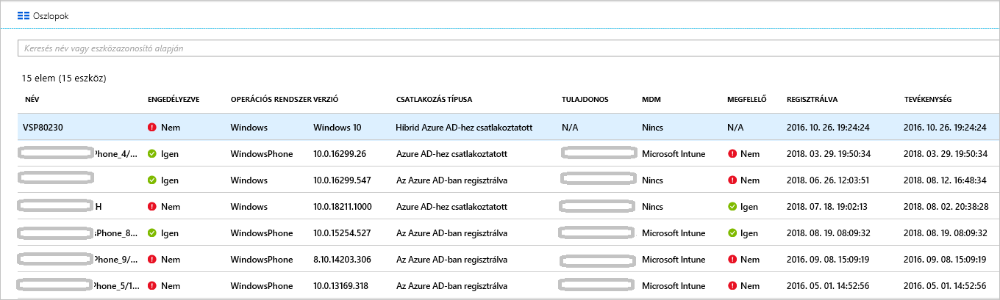

# <a name="how-to-manage-stale-devices-in-azure-ad"></a>Útmutató: elavult eszközök kezelése az Azure AD-ben

Ideális esetben az életciklus végén törlik a regisztrált, de már nem használt eszközök regisztrációját. Azonban például az eszközök elvesztése, ellopása vagy sérülése, illetve az operációs rendszerek újratelepítése miatt a legtöbb környezetben előfordulnak elavult eszközök. Rendszergazdaként minden bizonnyal örülne egy olyan módszernek, amellyel eltávolíthatók az elavult eszközök, hogy az erőforrásokat a tényleges felügyeletet igénylő eszközökre összpontosíthassa.

Ebből a cikkből megtudhatja, hogyan lehet hatékonyan kezelni a környezetben található elavult eszközöket.
  

## <a name="what-is-a-stale-device"></a>Mit nevezünk elavult eszköznek?

Az elavult eszköz ugyan regisztrálva van az Azure AD-ben, de egy meghatározott időszakon belül nem használták semmilyen felhőalapú alkalmazás eléréséhez. Az elavult eszközök a következők miatt nehezítik a bérlő eszközeinek és felhasználóinak felügyeletét és támogatását: 

- Ha több példány létezik az eszközből, az ügyfélszolgálaton dolgozók nehezen tudják megállapítani, hogy épp melyik eszköz aktív.
- Egyre több eszköz hozza létre a szükségtelen eszköz cellavisszaírásokat az Azure AD-csatlakozási szinkronizálások idejének növelésével.
- A biztonság és az előírásoknak való megfelelés érdekében valószínűleg szeretne rendet tartani az eszközei között. 

Az Azure AD-ben található elavult eszközök akadályozhatják a szervezet eszközeire vonatkozó általános életciklus-szabályzatok végrehajtását.

## <a name="detect-stale-devices"></a>Elavult eszközök észlelése

Mivel az elavult eszközök regisztrált eszközökként vannak meghatározva, amelyeket adott ideig nem használtak felhőalkalmazások eléréséhez, az észlelésükhöz egy időbélyeghez kötődő tulajdonságra van szükség. Az Azure AD-ben ennek a tulajdonságnak **ApproximateLastLogonTimestamp** vagy **tevékenység-időbélyegző** a neve. Ha az aktuális idő és a **tevékenység-időbélyegző** közötti eltérés meghaladja az aktív eszközökhöz megadott időszak hosszát, akkor az eszköz elavultnak minősül. Ez a **tevékenység-időbélyegző** nyilvános előzetes verzióban érhető el.

## <a name="how-is-the-value-of-the-activity-timestamp-managed"></a>Hogyan történik a tevékenység-időbélyegző értékének kezelése?  

A tevékenység-időbélyegző kiértékelését egy eszközről érkező hitelesítési kísérlet váltja ki. Az Azure AD az alábbi esetekben értékeli ki a tevékenység-időbélyegzőt:

- A [felügyelt eszközöket](../conditional-access/require-managed-devices.md) vagy [jóváhagyott ügyfélalkalmazások](../conditional-access/app-based-conditional-access.md) használatát igénylő feltételes hozzáférési szabályzatok aktiválva lettek.
- A hálózaton vannak aktív, Windows 10 rendszerű, az Azure AD-hez csatlakoztatott vagy a hibrid Azure AD-hez csatlakoztatott eszközök. 
- Intune által felügyelt eszközök jelentkeznek be a szolgáltatásba.

Ha a tevékenység időbélyegének meglévő értéke és a jelenlegi érték közötti különbség több mint 14 nap (+/-5 nap variancia), a meglévő értéket az új értékre cseréli a rendszer.

## <a name="how-do-i-get-the-activity-timestamp"></a>Hogyan szerezhetem be a tevékenység-időbélyegző értékét?

A tevékenység-időbélyegző értékét két módon kérheti le:

- Az Azure Portal [Eszközök oldalán](https://portal.azure.com/#blade/Microsoft_AAD_IAM/DevicesMenuBlade/Devices) található **Tevékenység** oszlopból

    

- A [Get-AzureADDevice](/powershell/module/azuread/Get-AzureADDevice) parancsmag

    

## <a name="plan-the-cleanup-of-your-stale-devices"></a>Az elavult eszközök törlésének előkészítése

A környezetben található elavult eszközök hatékony törléséhez érdemes létrehozni egy kapcsolódó szabályzatot. Ez a szabályzat biztosítja, hogy az elavult eszközökkel kapcsolatos összes szempontot figyelembe vegye. A következő szakaszokban több példát is fog látni a szabályzatokkal kapcsolatos gyakori szempontokra. 

### <a name="cleanup-account"></a>Fiók a törlés elvégzéséhez

Egy eszköz Azure AD-ben történő frissítéséhez szükség van egy fiókra, amelyhez a következő szerepkörök egyike van hozzárendelve:

- Globális rendszergazda
- Felhőalapú eszköz rendszergazdája
- Intune szolgáltatás rendszergazdája

A törlési szabályzatban válasszon olyan fiókokat, amelyekhez hozzá vannak rendelve a szükséges szerepkörök. 

### <a name="timeframe"></a>Időszak

Határozza meg az időszakot, amelyen túl egy eszköz elavultnak minősül. Az időkeret meghatározásakor a tevékenység időbélyegének az értékre való frissítéséhez feljegyzett ablak. Egy elavult eszköz esetében például nem érdemes olyan időbélyeget figyelembe venni, amely 21 napnál fiatalabb (beleértve a varianciaot is). Bizonyos esetekben egy eszköz akkor is elavultnak tűnhet, ha valójában nem az. Lehet, hogy az érintett eszköz tulajdonosa nyaral vagy betegállományban van.  amely túllépi az elavult eszközökhöz meghatározott időszakot.

### <a name="disable-devices"></a>Eszközök letiltása

Nem javasolt azonnal törölni az elavultnak látszó eszközöket, mivel a törlés akkor sem vonható vissza, ha később tévesnek bizonyul az értékelés. Az ajánlott eljárásnak megfelelően határozzon meg egy türelmi időszakot, amely során letiltja az eszközt, mielőtt törölné. A szabályzatban adjon meg egy időszakot, amelynek során az eszköz le lesz tiltva, mielőtt törlődne.

### <a name="mdm-controlled-devices"></a>MDM által vezérelt eszközök

Amennyiben az eszközt az Intune vagy más MDM-megoldás vezérli, vonja ki az eszközt a kezelési rendszerben, mielőtt letiltaná vagy törölné azt.

### <a name="system-managed-devices"></a>Rendszer által felügyelt eszközök

A rendszer által felügyelt eszközöket sose törölje. Ezek általában olyan eszközök, mint például az Autopilot. A törlés után ezeket az eszközöket nem lehet újra kiépíteni. Az új `Get-AzureADDevice` parancsmag alapértelmezés szerint kizárja a rendszer által felügyelt eszközöket. 

### <a name="hybrid-azure-ad-joined-devices"></a>Hibrid Azure AD-csatlakoztatott eszközök

A hibrid Azure AD-csatlakoztatott eszközöknek követniük kell a helyszíni elavult eszközök kezelésére vonatkozó szabályzatokat. 

Törlés Azure AD-ben:

- **Windows 10-es eszközök** – Tiltsa le vagy törölje a Windows 10-es eszközöket a helyszíni AD-ben, majd engedélyezze az Azure AD Connect számára a megváltozott eszközállapot szinkronizálását az Azure AD-vel.
- **Windows 7/8** – először tiltsa le vagy törölje a Windows 7/8 rendszerű eszközöket a helyszíni ad-ben. Az Azure AD Connect használatával nem tud letiltani vagy törölni Windows 7/8 rendszerű eszközöket az Azure AD-ben. Ehelyett, amikor a helyszíni módosításokat végzi, le kell tiltania/törölnie kell az Azure AD-ben.

> [!NOTE]
>* A helyszíni AD-ben vagy az Azure AD-ban lévő eszközök törlése nem távolítja el a regisztrációt az ügyfélen. A szolgáltatás csak az eszköz identitásának (például feltételes hozzáférés) használatával fogja megakadályozni az erőforrásokhoz való hozzáférést. További információ a [regisztráció eltávolításáról az ügyfélen](faq.md#hybrid-azure-ad-join-faq).
>* Egy Windows 10 rendszerű eszköz csak az Azure AD-ben való törlése újra szinkronizálja az eszközt a helyszíni Azure AD-kapcsolattal, de a "függő" állapotban lévő új objektumként. Az eszközön újra kell regisztrálni.
>* Az eszköznek a Windows 10/Server 2016 rendszerű eszközök szinkronizálási hatókörből való eltávolítása törli az Azure AD-eszközt. A szinkronizálási hatókörbe való hozzáadásával a rendszer egy új objektumot helyez el "függőben" állapotba. Az eszköz újbóli regisztrálása szükséges.
>* Ha nem használja a Windows 10-es eszközökön a Azure AD Connect a szinkronizáláshoz (például csak a AD FS a regisztrációhoz), akkor a Windows 7/8-eszközökhöz hasonló életciklust kell kezelnie.


### <a name="azure-ad-joined-devices"></a>Azure AD-hez csatlakoztatott eszközök

Azure AD-hez csatlakoztatott eszközök letiltása vagy törlése az Azure AD-ben.

> [!NOTE]
>* Az Azure AD-eszközök törlése nem távolítja el a regisztrációt az ügyfélen. A szolgáltatás csak az eszköz identitásának (például feltételes hozzáférés) használatával fogja megakadályozni az erőforrásokhoz való hozzáférést. 
>* További információk az [Azure ad-vel való csatlakozásról](faq.md#azure-ad-join-faq) 

### <a name="azure-ad-registered-devices"></a>Azure AD-ben regisztrált eszközök

Azure AD-ben regisztrált eszközök letiltása vagy törlése az Azure AD-ben

> [!NOTE]
>* Egy Azure AD-beli regisztrált eszköz az Azure AD-ben való törlése nem távolítja el a regisztrációt az ügyfélen. A szolgáltatás csak az eszköz identitásának (például feltételes hozzáférés) használatával fogja megakadályozni az erőforrásokhoz való hozzáférést.
>* További információk a [regisztráció törléséről az ügyfélen](faq.md#azure-ad-register-faq)

## <a name="clean-up-stale-devices-in-the-azure-portal"></a>Elavult eszközök törlése az Azure Portalon  

Bár az elavult eszközök törlése az Azure Portalon is elvégezhető, hatékonyabb megoldás egy PowerShell-szkripttel kezelni a folyamatot. Használja a legújabb PowerShell v1-modult az időbélyeg-szűrő használatához, valamint a rendszer által felügyelt eszközök, például az Autopilot kiszűréséhez. Jelenleg nem javasoljuk a PowerShell V2 használatát.

A folyamat jellemzően a következő lépésekből áll:

1. Kapcsolódás Azure Active Directory a Kapcsolódás a [AzureAD](/powershell/module/azuread/connect-azuread) parancsmag használatával
1. Az eszközök listájának lekérése
1. Tiltsa le az eszközt a [set-AzureADDevice](/powershell/module/azuread/Set-AzureADDevice) parancsmaggal (Letiltás a-AccountEnabled kapcsoló használatával). 
1. Az eszköz törlése előtt várja ki a kívánt hosszúságú türelmi időszakot.
1. Távolítsa el az eszközt a [Remove-AzureADDevice](/powershell/module/azuread/Remove-AzureADDevice) parancsmag használatával.

### <a name="get-the-list-of-devices"></a>Az eszközök listájának lekérése

Az összes eszköz lekérése és a visszaadott adatok tárolása egy CSV-fájlban:

```PowerShell
Get-AzureADDevice -All:$true | select-object -Property Enabled, DeviceId, DisplayName, DeviceTrustType, ApproximateLastLogonTimestamp | export-csv devicelist-summary.csv
```

Ha nagy számú eszköz található a címtárban, az időbélyeg-szűrő használatával Szűkítse le a visszaadott eszközök számát. Egy adott dátumnál régebbi időbélyegzővel rendelkező eszközök lekérése, valamint a visszaadott adatok tárolása egy CSV-fájlban: 

```PowerShell
$dt = [datetime]’2017/01/01’
Get-AzureADDevice | Where {$_.ApproximateLastLogonTimeStamp -le $dt} | select-object -Property Enabled, DeviceId, DisplayName, DeviceTrustType, ApproximateLastLogonTimestamp | export-csv devicelist-olderthan-Jan-1-2017-summary.csv
```

## <a name="what-you-should-know"></a>Alapismeretek

### <a name="why-is-the-timestamp-not-updated-more-frequently"></a>Miért nem frissül gyakrabban az időbélyegző?

Az időbélyegzőt az eszközéletciklus-forgatókönyvek támogatása végett kell frissíteni. Ez nem egy audit. Ha gyakoribb frissítésekre van szüksége az eszközről, használja a bejelentkezési auditnaplókat.

### <a name="why-should-i-worry-about-my-bitlocker-keys"></a>Miért kell odafigyelni a BitLocker-kulcsokra?

A konfigurálást követően a Windows 10-es eszközök BitLocker-kulcsai az eszközobjektumon vannak tárolva az Azure AD-ben. Az elavult eszköz törlésekor az eszközön tárolt BitLocker-kulcsokat is törli. Az elavult eszköz törlése előtt ellenőrizze, hogy a törlési szabályzat igazodik-e az eszköz tényleges életciklusához. 

### <a name="why-should-i-worry-about-windows-autopilot-devices"></a>Miért érdemes aggódni a Windows Autopilot-eszközökről?

Ha olyan Azure AD-eszközt töröl, amely egy Windows Autopilot-objektumhoz van társítva, akkor a következő három forgatókönyv fordulhat elő, ha az eszközt a jövőben újra felhasználják:
- A Windows Autopilot-alapú, felhasználó által vezérelt központi telepítések a fehér kesztyű használata nélkül új Azure AD-eszközt hoznak létre, de nem lesznek felcímkézve a ZTDID.
- A Windows Autopilot öntelepítő üzemmódú telepítései sikertelenek lesznek, mert az Azure AD-eszközök nem találhatók.  (Ez egy biztonsági mechanizmus, amely gondoskodik arról, hogy a "nem megfelelő" eszközök ne csatlakozzanak az Azure AD-hez hitelesítő adatok nélkül.) A hiba ZTDID-eltérést jelez.
- A Windows Autopilot-alapú, fehér kesztyűs telepítései sikertelenek lesznek, mert a társított Azure AD-eszköz nem található. (A színfalak mögött a fehér kesztyű üzembe helyezése ugyanazt a saját üzembe helyezési módot használja, így ugyanazokat a biztonsági mechanizmusokat érvényesítik.)

### <a name="how-do-i-know-all-the-type-of-devices-joined"></a>Honnan tudhatom meg, hogy milyen típusú eszközök vannak csatlakoztatva?

A különböző típusokról az [eszközfelügyeletet áttekintő](overview.md) részben olvashat.

### <a name="what-happens-when-i-disable-a-device"></a>Mi történik, ha letiltok egy eszközt?

Meghiúsul minden hitelesítés, amelynek keretében az eszköz végezné a hitelesítést az Azure AD-vel. Néhány gyakori példa:

- **Hibrid Azure ad-hez csatlakoztatott eszköz** – előfordulhat, hogy a felhasználók használhatják az eszközt a helyszíni tartományba való bejelentkezéshez. Az Azure AD-erőforrásokhoz, például az Office 365-höz viszont nem tudnak hozzáférni.
- **Azure AD-hez csatlakoztatott eszköz** – A felhasználók nem használhatják az eszközt bejelentkezésre. 
- **Mobileszköz** – A felhasználók nem férhetnek hozzá az Azure AD-erőforrásokhoz, például az Office 365-höz. 

## <a name="next-steps"></a>Következő lépések

További információk az eszközök Azure Portalon végzett felügyeletéről: [Eszközfelügyelet az Azure Portalon](device-management-azure-portal.md).
