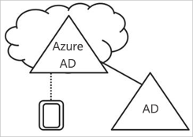
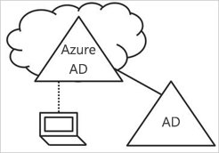
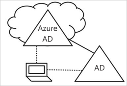

# Az Azure Active Directory eszközfelügyeletének ismertetése

Korunk mobil- és felhőalapú világában az Azure Active Directory (Azure AD) egyszeri bejelentkezési szolgáltatásával a felhasználók bárhonnan bejelentkezhetnek az eszközökre, alkalmazásokba és szolgáltatásokba. A különféle (esetenként saját tulajdonú) eszközök terjedésével az informatikai szakembereknek egyszerre két ellentétes célt kell teljesíteniük:

- A végfelhasználók hatékony munkájának támogatása bárhol és bármikor
- A vállalati tulajdon védelme bármikor

A felhasználók eszközökön keresztül férhetnek hozzá a vállalati tartalmakhoz. A tartalmak védelme érdekében rendszergazdaként mindenképpen érdemes a felügyelete alatt tartania ezeket az eszközöket. Így gondoskodhat róla, hogy a felhasználók csak olyan eszközökről férjenek hozzá a vállalat erőforrásaihoz, amelyek megfelelnek a biztonsági és megfelelőségi szabványoknak. 

Az eszközfelügyelet egyben az [eszközalapú feltételes hozzáférés](../conditional-access/require-managed-devices.md) alapja. Az eszközalapú feltételes hozzáféréssel gondoskodhat róla, hogy a környezet erőforrásai csak felügyelt eszközökkel legyenek elérhetők.   

Ez a cikk azt ismerteti, hogyan működik az eszközfelügyelet az Azure Active Directoryban.

> [!VIDEO https://www.youtube.com/embed/NeezfKhomQU]

## Eszközök bevonása az Azure AD felügyelete alá

Két módon vonhatja be az eszközöket az Azure AD felügyelete alá:

- Regisztrálással 
- Csatlakoztatással

Az eszközök Azure AD-beli **regisztrálása** lehetővé teszi az eszköz identitásának felügyeletét. Amikor regisztrál egy eszközt, az Azure AD eszközregisztráció ellátja azt egy identitással, amely az eszköz hitelesítésére használható, amikor a felhasználó bejelentkezik az Azure AD-be. Az eszközök az identitásuk alapján engedélyezhetők vagy tilthatók le.

Amikor ezt egy mobileszköz-felügyeleti (MDM) megoldással, például a Microsoft Intune-nal ötvözi, az Azure AD-ben lévő eszközattribútumok az eszköz további információival frissülnek. Ez lehetővé teszi további feltételes hozzáférési szabályok létrehozását, amelyek arra kényszerítik az eszközhozzáféréseket, hogy megfeleljenek a biztonsági és megfelelőségi szabványoknak. A Microsoft Intune-ban az eszközök regisztrálásának további információkért lásd: [Mi az eszközök regisztrálása?](https://docs.microsoft.com/intune/device-enrollment)

A **csatlakoztatás** az eszköz regisztrálásának kibővített formája. Ez azt jelenti, hogy ugyanazokat az előnyöket biztosítja, mint a regisztrálás, és az eszköz helyi állapotát is módosítja. A helyi állapot módosítása lehetővé teszi, hogy a felhasználók egy munkahelyi vagy iskolai fiókkal jelentkezzenek be az eszközön a személyes fiókjuk helyett.

## Azure AD-ben regisztrált eszközök   

Az Azure AD-ben regisztrált eszközök célja a **saját eszközök használatának (Bring Your Own Device, BYOD)** támogatása. Ebben a forgatókönyvben a felhasználó a saját személyes eszközéről férhet hozzá a cég Azure Active Directoryval felügyelt tartalmaihoz.  

A hozzáférés az eszközön megadott munkahelyi vagy iskolai fiók használatával történik.  
A Windows 10 például lehetővé teszi, hogy a felhasználók a saját számítógépükön, táblagépükön vagy telefonjukon megadjanak egy munkahelyi vagy iskolai fiókot.  
Amikor a felhasználó megad egy munkahelyi vagy iskolai fiókot, a rendszer regisztrálja az eszközt az Azure AD-ben, és adott esetben a cég által konfigurált mobileszköz-felügyeleti (MDM) rendszerben is. A vállalathoz tartozó felhasználók kényelmesen hozzáadhatják a munkahelyi vagy iskolai fiókokat a személyes tulajdonukban lévő eszközökön:

- Egy munkahelyi alkalmazás első hozzáférésekor
- Windows 10-ben manuálisan, a **Beállítások** menüben 

Az Azure AD-ben regisztrált eszközök Windows 10, iOS, Android és macOS rendszerű eszközök lehetnek.

## Azure AD-hez csatlakoztatott eszközök

Az Azure AD-hez csatlakoztatott eszközök leegyszerűsítik:

- A Windows üzembe helyezését a vállalati tulajdonú eszközökön 
- A hozzáférést a vállalati alkalmazásokhoz és erőforrásokhoz bármilyen Windows-eszközről
- A vállalati tulajdonú eszközök felhőalapú felügyeletét

Az alábbi módszerekkel létesíthet Azure AD-csatlakozást: 
 - [Windows Autopilot](https://docs.microsoft.com/windows/deployment/windows-autopilot/windows-10-autopilot)
 - [Tömeges üzembe helyezés](https://docs.microsoft.com/intune/windows-bulk-enroll)
 - [Önkiszolgáló megoldás használata](azuread-joined-devices-frx.md) 

Az **Azure AD-csatlakozás** olyan vállalatoknak való, amelyeknek az elsősorban felhőalapú (tehát elsősorban felhőszolgáltatásokat használó, a helyszíni infrastruktúra használatának csökkentésére törekvő) vagy teljesen felhőbeli (helyszíni infrastruktúra nélküli) üzemeltetés a célja. Nincs korlátozva, hogy az Azure AD-csatlakozást milyen méretű és típusú cégek használhatják. Az Azure AD-csatlakozás még hibrid környezetekben is jól használható, mert lehetővé teszi a felhőbeli és a helyszíni alkalmazások és erőforrások együttes használatát.

Az Azure AD-csatlakoztatott eszközök használata a következő előnyökkel jár:

- **Egyszeri bejelentkezés (SSO)** az Azure által felügyelt SaaS-alkalmazásokban és -szolgáltatásokban. A felhasználóknak nem kell külön hitelesíteniük magukat a munkahelyi erőforrások hozzáférésekor. Az egyszeri bejelentkezés funkció érhető el, akkor is, ha a felhasználók nem csatlakoznak a tartományi hálózaton.

- A felhasználói beállítások **vállalati előírásoknak megfelelő hordozása** a csatlakoztatott eszközökön. A felhasználóknak nem kell csatlakozniuk egy Microsoft-fiókhoz (például a Hotmailhez), hogy több eszköz beállításait is áttekinthessék.

- **Hozzáférés a Windows Store Vállalatoknak áruházhoz** egy Azure AD-fiókkal. A felhasználók választhatnak a cég által előre kiválasztott alkalmazások közül.

- **Windows Hello**-támogatás a munkahelyi erőforrások biztonságos és kényelmes hozzáféréséhez.

- **Korlátozott hozzáférés** az alkalmazásokhoz a megfelelőségi szabályzatban meghatározott eszközökről.

- **Zavartalan hozzáférés a helyszíni erőforrásokhoz**, amikor az eszközök rálátnak a helyszíni tartományvezérlőre. 

Habár az Azure AD elsősorban az olyan cégek számára készült, amelyek nem rendelkeznek helyszíni Windows Server Active Directory-infrastruktúrával, a szolgáltatás a következő helyzetekben is használható:

- Ha váltani kíván egy felhőalapú infrastruktúrára az Azure AD és egy mobileszköz-felügyeleti megoldás, például az Intune használatával.

- Ha nem használhat helyszíni tartománycsatlakoztatást, például ha mobileszközöket, táblagépeket és telefonokat szeretne felügyelet alá vonni.

- Ha a felhasználóknak elsősorban Office 365- vagy egyéb Azure AD-ben integrált SaaS-alkalmazásokhoz kell hozzáférnie.

- Ha felhasználók egy csoportját az Azure AD-ben szeretné felügyelni az Active Directory helyett. Ez a csoport lehet például az időszakos munkavállalóké, az alvállalkozóké vagy a tanulóké.

- Ha csatlakozási lehetőséget kíván nyújtani a korlátozott helyszíni infrastruktúrájú távoli fiókirodákban tartózkodó felhasználóknak.

Az Azure AD-csatlakoztatott eszközök csak Windows 10 rendszerű eszközök lehetnek.

## Hibrid Azure AD-csatlakoztatott eszközök

Több mint egy évtizede számos cég használja a tartományi csatlakoztatást a helyszíni Active Directoryhoz, mivel az a következő előnyökkel jár:

- Az informatikai részlegek egy központi helyről felügyelhetik a vállalati tulajdonú eszközöket.

- A felhasználók bejelentkezhetnek az eszközeiken a munkahelyi vagy iskolai Active Directory-fiókokkal. 

A helyszíni lábnyommal rendelkező cégek általában rendszerképkezelő megoldásokat használnak az eszközök üzembe helyezéséhez, és a **System Center Configuration Manager (SCCM)** vagy **csoportszabályzatok (GP)** használatával felügyelik azokat.

Ha az Ön környezetének van helyszíni AD-lábnyoma, ugyanakkor az Azure Active Directory nyújtotta lehetőségeket is ki szeretné használni, implementálhat hibrid Azure AD-csatlakoztatott eszközöket. Ezek olyan eszközök, amelyek a helyszíni Active Directoryhoz csatlakoznak, és regisztrálva vannak az Azure Active Directoryban is.

A hibrid Azure AD-csatlakoztatott eszközöket a következő esetekben érdemes használni:

- Ha Win32-alkalmazások vannak telepítve azokon az eszközökön, amelyek az Active Directory-géphitelesítést használják.

- Ha az eszközfelügyelethez csoportszabályzatokra van szükség.

- Ha továbbra is rendszerképkezelő megoldásokkal szeretné konfigurálni az alkalmazottak eszközeit.

A hibrid Azure AD-csatlakoztatott eszközök lehetnek Windows 10-es, illetve korábbi verziójú, például Windows 8 és 7 rendszerű eszközök is.

## Összegzés

Az Azure AD eszközfelügyelete a következő előnyöket nyújtja: 

- Egyszerűsíti az eszközök bevonását az Azure AD felügyelete alá

- Egyszerű hozzáférést nyújt a felhasználóknak a vállalat felhőbeli erőforrásaihoz

Az egyes megoldásokat a következő esetekben érdemes használni:

- Azure AD-ben regisztrált eszközök:

    - Személyes eszközök használata esetén 

    - Az eszközök manuális Azure AD-regisztrációjához

- Azure AD-hez csatlakoztatott eszközök: 

    - Vállalati tulajdonú eszközök használata esetén

    - Helyszíni AD-hez **nem** csatlakozó eszközök esetén

    - Az eszközök manuális Azure AD-regisztrációjához

    - Az eszközök helyi állapotának módosításához

- Hibrid Azure AD-csatlakoztatott, helyszíni AD-hez csatlakozó eszközök:     

    - Vállalati tulajdonú eszközök használata esetén

    - Helyszíni AD-hez csatlakozó eszközök esetén

    - Az eszközök automatikus Azure AD-regisztrációjához

    - Az eszközök helyi állapotának módosításához

## További lépések

- További információk az eszközök Azure Portalon végzett felügyeletéről: [Eszközfelügyelet az Azure Portalon](device-management-azure-portal.md).

- További információk az eszközalapú feltételes hozzáférésről: [Eszközalapú Azure Active Directory feltételes hozzáférési szabályzatok konfigurálása](../conditional-access/require-managed-devices.md).

- Beállítási információk:
    - Azure Active Directoryban regisztrált Windows 10-es eszközök: [Azure Active Directoryban regisztrált Windows 10 rendszerű eszközök konfigurálása](../user-help/device-management-azuread-registered-devices-windows10-setup.md)
    - Azure Active Directory-csatlakoztatott eszközök: [Azure Active Directory-csatlakoztatott eszközök konfigurálása](../user-help/device-management-azuread-joined-devices-setup.md)
    - Hibrid Azure AD-csatlakoztatott eszközök: [A hibrid Azure Active Directory-csatlakozás implementálásának megtervezése](hybrid-azuread-join-plan.md).

