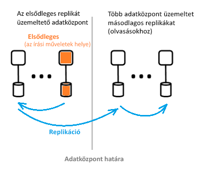

# Mi az az Azure Active Directory architektúrájának?
Az Azure Active Directory (Azure AD) lehetővé teszi, hogy biztonságosan kezelje az Azure-szolgáltatások és -erőforrások elérését a felhasználók számára. Az Azure AD-ben megtalálható az identitáskezelési megoldások teljes palettája. Az Azure AD-funkciókkal kapcsolatos információért lásd: [Mi az az Azure Active Directory?](active-directory-whatis.md)

Az Azure AD-vel felhasználókat és csoportokat hozhat létre és kezelhet, valamint engedélyeket adhat meg a vállalati erőforrások hozzáférésének engedélyezéséhez és megtagadásához. Az identitáskezeléssel kapcsolatos információért tekintse meg az [Azure-identitáskezelés alapjait leíró szakaszt](active-directory-whatis.md).

## Azure AD-architektúra
Az Azure AD földrajzilag elosztott architektúrája a széles körű megfigyelését, automatikus átirányítás, feladatátvételi és helyreállítási funkciókat, amelyeket vállalati szintű rendelkezésre állást és teljesítményt nyújthat az ügyfeleknek egyesíti.

Ez a cikk a következő architektúraelemeket tárgyalja:
 *  Szolgáltatásarchitektúra kialakítása
 *  Használhatósági 
 *  Folyamatos rendelkezésre állás
 *  Adatközpontok

### Szolgáltatásarchitektúra kialakítása
A leggyakoribb módja hozhat létre egy elérhető és használható, adatokban gazdag rendszerek független építőelemek vagy skálázási egységek keresztül. Az Azure AD adatrétege skálázási egységek nevezzük *partíciók*. 

Az adatréteg több front-end szolgáltatással rendelkezik, amelyek olvasási és írási képességeket nyújtanak. Az alábbi ábra bemutatja, hogyan lépnek egy egy címtárból partíció összetevői a földrajzilag elosztott adatközpontokban. 

  

Az Azure AD architektúra összetevői között egy elsődleges replika és másodlagos replikák szerepelnek.

**Elsődleges replika**

Az *elsődleges replika* fogadja azon partíció összes *írását*, amelyhez tartozik. Minden írási művelet azonnal replikálódik egy másik adatközpontban lévő másodlagos replikára, mielőtt a rendszer sikert jelezne a hívónak. Ezáltal biztosítható az írások georedundáns tartóssága.

**Másodlagos replikák**

Minden *címtárolvasás* *másodlagos replikákból* van szolgáltatva, amelyek különböző földrajzi helyeken lévő adatközpontokban találhatók. Sok másodlagos replika van, mivel az adatok replikálása aszinkron módon történik. A címtárolvasások, például a hitelesítési kérések, szolgált, amely az ügyfelek közelében találhatók adatközpontok adataihoz. A másodlagos replikák felelősek az olvasás méretezhetőségéért.

### Méretezhetőség

A méretezhetőség azon képesség, amellyel a szolgáltatások ki tudnak bővülni a növekvő teljesítményigények kielégítése érdekében. Az írás méretezhetősége az adatok particionálásával érhető el. Az olvasás méretezhetősége az adatok egy partícióról több, a világ számos részén elosztott másodlagos replikákra történő replikálásával érhető el.

Az adatközpontot, amelyben a fizikailag legközelebbi érkező kérések legyenek átirányítva. Az írások transzparens módon vannak átirányítva az elsődleges replikához az írás-olvasás konzisztenciájának biztosítása érdekében. A másodlagos replikák jelentősen kibővítik a partíciók méretét, mert a címtárak leginkább olvasásokat szolgáltatnak.

A címtáralkalmazások a legközelebbi adatközpontokhoz csatlakoznak. Ez a kapcsolat javítja a teljesítményt, és ezért horizontális felskálázása lehetséges. Mivel egy címtárpartíció sok másodlagos replikával rendelkezhet, a másodlagos replikák közelebb helyezhetők a címtár ügyfeleihez. Csak a belső címtárszolgáltatás írásigényes összetevői célozzák meg közvetlenül az aktív elsődleges replikát.

### Folyamatos rendelkezésre állás

A rendelkezésre állás (vagy üzemidő) határozza meg, hogy egy rendszer mennyire tud zavartalanul működni. Az Azure AD magas rendelkezésre állású kulcsa, hogy a szolgáltatások gyorsan képesek áthelyezni a forgalmat több, földrajzilag elosztott adatközpontok között. Mindegyik adatközpont független, ami lehetővé teszi a nem összefüggő hibaállapotokat.

Az Azure AD partíciójának kialakítása a vállalati AD kialakításához, amely tartalmazza az elsődleges replika körültekintően összehangolt és determinisztikus feladatátvételi folyamatot egyszeri terv használatával képest egyszerű.

**Hibatűrés**

A rendszereknek jobb a rendelkezésre állása, ha képesek tűrni a hardveres, hálózati és szoftverhibákat. A címtárban lévő összes partícióhoz magas rendelkezésre állású főreplika létezik: Az elsődleges replika. Ezen a replikán csak a partíció írása történik. Ez a replika folyamatos megfigyelés alatt áll, és az írások azonnal egy másik replikára helyezhetők (amely az új elsődleges replikává válik), ha a rendszer hibát észlel. Feladatátvétel esetén általában 1-2 percig megszűnhet az írás rendelkezésre állása. Ez nincs hatással az olvasás rendelkezésre állására.

Az olvasási műveletek (amelyek száma nagyságrendekkel meghaladja az írásokét) csak a másodlagos replikákhoz érkeznek. Mivel a másodlagos replikák idempotensek, egy adott partíció bármely replikájának elvesztése könnyedén orvosolható az olvasások egy másik replikára történő irányításával, általában ugyanabban az adatközpontban.

**Adatok tartóssága**

Az írások tartós véglegesítése legalább két adatközpontban megtörténik a nyugtázásuk előtt. Ehhez először véglegesíteni kell az írást az elsődleges replikán, majd azonnal replikálni kell legalább egy másik adatközpontba. Ez az írási művelet biztosítja, hogy egy lehetséges végzetes elvesztése üzemeltető az elsődleges adatközpont az adatvesztést eredményez.

Az Azure AD-ben a nulla [helyreállítási időre vonatkozó célkitűzés (RTO)](https://en.wikipedia.org/wiki/Recovery_time_objective) nincs adatvesztés, a feladatátvételt. Az érintett műveletek közé tartoznak az alábbiak:
-  Kiállítási és a címtárolvasások
-  Így csak körülbelül 5 percet RTO címtárba

### Adatközpontok

Az Azure AD replikái a világ számos részén található adatközpontokban vannak tárolva. További információk: [Azure adatközpontok](https://azure.microsoft.com/overview/datacenters).

Az Azure AD a következő jellemzőkkel rendelkező adatközpontokon működik:

 * Hitelesítés, a Graph és az egyéb AD-szolgáltatások az átjárószolgáltatás mögött található. Az átjáró kezeli ezen szolgáltatások terheléselosztását. Ez feladatátvételt hajt végre automatikus Ha bármelyik nem megfelelő állapotú kiszolgálókat észlel tranzakciós állapottesztek. Ezen állapot-mintavételek alapján az átjáró dinamikusan átirányítja a forgalmat a kifogástalan állapotú adatközpontokhoz.
 * Az *olvasások* esetében a címtár másodlagos replikákkal és megfelelő előtér-szolgáltatásokkal rendelkezik egy több adatközpontban működő aktív-aktív konfigurációban. A teljes adatközpont meghibásodása esetén a rendszer automatikusan átirányítja a forgalmat egy másik adatközpontra.
 *  A *ír*, a címtár hajt végre feladatátvételt az elsődleges (fő-) replika adatközpontokon keresztül tervezett (új elsődleges szinkronizálása a régi elsődleges) vagy vészhelyzeti feladatátvételi eljárásokat. Az adatok tartóssága minden véglegesítés legalább két adatközpontra történő replikálásával valósul meg.

**Adatkonzisztencia**

A könyvtár modell az egyik végleges kényszerítené a felhasználókat. Az elosztott aszinkron replikációs rendszerek egyik általános problémája egy "adott" replikáról lekért adatok nem feltétlenül naprakészek. 

Az Azure AD-ben a másodlagos replikát megcélzó alkalmazások  olvasási és írási konzisztenciája úgy valósul meg, hogy az írásokat a rendszer az elsődleges replikára irányítja, és ezzel egyidejűleg visszahúzza azokat a másodlagos replikára.

Az Azure AD Graph API-t használó alkalmazások írásai számára nem kötelező az affinitás fenntartása egy címtár replikája felé az olvasási-írási konzisztencia érdekében. Az Azure AD Graph szolgáltatása egy logikai munkamenetet tart fenn, amely affinitással rendelkezik egy olvasáshoz használt másodlagos replikához. Az affinitás egy „replika-jogkivonatban” van rögzítve, amelyet a Graph szolgáltatás egy elosztott gyorsítótár használatával gyorsítótáraz. A jogkivonat ezután a logikai munkamenet következő műveleteihez lesz felhasználva. 

 >[!NOTE]
 >Az írásokat a rendszer azonnal replikálja arra a másodlagos replikára, amelyre a logikai munkamenet olvasásai ki lettek adva.
 >

**Biztonsági másolatok védelme**

A címtár a végleges törlés helyett helyreállítható törlést valósít meg a felhasználók és bérlők számára, amely lehetővé teszi az egyszerű helyreállítást, ha az ügyfél esetleg véletlenül törölne valamit. A bérlői rendszergazda véletlenül töröl egy felhasználót, ha azok egyszerűen visszavonni, és helyreállíthatja a törölt felhasználót. 

Az Azure AD naponta biztonsági másolatot készít az összes adatról, ezért képes az adatok mérvadó visszaállítására bármilyen logikai törlés vagy sérülés esetében. Az adatréteg adatrétegünk hibajavító kódokat alkalmaz, így azt is ellenőrizze a hibákat, és automatikusan kijavítani bizonyos típusú lemezhibákat.

**Mérőszámok és figyelők**

Egy magas rendelkezésre állású szolgáltatás futtatásához világszínvonalú metrikára és monitorozási képességekre van szükség. Az Azure AD folyamatosan elemzi a szolgáltatások állapotával kapcsolatos legfontosabb mérőszámokat és az egyes szolgáltatások sikerességi feltételeit, illetve jelentést készít azokról. Nincs folyamatos fejlesztési és a hangolási mérőszámok és monitorozási és riasztási minden esetben minden egyes Azure AD szolgáltatásban, és az összes szolgáltatásban.

Ha bármelyik Azure AD szolgáltatás nem várt módon működik, azonnal műveletet funkciójának helyreállításához ismerhető meg leggyorsabban. A legfontosabb mérőszám az Azure AD nyomon követi a milyen gyorsan élő webhely problémákat észlelt, és az ügyfelek problémák elhárításáról. Komoly erőfeszítéseket teszünk a monitoring és a riasztások területén azért, hogy minimalizáljuk az észleléshez szükséges időt (cél: <5 perc). A működőképesség javításával pedig a hiba súlyosságának mérsékléséhez szükséges időt igyekszünk csökkenteni (cél: <30 perc).

**Biztonságos műveletek**

Műveleti vezérlőket, például a többtényezős hitelesítés (MFA) használatával minden olyan művelet, valamint minden művelet naplózását. Emellett minden olyan operatív tevékenység igény szerinti folyamatos számára szükséges ideiglenes hozzáférést just-in-time jogosultságszint-emelési rendszert használ. További információkért lásd: [A megbízható felhő](https://azure.microsoft.com/support/trust-center).

## További lépések
[Az Azure Active Directory fejlesztői útmutatója](https://docs.microsoft.com/azure/active-directory/develop/active-directory-developers-guide)

