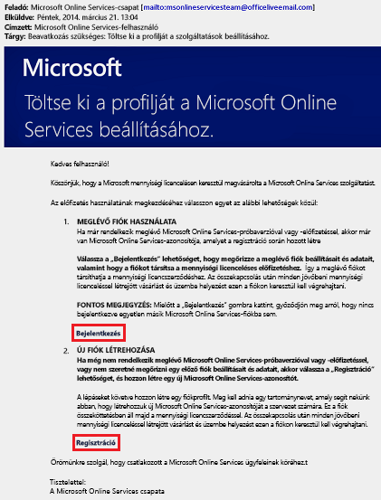
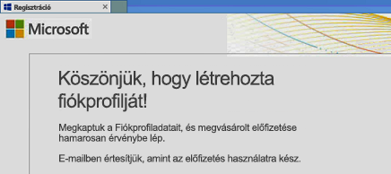
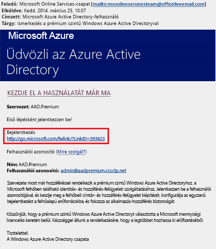
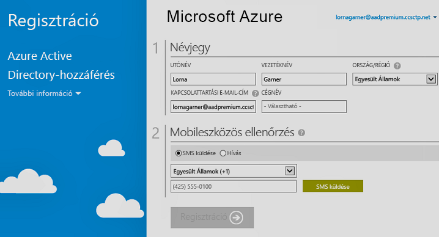

# Regisztráljon az Azure Active Directory Premium-kiadások
Vásárol, és a prémium szintű Azure Active Directory (Azure AD) kiadások társítása az Azure-előfizetés. Ha új Azure-előfizetés létrehozására van szüksége, aktiválnia kell a licenccsomagját és az Azure AD-szolgáltatás hozzáférését is.

> [!NOTE]
>Az Azure AD Prémium és Alapszintű kiadása az Azure Active Directory világszerte elérhető példányával érhetők el a kínai ügyfelek számára. Az Azure AD Prémium és Alapszintű kiadása jelenleg nem támogatott Kínában a 21Vianet által működtetett Azure-szolgáltatásban. További információért lépjen velünk kapcsolatba az [Azure Active Directory fórumon](https://feedback.azure.com/forums/169401-azure-active-directory/) keresztül.

Az Active Directory Premium 1 vagy Premium 2-re történő regisztráció előtt először határozza meg, melyik előfizetést vagy csomagot kívánja használni a létezők közül:

- Meglévő Azure vagy Office 365-előfizetéssel

- Enterprise Mobility + Security licenccsomaggal

- Microsoft mennyiségi licenccsomaggal

Amikor az Azure-előfizetését korábban megvásárolt és aktivált Azure AD-licencekkel használja a regisztrációhoz, akkor az ugyanabban a könyvtárban levő licencek automatikusan aktiválódnak. Ha nem ez a helyzet, akkor még aktiválnia kell a licenccsomagot és az Azure AD-hozzáférését. A licenccsomag aktiválással kapcsolatos további információkért lásd: [Új licenccsomag aktiválása](#activate-your-new-license-plan). Az Azure AD-hozzáférés aktiválásával kapcsolatos további információkért lásd: [Azure AD-hozzáférés aktiválása](#activate-your-azure-ad-access). 

## Regisztráció meglévő Azure vagy Office 365-előfizetéssel
Azure- vagy Office 365-előfizetőként az interneten vásárolhatja meg a Prémium szintű Azure Active Directory-kiadásokat. A részletes lépésekért lásd: [A Prémium szintű Active Directory megvásárlása – meglévő ügyfelek](https://channel9.msdn.com/Series/Azure-Active-Directory-Videos-Demos/How-to-Purchase-Azure-Active-Directory-Premium-Existing-Customer) vagy [A Prémium szintű Active Directory megvásárlása – új ügyfelek](https://channel9.msdn.com/Series/Azure-Active-Directory-Videos-Demos/How-to-Purchase-Azure-Active-Directory-Premium-New-Customers).

## Regisztráció Enterprise Mobility + Security licenccsomaggal
Enterprise Mobility + Security olyan, az Azure AD Premium, Azure Information Protection és a Microsoft Intune-csoportból áll. Ha már van EMS-licence, az Azure AD használatát a következő licenclehetőségek egyikével kezdheti meg:

További információkat az EMS-ről a [Nagyvállalati mobilitás és biztonság webhelyén](https://www.microsoft.com/cloud-platform/enterprise-mobility-security).

- Próbálja ki az EMS-t az [Enterprise Mobility + Security E5 ingyenes próba-előfizetésével](https://signup.microsoft.com/Signup?OfferId=87dd2714-d452-48a0-a809-d2f58c4f68b7&ali=1).

- Vásároljon [Enterprise Mobility + Security E5 licenceket](https://signup.microsoft.com/Signup?OfferId=e6de2192-536a-4dc3-afdc-9e2602b6c790&ali=1)

- Vásároljon [Enterprise Mobility + Security E3 licenceket](https://signup.microsoft.com/Signup?OfferId=4BBA281F-95E8-4136-8B0F-037D6062F54C&ali=1)

## Regisztráció Microsoft mennyiségi licenccsomag használatával
A Microsoft mennyiségi licenccsomagon keresztül a kívánt licencszámtól függően az alábbi két programmal regisztrálhat a prémium szintű Azure AD használatára:

- **250 és több licenc.** [Microsoft nagyvállalati szerződés](https://www.microsoft.com/en-us/licensing/licensing-programs/enterprise.aspx)

- **5–250 licencre.** [Mennyiségi licenc megnyitása](https://www.microsoft.com/en-us/licensing/licensing-programs/open-license.aspx)

A nagybani licencbeadási vásárlási lehetőségekről bővebb információ a [nagybani licencbeadáson keresztüli vásárlást](https://www.microsoft.com/en-us/licensing/how-to-buy/how-to-buy.aspx) ismertető oldalon található.

## Az új licenccsomag aktiválása
Ha új Azure AD licenccsomaggal regisztrált, akkor a vásárlás után kapott visszaigazoló e-mail használatával aktiválnia kell a szervezete számára.

### A licenccsomag aktiválása
- Nyissa meg a Microsofttól a regisztráció után kapott megerősítő e-mailt, majd vagy a **Bejelentkezésre** vagy a **Regisztrációra** kattintson.
   
    

    - **Bejelentkezés.** Ezt a hivatkozást válassza, ha rendelkezik meglévő bérlővel, majd a meglévő rendszergazdai fiókjával jelentkezzen be. A bérlő globális rendszergazdai kell, ahol a licenceket aktiválása vannak folyamatban.

    - **Regisztráció.** Ezt a hivatkozást válassza, ha új Azure AD-bérlőt szeretne aktiválni a licenccsomaghoz a **Fiókprofil létrehozása** párbeszédpanel megnyitásával.

        

Ha elkészült, a bérlő számára a licenccsomag aktiválását megköszönő megerősítő ablakot fog látni.

## Az Azure AD-hozzáférés aktiválása
Ha új Prémium szintű Azure AD-licenceket ad már létező előfizetéshez, akkor az Azure AD-hozzáférés már valószínűleg aktív. Más esetekben aktiválnia kell az **üdvözlő e-mail** fogadása után.  

Miután a megvásárolt licencek érvénybe lépnek a címtárban, kapni fog egy **üdvözlő e-mailt**. Az e-mail megerősíti, hogy elkezdheti a Prémium szintű Azure AD vagy az Enterprise Mobility + Security licenceinek és funkcióinak használatát. 

> [!TIP]
> Csak azután lesz elérhető az Azure AD az új bérlő számára, miután aktiválta az Azure AD directory hozzáférését az üdvözlő e-maillel.

### Az Azure AD-hozzáférés aktiválása

1. Nyissa meg a **üdvözlő e-mailt**, és kattintson a **bejelentkezésre**.
   
    

2. Sikeres bejelentkezés után, mobileszköz használatával kétlépéses ellenőrzésen megy keresztül.
   
    

Az aktiválási folyamat jellemzően csak néhány percet vesz igénybe, és ezután már használhatja az Azure AD-bérlővel. 

## További lépések
Miután megvan a Prémium szintű Azure AD, [testre szabhatja a tartományát](add-custom-domain.md), hozzáadhatja a [vállalati védjegyzést](customize-branding.md), [létrehozhat bérlőt](active-directory-access-create-new-tenant.md), és [felvehet csoportokat](active-directory-groups-create-azure-portal.md)és [felhasználókat](add-users-azure-active-directory.md).
