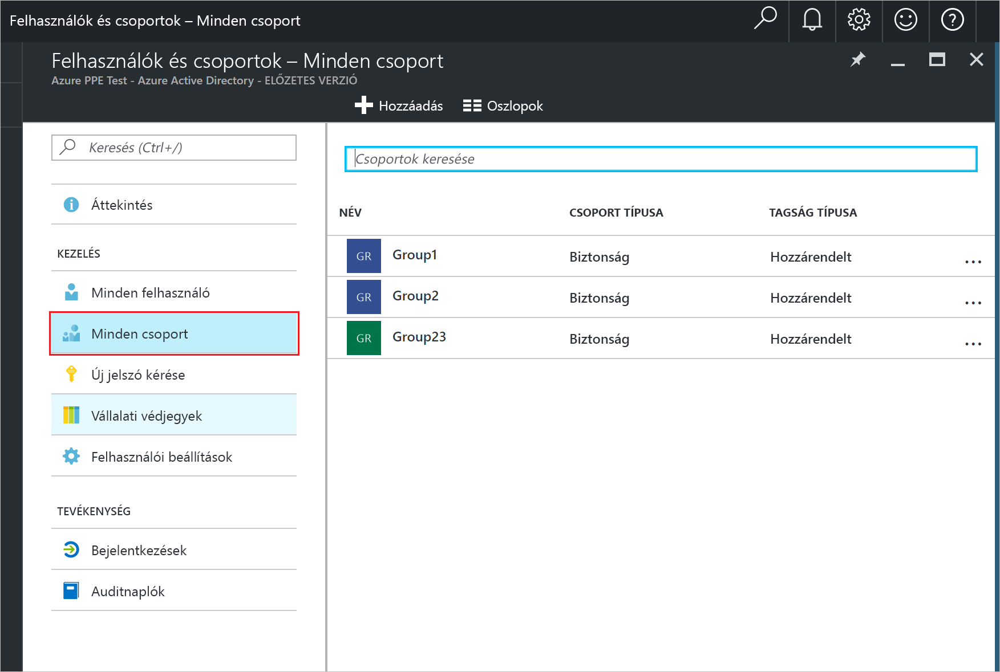
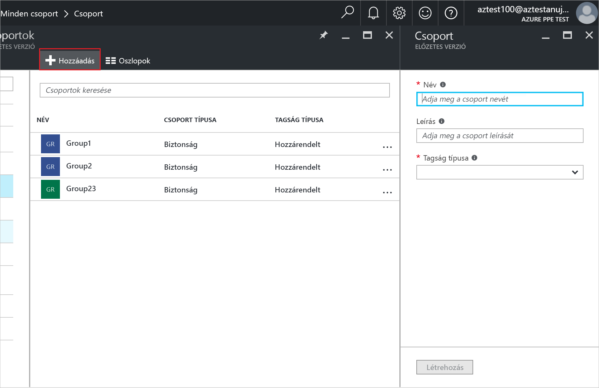
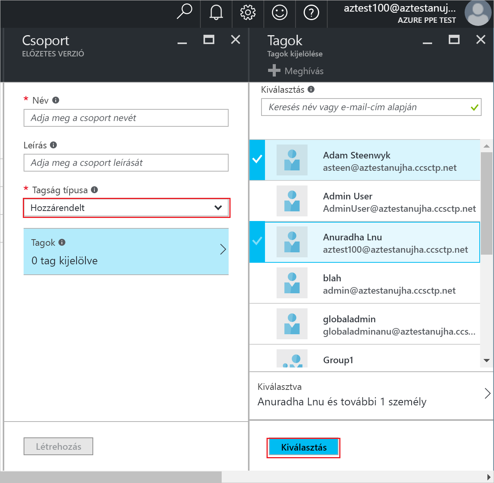
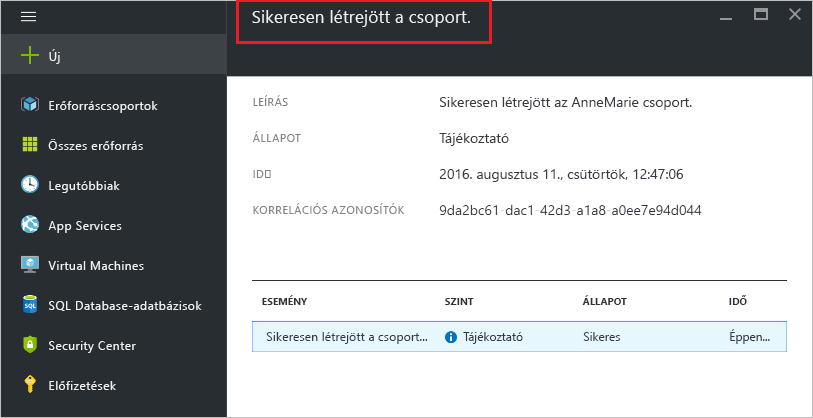

# Csoport létrehozása és tagok hozzáadása az Azure Active Directoryban
> [!div class="op_single_selector"]
> * [Azure Portal](active-directory-groups-create-azure-portal.md)
> * [PowerShell](../users-groups-roles/groups-settings-v2-cmdlets.md)

Ez a cikk ismerteti egy új csoport létrehozásának és feltöltésének módját az Azure Active Directoryban. A csoportokat kezelési feladatok, például licencek vagy engedélyek egyszerre több felhasználóhoz vagy eszközhöz való hozzárendelésére használhatja.

## Hogyan hozható létre csoport?
1. Jelentkezzen be az [Azure Portalra](https://portal.azure.com) egy olyan fiókkal, amely a címtár globális rendszergazdája.
2. Válassza a **Minden szolgáltatás** elemet, írja be a **Felhasználók és csoportok** kifejezést a szövegmezőbe, majd válassza a **Bevitel** parancsot.

   
3. A **Felhasználók és csoportok** panelen válassza a **Minden csoport** elemet.

   
4. A **Felhasználók és csoportok – Minden csoport** panelen válassza a **Hozzáadás** parancsot.

   
5. A **Csoport** panelen adja meg a csoport nevét és leírását.
6. Csoporttagok felvételéhez válassza ki a **Hozzárendelt** típust a **Tagságtípus** mezőben, majd válassza a **Tagok** elemet. További információ a csoporttagságok dinamikus kezelésével kapcsolatban: [Attribútumok használata speciális csoporttagsági szabályok létrehozásához](../users-groups-roles/groups-dynamic-membership.md).

   
7. A **Tagok** panelen jelöljön ki egy vagy több, a csoporthoz hozzárendelni kívánt felhasználót vagy eszközt, majd a panel alján található **Kiválasztás** gombbal adja őket hozzá a csoporthoz. A **Felhasználó** mezővel aszerint szűrheti a megjelenített elemeket, hogy a megadott szöveg megtalálható-e egy felhasználó- vagy eszköznévben. Helyettesítő karakterek nem használhatók a mezőben.
8. Ha befejezte a tagok hozzáadását a csoporthoz, válassza a **Létrehozás** gombot a **Csoport** panelen.    

   

## További lépések
E cikkekben további információk találhatók az Azure Active Directoryval kapcsolatban.

* [Meglévő csoportok megtekintése](active-directory-groups-view-azure-portal.md)
* [Csoportbeállítások kezelése](active-directory-groups-settings-azure-portal.md)
* [Csoporttagok kezelése](active-directory-groups-members-azure-portal.md)
* [Csoporttagságok kezelése](active-directory-groups-membership-azure-portal.md)
* [A csoportban lévő felhasználók dinamikus szabályainak kezelése](../users-groups-roles/groups-dynamic-membership.md)
