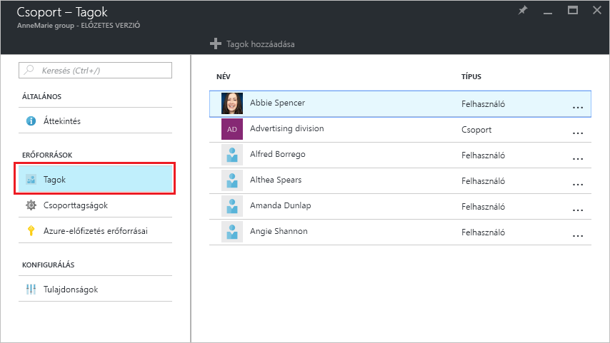
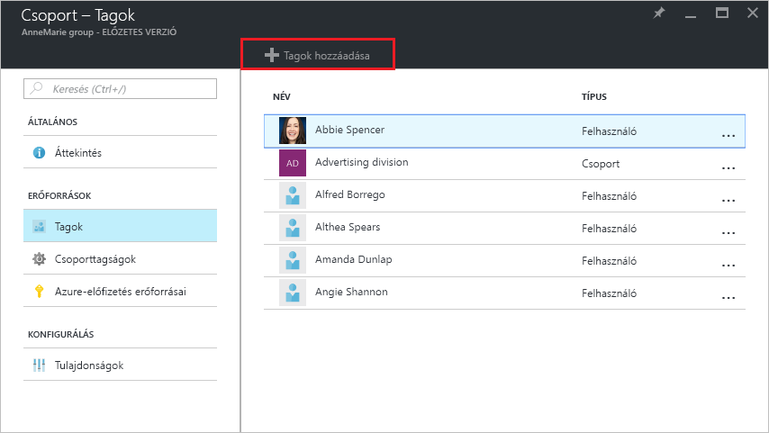
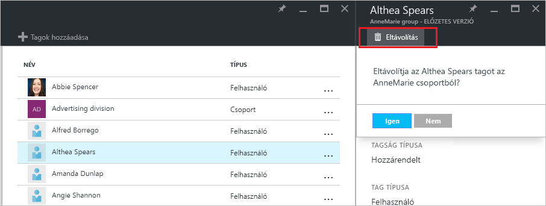

# Felhasználók csoporttagságainak kezelése az Azure Active Directory-bérlőben
Ez a cikk azt ismerteti, hogy hogyan kezelheti egy csoport tagjait az Azure Active Directoryban (Azure AD).

## Hogyan találhatom meg és kezelhetem a csoporttagokat?
1. Jelentkezzen be az [Azure Portalra](https://portal.azure.com) egy olyan fiókkal, amely a címtár globális rendszergazdája.
2. Válassza a **Minden szolgáltatás** elemet, írja be a **Felhasználók és csoportok** kifejezést a szövegmezőbe, majd nyomja le az **Enter** billentyűt.

   
3. A **Felhasználók és csoportok** panelen válassza a **Minden csoport** elemet.

   
4. A **Felhasználók és csoportok – Minden csoport** panelen válasszon ki egy csoportot.
5. A **Csoport – *csoportnév*** panelen válassza a **Tagok** elemet.

   
6. A csoporttagok hozzáadásához válassza a **Csoport – Tagok** panel **Tagok hozzáadása** parancsát.

   
7. A **Tagok** panelen jelöljön ki egy vagy több, a csoporthoz hozzárendelni kívánt felhasználót vagy eszközt, majd a panel alján található **Kiválasztás** gombbal adja őket hozzá a csoporthoz. A **Felhasználó** mezővel aszerint szűrheti a megjelenített elemeket, hogy a megadott szöveg megtalálható-e egy felhasználó- vagy eszköznévben. Helyettesítő karakterek nem használhatók a mezőben.
8. Ha el szeretne távolítani tagokat a csoportból, válasszon ki egy csoporttagot a **Csoport – Tagok** panelen.
9. A ***tag neve*** panelen válassza ki az **Eltávolítás** parancsot, majd a parancssorban erősítse meg a döntést.

   
10. Ha befejezte a csoporttagok módosítását, válassza a **Mentés** lehetőséget.

## További információ
E cikkekben további információk találhatók az Azure Active Directoryval kapcsolatban.

* [Meglévő csoportok megtekintése](active-directory-groups-view-azure-portal.md)
* [Új csoport létrehozása és tagok hozzáadása](active-directory-groups-create-azure-portal.md)
* [Csoportbeállítások kezelése](active-directory-groups-settings-azure-portal.md)
* [Csoporttagságok kezelése](active-directory-groups-membership-azure-portal.md)
* [A csoportban lévő felhasználók dinamikus szabályainak kezelése](../users-groups-roles/groups-dynamic-membership.md)
