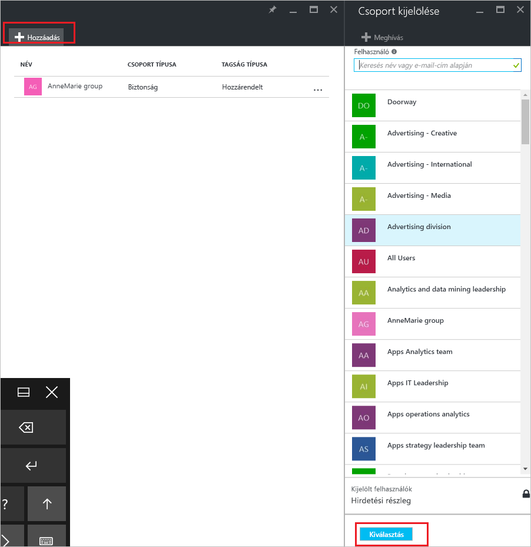
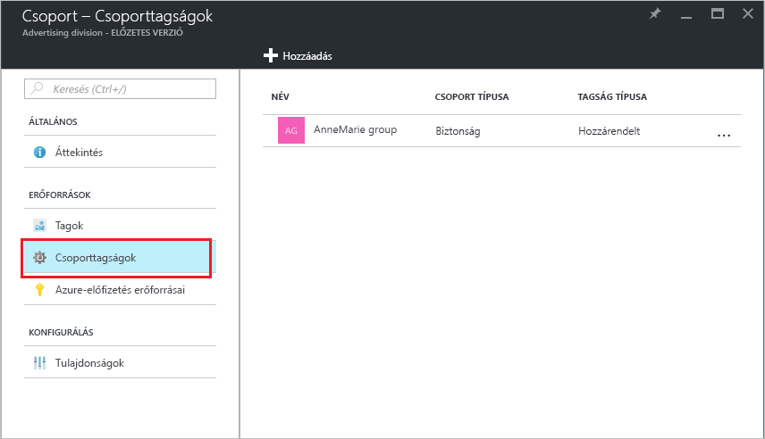

# Adja hozzá, vagy távolítsa el egy csoport egy másik csoportot az Azure Active Directoryval
Ez a cikk segít hozzáadhat és eltávolíthat egy csoportot az Azure Active Directory használatával egy másik csoportot.

>[!Note]
>A szülőcsoport törölni próbál, ha [frissíteni vagy törölni a csoportot és annak tagjait](active-directory-groups-delete-group.md).

## Adjon hozzá egy másik csoportot
Hozzáadhat egy meglévő biztonsági csoport egy másik meglévő biztonsági csoport (más néven beágyazott csoportok), a tag létrehozása (alcsoport) csoport és a egy szülőcsoportot. A tagcsoportnak örökli az attribútumokat és a tulajdonságokat a szülőcsoporthoz, így konfigurációs időt takarít meg.

>[!Important]
>Jelenleg nem támogatottak:<ul><li>Csoportok hozzáadása a helyszíni Active Directoryval szinkronizált csoporthoz</li><li>Biztonsági csoportok hozzáadása az Office 365-csoportok</li><li>Biztonsági csoportok vagy más Office 365-csoportokat az Office 365-csoportok hozzáadása</li><li>Alkalmazások hozzárendelése a beágyazott csoportok</li><li>Beágyazott csoportok licencek alkalmazása</li></ul>

### Egy másik csoport tagjaként csoport hozzáadása

1. A címtár eléréséhez globális rendszergazdai fiókkal jelentkezzen be az [Azure portálra](https://portal.azure.com).

2. Válassza ki **Azure Active Directory**, majd válassza ki **csoportok**.

3. Az a **csoportok – összes csoport** lapon keresse meg és válassza ki a csoportot, amely egy másik csoport tagjává válik. Ebben a gyakorlatban használjuk a **mobileszköz-kezelési szabályzat – Nyugat-India** csoport.

    >[!Note]
    >Adhat hozzá a csoporthoz, amelynek csak egyetlen csoport egyszerre. Ezenkívül a **csoport kijelölése** box szűri a megjelenített megfelelt a bejegyzés egy felhasználó vagy az eszköz nevének bármelyik részét. Azonban a helyettesítő karakterek nem támogatottak.

    

4. Az a **mobileszköz-kezelési szabályzat – Nyugat - csoporttagságok** lapon jelölje be **csoporttagságok**, jelölje be **Hozzáadás**, keresse meg a csoport tagja, és válassza a acsoportba **Válassza ki**. Ebben a gyakorlatban használjuk a **mobileszköz-kezelési szabályzat – az összes szervezeti** csoport.

    A **mobileszköz-kezelési szabályzat – Nyugat-India** csoport már tagja a **mobileszköz-kezelési szabályzat – az összes szervezeti** csoport, a tulajdonságok és a mobileszköz-kezelési házirend - az összes szervezeti csoport konfiguráció örökli.

    

5. Tekintse át a **mobileszköz-kezelési szabályzat – Nyugat - csoporttagságok** oldalon tekintheti meg a csoport- és tagobjektumok kapcsolatban.

    

6. A csoport- és tagobjektumok kapcsolatban részletesebb megjelenítéséhez, válassza ki a csoport nevét (**mobileszköz-kezelési szabályzat – az összes szervezeti**), és tekintse meg a **mobileszköz-kezelési szabályzat – Nyugat-India** részletei lapon.

    

## Csoport eltávolítása csoportból
Eltávolíthatja a meglévő biztonsági csoportot egy másik biztonsági csoportból. Azonban a csoport eltávolítása is eltávolítja a örökölt attribútumok és a tulajdonságok a tagjai.

### Egy tag csoport eltávolítása egy másik csoportot
1. Az a **csoportok – összes csoport** lapon keresse meg és válassza ki azt a csoportot, amely tagja egy másik csoportra, el kell távolítani. Ebben a gyakorlatban újra használjuk a **mobileszköz-kezelési szabályzat – Nyugat-India** csoport.

2. Az a **mobileszköz-kezelési szabályzat – Nyugat-India – áttekintés** lapon jelölje be **csoporttagságok**.

    

3. Válassza ki a **mobileszköz-kezelési szabályzat – az összes szervezeti** csoportra a **mobileszköz-kezelési szabályzat – Nyugat - csoporttagságok** oldalra, és kattintson **eltávolítása** származó a **mobileszköz-kezelési szabályzat – Nyugat-India** részletei lapon.

    

## További információ
E cikkekben további információk találhatók az Azure Active Directoryval kapcsolatban.

- [Csoportok és tagok megtekintése](active-directory-groups-view-azure-portal.md)

- [Hozzon létre egy alapszintű csoportot, és tagokat vehet fel](active-directory-groups-create-azure-portal.md)

- [Tagok hozzáadása vagy eltávolítása a csoportból](active-directory-groups-members-azure-portal.md)

- [A csoport beállításainak szerkesztése](active-directory-groups-settings-azure-portal.md)

- [Csoport használata SaaS-alkalmazásokhoz való hozzáférés kezelésére](../users-groups-roles/groups-saasapps.md)

- [Forgatókönyvek, korlátait és ismert problémák csoportok használata kezelheti az Azure Active Directory licencelése](../users-groups-roles/licensing-group-advanced.md#limitations-and-known-issues)
