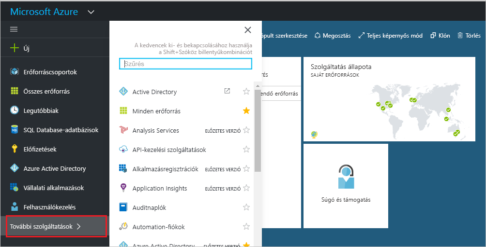
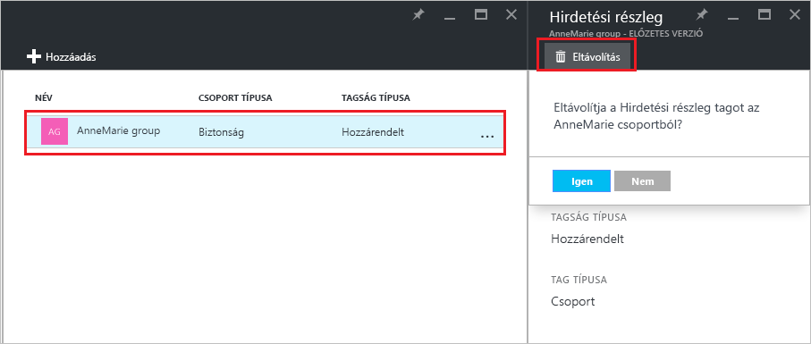

# Annak kezelése, hogy egy csoport mely csoportokhoz tartozik az Azure Active Directory-bérlőben
A csoportok tartalmazhatnak más csoportokat az Azure Active Directoryban. Az alábbiakat követve kezelheti ezen csoportok tagságát.

## Hogyan találhatom meg azokat a csoportokat, amelyeknek a saját csoportom a tagja?
1. Jelentkezzen be az [Azure AD felügyeleti központba](https://aad.portal.azure.com) egy olyan fiókkal, amely a címtár globális rendszergazdája.
2. Válassza a **Felhasználók és csoportok** elemet.

   
1. Válassza a **Minden csoport** lehetőséget.

   
1. Válasszon ki egy csoportot.
2. Válassza a **Csoporttagságok** elemet.

   
1. A saját csoport egy másik csoport tagjaként való hozzáadásához válassza a **Csoport – Csoporttagságok** panel **Hozzáadás** parancsát.
2. Válasszon ki egy csoportot a **Csoport kiválasztása** panelen, majd kattintson a panel alján található **Kiválasztás** gombra. A kiválasztott csoport egyszerre csak egy csoporthoz adható hozzá. A **Felhasználó** mezővel aszerint szűrheti a megjelenített elemeket, hogy a megadott szöveg megtalálható-e egy felhasználó- vagy eszköznévben. Helyettesítő karakterek nem használhatók a mezőben.

   
8. Ha el szeretné távolítani a saját csoportot egy másik csoport tagjai közül, válasszon ki egy csoportot a **Csoport – Csoporttagságok** panelen.
9. Kattintson az **Eltávolítás** parancsra, majd erősítse meg a műveletet, amikor a rendszer megkéri rá.

   
10. Ha befejezte a csoport csoporttagságának módosítását, kattintson a **Mentés** parancsra.

## További információ
E cikkekben további információk találhatók az Azure Active Directoryval kapcsolatban.

* [Meglévő csoportok megtekintése](active-directory-groups-view-azure-portal.md)
* [Új csoport létrehozása és tagok hozzáadása](active-directory-groups-create-azure-portal.md)
* [Csoportbeállítások kezelése](active-directory-groups-settings-azure-portal.md)
* [Csoporttagok kezelése](active-directory-groups-members-azure-portal.md)
* [A csoportban lévő felhasználók dinamikus szabályainak kezelése](../users-groups-roles/groups-dynamic-membership.md)
