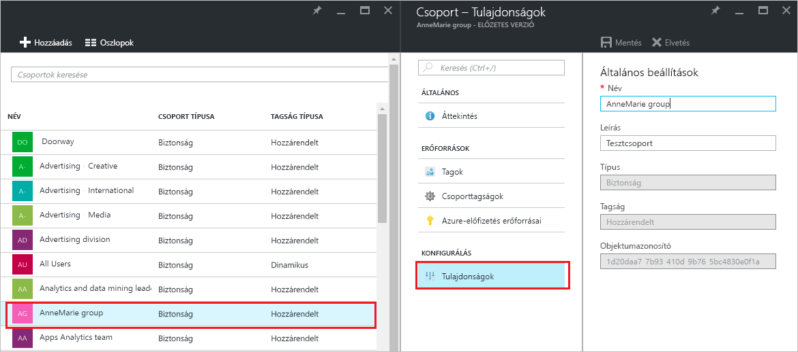

# Csoportok beállításainak kezelése az Azure Active Directoryban
Ez a cikk azt ismerteti, hogyan módosíthatja a csoportok beállításait az Azure Active Directoryban (Azure AD).

## Hogyan kereshetem meg és módosíthatom a beállításokat?
1. Jelentkezzen be az [Azure AD felügyeleti központba](https://aad.portal.azure.com) egy olyan fiókkal, amely a címtár globális rendszergazdája.
2. Válassza a **Minden szolgáltatás** elemet, írja be a **Felhasználók és csoportok** kifejezést a szövegmezőbe, majd nyomja le az **Enter** billentyűt.

   
3. A **Felhasználók és csoportok** panelen válassza a **Minden csoport** elemet.

   
4. A **Felhasználók és csoportok – Minden csoport** panelen válasszon ki egy csoportot.
5. A **Csoport – *csoportnév*** panelen válassza a **Tulajdonságok** elemet.

   
6. Ha befejezte a csoport tulajdonságainak módosítását, kattintson a **Mentés** parancsra.    

   

## További lépések
E cikkekben további információk találhatók az Azure Active Directoryval kapcsolatban.

* [Meglévő csoportok megtekintése](active-directory-groups-view-azure-portal.md)
* [Új csoport létrehozása és tagok hozzáadása](active-directory-groups-create-azure-portal.md)
* [Csoporttagok kezelése](active-directory-groups-members-azure-portal.md)
* [Csoporttagságok kezelése](active-directory-groups-membership-azure-portal.md)
* [A csoportban lévő felhasználók dinamikus szabályainak kezelése](../users-groups-roles/groups-dynamic-membership.md)
