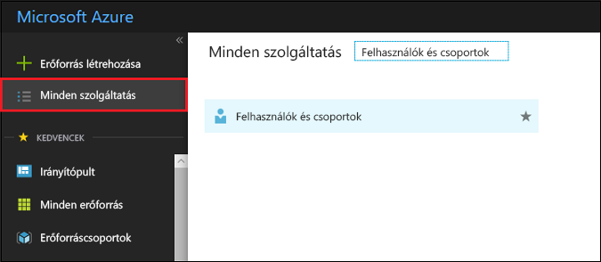

# A felhasználói csoportok megtekintése vagy megkeresése az Azure Active Directoryban
Ez a cikk azt ismerteti, hogyan tekinthet meg csoportokat az Azure Active Directoryban (Azure AD). Az Azure AD által biztosított felhasználókezelés egyik funkciója a csoportok használata a kezelési feladatok végrehajtására, például licencek vagy engedélyek egyszerre több felhasználóhoz való hozzárendelésére.

## Hogyan tekinthetem meg az összes csoportot?
1. Jelentkezzen be az [Azure Portalra](https://portal.azure.com) egy olyan fiókkal, amely a címtár globális rendszergazdája.
2. Válassza a **Minden szolgáltatás** elemet, írja be a **Felhasználók és csoportok** kifejezést a szövegmezőbe, majd nyomja le az **Enter** billentyűt.

   
3. A **Felhasználók és csoportok** panelen válassza a **Minden csoport** elemet.

   
4. A **Felhasználók és csoportok – Minden csoport** panelen hozzáadhat vagy eltávolíthat megjelenítési oszlopokat, a lista szűrésével csoportokra kereshet rá, illetve módosíthatja azokat a csoportokat, amelyek módosításához rendelkezik a megfelelő engedélyekkel.

## További lépések
E cikkekben további információk találhatók az Azure Active Directoryval kapcsolatban.

* [Meglévő csoportok megtekintése](active-directory-groups-view-azure-portal.md)
* [Új csoport létrehozása és tagok hozzáadása](active-directory-groups-create-azure-portal.md)
* [Csoportbeállítások kezelése](active-directory-groups-settings-azure-portal.md)
* [Csoporttagok kezelése](active-directory-groups-members-azure-portal.md)
* [Csoporttagságok kezelése](active-directory-groups-membership-azure-portal.md)
* [A csoportban lévő felhasználók dinamikus szabályainak kezelése](../users-groups-roles/groups-dynamic-membership.md)
