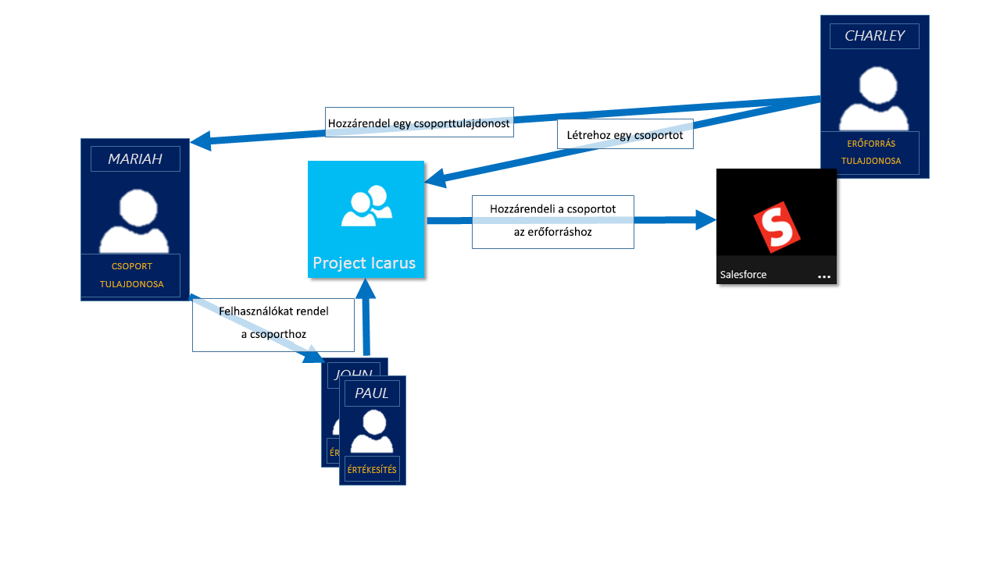
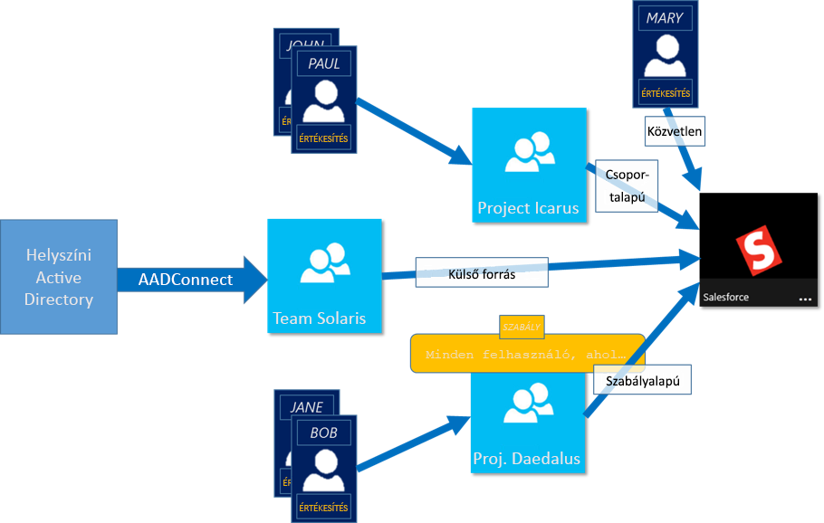

# Alkalmazás- és erőforrás-hozzáférés kezelése Azure Active Directory-csoportok
Az Azure Active Directory (Azure AD) segítségével felügyelheti felhőalapú alkalmazásait, a helyszíni alkalmazások és használatával a szervezet erőforrásaihoz. Az erőforrások a címtár, például való kezelése a szerepkörök a címtárnak, vagy a könyvtárba, külső objektumok, például a szoftverek (SaaS) Szolgáltatottszoftver-alkalmazásokat, az Azure-szolgáltatásokat, SharePoint-webhelyekre és a helyszíni erőforrások része lehet.

>[!NOTE]
>Az Azure Active Directory használatához Azure-fiókra lesz szükség. Ha nincs fiókja, [regisztrálhat egy ingyenes Azure-fiókot](https://azure.microsoft.com/free/).

## Hogyan hozzáférés-kezelés az Azure ad-ben során?
Az Azure AD segítségével hozzáférést biztosíthat a munkahelyi erőforrásokhoz azáltal, hogy egy felhasználó hozzáférési jogosultságokat, vagy az egy teljes Azure AD-csoportban. Csoportok használata lehetővé teszi, hogy az erőforrás tulajdonosa (vagy az Azure AD directory), rendelje hozzá a hozzáférési engedélyek egy készletét, ahelyett, hogy a jogok egyesével adja meg a csoport összes tagja. Az erőforrás vagy a könyvtár tulajdonosa is adhat a management rights számára a taglistára valaki másra, például egy részleg vezető vagy egy ügyfélszolgálati adminisztrátor, ami lehetővé teszi, hogy a személy, hozzáadhat és eltávolíthat tagokat, igény szerint. Csoporttulajdonosok kezelése kapcsolatos további információkért lásd: [csoporttulajdonosok kezelése](active-directory-accessmanagement-managing-group-owners.md)

## Hozzáférési jogosultságok hozzárendelése módjai
Erőforrás-hozzáférési jogosultsága ahhoz, hogy a felhasználók hozzárendelése négy módja van:

- **Közvetlen hozzárendelés.** Az erőforrás tulajdonosa közvetlenül az erőforráshoz rendeli hozzá a felhasználó.

- **Csoport-hozzárendelés.** Az erőforrás tulajdonosa az erőforráshoz, ami automatikusan biztosít az összes a csoport tagjainak hozzáférést az erőforráshoz rendeli hozzá az Azure AD-csoportok. Csoporttagság kezeli a csoport tulajdonosa, mind az erőforrás tulajdonosa, ami lehetővé teszi a tagok hozzáadása vagy eltávolítása a csoportból vagy tulajdonos. Hozzáadásával vagy eltávolításával csoporttagság kapcsolatos további információkért lásd: [hogyan: hozzáadása vagy eltávolítása egy csoport egy másik csoport használatával az Azure Active Directory portálon](active-directory-groups-membership-azure-portal.md). 

- **A szabály-alapú hozzárendelést.** Az erőforrás tulajdonosa létrehoz egy csoportot, és a egy szabályt használ a meghatározására, hogy melyik felhasználók vannak hozzárendelve egy adott erőforrás. A szabály az attribútumokat, amelyek az egyes felhasználókhoz rendelt alapul. Az erőforrás tulajdonosa kezeli a szabályt, amely meghatározza, hogy melyik attribútumai és értékei szükség, hogy engedélyezze a hozzáférést az erőforráshoz. További információkért lásd: [dinamikus csoport létrehozása és állapotának](../users-groups-roles/groups-create-rule.md).

    Ez a rövid videó gyors létrehozásáról és használatáról a dinamikus csoportok ismertetése is megtekintheti:

    >[!VIDEO https://channel9.msdn.com/Series/Azure-Active-Directory-Videos-Demos/Azure-AD--Introduction-to-Dynamic-Memberships-for-Groups/player]

- **Külső szolgáltató hozzárendelést.** Hozzáférés a külső forrásból, például egy helyszíni címtár vagy egy SaaS-alkalmazás származik. Ebben a helyzetben az erőforrás tulajdonosa egy csoportot, így biztosítva hozzáférést az erőforráshoz rendeli hozzá, és majd a külső adatforrás kezeli-e a csoport tagjai.

   

## Csatlakozhat felhasználói csoportok nélkül érvényessége a felhasználóhoz?
A csoport tulajdonosa engedélyezheti a felhasználók számára, amelyhez csatlakozhatnak hozzájuk rendelni helyett a saját csoportok kereséséhez. A tulajdonos is állíthat be a csoport, automatikusan elfogadja az összes olyan felhasználó, amelyhez csatlakozni vagy jóváhagyás szükséges.

Miután egy felhasználó egy csoporthoz való csatlakoztatáshoz igényel, a rendszer továbbítja a kérést a csoport tulajdonosa. Ez szükséges, ha a tulajdonos jóváhagyhatja a kérést, és a felhasználó értesítést kap a csoport tagságát. Azonban, ha több tulajdonosai, és egyik fennmaradhat, a felhasználó értesítést kap, de nincs hozzá a csoporthoz. További információkat és útmutatást ahhoz, hogy a felhasználók, csoportok csatlakozni kérése: [Azure AD beállítása, így a felhasználók kérhetik való csatlakozás csoportokhoz](../users-groups-roles/groups-self-service-management.md)

## További lépések
Most, hogy egy kis csoportok használata a hozzáférés-kezelés bemutatása, megkezdése az erőforrások és alkalmazások felügyeletét.

- [Hozzon létre egy új csoportot az Azure Active Directoryval](active-directory-groups-create-azure-portal.md) vagy [létrehozása és kezelése a PowerShell-parancsmagok használatával új csoport](../users-groups-roles/groups-settings-v2-cmdlets.md)

- [Csoportok használata hozzáférések hozzárendelése az integrált SaaS-alkalmazások](../users-groups-roles/groups-saasapps.md)

- [Egy helyi csoport az Azure-ban az Azure AD Connect szinkronizálása](../hybrid/whatis-hybrid-identity.md)