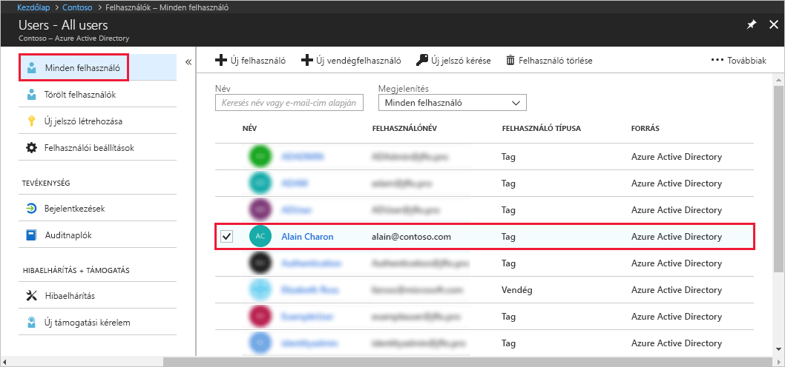
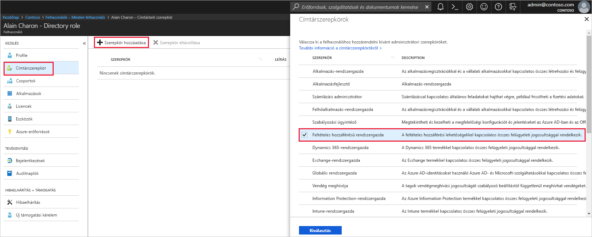

# Felhasználó hozzárendelése rendszergazdai szerepkörökhöz az Azure Active Directory-ban
Ez a cikk azt ismerteti, hogyan rendelhető hozzá egy rendszergazdai szerepkör egy felhasználóhoz az Azure Active Directoryban (Azure AD). További információ új vállalati felhasználók hozzáadásáról: [Új felhasználók felvétele az Azure Active Directoryba](../add-users-azure-active-directory.md). A hozzáadott felhasználók alapértelmezés szerint nem rendelkeznek rendszergazdai engedélyekkel, de bármikor hozzájuk rendelhet szerepköröket.

## Szerepkör hozzárendelése felhasználóhoz
1. Jelentkezzen be az [Azure portálra](https://portal.azure.com) egy olyan fiókkal, amely a címtár globális rendszergazdája vagy kiemelt szerepkörű rendszergazdája.

2. Válassza az **Azure Active Directory** lehetőséget, a **Felhasználók** elemet, majd válasszon ki egy felhasználót.

    

3. A kijelölt felhasználónál válassza a **Címtárbeli szerepkör**, majd a **Szerepkör hozzáadása** elemet, és válassza ki a megfelelő rendszergazdai szerepköröket (például **Feltételes hozzáférésű rendszergazda**) a **Címtárbeli szerepkörök** listából. A rendszergazdai szerepkörökről további információt a [Rendszergazdai szerepkörök hozzárendelése az Azure AD-ben](../users-groups-roles/directory-assign-admin-roles.md) című témakörben talál. 

    

1. A mentéshez válassza a **Kiválasztás** lehetőséget.

## További lépések
* [Rövid útmutató: Felhasználók hozzáadása vagy törlése az Azure Active Directoryban](add-users-azure-active-directory.md)
* [Felhasználói profilok kezelése](active-directory-users-profile-azure-portal.md)
* [Vendégfelhasználók hozzáadása másik címtárból](../b2b/what-is-b2b.md) 
* [Felhasználó hozzárendelése egy szerepkörhöz az Azure AD-ben](active-directory-users-assign-role-azure-portal.md)
* [Törölt felhasználó visszaállítása](active-directory-users-restore.md)
