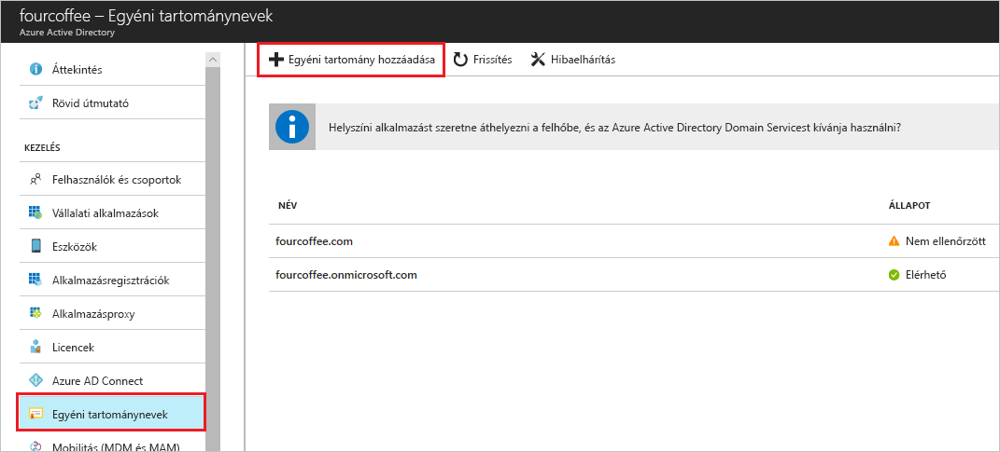

# Útmutató: az Azure Active Directory portál használatával egyéni tartománynév hozzáadása
Minden új Azure AD-bérlőt egy kezdeti tartománynevet tartalmaz *domainname*. onmicrosoft.com. Nem módosítható, és a kezdeti tartománynév törlése, de a szervezet neveket adhat hozzá a listában. Egyéni tartománynevek hozzáadása segítségével hozhat létre, amely számára is felismerhetők a felhasználók számára, például felhasználóneveket *alain@contoso.com*.

## Előkészületek
Egyéni tartománynév hozzáadása előtt létre kell hoznia a tartománynév a tartományregisztrálónál. Egy akkreditált tartományregisztráló, lásd: [ICANN-Accredited regisztráló szervezetek](https://www.icann.org/registrar-reports/accredited-list.html).

## A címtár létrehozása az Azure ad-ben
A tartománynév kap, miután az első Azure AD-címtár is létrehozhat.

1. Jelentkezzen be a [az Azure portal](https://portal.azure.com/) a címtárhoz, egy olyan fiókkal rendelkező a **tulajdonosa** az előfizetést, és válassza ki a szerepkör **Azure Active Directory**. Előfizetési szerepkörökhöz kapcsolatos további információkért lásd: [klasszikus előfizetés rendszergazdai szerepköröket, az Azure RBAC-szerepkörök és az Azure AD-rendszergazdai szerepköröket](../../role-based-access-control/rbac-and-directory-admin-roles.md#azure-rbac-roles).

    

    >[!TIP]
    > Ha helyszíni Windows Server AD-jét szeretné összevonni az Azure AD-vel, az Azure AD Connect eszköz futtatásakor jelölje be a **Szeretném konfigurálni ezt a tartományt egyszeri bejelentkezéshez a helyi Active Directoryhoz** jelölőnégyzetet a címtárak szinkronizálásához. Emellett a helyszíni címtárral való összevonáshoz kiválasztott tartománynevet is regisztrálnia kell az **Azure AD-tartomány** lépésnél a varázslóban. Megtekintheti, hogyan néz ki ez a lépés a varázslóban [ezekben az útmutatásokban](../hybrid/how-to-connect-install-custom.md#verify-the-azure-ad-domain-selected-for-federation). Ha még nem rendelkezik Azure AD Connect eszközzel, [innen letöltheti](https://go.microsoft.com/fwlink/?LinkId=615771).

2. Az új könyvtár létrehozása a lépéseket követve [hozzon létre egy új bérlőt a szervezetén belül](active-directory-access-create-new-tenant.md#create-a-new-tenant-for-your-organization).

    >[!Important]
    >A személy, aki a bérlőt hoz létre a program automatikusan az adott bérlő globális rendszergazdája. A globális rendszergazdai a bérlőhöz további rendszergazdákat is hozzáadhat.

## Az egyéni tartománynév hozzáadása az Azure ad-ben
Miután létrehozta a címtárban, az egyéni tartománynevet is hozzáadhat.

1. Válassza ki **egyéni tartománynevek**, majd válassza ki **egyéni tartomány hozzáadása**.

    

2. Írja be a szervezet új tartomány nevét, a **egyéni tartománynév** mezőbe (például _contoso.com_), majd válassza ki **tartomány hozzáadása**.

    A nem ellenőrzött tartomány van felvéve, és a **Contoso** lap jelenik meg, amelyen látható a DNS-adatok.

    >[!Important]
    >Szerepelnie kell .com, .net vagy egyéb legfelső szintű kiterjesztés ennek megfelelően működjön.

    

4. A DNS-adatok másolása a **Contoso** lapot. Ha például az MS = ms64983159.

    

## A DNS-adatokat hozzáadni a tartományregisztráló
Az egyéni tartománynév hozzáadása az Azure ad-hez, után térjen vissza a tartományregisztrálónál, és adja hozzá az Azure AD DNS-információkat a másolt TXT-fájlból. Létrehozás a txt típusú rekordot a tartományra vonatkozóan "ellenőrzi a" a tartománynév tulajdonjogát.

-  Lépjen vissza a tartományregisztrálónál, hozzon létre egy új txt típusú rekordot, a tartomány alapján a másolt DNS-adatokat, állítsa a **TTL** (élő az idő) és 60 perc, majd mentse az adatokat.

    >[!Important]
    >A kívánt számú tartománynevek regisztrálhat. Azonban minden egyes tartományhoz lekérdezi a saját txt típusú rekordot az Azure ad-ből. Ügyeljen arra, hogy a txt típusú fájl adatait, a tartományregisztráló megadásakor. Ha nem a megfelelő adja meg, vagy véletlenül ismétlődő információt, kell Várjon, amíg a TTL időtúllépés (60 perc), mielőtt újra próbálkozhat.

## Az egyéni tartománynév ellenőrzése
Miután regisztrálta az egyéni tartománynevet, meg kell róla, hogy érvényes Azure AD-ben. Az Azure ad-hez a tartományregisztrálónál propagálása azonnali vagy is igénybe vehet néhány napra, attól függően, a tartományregisztrálónál.

### Az egyéni tartománynév ellenőrzése
1. A címtár eléréséhez globális rendszergazdai fiókkal jelentkezzen be az [Azure portálra](https://portal.azure.com/).

2. Válassza ki **Azure Active Directory**, majd válassza ki **egyéni tartománynevek**.

3. Az a **Fabrikam – egyéni tartománynevek** lapra, jelölje be az egyéni tartománynév **Contoso**.

    

4. Az a **Contoso** lapon jelölje be **ellenőrizze** , hogy az egyéni tartomány megfelelően regisztrálva van, és érvényes Azure AD-hez.

    

## Gyakori hitelesítési hibák
- Ha az Azure AD nem képes egyéni tartománynév ellenőrzésére, próbálkozzon a következőkkel:
    - **Várjon legalább egy órát, és próbálkozzon újra**. DNS-rekordokat kell propagálása előtt az Azure AD ellenőrizni tudja a tartományt, és ez a folyamat egy vagy több óráig tarthat.

    - **Győződjön meg arról, hogy a DNS-rekord helyességéről.** Lépjen vissza a tartomány nevét regisztráló helyre, és ellenőrizze, hogy a bejegyzés létezik, és, hogy megegyezik-e a DNS-bejegyzés adatait az Azure AD által támogatott.

    Ha nem frissíti a rekordot a regisztrálójánál helyen, egy olyan személlyel, amely rendelkezik a megfelelő engedélyekkel a bejegyzést, és győződjön meg arról, pontosan meg kell osztania a bejegyzést.

- **Ellenőrizze, hogy a tartománynév már nem használt egy másik címtárban.** A tartománynév csak egy címtárban, ami azt jelenti, hogy a tartománynév jelenleg ellenőrizve van egy másik címtárban, ha azt nem is lehet ellenőrizni az új címtárban ellenőrizhető. Duplikáció a probléma elhárításához törölnie kell az a tartomány nevét a régi könyvtárból. További információ a tartománynevek törléséről: [egyéni tartománynevek kezelése](../users-groups-roles/domains-manage.md).

- **Ellenőrizze, hogy nem kell minden olyan nem felügyelt Power BI-bérlők.** Ha a felhasználók önkiszolgáló regisztráció a Power bi-ban aktiválták és létrehozott egy nem felügyelt bérlőt a szervezetén belül, meg kell átveszi belső vagy külső rendszergazdaként PowerShell használatával. Egy nem felügyelt könyvtár átvétele kapcsolatos további tudnivalókért lásd: [rendszergazdaként az Azure Active Directoryban egy nem felügyelt könyvtár átvétele](../users-groups-roles/domains-admin-takeover.md).

## További lépések

- Egy másik globális rendszergazda hozzáadása a címtárhoz. További információkért lásd: [szerepkörök és a Rendszergazdák hozzárendelése](active-directory-users-assign-role-azure-portal.md)

- Felhasználók hozzáadása a tartományhoz, lásd: [hozzáadása vagy a felhasználók törlése](add-users-azure-active-directory.md)

- Kezelheti a tartomány nevét adatait az Azure ad-ben. További információkért lásd: [egyéni tartománynevek kezelése](../users-groups-roles/domains-manage.md)

- Ha rendelkezik a helyszíni verzióját, amelyet szeretne használhatja az Azure Active Directory mellett, a Windows Server [a helyszíni címtárak integrálása az Azure Active Directory](../connect/active-directory-aadconnect.md).
