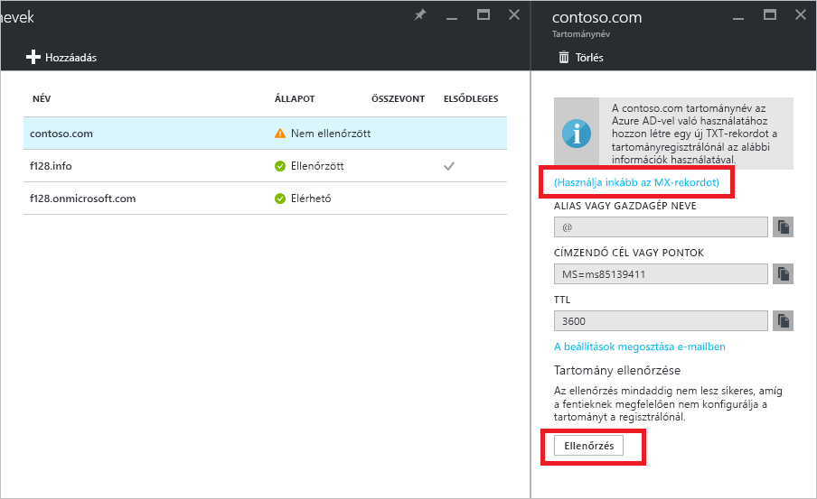

# Rövid útmutató: Egyéni tartománynév hozzáadása az Azure Active Directoryhoz

Minden Azure AD-címtár a következő formátumú kezdeti tartománynévvel rendelkezik: *tartománynév*.onmicrosoft.com. A kezdeti tartománynév nem módosítható vagy törölhető, azonban a vállalati tartománynevet is felveheti az Azure AD-be. Előfordulhat például, hogy a vállalat más tartományneveket is használ, valamint olyan felhasználókkal is rendelkezik, akik a vállalati tartománynévvel jelentkeznek be. Ha egyéni tartományneveket vesz fel az Azure AD-be, olyan felhasználóneveket rendelhet a címtárhoz, amelyek a felhasználók számára is felismerhetők (például „alice@contoso.com.” az „alice@*tartománynév*.onmicrosoft.com” helyett). A folyamat egyszerűen végrehajtható:

1. Az egyéni tartománynév hozzáadása a címtárhoz
2. Vegye fel a DNS-bejegyzést a tartománynévhez a tartománynév-regisztrálónál
3. Az egyéni tartománynév ellenőrzése az Azure AD-ben

## Az egyéni tartománynév hozzáadása a címtárhoz
1. Jelentkezzen be az [Azure Portalra](https://aad.portal.azure.com/#blade/Microsoft_AAD_IAM/ActiveDirectoryMenuBlade/Overview) egy olyan fiókkal, amely a címtár globális rendszergazdája.
2. A bal oldalon válassza az **Egyéni tartománynevek** elemet.
3. Válassza az **Egyéni tartomány hozzáadása** lehetőséget.
   
   
5. Az **Egyéni tartománynevek** szakaszban adja meg az egyéni tartomány nevét a megfelelő mezőben (például: „contoso.com”), majd válassza a **Tartomány hozzáadása** lehetőséget. A névben mindenképpen szerepeljen a .com, a .net vagy egyéb legfelső szintű kiterjesztés.
6. A ***tartománynév*** panelen (a panel címe az Ön új tartományneve), gyűjtse össze a DNS-bejegyzés adatait az egyéni tartománynév későbbi ellenőrzéséhez az Azure AD-ben.
   
   

> [!TIP]
> Ha helyszíni Windows Server AD-jét szeretné összevonni az Azure AD-vel, az Azure AD Connect eszköz futtatásakor jelölje be a **Szeretném konfigurálni ezt a tartományt egyszeri bejelentkezéshez a helyi Active Directoryhoz** jelölőnégyzetet a címtárak szinkronizálásához. Emellett a helyszíni címtárral való összevonáshoz kiválasztott tartománynevet is regisztrálnia kell az **Azure AD-tartomány** lépésnél a varázslóban. Megtekintheti, hogyan néz ki ez a lépés a varázslóban [ezekben az útmutatásokban](./../connect/active-directory-aadconnect-get-started-custom.md#verify-the-azure-ad-domain-selected-for-federation). Ha még nem rendelkezik Azure AD Connect eszközzel, [innen letöltheti](http://go.microsoft.com/fwlink/?LinkId=615771).

## Vegye fel a DNS-bejegyzést a tartománynévhez a tartománynév-regisztrálónál
A következő lépés az egyéni tartománynév Azure AD-vel történő használatához a tartomány DNS-zónafájljának frissítése. Ezt követően az Azure AD ellenőrzi, hogy az adott tartománynév valóban a vállalat tulajdonában van-e. Használhatja az [Azure DNS-t](https://docs.microsoft.com/azure/dns/dns-getstarted-portal) az Azure/Office 365/külső DNS-rekordjaihoz az Azure-ban, vagy hozzáadhatja a DNS-bejegyzést [egy másik DNS-regisztrálóhoz](https://support.office.com/article/Create-DNS-records-for-Office-365-when-you-manage-your-DNS-records-b0f3fdca-8a80-4e8e-9ef3-61e8a2a9ab23/).

1. Jelentkezzen be a tartomány tartománynév-regisztrálójába. Ha nem rendelkezik hozzáféréssel a DNS-bejegyzés frissítéséhez, kérjen meg egy olyan személyt vagy csapatot, amely rendelkezik a 2. lépés végrehajtásához szükséges hozzáféréssel, és értesíti, amikor a frissítés befejeződött.
2. Frissítse a tartomány DNS-zónafájlját az Azure AD által rendelkezésre bocsátott DNS-bejegyzés hozzáadásával. A DNS-bejegyzés semmilyen értelemben nem módosítja a rendszer viselkedését, például a levélkezelési útválasztást vagy a webes üzemeltetést sem.

## Az egyéni tartománynév ellenőrzése az Azure AD-ben
A DNS-bejegyzés hozzáadását követően készen áll a tartománynév Azure AD-vel történő ellenőrzésére. A tartománynév csak azután ellenőrizhető, hogy a DNS-rekordok propagálása megtörtént. Ez a propagálás általában csak másodperceket vesz igénybe, de néha egy vagy több óráig is eltarthat. Ha az ellenőrzés nem sikerül első alkalommal, próbálkozzon újra később.

1. Jelentkezzen be az [Azure AD-be](https://aad.portal.azure.com/#blade/Microsoft_AAD_IAM/ActiveDirectoryMenuBlade/Overview) egy olyan fiókkal, amely a bérlő globális rendszergazdája.
2. Válassza az **Egyéni tartománynevek** elemet.
3. Jelölje ki a még nem ellenőrzött tartománynevet, amelyet ellenőrizni szeretne.
4. Tekintse át a bejegyzéseket, és válassza az **Ellenőrzés** lehetőséget az ellenőrzés befejezéséhez.

Mostantól [hozzá tud rendelni egyéni tartománynevet tartalmazó felhasználóneveket](../users-groups-roles/domains-manage.md). Felhőalapú felhasználói fiókokat hozhat létre, vagy frissítheti a korábban szinkronizált helyszíni felhasználói fiók adatait az egyéni tartománynév használatával. Emellett módosíthatja a szinkronizált felhasználói fiók tartományi utótagját a [Microsoft PowerShell](https://msdn.microsoft.com/library/azure/e1ef403f-3347-4409-8f46-d72dafa116e0#BKMK_ManageDomains) vagy a [Graph API](https://msdn.microsoft.com/Library/Azure/Ad/Graph/api/domains-operations) segítségével.

> [!TIP]
> Legfeljebb 900 felügyelt tartománynév felvételére van lehetőség. Ha minden tartományt a helyszínen szeretne összevonni az Active Directoryval, akkor címtáranként legfeljebb 450 felügyelt tartománynév felvételére van lehetőség. További információk: [Összevont és felügyelt tartománynevek](https://docs.microsoft.com/azure/active-directory/active-directory-add-domain-concepts#federated-and-managed-domain-names).

## Hibaelhárítás
Ha nem sikerül ellenőriznie egy egyéni tartománynevet, próbálkozzon a következő hibaelhárítási lépésekkel:

1. **Várjon egy órát**. A DNS-rekordokat propagálni kell, mielőtt az Azure AD ellenőrizni tudja a tartományt. A folyamat egy óráig vagy tovább is tarthat.
2. **Győződjön meg róla, hogy a DNS-rekord helyesen lett megadva**. Hajtsa végre ezt a lépést a tartomány tartománynév-regisztrációs webhelyén. Az Azure AD nem tudja ellenőrizni a tartománynevet, ha: 
  * A DNS-bejegyzés nem szerepel a DNS-zónafájlban.
  * Nem egyezik pontosan azzal a DNS-bejegyzéssel, amelyet az Azure AD adott meg. 
  
  Ha nincs hozzáférése a tartomány DNS-rekordjainak frissítéséhez a tartománynév-regisztrálónál, ossza meg a DNS-bejegyzést egy ilyen engedélyekkel rendelkező személlyel vagy csapattal, majd kérje a DNS-bejegyzés hozzáadását.
3. **Tartománynév törlése egy Azure AD-ben található másik címtárból**. A tartománynév csak egyetlen címtárban ellenőrizhető. Ha a tartománynév jelenleg ellenőrizve van egy másik címtárban, az új címtárban az ellenőrzése addig nem végezhető el, amíg nem törli a másikból. Információ a tartománynevek törléséről: [Egyéni tartománynevek kezelése](../users-groups-roles/domains-manage.md).    

Minden egyes tartománynév hozzáadásához ismételje meg a jelen cikkben ismertetett lépéseket.

## Részletek
[Egyéni tartománynevek fogalmi áttekintése az Azure AD-ben](../users-groups-roles/domains-manage.md)

[Egyéni tartománynevek kezelése](../users-groups-roles/domains-manage.md)

## További lépések
Ebben a rövid útmutatóban megismerhette, hogyan vehet fel egyéni tartományt az Azure AD-ben. 

Az alábbi hivatkozásra kattintva felvehet egy új egyéni tartományt az Azure AD-ben az Azure Portal használatával.

> [!div class="nextstepaction"]
> [Egyéni tartomány hozzáadása](https://aad.portal.azure.com/#blade/Microsoft_AAD_IAM/ActiveDirectoryMenuBlade/QuickStart) 