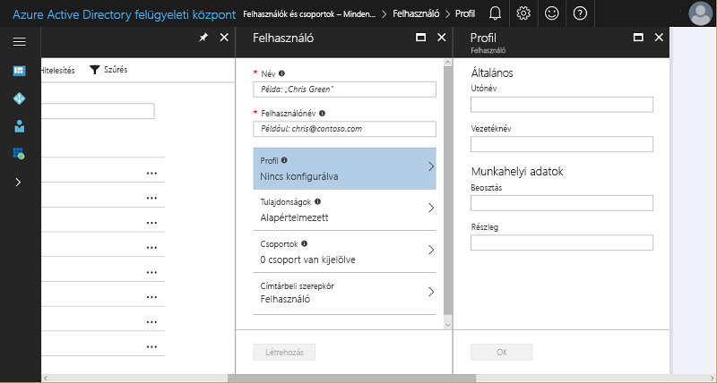
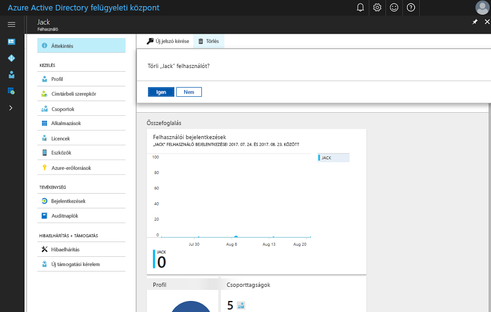

# Rövid útmutató: Új felhasználók hozzáadása az Azure Active Directoryhoz
Ez a cikk azt ismerteti, hogyan törölhet vagy adhat hozzá felhasználókat cége Azure Active Directory-bérlőjéhez (Azure AD-bérlő) az Azure Portal használatával, illetve a saját helyszíni Windows Server AD felhasználói fiókadatainak szinkronizálásával. 

## Felhőalapú felhasználók hozzáadása
1. Jelentkezzen be az [Azure Active Directory felügyeleti központba](https://aad.portal.azure.com) egy olyan fiókkal, amely a címtár globális rendszergazdája.
2. Válassza az **Azure Active Directory**, majd a **Felhasználók és csoportok** elemet.
3. A **Felhasználók és csoportok** területen válassza a **Minden felhasználó**, majd az **Új felhasználó** lehetőséget.
   
4. Adja meg a felhasználó adatait (például **Név** és **Felhasználónév**). A felhasználónév tartománynév részének a kezdeti alapértelmezett tartománynévnek („[tartománynév].onmicrosoft.com”), vagy egy ellenőrzött, nem összevont [egyéni tartománynévnek](add-custom-domain.md) kell lennie (pl. „contoso.com”).
5. Másolja a vágólapra vagy egyéb módon jegyezze fel a létrehozott jelszót, hogy megadhassa azt a felhasználónak a folyamat befejezése után.
6. Az adatokat a felhasználóhoz tartozó **Profil**, **Csoportok**, vagy **Címtárbeli szerepkör** területeken is megadhatja. A felhasználói és rendszergazdai szerepkörökről további információért lásd: [Rendszergazdai szerepkörök hozzárendelése az Azure AD-ben](../users-groups-roles/directory-assign-admin-roles.md).
7. A **Felhasználó** területen válassza a **Létrehozás** elemet.
8. Küldje el a létrehozott jelszót biztonságosan az új felhasználónak, hogy az be tudjon vele jelentkezni.

> [!TIP]
> Emellett a helyszíni Windows Server AD-ról is szinkronizálhatja a felhasználói adatokat. A Microsoft identitáskezelési megoldásai kiterjednek a helyszíni és felhőalapú képességekre is, így egyetlen felhasználói identitás jön létre hitelesítés és engedélyezés céljából az összes erőforráshoz, helytől függetlenül. Ezt hibrid identitásnak nevezzük. Az [Azure AD Connect](https://docs.microsoft.com/azure/active-directory/connect/active-directory-aadconnect) használatával integrálhatja a helyszíni címtárakat az Azure Active Directoryval a hibrid identitáskezelési forgatókönyvek esetében. Így közös identitást biztosíthat a felhasználóinak az Azure AD-vel integrált Office 365-, Azure- és SaaS-alkalmazásokhoz. 

## Felhasználók törlése az Azure AD-ből
1. Jelentkezzen be az [Azure Active Directory felügyeleti központba](https://aad.portal.azure.com) egy olyan fiókkal, amely a címtár globális rendszergazdája.
2. Válassza a **Felhasználók és csoportok** elemet.
3. A **Felhasználók és csoportok** panelen válassza ki a törölni kívánt felhasználót. 
4. A kiválasztott felhasználó paneljén válassza az **Áttekintés** elemet, majd a parancssávon válassza ki a **Törlés** parancsot.
   

### Részletek 
* [Vendégfelhasználók hozzáadása másik címtárból](../b2b/what-is-b2b.md) 
* [Felhasználó hozzárendelése egy szerepkörhöz az Azure AD-ben](active-directory-users-assign-role-azure-portal.md)
* [Felhasználói profilok kezelése](active-directory-users-profile-azure-portal.md)
* [Törölt felhasználó visszaállítása](active-directory-users-restore.md)

## További lépések
Ebben a rövid útmutatóban megismerhette, hogyan adhat hozzá új felhasználót az Azure AD Premiumhoz. 

Az alábbi hivatkozásra kattintva létrehozhat egy új felhasználót az Azure AD-ben az Azure Portal használatával.

>[!div class="nextstepaction"]
>[Felhasználók hozzáadása az Azure AD-hez](https://aad.portal.azure.com/#blade/Microsoft_AAD_IAM/UserManagementMenuBlade/)