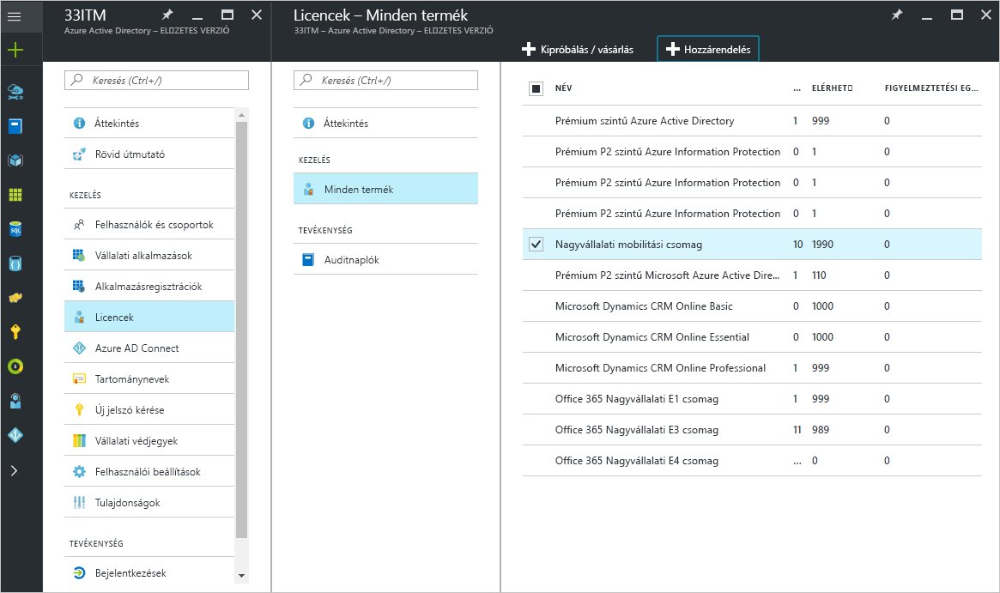
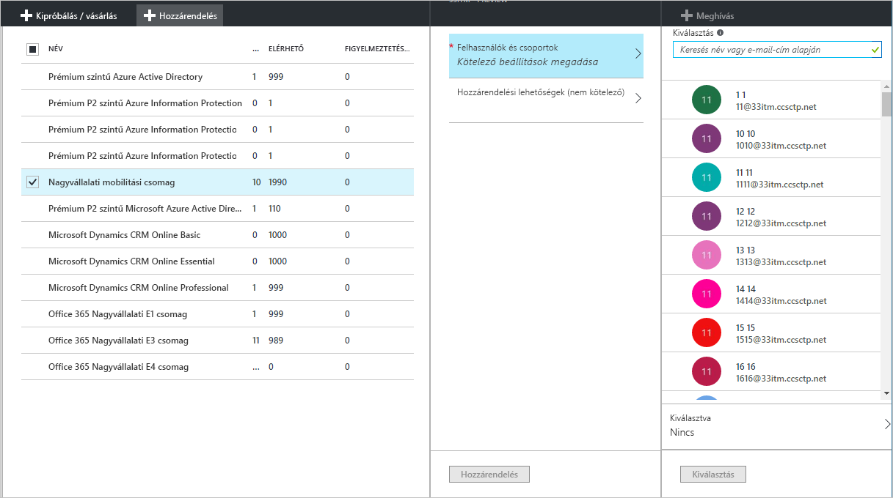
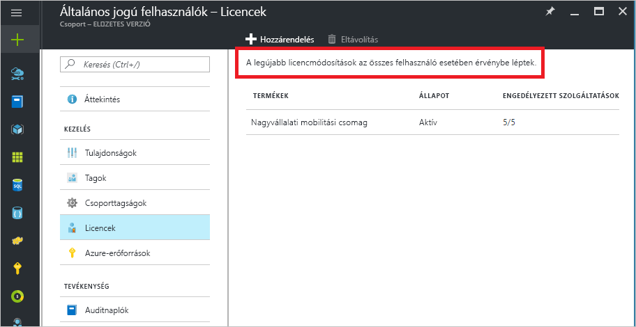
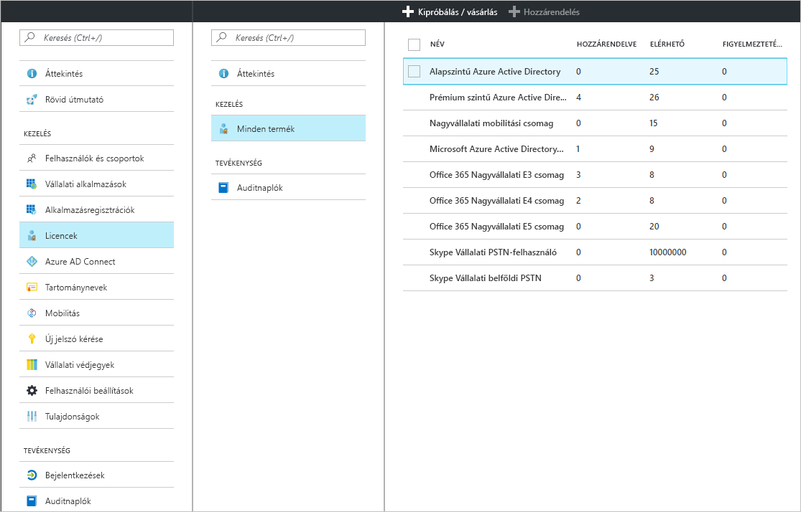
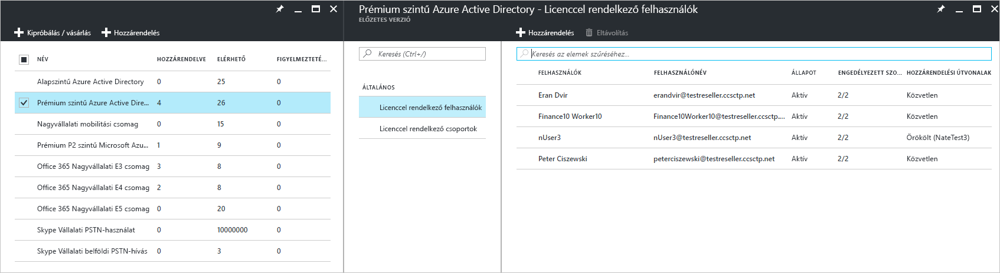

# Gyors útmutató: Felhasználók licencelése az Azure Active Directoryban
A licencalapú Azure AD-szolgáltatások az Azure-bérlőn belüli Azure Active Directory- (Azure AD-) előfizetés aktiválásával működnek. Az előfizetés aktiválását követően a szolgáltatások képességeit az Azure AD-rendszergazdák kezelhetik, és a licenccel rendelkező felhasználók használhatják. Az Enterprise Mobility + Security, a prémium szintű Azure AD vagy az alapszintű Azure AD megvásárlása esetén a rendszer frissíti a bérlőt az előfizetéssel, beleértve az érvényességi időszakot és az előre kifizetett licenceket is. Az előfizetéssel kapcsolatos információkat, beleértve a hozzárendelt és a rendelkezésre álló licencek számát, az Azure Portal **Azure Active Directory** részén tekintheti meg a **Licencek** csempe megnyitásával. Emellett a **Licencek** panelről kezelheti legkönnyebben a licenc-hozzárendeléseket is.

A fizetős képességek konfigurálásához mindössze egy előfizetést kell beszereznie, azonban a fizetős Azure AD-funkciókhoz ennek ellenére is hozzá kell rendelnie felhasználói licenceket. Minden olyan felhasználóhoz hozzá kell rendelnie egy licencet, akinek hozzáférésre van szüksége egy fizetős Azure AD-funkcióhoz, vagy akit ezzel a funkcióval kíván kezelni. A licenc-hozzárendelés egy felhasználó és egy megvásárolt szolgáltatás, például a prémium szintű Azure AD, az alapszintű Azure AD vagy az Enterprise Mobility + Security közötti leképezés.

[Csoportalapú licenc-hozzárendeléssel](active-directory-licensing-whatis-azure-portal.md) a következőkhöz hasonló szabályokat állíthat be:
* A címtár összes felhasználója automatikusan kap egy licencet.
* Mindenki, aki megfelelő beosztással rendelkezik, kap egy licencet.
* A döntést delegálhatja is a vállalat más vezetői számára ([önkiszolgáló csoportok](../users-groups-roles/groups-self-service-management.md) használatával).

> [!TIP]
> A csoportokhoz való licenc-hozzárendelés részletes ismertetését, beleértve a speciális forgatókönyveket és az Office 365 licencelési forgatókönyveit a [licencek az Azure Active Directoryban csoporttagság alapján való felhasználókhoz rendelését](../users-groups-roles/licensing-groups-assign.md) ismertető témakörben olvashatja.

## Licencek hozzárendelése felhasználókhoz és csoportokhoz
Egy aktív előfizetés használatával először saját magához rendeljen egy licencet, majd a böngésző frissítésével ellenőrizze, hogy az előfizetésben szereplő összes funkció látható-e. A következő lépés licencek hozzárendelése azokhoz a felhasználókhoz, akiknek hozzáférésre van szükségük a fizetős Azure AD-funkciókhoz. A licencek hozzárendelésének egy egyszerű módja a licencek felhasználói csoportokhoz való hozzárendelése egyes személyek helyett. Amikor licenceket rendel egy csoporthoz, mindegyik csoporttaghoz hozzárendel egy licencet. Ha felhasználókat ad a csoporthoz vagy távolít el abból, automatikusan megtörténik a megfelelő licencek hozzárendelése vagy eltávolítása. 

> [!NOTE]
> Nem minden Microsoft-szolgáltatás érhető el minden területen. Egy felhasználóhoz csak úgy lehet licencet rendelni, ha a rendszergazda megadja a felhasználó **Felhasználás helye** tulajdonságát. A tulajdonság az Azure Portal **Felhasználó** &gt; **Profil** &gt; **Beállítások** lapján adható meg. Ha csoporthoz rendel licenceket, azon felhasználók, akiknek a felhasználási helye nem lett megadva, a címtár helyét öröklik.

Licenc hozzárendeléséhez válasszon ki legalább egy terméket az **Azure Active Directory** &gt; **Licencek** &gt; **Minden termék** lapon, majd válassza a parancssáv **Hozzárendelés** elemét.

A **Felhasználók és csoportok** panelen választhat ki több felhasználót vagy csoportot, illetve tilthat le szolgáltatáscsomagokat a termékben. A lap tetején található keresőmezővel kereshet rá a felhasználó- és csoportnevekre.

Amikor licenceket rendel egy csoporthoz, a csoport méretétől függően némi időbe telhet, amíg minden felhasználó örökli a licencet. A feldolgozás állapotát a **Csoport** panel **Licencek** csempéjének segítségével ellenőrizheti.

Előfordulhatnak hozzárendelési hibák az Azure AD általi licenc-hozzárendelés során, azonban ezek viszonylag ritkák az Azure AD- és Enterprise Mobility + Security-termékek kezelése során. A lehetséges hozzárendelési hibák az alábbiak lehetnek:
- Hozzárendelési ütközés: A felhasználóhoz korábban hozzárendeltek egy licencet, amely nem kompatibilis az aktuális licenccel. Ebben az esetben az új licenc hozzárendeléséhez el kell távolítani az aktuálisat.
- A rendelkezésre álló licencek számának túllépése: Ha a hozzárendelt csoportokban található felhasználók száma túllépi a rendelkezésre álló licencek számát, a felhasználó hozzárendelési állapota hiányzó licencek miatti hozzárendelési hibát jelez.

### Az Azure AD B2B-együttműködésének licencelése

A B2B-együttműködés lehetővé teszi vendégfelhasználók meghívását az Azure AD-bérlőbe, így hozzáférés biztosítható számukra az Azure AD-szolgáltatásokhoz és az elérhetővé tett Azure-erőforrásokhoz.  

A B2B-felhasználók meghívása és alkalmazásokhoz való hozzárendelése az Azure AD-ben díjmentes. Vendégfelhasználónként legfeljebb 10 alkalmazás és 3 alapszintű jelentés szintén ingyenes a B2B-együttműködés felhasználói számára. Ha a vendégfelhasználó rendelkezik megfelelő licencekkel a partner Azure AD-bérlőjében, akkor az Ön bérlőjében is rendelkezni fog licenccel.

Ez nem kötelező, ha azonban hozzáférést szeretne biztosítani fizetős Azure AD-funkciókhoz, a B2B-vendégfelhasználókat el kell látni a megfelelő Azure AD-licencekkel. A meghívást kezdeményező, fizetős Azure AD-licenccel rendelkező bérlő a bérlőbe meghívott további öt vendégfelhasználóhoz rendelhet a B2B-együttműködési felhasználói jogosultságokat. Forgatókönyveket és információkat a [B2B-együttműködés licencelési útmutatójában](../b2b/licensing-guidance.md) találhat.

## A hozzárendelt licencek megtekintése

A hozzárendelt és a rendelkezésre álló licencek összegző nézete az **Azure Active Directory** &gt; **Licencek** &gt; **Minden termék** lapon látható.

A hozzárendelt felhasználók és csoportok részletes listája egy adott termék kiválasztásakor válik elérhetővé. A **Licenccel rendelkező felhasználók** listában azok a felhasználók láthatók, akik jelenleg licencet használnak, valamint az, hogy a licenc hozzárendelése a felhasználóhoz közvetlenül történt-e vagy egy csoportból örökölte a felhasználó.

Ehhez hasonlóan a **Licenccel rendelkező csoportok** listában azok a csoportok láthatók, amelyekhez licencek lettek hozzárendelve. Válasszon ki egy felhasználót vagy csoportot a **Licencek** panel megnyitásához, amelyen az adott objektumhoz hozzárendelt összes licenc látható.

## Licenc eltávolítása

Licenc eltávolításához lépjen a felhasználóhoz vagy csoporthoz, majd nyissa meg a **Licencek** csempét. Válassza ki a licencet, majd kattintson az **Eltávolítás** elemre.

A felhasználó által egy csoporttól örökölt licencek nem távolíthatók el közvetlenül. Ekkor a felhasználót kell eltávolítania abból a csoportból, amelyből a licencet örökli.

## További lépések
Ebben a rövid útmutatóban megismerte, hogyan rendelhet hozzá licenceket a felhasználókhoz és csoportokhoz az Azure AD címtárban. 

Az alábbi hivatkozásra kattintva konfigurálhatja az előfizetések licenc-hozzárendelését az Azure AD-ben az Azure Portal segítségével.

> [!div class="nextstepaction"]
> [Azure AD-licencek hozzárendelése](https://aad.portal.azure.com/#blade/Microsoft_AAD_IAM/LicensesMenuBlade/Overview) 