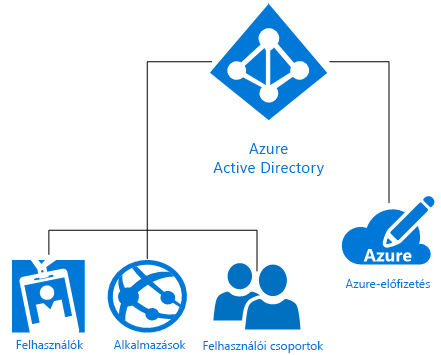

# Mi a Microsoft Azure-identitással?
A Microsoft Azure Active Directory (Azure AD) egy felhőalapú identitás- és hozzáférés-kezelési megoldás, amely címtárszolgáltatásokat, identitáskezelést és alkalmazáshozzáférés-felügyeletet kínál. Az Azure AD lehetővé teszi az [egyszeri bejelentkezést](https://docs.microsoft.com/azure/active-directory/active-directory-enterprise-apps-manage-sso) több ezer előre integrált kereskedelmi és egyéni alkalmazásba, amelyek szerepelnek [az Azure AD alkalmazáskatalógusában](https://azure.microsoft.com/marketplace/active-directory/all/). Ezen alkalmazások között számos olyan van, például az Office 365, a Salesforce.com, a Box, a ServiceNow vagy a Workday, amelyeket Ön valószínűleg már használ.

Az újonnan létrehozott Azure-előfizetésekhez a rendszer automatikusan hozzárendel egy Azure AD-címtárat. Az Azure identitáskezelési szolgáltatásaként ekkor az Azure AD minden identitáskezelési és hozzáférés-vezérlési funkciót biztosít a felhőalapú erőforrásokhoz. Az erőforrások közé tartozhatnak egy bérlő (vállalat) felhasználói, alkalmazásai és csoportjai, ahogyan az a következő ábrán látható:

A Microsoft Azure számos, különböző mértékben összetett módot kínál a szolgáltatott identitási (IDaaS) megoldások használatára az egyes vállalatok igényeinek kielégítéséhez. A cikk további részében megismerkedhet az alapvető Azure-identitáskezelési terminológiával és fogalmakkal, és javaslatokat olvashat az elérhető lehetőségek közül a legjobb kiválasztásához.

## Fontos kifejezések

Mielőtt kiválasztaná a vállalat által használt Azure-identitáskezelési megoldást, fontos megismerkednie az Azure-identitásszolgáltatások kapcsán leggyakrabban használt kifejezésekkel.

|Kifejezés| Leírás|
|-----|-----|
|Azure-előfizetés |Az előfizetések segítségével lehet fizetni az Azure Cloud Servicesért. Az előfizetések általában egy hitelkártyához vannak kapcsolva. Egyszerre több előfizetése is lehet, azonban az erőforrások előfizetések közötti megosztása nehéznek bizonyulhat.|
|Azure-bérlő | Az Azure AD-bérlő egy vállalatot jelöl. Ez az Azure AD dedikált, megbízható példánya, amely automatikusan jön létre, amikor egy vállalat előfizetést regisztrál a Microsoft felhőszolgáltatásaira, például az Azure, az Intune vagy az Office 365 szolgáltatásra. A bérlők a szolgáltatásokhoz egy dedikált környezetben (egyvállalatos) vagy egy más vállalatokkal megosztott (többvállalatos) környezetben kaphatnak hozzáférést.|
|Azure AD-címtár | Minden Azure-bérlő rendelkezik egy dedikált, megbízható Azure AD-címtárral, amely tartalmazza a bérlő felhasználóit, csoportjait és alkalmazásait. Ezt a címtárat használják a bérlői erőforrásokhoz kapcsolódó identitás- és hozzáféréskezelési műveletek. Mivel a Microsoft felhőszolgáltatásaira (például Azure, Microsoft Intune, Office 365) való regisztráció során automatikusan létrejön egy, a vállalatot jelölő egyedi Azure AD-címtár, így a *bérlő*, az *Azure AD* és az *Azure AD-címtár* kifejezések időnként azonos jelentésben szerepelnek. |
|Egyéni tartomány | Amikor első alkalommal regisztrál előfizetést egy Microsoft-felhőszolgáltatásra, a bérlő (vállalat) egy *.onmicrosoft.com* tartománynevet használ. Azonban a legtöbb vállalatnak van egy vagy több saját tartományneve, amelyet az üzleti tevékenységéhez használ, és amelyen keresztül a végfelhasználók hozzáférhetnek a vállalati erőforrásokhoz. Az egyéni tartománynevet hozzáadhatja az Azure AD-hez, hogy a tartománynév a felhasználók számára felismerhető legyen (például *alice@contoso.onmicrosoft.com* helyett *alice@contoso.com*). |
|Azure AD-fiók | Ezek olyan identitások, amelyek az Azure AD-vel vagy egy másik Microsoft-felhőszolgáltatással, például az Office 365-tel lettek létrehozva. Az Azure AD-ben vannak tárolva, és a vállalat bármely felhőszolgáltatásbeli előfizetése által elérhetők. |
|Azure-előfizetés-adminisztrátor| A fiókadminisztrátor az a személy, aki az Azure-előfizetést regisztrálta vagy megvásárolta. Különböző felügyeleti feladatokat végezhet el a [Fiókközpont](https://account.azure.com/Subscriptions) használatával, ilyen például az előfizetések létrehozása, előfizetések lemondása, előfizetések számlázásának módosítása vagy a szolgáltatásadminisztrátor módosítása. |
|Globális Azure AD-rendszergazda | Az Azure AD globális rendszergazdái teljes körű hozzáféréssel rendelkeznek az Azure AD felügyeleti funkcióihoz. Az a személy, aki regisztrál egy előfizetést egy Microsoft-felhőszolgáltatásra, alapértelmezés szerint automatikusan globális rendszergazda lesz. Több globális rendszergazda is lehet, de csak a globális rendszergazdák rendelhetik hozzá a felhasználókhoz [a további adminisztrátori szerepköröket](https://docs.microsoft.com/azure/active-directory/active-directory-assign-admin-roles-azure-portal). |
|Microsoft-fiók | A Microsoft-fiókok (amelyeket Ön hoz létre személyes használatra) hozzáférést biztosítanak a Microsoft végfelhasználói termékeihez és felhőszolgáltatásaihoz, mint az Outlook (Hotmail), a OneDrive, az Xbox LIVE vagy az Office 365. Ezek az identitások a Microsoft felhasználói identitás- és fiókrendszerében lesznek létrehozva és tárolva.|
|Munkahelyi vagy iskolai fiókok | A munkahelyi vagy iskolai fiókok (amelyeket egy rendszergazda hoz létre üzleti vagy oktatási célból) hozzáférést biztosítanak a Microsoft vállalati szintű üzleti felhőszolgáltatásaihoz, mint az Azure, az Intune vagy az Office 365.|

## Fontos fogalmak

Most, hogy tisztában van az Azure alapvető identitáskezelési kifejezéseivel, ismerkedjen meg a következő Azure-identitáskezelési fogalmakkal, amelyek révén megalapozottabb döntéseket hozhat az Azure identitáskezelési szolgáltatásaival kapcsolatban.

|Fogalom |Leírás|
|-----|-----|
|[How Azure subscriptions are associated with Active Directory? (Hogyan kapcsolódnak az Azure-előfizetések az Azure Active Directory-hoz?)](https://docs.microsoft.com/azure/active-directory/active-directory-how-subscriptions-associated-directory) |Minden Azure-előfizetés megbízhatósági kapcsolatban áll egy Azure AD-címtárral a felhasználók, szolgáltatások és eszközök hitelesítéséhez. *Több előfizetés is megbízhat ugyanabban az Azure AD-címtárban, de egy előfizetés csak egyetlen Azure AD-címtárban bízhat meg*. Ez a megbízhatósági kapcsolat nem olyan, mint ami az előfizetés és az Azure többi erőforrása (webhelyek, adatbázisok stb.) között áll fenn, mivel azok inkább az előfizetések gyermekerőforrásainak számítanak. Ha egy előfizetés érvényessége lejár, akkor az előfizetéshez társított erőforrások hozzáférése is megszűnik, kivéve az Azure AD-t. Az Azure AD-címtár azonban elérhető marad az Azure-ban, így más előfizetéseket is társíthat ehhez a címtárhoz, és folytathatja a bérlői erőforrások kezelését.|
|[Az Azure AD licencelésének működése](https://docs.microsoft.com/azure/active-directory/active-directory-licensing-get-started-azure-portal) | A Nagyvállalati mobilitási csomag, a prémium szintű Azure AD vagy az alapszintű Azure AD megvásárlása vagy aktiválása esetén a rendszer frissíti a címtárat az előfizetéssel, beleértve az érvényességi időszakot és az előre kifizetett licenceket is. Az előfizetés aktiválását követően a szolgáltatást az Azure AD globális rendszergazdái kezelhetik, és a licenccel rendelkező felhasználók használhatják. Az előfizetéssel kapcsolatos információkat, beleértve a hozzárendelt és a rendelkezésre álló licencek számát az Azure Portalon, az **Azure Active Directory** > **Licencek** panelen tekintheti meg. Emellett itt kezelheti legkönnyebben a licenc-hozzárendeléseket is.|
|[Szerepköralapú hozzáférés-vezérlés az Azure Portalon](https://docs.microsoft.com/azure/role-based-access-control/overview)|Az Azure szerepköralapú hozzáférés-vezérlés (RBAC) részletesen beállítható hozzáférés-kezelést biztosít az Azure-erőforrásokhoz. A túl sok engedély sebezhetővé teszi a fiókokat a támadókkal szemben. Ha túl kevés az engedély, az korlátozza az alkalmazottakat a hatékony munkavégzésben. Az RBAC használatával pontosan azokat az engedélyeket biztosíthatja az alkalmazottak számára, amelyekre szükségük van három alapvető szerepkör alapján az összes erőforráscsoportra vonatkozóan: tulajdonos, közreműködő, olvasó. Emellett akár 2000 [egyéni RBAC-szerepkört](https://docs.microsoft.com/azure/role-based-access-control/custom-roles) is létrehozhat az igényeinek megfelelően. |
|[Hibrid identitás](https://docs.microsoft.com/azure/active-directory/connect/active-directory-aadconnect)|Hibrid identitás úgy jön létre, ha az [Azure AD Connect](https://docs.microsoft.com/azure/active-directory/connect/active-directory-aadconnect) segítségével integrálja a helyszíni Windows Server Active Directoryt (AD DS-t) az Azure AD-vel. Így közös identitást biztosíthat a felhasználóinak az Azure AD-vel integrált Office 365-, Azure- és helyszíni alkalmazásokhoz vagy SaaS-alkalmazásokhoz. A hibrid identitásokkal gyakorlatilag kiterjesztheti a helyszíni környezetet a felhőbe identitás- és hozzáféréskezelési célból.|

### A Windows Server AD DS és az Azure AD közötti különbségek
Az Azure Active Directory (Azure AD) és a helyszíni Active Directory (az Active Directory Domain Services vagy AD DS) egyaránt olyan rendszerek, amelyek címtáradatokat tárolnak, és kezelik a felhasználók és az erőforrások közötti kommunikációt, beleértve a felhasználói bejelentkezési folyamatokat, a hitelesítést és a címtárkereséseket.

Ha már ismeri a helyszíni Windows Server Active Directory Domain Services (AD DS) működését, amely először a Windows 2000 Serverben mutatkozott be, valószínűleg már tisztában van az identitásszolgáltatás fogalmával. Azonban fontos megérteni azt is, hogy az Azure AD nem csak egyszerűen egy tartományvezérlő a felhőben. Ez egy új módszer szolgáltatott identitások (IDaaS) biztosítására az Azure-ban, amely teljesen új gondolkodásmódot igényel a felhőalapú képességek kihasználásához és a vállalat védelméhez a modern fenyegetésekkel szemben. 

Az AD DS egy kiszolgálói szerepkör a Windows Serveren, ami azt jelenti, hogy üzembe helyezhető fizikai vagy virtuális gépen is. Hierarchiai struktúrával rendelkezik, amelynek alapja az X.500. DNS-t használ az objektumok kereséséhez, az LDAP segítségével kezelhető, és elsősorban Kerberost használ a hitelesítéshez. Az Active Directory lehetővé teszi szervezeti egységek (OU-k) és csoportházirend-objektumok (GPO-k) használatát is a gépek tartományhoz való csatlakoztatása mellett. A tartományok között megbízhatósági kapcsolatok jönnek létre.

Az informatikai részlegek évek óta az AD DS-sel védik biztonsági határaikat, azonban a modern, határok nélküli vállalatoknak új vezérlősíkra van szükségük az alkalmazottak, ügyfelek és partnerek identitáskezelési igényeinek teljesítéséhez. Az Azure AD ez az identitáskezelési vezérlősík. A biztonsági technológiák a vállalati tűzfalon kívülre, a felhőbe kerültek át, ahol az Azure AD megvédi a vállalati erőforrásokat és hozzáféréseket azáltal, hogy egy közös identitást biztosít a felhasználók számára (a helyszínen vagy a felhőben). Ez rugalmasságot biztosít a felhasználók számára, hogy biztonságosan elérhessék a szükséges alkalmazásokat, és szinte bármilyen eszközről elvégezhessék a munkájukat. Emellett zökkenőmentesen használható, kockázatalapú adatvédelmi vezérlők is elérhetők, amelyek gépi tanulási funkciókra és részletes jelentéskészítési funkciókra épülnek, és segítenek abban, hogy az informatikai részleg biztosíthassa a vállalati adatok védelmét.

Az Azure AD egy több ügyfelet kiszolgáló nyilvános címtárszolgáltatás, ami azt jelenti, hogy az Azure AD-n belül létrehozhat egy bérlőt a felhőbeli kiszolgálóihoz és az alkalmazásaihoz, például az Office 365-höz. A felhasználók és csoportok egy lapos struktúrában jönnek létre szervezeti egységek és csoportházirend-objektumok nélkül. A hitelesítés olyan protokollokkal zajlik, mint az SAML, a WS-Federation és az OAuth. Az Azure AD-ben lehet lekérdezéseket végezni, de ehhez az LDAP használata helyett az AD Graph API nevű REST API-t kell használni. Ezek mindegyike működik HTTP-n és HTTPS-en keresztül.

### Az Office 365 felügyeleti és biztonsági funkcióinak bővítése
Már az Office 365-öt használja? Felgyorsíthatja digitális átállását, és kibővítheti az Office 365 beépített funkcióit az Azure AD-vel, így biztonságban tudhatja minden erőforrását, és hatékonyabbá teheti alkalmazottai munkáját. Ha az Office 365 képességei mellett az Azure AD-t is használja, a teljes alkalmazásportfóliója számára védelmet nyújthat egyetlen identitás használatával, amely lehetővé teszi az egyszeri bejelentkezést az összes alkalmazáshoz. Bővítheti a feltételes hozzáférési lehetőségeket, hogy azok ne csak az eszköz állapota alapján, hanem felhasználó, hely, alkalmazás és kockázat alapján is működjenek. Szükség esetén a többtényezős hitelesítés (MFA) még nagyobb biztonságot nyújt. Emellett hatékonyabban felügyelheti a felhasználói jogosultságokat, és igény szerinti rendszergazdai hozzáférést biztosíthat. A felhasználók hatékonyabban végezhetik a munkájukat, és kevesebb ügyfélszolgálati támogatási jegyet kell létrehozniuk az Azure AD olyan önkiszolgáló funkcióinak köszönhetően, mint az elfelejtett jelszavak alaphelyzetbe állítása, az alkalmazás-hozzáférési kérelmek és a csoportok létrehozása és kezelése.

> [!TIP]
> Többet szeretne megtudni arról, hogyan használható az Office 365-ben az Azure AD-alapú identitáskezelés? [Olvassa el az e-könyvet](https://info.microsoft.com/Extend-Office-365-security-with-EMS.html).

## Microsoft Azure identitáskezelési megoldások

A Microsoft Azure több lehetőséget is kínál a felhasználók identitásainak kezelésére, függetlenül attól, hogy azok kezelése teljes mértékben a helyszínen, kizárólag a felhőben vagy vegyesen történik. Ezek a lehetőségek a következők: önkiszolgáló AD DS az Azure-ban, Azure Active Directory (Azure AD), hibrid identitás és Azure AD Domain Services.

### Önkiszolgáló AD DS
Ha a vállalatnak csak kevés felhőbeli erőforrásra van szüksége, az Azure-beli **önkiszolgáló AD DS** a megoldás. Ez a lehetőség számos olyan Windows Server AD DS-forgatókönyvet támogat, amelyek kiválóan alkalmasak Azure-beli virtuális gépekként való üzembe helyezésre. Például létrehozhat egy Azure-beli virtuális gépet tartományvezérlőként, amely egy távoli adatközpontban fut, és a távoli hálózathoz csatlakozik. A virtuális gép támogatja a távoli felhasználóktól érkező hitelesítési kérelmeket, és növeli a hitelesítési teljesítményt. Ez a lehetőség jól használható egy egyébként költséges vészhelyreállítási hely viszonylag kis költségű alternatívájaként néhány tartományvezérlő és egy virtuális hálózat az Azure-ban történő üzemeltetésével. Végül lehetséges, hogy telepíteni kell az Azure-ban egy alkalmazást, például a SharePointot, amelynek szüksége van a Windows Server AD DS-re, de nem függ a helyszíni hálózattól vagy a vállalati Windows Server Active Directorytól. Ebben az esetben üzembe helyezhet egy elszigetelt erdőt az Azure-ban a SharePoint-kiszolgálófarm követelményeinek megfelelően. Olyan hálózati alkalmazások is üzembe helyezhetők, amelyeknek szükségük van a helyszíni hálózattal és a helyszíni Active Directoryval való kapcsolatra.

### Azure Active Directory (Azure AD)
Az **önálló Azure AD** egy teljes mértékben felhőalapú, szolgáltatott identitás- és hozzáférés-kezelési (IDaaS) megoldás. Az Azure AD számos lehetőséget nyújt felhasználók és csoportok kezeléséhez. Biztonságosabbá teszi a hozzáférést a helyszíni és a felhőbeli alkalmazásokhoz, többek között a Microsoft webszolgáltatásaihoz, például az Office 365-höz, illetve számos más, nem Microsoft SaaS-alkalmazáshoz. Az Azure AD háromféle kiadásban érhető el: ingyenes, alapszintű és prémium. Az Azure AD jelentősen megnöveli a vállalat hatékonyságát, és a biztonsági megoldásokat kiterjeszti a szegélyhálózati tűzfalon túlra, egy új vezérlősíkra, amelyet az Azure Machine Learning és egyéb fejlett biztonsági funkciók védenek.

### Hibrid identitás
Ahelyett, hogy választanának a helyszíni és a felhőalapú identitáskezelési megoldások között, egyre több haladó szellemű vállalkozás és informatikai igazgató dönt úgy a vállalat hosszú távú fejlődésének irányát szem előtt tartva, hogy a helyszíni címtáraikat kiterjesztik a felhőbe **hibrid identitási** megoldásokkal. A hibrid identitás egy olyan, valóban globális identitás- és hozzáférés-kezelési megoldás, amely biztonságos és hatékony hozzáférést biztosít a felhasználók munkavégzéséhez szükséges alkalmazásokhoz.

> [!TIP]
> Ha többet szeretne megtudni arról, hogyan vált az Azure Active Directory az informatikai igazgatók stratégiájának központi elemévé, töltse le [az Azure Active Directoryhoz készült informatikai igazgatói útmutatót](https://aka.ms/AzureADCIOGuide).

### Azure AD Domain Services
Az **Azure AD Domain Services** felhőalapú megoldást nyújt az egyszerű Azure-beli virtuális gépek AD DS segítségével történő konfigurálásához, és lehetővé teszi a hálózati alkalmazások fejlesztését és tesztelését a helyszíni identitáskezelési követelményeknek megfelelő módon. Az Azure AD Domain Services nem azt a célt szolgálja, hogy a helyszíni AD DS-infrastruktúra áthelyezhető legyen az Azure AD Domain Services által felügyelt Azure-beli virtuális gépekre. Ehelyett a felügyelt tartományokban található Azure-beli virtuális gépek akkor használandók, ha helyszíni alkalmazások fejlesztéséhez, teszteléséhez és áthelyezéséhez szükség van a felhőbeli AD DS-hitelesítési módszerekre.

## Gyakori forgatókönyvek és javaslatok

Íme néhány gyakori identitás- és hozzáféréskezelési helyzet, és az azokhoz ajánlott Azure-identitáskezelési lehetőség.

|Identitáskezelési forgatókönyv| Ajánlás|
|-----|-----|
|A vállalat jelentős befektetéseket eszközölt egy helyszíni Windows Server Active Directoryba, de szeretnénk az identitáskezelést kiterjeszteni a felhőbe.| A leggyakrabban használt Azure-identitáskezelési megoldás a [hibrid identitás](https://docs.microsoft.com/azure/active-directory/active-directory-hybrid-identity-design-considerations-overview). Ha már befektetett a helyszíni AD DS-be, könnyedén kiterjesztheti az identitáskezelést a felhőbe az Azure AD Connect használatával.|
|A vállalkozásom a felhőben indult, és nincsenek helyszíni identitáskezelési megoldásokkal kapcsolatos befektetéseink.| Az [Azure Active Directory](https://docs.microsoft.com/azure/active-directory/active-directory-whatis) a legjobb választás a kizárólag a felhőben működő, helyszíni befektetésekkel nem rendelkező vállalkozások számára.|
|Egyszerű Azure-beli virtuális gép konfigurálási és vezérlési megoldásra van szükségem a helyszíni identitáskezelési követelmények teljesítéséhez alkalmazások fejlesztése és tesztelése céljából.|Az [Azure AD Domain Services](https://docs.microsoft.com/azure/active-directory-domain-services/active-directory-ds-overview) jó választás, ha az egyszerű Azure VM-konfiguráláshoz és -vezérléshez az AD DS-t szeretné használni, vagy ha örökölt, címtárfüggő, helyszíni alkalmazásokat szeretne fejleszteni vagy a felhőbe migrálni.|  
|Szükségem van néhány Azure-beli virtuális gépre, de a vállalat továbbra is jelentős befektetéssel rendelkezik a helyszíni Active Directory (AD DS) terén.|Használjon [önkiszolgáló AD DS-t](https://docs.microsoft.com/azure/active-directory-domain-services/active-directory-ds-comparison#do-it-yourself-diy-ad-deployment-options) az Azure-beli virtuális gépekhez, ha csak néhány virtuális gépre van szüksége, és jelentős helyszíni AD DS-befektetései vannak. |

## Hol találhatok további információkat?
Rengeteg hasznos forrásanyagunk található online, amelyekből mindent megtudhat az Azure AD-ről. Íme néhány cikk kiindulásként:

* [Címtár hibrid kezelésének engedélyezése az Azure AD Connect segítségével](../hybrid/whatis-hybrid-identity.md)
* [Még nagyobb biztonság a mai hálózati kapcsolatokkal átszőtt világban](../authentication/multi-factor-authentication.md)
* [Felhasználók átadásának és megszüntetésének automatizálása a SaaS-alkalmazásokban az Azure Active Directoryval](../manage-apps/user-provisioning.md)
* [Jelszavak kezelése tetszőleges helyről](../user-help/active-directory-passwords-update-your-own-password.md)
* [Mi az az alkalmazás-hozzáférés és az egyszeri bejelentkezés az Azure Active Directoryval?](../manage-apps/what-is-single-sign-on.md)
* [Felhasználók átadásának és megszüntetésének automatizálása a SaaS-alkalmazásokban az Azure Active Directoryval](../manage-apps/user-provisioning.md)
* [Helyszíni alkalmazások biztonságos távoli elérése](../manage-apps/application-proxy.md)
* [Erőforráshozzáférés-kezelés Azure Active Directory-csoportokkal](active-directory-manage-groups.md)
* [Mi az a Microsoft Azure Active Directory-licencelés?](active-directory-licensing-whatis-azure-portal.md)
* [Hogyan deríthetem fel a vállalatban használt nem engedélyezett felhőalkalmazásokat?](../manage-apps/cloud-app-discovery.md)

## További lépések

Most, hogy megismerkedett az Azure identitáskezelési fogalmaival és az elérhető lehetőségekkel, a következő forrásanyagok segítségével implementálhatja a kiválasztott megoldást:

[További tudnivalók az Azure hibrid identitáskezelési megoldásairól](https://docs.microsoft.com/azure/active-directory/choose-hybrid-identity-solution)

[További információk Azure megvalósíthatósági próba (PoC) környezetben](https://aka.ms/aad-poc)
