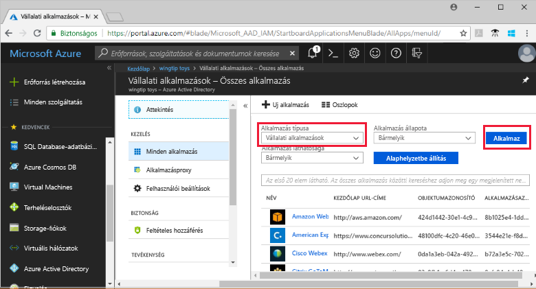
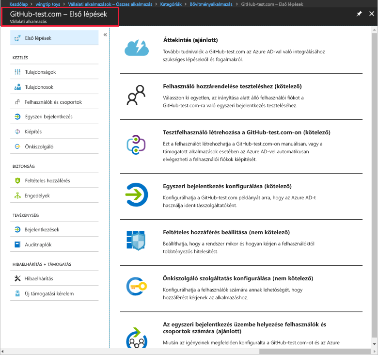

# Rövid útmutató: Alkalmazás hozzáadása az Azure Active Directory-bérlőhöz

Az Azure Active Directory (Azure AD) rendelkezik egy katalógussal, amely több ezer előre integrált alkalmazást tartalmaz. A vállalat által használt alkalmazások egy része valószínűleg megtalálható a katalógusban. Ebben a rövid útmutatóban egy katalógusbeli alkalmazást adhat hozzá az Azure Portalon az Azure Active Directory- (Azure AD-) bérlőhöz. 
 
Miután hozzáadta az alkalmazást az Azure AD-bérlőhöz, a következőket teheti:

- Az alkalmazáshoz való felhasználói hozzáférés kezelése feltételes hozzáférési szabályzattal.
- Felhasználók konfigurálása az alkalmazásba való egyszeri bejelentkezésre az Azure AD-fiókkal.

## Előkészületek

Ahhoz, hogy hozzáadhasson egy alkalmazást a bérlőhöz, a következőkre van szüksége:

- Azure AD-előfizetés
- Az egyszeri bejelentkezés használatára képes előfizetés az alkalmazáshoz

Jelentkezzen be az [Azure Portalra](https://portal.azure.com) az Azure AD-bérlő globális rendszergazdájaként, felhőalkalmazás- vagy alkalmazás-rendszergazdaként.

Javasoljuk, hogy az oktatóanyag lépéseinek teszteléséhez ne éles környezetet használjon. Ha nem rendelkezik nem éles Azure AD-környezettel, szerezze be az [egy hónapos próbaverziót](https://azure.microsoft.com/pricing/free-trial/).

## Alkalmazás hozzáadása az Azure AD-bérlőhöz

Katalógusbeli alkalmazás hozzáadása az Azure AD-bérlőhöz:

1. Az [Azure Portal](https://portal.azure.com) bal oldali navigációs paneljén kattintson az **Azure Active Directory** elemre. 

2. Az **Azure Active Directory** panelen kattintson a **Vállalati alkalmazások** elemre. 

    

3. Megnyílik a **Minden alkalmazás** panel, amely az Azure AD-bérlőn található alkalmazások véletlenszerű mintáját mutatja. 

    

4. Kattintson az **Új alkalmazás** gombra a **Minden alkalmazás** panel felső részén.

    

5. A katalógusbeli alkalmazások listájának megtekintésének legegyszerűbb módja, ha a **Kategóriák** elemet használja, mivel a **Kiemelt alkalmazások** alatti ikonok véletlenszerű katalógusbeli alkalmazásokhoz tartoznak. 

    

    További alkalmazások megjelenítéséhez kattintson a **Továbbiak betöltése** elemre. Nem javasoljuk, hogy ezzel a módszerrel keressen, mivel több ezer alkalmazás található a katalógusban.

6. Egy adott alkalmazás kereséséhez a **Hozzáadás a katalógusból** elemnél adja meg a hozzáadni kívánt alkalmazás nevét. Válassza ki az alkalmazást a találatok közül, és kattintson a **Hozzáadás** gombra. Az alábbi példában az az **alkalmazás-hozzáadási** űrlap látható, amely a GitHub.com keresése után jelenik meg.

    

6. Az alkalmazásspecifikus űrlapon módosíthatja a tulajdonságokat. Például szerkesztheti az alkalmazás nevét, hogy az megfeleljen a vállalat igényeinek. Ebben a példában a **GitHub-test** nevet használjuk.

8. Ha befejezte a tulajdonságok módosítását, kattintson a **Hozzáadás** gombra.

9. Megjelenik az első lépések lap, amelyen a beállításokkal konfigurálhatja az alkalmazást a vállalat számára. 

    

Befejezte az alkalmazás hozzáadását. Nyugodtan tartson szünetet.  A következő szakaszokban megtudhatja, hogyan módosíthatja az alkalmazás emblémáját és szerkesztheti az alkalmazás egyéb tulajdonságait.

## Azure AD-bérlői alkalmazás megkeresése

Tegyük fel, hogy időközben valamiért el kellett mennie, és most folytatja az alkalmazás konfigurálását. Először is keresse meg az alkalmazást.

1. Az **[Azure Portal](https://portal.azure.com)** bal oldali navigációs paneljén kattintson az **Azure Active Directory** elemre. 

2. Az Azure Active Directory panelen kattintson a **Vállalati alkalmazások** elemre. 

3. Az **Alkalmazás típusa** legördülő listából válassza a **Minden alkalmazás** lehetőséget, majd kattintson az **Alkalmaz** gombra. A megtekintési lehetőségekről további információkat a [bérlői alkalmazások megtekintését](view-applications-portal.md) ismertető cikkben olvashat.

4. Most az Azure AD-bérlőn található összes alkalmazás listáját látja.  A lista egy véletlenszerű minta. További alkalmazások megjelenítéséhez kattintson a **Továbbiak betöltése** elemre akár többször is. 

5. Egy adott alkalmazás gyors megkereséséhez a bérlőn írja be az alkalmazás nevét a keresőmezőbe, és kattintson az **Alkalmaz** gombra. Ebben a példában a korábban hozzáadott GitHub-test alkalmazást keressük meg.

    

## Felhasználó bejelentkezési tulajdonságainak konfigurálása

Most, hogy megkereste az alkalmazást, nyissa meg, és konfigurálja az alkalmazás tulajdonságait.

Az alkalmazás tulajdonságainak szerkesztése

1. Kattintson az alkalmazásra a megnyitásához.
2. Kattintson a **Tulajdonságok** gombra a tulajdonságpanel szerkesztéshez való megnyitásához.

    

3. Szánjon egy kis időt a bejelentkezési beállítások megismerésére. Az **Engedélyezett a felhasználók számára a bejelentkezés**, a **Felhasználó-hozzárendelés szükséges** és a **Felhasználók számára látható** beállítás határozza meg, hogy az alkalmazáshoz hozzárendelt vagy nem hozzárendelt felhasználók bejelentkezhetnek-e.  Emellett ezek azt is meghatározzák, hogy a felhasználó láthatja-e az alkalmazást a hozzáférési panelen. 

    - Az **Engedélyezett a felhasználók számára a bejelentkezés** meghatározza, hogy az alkalmazáshoz hozzárendelt felhasználók bejelentkezhetnek-e.
    - A **Felhasználó-hozzárendelés szükséges** meghatározza, hogy az alkalmazáshoz nem hozzárendelt felhasználók bejelentkezhetnek-e.
    - A **Felhasználók számára látható** meghatározza, hogy az alkalmazáshoz hozzárendelt felhasználók láthatják-e az alkalmazást a hozzáférési panelen és az O365 indítójában. 

4. A következő táblázatok segítségével kiválaszthatja az igényeinek legjobban megfelelő beállításokat. 

     - Működés **hozzárendelt** felhasználók esetében:

       | Alkalmazás tulajdonságainak beállításai | | | Felhasználói élmény – hozzárendelt felhasználók | |
       |---|---|---|---|---|
       | Engedélyezett a felhasználók számára a bejelentkezés? | Felhasználó-hozzárendelés szükséges? | Felhasználók számára látható? | Bejelentkezhetnek a hozzárendelt felhasználók? | Látható az alkalmazás a hozzárendelt felhasználók számára?* |
       | igen | igen | igen | igen | igen  |
       | igen | igen | nem  | igen | nem   |
       | igen | nem  | igen | igen | igen  |
       | igen | nem  | nem  | igen | nem   |
       | nem  | igen | igen | nem  | nem   |
       | nem  | igen | nem  | nem  | nem   |
       | nem  | nem  | igen | nem  | nem   |
       | nem  | nem  | nem  | nem  | nem   |

     - Működés **nem hozzárendelt** felhasználók esetében:
  
       | Alkalmazás tulajdonságainak beállításai | | | Felhasználói élmény – nem hozzárendelt felhasználók | |
       |---|---|---|---|---|
       | Engedélyezett a felhasználók számára a bejelentkezés? | Felhasználó-hozzárendelés szükséges? | Felhasználók számára látható? | Bejelentkezhetnek a nem hozzárendelt felhasználók? | Látható az alkalmazás a nem hozzárendelt felhasználók számára?* |
       | igen | igen | igen | nem  | nem   |
       | igen | igen | nem  | nem  | nem   |
       | igen | nem  | igen | igen | nem   |
       | igen | nem  | nem  | igen | nem   |
       | nem  | igen | igen | nem  | nem   |
       | nem  | igen | nem  | nem  | nem   |
       | nem  | nem  | igen | nem  | nem   |
       | nem  | nem  | nem  | nem  | nem   |

    *Látható az alkalmazás a felhasználó számára a hozzáférési panelen és az Office 365 alkalmazás indítójában?

## Egyéni embléma használata

Egyéni embléma használata:

1. Hozzon létre egy emblémát, amelynek mérete 215 × 215 képpont, és mentse PNG formátumban.
2. Mivel már megkereste az alkalmazást, kattintson rá.
2. A bal oldali panelen kattintson a **Tulajdonságok** lehetőségre.
4. Töltse fel az emblémát.
5. Amikor végzett, kattintson a **Mentés** gombra.

    

## További lépések

Ebben a rövid útmutatóban megismerhette, hogyan adhat hozzá katalógusbeli alkalmazást az Azure AD-bérlőhöz. Emellett azt is megtanulta, hogyan szerkesztheti egy alkalmazás tulajdonságait. 

Most már készen áll arra, hogy konfigurálja az alkalmazást egyszeri bejelentkezésre. 

> [!div class="nextstepaction"]
> [Egyszeri bejelentkezés konfigurálása](configure-single-sign-on-portal.md)

