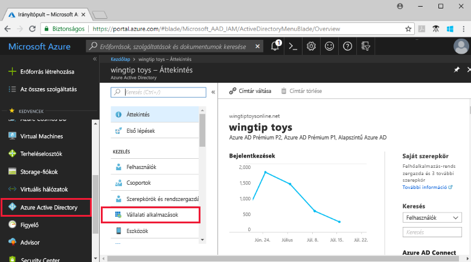
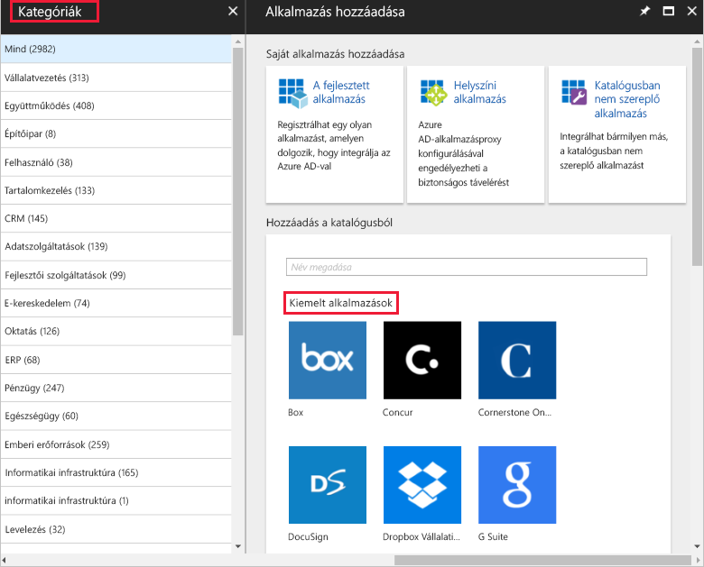
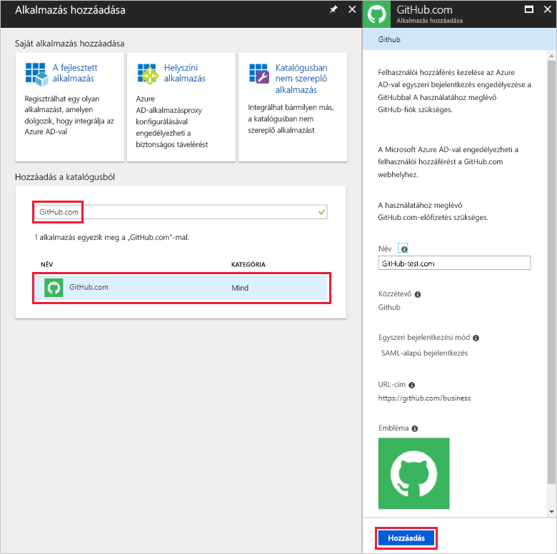
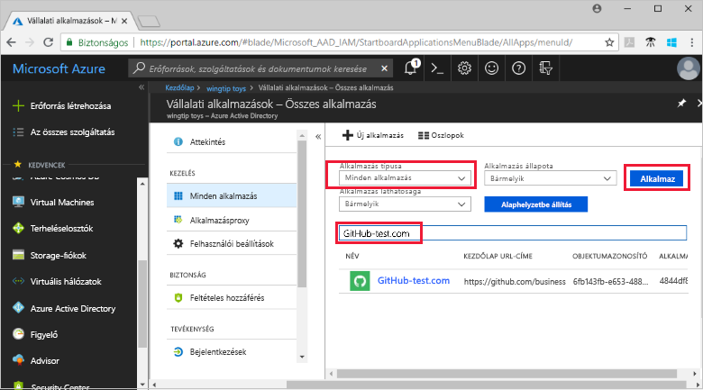
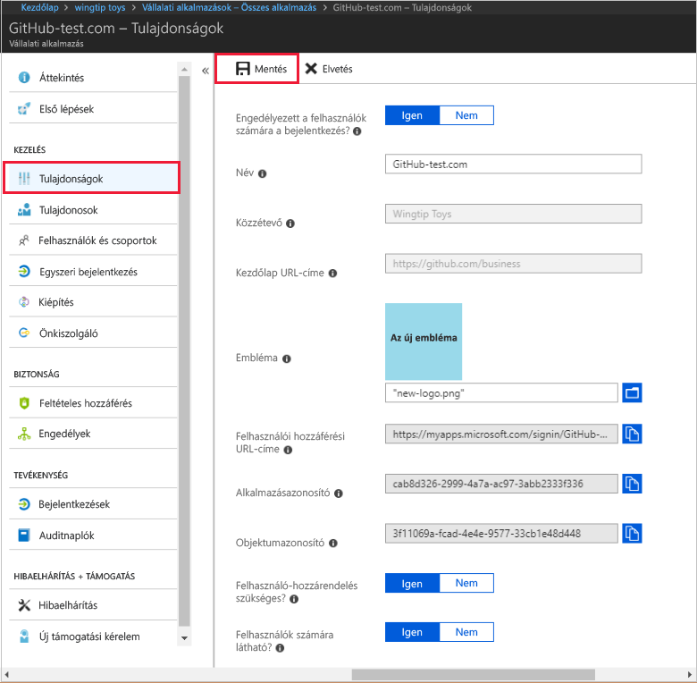
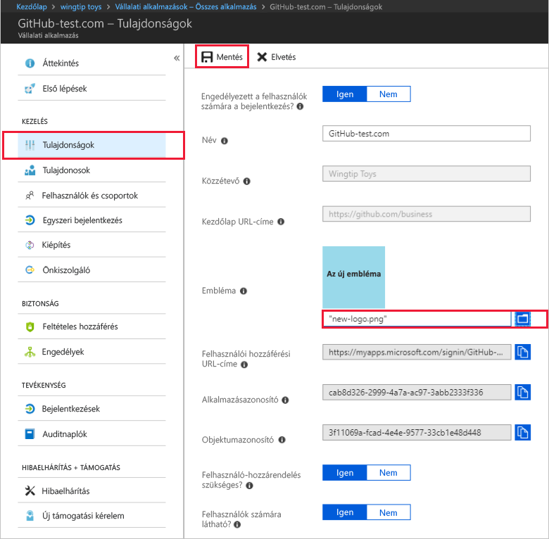

# Gyors útmutató: Az Azure Active Directory-bérlőhöz alkalmazás hozzáadása

Az Azure Active Directory (Azure AD) rendelkezik egy katalógussal, amely több ezer előre integrált alkalmazást tartalmaz. A vállalat által használt alkalmazások egy része valószínűleg megtalálható a katalógusban. Ebben a rövid útmutatóban egy katalógusbeli alkalmazást adhat hozzá az Azure Portalon az Azure Active Directory- (Azure AD-) bérlőhöz.

Miután hozzáadta az alkalmazást az Azure AD-bérlőhöz, a következőket teheti:

- Az alkalmazáshoz való felhasználói hozzáférés kezelése feltételes hozzáférési szabályzattal.
- Felhasználók konfigurálása az alkalmazásba való egyszeri bejelentkezésre az Azure AD-fiókkal.

## Előkészületek

Ahhoz, hogy hozzáadhasson egy alkalmazást a bérlőhöz, a következőkre van szüksége:

- Azure AD-előfizetés
- Az egyszeri bejelentkezés használatára képes előfizetés az alkalmazáshoz

Jelentkezzen be az [Azure Portalra](https://portal.azure.com) az Azure AD-bérlő globális rendszergazdájaként, felhőalkalmazás- vagy alkalmazás-rendszergazdaként.

Javasoljuk, hogy az oktatóanyag lépéseinek teszteléséhez ne éles környezetet használjon. Ha nem rendelkezik nem éles Azure AD-környezettel, szerezze be az [egy hónapos próbaverziót](https://azure.microsoft.com/pricing/free-trial/).

## Alkalmazás hozzáadása az Azure AD-bérlőhöz

Katalógusbeli alkalmazás hozzáadása az Azure AD-bérlőhöz:

1. Az a [az Azure portal](https://portal.azure.com), válassza a bal oldali navigációs panelen, **Azure Active Directory**.

1. Az a **Azure Active Directory** ablaktáblán válassza előbb **vállalati alkalmazások**.

    

1. A **minden alkalmazás** panel megnyílik egy véletlenszerűen vett minta az alkalmazások megjelenítése az Azure AD-bérlőben. Válassza ki **új alkalmazás** felső részén a **minden alkalmazás** ablaktáblán.

    

1. Az a **kategóriák** ablaktáblán ikonok mellett láthatja a **kiemelt alkalmazások** területet, amely egy véletlenszerűen vett minta katalógus alkalmazások vannak.  További alkalmazások megtekintéséhez kiválaszthatja **Továbbiak megjelenítése**. De nem ajánlott, hogy ezzel a módszerrel keresése, mivel több ezer, a katalógusban található alkalmazáshoz.

    

1. Egy alkalmazáshoz, a Keresés **Hozzáadás a katalógusból**, írja be a hozzáadni kívánt alkalmazás nevét. Válassza ki az alkalmazást az eredményeket, és válassza ki a **Hozzáadás**. A következő példa bemutatja a **alkalmazás hozzáadása** keresése a github.com után megjelenő képernyőn.

    

1. Az alkalmazásspecifikus űrlapon módosíthatja a tulajdonságokat. Például szerkesztheti az alkalmazás nevét, hogy az megfeleljen a vállalat igényeinek. Ebben a példában a **GitHub-test** nevet használjuk.

1. Amikor végzett a tulajdonságok módosítása, válassza ki a **Hozzáadás**.

1. Megjelenik az első lépések lap, amelyen a beállításokkal konfigurálhatja az alkalmazást a vállalat számára.

Befejezte az alkalmazás. Nyugodtan tartson szünetet. A következő szakaszokban megtudhatja, hogyan módosíthatja az alkalmazás emblémáját és szerkesztheti az alkalmazás egyéb tulajdonságait.

## Azure AD-bérlői alkalmazás megkeresése

Tegyük fel, hogy időközben valamiért el kellett mennie, és most folytatja az alkalmazás konfigurálását. Az első teendő, keresse meg az alkalmazást.

1. Az a  **[az Azure portal](https://portal.azure.com)**, válassza a bal oldali navigációs panelen, **Azure Active Directory**.

1. Az a **Azure Active Directory** ablaktáblán válassza előbb **vállalati alkalmazások**.

1. Az a **alkalmazástípus** legördülő menüjében válassza **minden alkalmazás**, majd válassza ki **alkalmaz**. A megtekintési lehetőségekről további információkat a [bérlői alkalmazások megtekintését](view-applications-portal.md) ismertető cikkben olvashat.

1. Most az Azure AD-bérlőn található összes alkalmazás listáját látja. A lista egy véletlenszerű minta. További alkalmazások megtekintéséhez válasszon **Továbbiak megjelenítése** egy vagy több alkalommal.

1. Egy alkalmazás megtalálhatja a saját bérlőjében, adja meg az alkalmazás nevét a keresőmezőbe, és válassza **alkalmaz**. Ebben a példában a GitHub-tesztelési kérelem korábban hozzáadott keresi meg.

    

## Felhasználó bejelentkezési tulajdonságainak konfigurálása

Most, hogy az alkalmazás talált, nyissa meg, és konfigurálja az alkalmazás tulajdonságait.

Alkalmazás tulajdonságainak szerkesztése:

1. Válassza ki az alkalmazás megnyitásához.
1. Válassza ki **tulajdonságok** , nyissa meg szerkesztésre a Tulajdonságok panelen.

    

1. Szánjon egy kis időt a bejelentkezési beállítások megismerésére. A beállítások határozzák meg, hogyan a hozzárendelt és az alkalmazáshoz hozzá nem rendelt felhasználók számára az alkalmazás be tud jelentkezni. És a beállítások határozzák meg is, ha a felhasználó láthatja-e az alkalmazás a hozzáférési panelen.

    - Az **Engedélyezett a felhasználók számára a bejelentkezés** meghatározza, hogy az alkalmazáshoz hozzárendelt felhasználók bejelentkezhetnek-e.
    - **Felhasználó-hozzárendelés szükséges** határozza meg, hogy az alkalmazás nem rendelt felhasználók jelentkezhetnek be.
    - A **Felhasználók számára látható** meghatározza, hogy az alkalmazáshoz hozzárendelt felhasználók láthatják-e az alkalmazást a hozzáférési panelen és az O365 indítójában.

1. Az alábbi táblázatok segítségével kiválaszthatja az igényeinek a legjobb lehetőségeket.

   - Működés **hozzárendelt** felhasználók esetében:

       | Alkalmazás tulajdonságainak beállításai | | | Felhasználói élmény – hozzárendelt felhasználók | |
       |---|---|---|---|---|
       | Engedélyezett a felhasználók számára a bejelentkezés? | Felhasználó-hozzárendelés szükséges? | Felhasználók számára látható? | Bejelentkezhetnek a hozzárendelt felhasználók? | Látható az alkalmazás a hozzárendelt felhasználók számára?* |
       | igen | igen | igen | igen | igen  |
       | igen | igen | nem  | igen | nem   |
       | igen | nem  | igen | igen | igen  |
       | igen | nem  | nem  | igen | nem   |
       | nem  | igen | igen | nem  | nem   |
       | nem  | igen | nem  | nem  | nem   |
       | nem  | nem  | igen | nem  | nem   |
       | nem  | nem  | nem  | nem  | nem   |

   - Működés **nem hozzárendelt** felhasználók esetében:

       | Alkalmazás tulajdonságainak beállításai | | | Felhasználói élmény – nem hozzárendelt felhasználók | |
       |---|---|---|---|---|
       | Engedélyezett a felhasználók számára a bejelentkezés? | Felhasználó-hozzárendelés szükséges? | Felhasználók számára látható? | Bejelentkezhetnek a nem hozzárendelt felhasználók? | Látható az alkalmazás a nem hozzárendelt felhasználók számára?* |
       | igen | igen | igen | nem  | nem   |
       | igen | igen | nem  | nem  | nem   |
       | igen | nem  | igen | igen | nem   |
       | igen | nem  | nem  | igen | nem   |
       | nem  | igen | igen | nem  | nem   |
       | nem  | igen | nem  | nem  | nem   |
       | nem  | nem  | igen | nem  | nem   |
       | nem  | nem  | nem  | nem  | nem   |

     *Látható az alkalmazás a felhasználó számára a hozzáférési panelen és az Office 365 alkalmazás indítójában?

## Egyéni embléma használata

Egyéni embléma használata:

1. Hozzon létre egy emblémát, amelynek mérete 215 × 215 képpont, és mentse PNG formátumban.
1. Mivel az alkalmazás már talált, válassza ki az alkalmazást.
1. A bal oldali panelen válassza ki a **tulajdonságok**.
1. Töltse fel az emblémát.
1. Ha elkészült, válassza ki a **mentése**.

    

## További lépések

Ebben a rövid útmutatóban megismerhette, hogyan adhat hozzá katalógusbeli alkalmazást az Azure AD-bérlőhöz. Megtanulta, hogyan szerkesztheti egy alkalmazás tulajdonságait.

Most már készen áll arra, hogy konfigurálja az alkalmazást egyszeri bejelentkezésre.

> [!div class="nextstepaction"]
> [Egyszeri bejelentkezés konfigurálása](configure-single-sign-on-portal.md)

