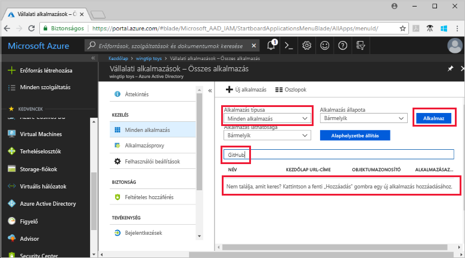
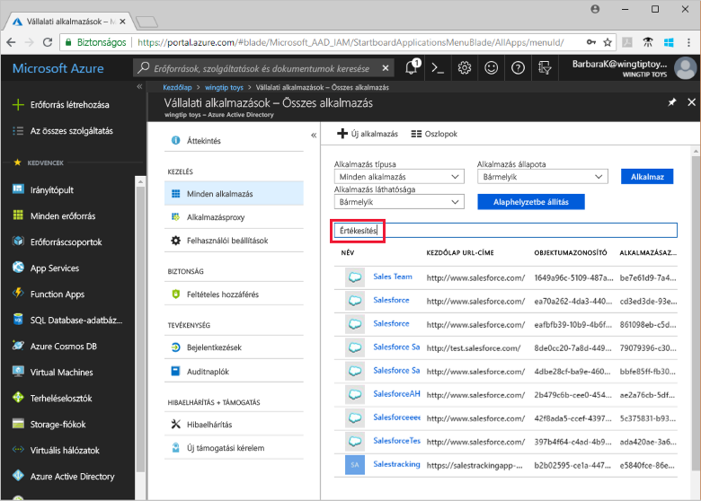

# Azure Active Directory-bérlői alkalmazások megtekintése

Ebben a rövid útmutatóban az Azure Portal használatával tekintheti meg az Azure Active Directory- (Azure AD-) bérlő alkalmazásait.

## Előkészületek

Az eredmények megtekintéséhez legalább egy alkalmazásnak lennie kell az Azure AD-bérlőn. Az alkalmazás hozzáadásának lépéseit lásd az [Alkalmazás hozzáadása](add-application-portal.md) rövid útmutatóban.

Jelentkezzen be az [Azure Portalra](https://portal.azure.com) az Azure AD-bérlő globális rendszergazdájaként, felhőalkalmazás- vagy alkalmazás-rendszergazdaként.

## A bérlői alkalmazások listájának megkeresése

Az Azure AD-bérlői alkalmazások az Azure Portal **Vállalati alkalmazások** szakaszában tekinthetők meg.

A bérlői alkalmazások megkeresésének lépései:

1. Az a  **[az Azure portal](https://portal.azure.com)**, válassza a bal oldali navigációs panelen, **Azure Active Directory**. 

1. Az a **Azure Active Directory** ablaktáblán válassza előbb **vállalati alkalmazások**. 

1. A a **alkalmazástípus** legördülő menüjében válassza **minden alkalmazás**, és válassza a **alkalmaz**. Ekkor egy véletlenszerűen kiválasztott minta jelenik meg a bérlői alkalmazásokból.
   
1. További alkalmazások megtekintéséhez jelölje ki **Továbbiak betöltése** a lista alján. A bérlői alkalmazások számától függően a listában való görgetés helyett hasznosabbnak bizonyulhat [az adott alkalmazás megkeresése](#search-for-a-tenant-application).

## Megtekintési beállítások kiválasztása

Válassza ki a beállítások szerint, amit keres.

1. Megtekintheti, hogy az alkalmazások által **alkalmazástípus**, **Alkalmazásállapot**, és **alkalmazás láthatósága**. 

1. Az **Alkalmazás típusa** területen az alábbi beállítások egyikét választhatja ki:

    - **Vállalati alkalmazások** – a nem a Microsoft által fejlesztett alkalmazások megjelenítése.
    - **Microsoft-alkalmazások** – a Microsoft által fejlesztett alkalmazások megjelenítése.
    - **Minden alkalmazás** – a nem a Microsoft által fejlesztett alkalmazások és a Microsoft-alkalmazások együttes megjelenítése.

1. Az **Alkalmazás állapota** területen a **Bármely**, **Letiltva** vagy **Engedélyezve** lehetőségek közül választhat. A **Bármely** beállítás magában foglalja a letiltott és az engedélyezett alkalmazásokat is.

1. Az **Alkalmazás láthatósága** területen a **Bármely** vagy a **Rejtett** lehetőségek közül választhat. A **rejtett** beállítást választja, megjelenik az alkalmazásokat, amelyek a bérlőbe, de nem látható a felhasználók számára.

1. Miután kiválasztotta a kívánt beállításokat, válassza ki a **alkalmaz**.
 

## Bérlői alkalmazás keresése

Egy adott alkalmazás keresése:

1. Az a **alkalmazástípus** menüjében válassza **minden alkalmazás**, és válassza a **alkalmaz**.

1. Adja meg a megkeresni kívánt alkalmazás nevét. Ha az alkalmazás az Azure AD-bérlő van adva, megjelenik a keresési eredmények között. Ez a példa bemutatja, hogy a GitHub még nem sikerült hozzáadni a bérlő alkalmazásokhoz.

    

1. Próbálkozzon az alkalmazásnév első néhány betűjének beírásával. Ebben a példában az összes olyan alkalmazás látható, amelyek neve a **Sales** sztringgel kezdődik.

    

## További lépések

Ebből a gyors útmutatóból megtudhatta, hogyan az alkalmazások megtekintéséhez az Azure AD-bérlővel. Megtudhatta, hogyan az alkalmazások által alkalmazástípus, állapotát és látható-e a lista szűréséhez. Emellett azt is megtanulta, hogyan kereshet meg egy adott alkalmazást.

Most, hogy az alkalmazás talált, keresnek a továbbra is [adja hozzá a bérlő több alkalmazás](add-application-portal.md). Másik lehetőségként kiválaszthatja, hogy az alkalmazás megtekintéséhez vagy módosításához a tulajdonságok és a konfigurációs beállításokat. Konfigurálhat például egyszeri bejelentkezést. 

> [!div class="nextstepaction"]
> [Egyszeri bejelentkezés konfigurálása](configure-single-sign-on-portal.md)

