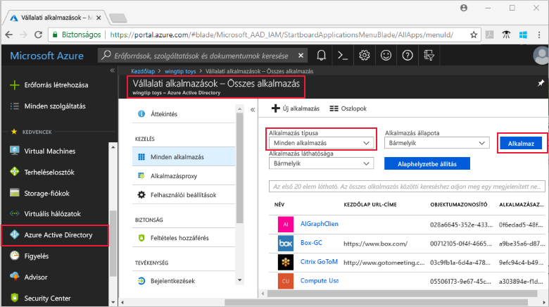
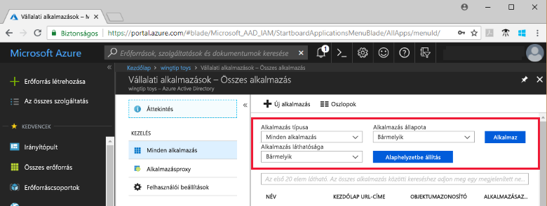

# Azure Active Directory-bérlői alkalmazások megtekintése

Ebben a rövid útmutatóban az Azure Portal használatával tekintheti meg az Azure Active Directory- (Azure AD-) bérlő alkalmazásait.

## Előkészületek

Az eredmények megtekintéséhez legalább egy alkalmazásnak lennie kell az Azure AD-bérlőn. Az alkalmazás hozzáadásának lépéseit lásd az [Alkalmazás hozzáadása](add-application-portal.md) rövid útmutatóban.

Jelentkezzen be az [Azure Portalra](https://portal.azure.com) az Azure AD-bérlő globális rendszergazdájaként, felhőalkalmazás- vagy alkalmazás-rendszergazdaként.

## A bérlői alkalmazások listájának megkeresése

Az Azure AD-bérlői alkalmazások az Azure Portal **Vállalati alkalmazások** szakaszában tekinthetők meg.

A bérlői alkalmazások megkeresésének lépései:

1. Az **[Azure Portal](https://portal.azure.com)** bal oldali navigációs paneljén kattintson az **Azure Active Directory** elemre. 

2. Az Azure Active Directory panelen kattintson a **Vállalati alkalmazások** elemre. 

3. Az **Alkalmazás típusa** legördülő listából válassza a **Minden alkalmazás** lehetőséget, majd kattintson az **Alkalmaz** gombra. Ekkor egy véletlenszerűen kiválasztott minta jelenik meg a bérlői alkalmazásokból.

    
   
4. További alkalmazások megtekintéséhez kattintson a **Továbbiak megjelenítése** gombra a lista alján. A bérlői alkalmazások számától függően a listában való görgetés helyett hasznosabbnak bizonyulhat [az adott alkalmazás megkeresése](#search-for-a-tenant-application).

## Megtekintési beállítások kiválasztása

Ebben a szakaszban kiválaszthatja a keresési beállításokat.

1. Az alkalmazásokat megtekintheti az **Alkalmazás típusa**, az **Alkalmazás állapota** és az **Alkalmazás láthatósága** alapján. 

    

2. Az **Alkalmazás típusa** területen az alábbi beállítások egyikét választhatja ki:

    - **Vállalati alkalmazások** – a nem a Microsoft által fejlesztett alkalmazások megjelenítése.
    - **Microsoft-alkalmazások** – a Microsoft által fejlesztett alkalmazások megjelenítése.
    - **Minden alkalmazás** – a nem a Microsoft által fejlesztett alkalmazások és a Microsoft-alkalmazások együttes megjelenítése.

3. Az **Alkalmazás állapota** területen a **Bármely**, **Letiltva** vagy **Engedélyezve** lehetőségek közül választhat. A **Bármely** beállítás magában foglalja a letiltott és az engedélyezett alkalmazásokat is.

4. Az **Alkalmazás láthatósága** területen a **Bármely** vagy a **Rejtett** lehetőségek közül választhat. A **Rejtett** beállítással olyan alkalmazásokat jeleníthet meg, amelyek megtalálhatók a bérlőn, de a felhasználók számára nem láthatók.

5. A kívánt beállítások megadását követően kattintson az **Alkalmaz** gombra.
 

## Bérlői alkalmazás keresése

Egy adott alkalmazást az alábbi lépésekkel kereshet meg:

1. Az **Alkalmazás típusa** menüben válassza a **Minden alkalmazás** lehetőséget, majd kattintson az **Alkalmaz** gombra.

2. Adja meg a megkeresni kívánt alkalmazás nevét. Ha az alkalmazás hozzá lett adva az Azure AD-bérlőhöz, az megjelenik a keresési eredmények között. Ebben a példában az látható, hogy a GitHub nem lett hozzáadva a bérlői alkalmazásokhoz.

    

3. Próbálkozzon az alkalmazásnév első néhány betűjének beírásával.  Ebben a példában az összes olyan alkalmazás látható, amelyek neve a **Sales** sztringgel kezdődik.

    

## További lépések

Ebben a rövid útmutatóban megismerte, hogyan tekintheti meg az Azure AD-bérlőn lévő alkalmazásokat, illetve hogyan szűrheti az alkalmazásokat típus, állapot és láthatóság szerint. Emellett azt is megtanulta, hogyan kereshet meg egy adott alkalmazást.

Most, hogy megtalálta a keresett alkalmazást, folytathatja a [további bérlői alkalmazások hozzáadását](add-application-portal.md) ismertető oktatóanyaggal, vagy az alkalmazásra kattintva megtekintheti vagy szerkesztheti a tulajdonságokat és a konfigurációs beállításokat. Konfigurálhat például egyszeri bejelentkezést. 

> [!div class="nextstepaction"]
> [Egyszeri bejelentkezés konfigurálása](configure-single-sign-on-portal.md)

