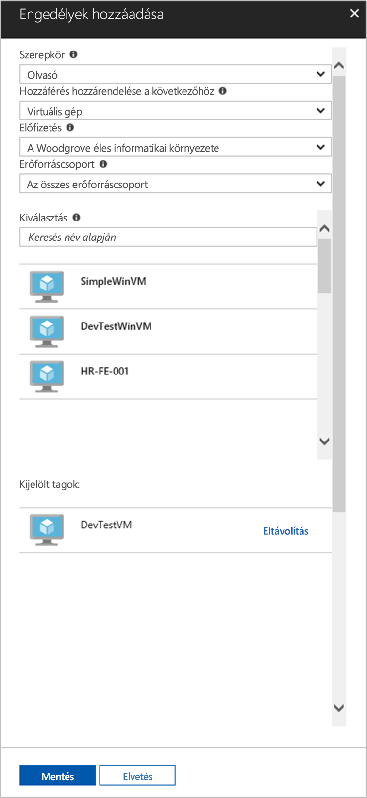

# <a name="use-a-linux-vm-system-assigned-managed-identity-to-access-azure-resource-manager"></a>Hozzáférés az Azure Resource Managerhez egy Linux VM-beli, rendszer által hozzárendelt felügyelt identitással

[!INCLUDE [preview-notice](../../../includes/active-directory-msi-preview-notice.md)]

Ez a rövid útmutató bemutatja, hogyan férhet hozzá az Azure Resource Manager API-hoz egy Linux rendszerű virtuális gép (VM) rendszer által hozzárendelt identitásával. Az Azure-erőforrások felügyelt identitásainak kezelését automatikusan az Azure végzi, és lehetővé teszi a hitelesítést az Azure AD-hitelesítést támogató szolgáltatásokban anélkül, hogy be kellene szúrnia a hitelesítő adatokat a kódba. Az alábbiak végrehajtásának módját ismerheti meg:

> [!div class="checklist"]
> * Hozzáférés engedélyezése virtuális gép számára az Azure Resource Managerben lévő erőforráscsoporthoz 
> * Hozzáférési jogkivonat lekérése a VM identitásával, majd az Azure Resource Manager meghívása a használatával 

## <a name="prerequisites"></a>Előfeltételek

[!INCLUDE [msi-tut-prereqs](../../../includes/active-directory-msi-tut-prereqs.md)]

## <a name="grant-your-vm-access-to-a-resource-group-in-azure-resource-manager"></a>Hozzáférés engedélyezése virtuális gép számára az Azure Resource Managerben lévő erőforráscsoporthoz 

Az Azure-erőforrások felügyelt identitásainak segítségével a kód hozzáférési jogkivonatokat kérhet le az olyan erőforrások felé történő hitelesítéshez, amelyek támogatják az Azure AD-hitelesítést. Az Azure Resource Manager API támogatja az Azure AD-hitelesítést. Először hozzáférést kell adnunk a VM identitásának egy erőforráshoz az Azure Resource Managerben, ebben az esetben ahhoz az erőforráscsoporthoz, amelyben a VM található.  

1. Navigáljon az **Erőforráscsoportok** lapra.
2. Válassza ki a korábban létrehozott **erőforráscsoportot**.
3. Lépjen a bal oldali panelen a **Hozzáférés-vezérlés (IAM)** hivatkozáshoz.
4. A **Hozzáadás** elemre kattintva rendeljen hozzá egy új szerepkört a virtuális géphez. A **Szerepkör** beállításhoz válassza ki az **Olvasó** értéket.
5. A következő legördülő menüben a **Hozzáférés hozzárendelése** beállítás számára válassza ki a **Virtuális gép** értéket.
6. Ezután ellenőrizze, hogy a megfelelő előfizetés szerepel-e az **Előfizetés** legördülő menüben. Az **Erőforráscsoport** esetében válassza a **Minden erőforráscsoport** lehetőséget.
7. Végül a **Kiválasztás** mezőben válassza ki a linuxos VM-et a legördülő menüben, majd kattintson a **Mentés** gombra.

    

## <a name="get-an-access-token-using-the-vms-system-assigned-managed-identity-and-use-it-to-call-resource-manager"></a>Hozzáférési jogkivonat lekérése a virtuális gép rendszer által hozzárendelt felügyelt identitásának használatával, majd a Resource Manager meghívása a jogkivonat használatával 

A lépések elvégzéséhez szüksége lesz egy SSH-ügyfélre. Windows használata esetén használhatja a [Linux Windows alrendszerében](https://msdn.microsoft.com/commandline/wsl/about) elérhető SSH-ügyfelet. Amennyiben segítségre van szüksége az SSH-ügyfél kulcsának konfigurálásához, [Az SSH-kulcsok és a Windows együttes használata az Azure-ban](../../virtual-machines/linux/ssh-from-windows.md) vagy [Nyilvános és titkos SSH-kulcspár létrehozása és használata az Azure-ban Linux rendszerű virtuális gépekhez](../../virtual-machines/linux/mac-create-ssh-keys.md) című cikkekben talál további információt.

1. A portálon lépjen a Linux virtuális gépre, és az **Áttekintés** területen kattintson a **Csatlakozás** gombra.  
2. **Csatlakozzon** a virtuális géphez a választott SSH-ügyféllel. 
3. A terminálablakban használatával `curl`, indítson egy Azure-erőforrások végpont a hozzáférési jogkivonat beszerzése az Azure Resource Manager helyi felügyelt identitások.  
 
    A `curl` kérelmet, a hozzáférési jogkivonat nem éri el.  
    
    ```bash
    curl 'http://169.254.169.254/metadata/identity/oauth2/token?api-version=2018-02-01&resource=https://management.azure.com/' -H Metadata:true   
    ```
    
    > [!NOTE]
    > A „resource” paraméter értékének pontosan egyeznie kell az Azure AD által várt értékkel.  Az Azure Resource Manager erőforrás-azonosítójának használatakor a záró perjelet is szerepeltetni kell az URI-ban. 
    
    A válasz tartalmazza az Azure Resource Manager eléréséhez szükséges hozzáférési jogkivonatot. 
    
    Válasz:  

    ```bash
    {"access_token":"eyJ0eXAiOi...",
    "refresh_token":"",
    "expires_in":"3599",
    "expires_on":"1504130527",
    "not_before":"1504126627",
    "resource":"https://management.azure.com",
    "token_type":"Bearer"} 
    ```
    
    A jogkivonat segítségével elérheti az Azure Resource Managert, például hogy elolvassa annak az erőforráscsoportnak a részleteit, amelyhez korábban engedélyezte hozzáférést ennek a virtuális gépnek. Cserélje le a \<SUBSCRIPTION ID\>, a \<RESOURCE GROUP\> és az \<ACCESS TOKEN\> változók értékeit a korábban létrehozottakra. 
    
    > [!NOTE]
    > Az URL-cím megkülönbözteti a kis-és nagybetűket, ezért pontosan ugyanúgy adja meg, mint ahogy az erőforráscsoportot elnevezte, illetve ügyeljen a „resourceGroup” sztringben a nagy G betű használatára is.  
    
    ```bash 
    curl https://management.azure.com/subscriptions/<SUBSCRIPTION ID>/resourceGroups/<RESOURCE GROUP>?api-version=2016-09-01 -H "Authorization: Bearer <ACCESS TOKEN>" 
    ```
    
    A válasz visszaadja a megadott erőforráscsoportra vonatkozó információt:    
    ```bash
    {"id":"/subscriptions/98f51385-2edc-4b79-bed9-7718de4cb861/resourceGroups/DevTest","name":"DevTest","location":"westus","properties":{"provisioningState":"Succeeded"}} 
    ```

## <a name="next-steps"></a>További lépések

Ennek a rövid útmutatónak a segítségével megtanulta, hogyan használható a rendszer által hozzárendelt felügyelt identitás az Azure Resource Manager API-hoz való hozzáféréshez.  További információ az Azure Resource Managerről:

> [!div class="nextstepaction"]
>[Azure Resource Manager](/azure/azure-resource-manager/resource-group-overview)
