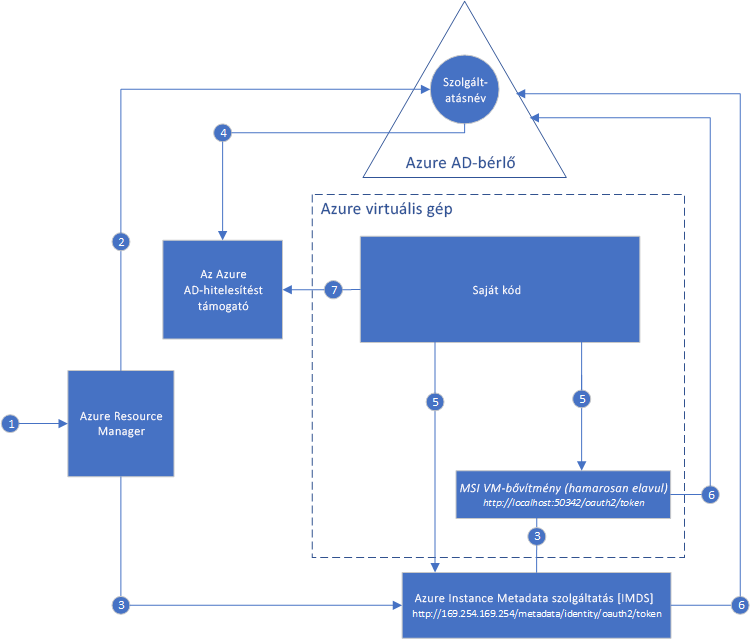

# Mi az Azure-erőforrásokhoz készült felügyeltszolgáltatás-identitás?

[!INCLUDE[preview-notice](../../../includes/active-directory-msi-preview-notice.md)]

A felhőalapú alkalmazások készítése során általános kihívást jelenti a hitelesítő adatok a kódban való kezelése, amelyekkel az alkalmazás magát a felhőalapú szolgáltatásokban hitelesíti. A hitelesítő adatok biztonságának megőrzése fontos feladat. Ideális esetben a hitelesítő adatok soha nem jelennek meg a fejlesztői munkaállomásokon, és a verziókövetési rendszerbe sem kerülnek be. Az Azure Key Vault módot kínál a hitelesítő adatok, titkos kódok és egyéb kulcsok biztonságos tárolására, azonban a kódnak hitelesítenie kell magát a Key Vaultban az adatok lekéréséhez. 

Az Azure Active Directory (Azure AD) felügyeltszolgáltatás-identitás szolgáltatása megoldást kínál erre a problémára. A szolgáltatás automatikusan felügyelt identitást biztosít az Azure-szolgáltatások számára az Azure AD-ben. Ezzel az identitással bármely, az Azure AD-hitelesítést támogató szolgáltatásban, többek között a Key Vaultban is elvégezheti a hitelesítést anélkül, hogy a hitelesítő adatok a kódban szerepelnének.

A felügyeltszolgáltatás-identitás szolgáltatás ingyenesen használható az Azure Active Directoryval az Azure-előfizetésekben. Nincs további költség.

## Hogyan működik a szolgáltatás?

A felügyelt identitásoknak két típusa létezik:

- A **rendszerhez hozzárendelt identitás** közvetlenül egy Azure-beli szolgáltatáspéldányon van engedélyezve. Az identitás engedélyezésekor az Azure létrehoz egy identitást a példány számára a példány előfizetése által megbízhatónak tekintett Azure AD-bérlőn. Az identitás létrehozása után a rendszer hozzárendeli a hitelesítő adatokat a példányon. A rendszerhez hozzárendelt identitás életciklusa közvetlenül kötődik ahhoz az Azure-beli szolgáltatáspéldányhoz, amelyen engedélyezve van. A példány törlésekor az Azure automatikusan törli a hitelesítő adatokat és az identitást az Azure AD-ben.
- A **felhasználóhoz hozzárendelt identitás** különálló Azure-erőforrásként jön létre. Egy létrehozási folyamaton keresztül az Azure létrehoz egy identitást a használt előfizetés által megbízhatónak tekintett Azure AD-bérlőn. Az identitás a létrehozását követően hozzárendelhető egy vagy több Azure-beli szolgáltatáspéldányhoz. A felhasználóhoz hozzárendelt identitások életciklusa külön van kezelve azon Azure-beli szolgáltatáspéldányoktól, amelyekhez hozzá lettek rendelve.

A kód a felügyeltszolgáltatás-identitások használatával hozzáférési jogkivonatokat igényelhet az Azure AD-hitelesítést támogató szolgáltatásokhoz. Az Azure gondoskodik a szolgáltatáspéldány által használt hitelesítő adatok biztosításáról.

Az alábbi ábrán a felügyelszolgáltatás-identitások az Azure-beli virtuális gépekkel (VM) való működése látható:

### Hogyan működnek a rendszerhez hozzárendelt identitások az Azure-beli virtuális gépekkel?

1. Az Azure Resource Managerbe érkezik egy kérés a rendszerhez hozzárendelt identitás egy virtuális gépen történő engedélyezésére.
2. Az Azure Resource Manager létrehoz egy szolgáltatásnevet az Azure AD-ben a virtuális gép identitása számára. A szolgáltatásnév az előfizetés által megbízhatónak tekintett Azure AD-bérlőn jön létre.
3. Az Azure Resource Manager konfigurálja az identitást a virtuális gépen:
    1. Frissíti az Azure Instance Metadata szolgáltatás identitásvégpontját a szolgáltatásnév ügyfél-azonosítójával és tanúsítványával.
    1. Létrehozza a VM-bővítményt, és hozzáadja a szolgáltatásnév ügyfél-azonosítóját és tanúsítványát. (Ez a lépés hamarosan elavul majd.)
4. Miután a virtuális gép már rendelkezik identitással, a szolgáltatásnév-adatok használatával biztosítson hozzáférést a virtuális gépnek az Azure-erőforrásokhoz. Az Azure Resource Manager meghívásához szerepköralapú hozzáférés-vezérlés (RBAC) használatával rendelje hozzá a megfelelő szerepkört a virtuális gép szolgáltatásnevéhez az Azure AD-ben. A Key Vault meghívásához adjon hozzáférést a kódnak az adott titkos kódhoz vagy kulcshoz a Key Vaultban.
5. A virtuális gépen futó kód két végpontról kérhet le jogkivonatot, amelyek csak a virtuális gépen belülről érhetők el:

    - Az Azure Instance Metadata szolgáltatás identitásvégpontja (ajánlott): `http://169.254.169.254/metadata/identity/oauth2/token`
        - A resource (erőforrás) paraméter határozza meg azt a szolgáltatást, amelynek a jogkivonatot meg kell küldeni. Az Azure Resource Manager hitelesítéséhez használja a `resource=https://management.azure.com/` paramétert.
        - Az API version (API-verzió) paraméter adja meg az IMDS-verziót – használja az api-version=2018-02-01, vagy egy nagyobb értéket.
    - A VM-bővítmény végpontja (hamarosan elavul): `http://localhost:50342/oauth2/token` 
        - A resource (erőforrás) paraméter határozza meg azt a szolgáltatást, amelynek a jogkivonatot meg kell küldeni. Az Azure Resource Manager hitelesítéséhez használja a `resource=https://management.azure.com/` paramétert.

6. A rendszer egy hívást intéz az Azure AD-re, és egy hozzáférési jogkivonatot igényel (az 5. lépésben leírtak szerint) a 3. lépésben konfigurált ügyfél-azonosító és tanúsítvány használatával. Az Azure AD egy JSON Web Token (JWT) formátumú hozzáférési jogkivonatot ad vissza.
7. A kód elküldi a hozzáférési jogkivonatot egy hívásban egy olyan szolgáltatásnak, amely támogatja az Azure AD-hitelesítést.

### Hogyan működnek a felhasználóhoz hozzárendelt identitások az Azure-beli virtuális gépekkel?

1. Az Azure Resource Managerbe érkezik egy kérés egy felhasználóhoz hozzárendelt identitás létrehozására.
2. Az Azure Resource Manager létrehoz egy szolgáltatásnevet az Azure AD-ben a felhasználóhoz hozzárendelt identitás számára. A szolgáltatásnév az előfizetés által megbízhatónak tekintett Azure AD-bérlőn jön létre.
3. Az Azure Resource Managerbe érkezik egy kérés a felhasználóhoz hozzárendelt identitás egy virtuális gépen történő konfigurálására:
    1. Frissíti az Azure Instance Metadata szolgáltatás identitásvégpontját a felhasználóhoz hozzárendelt identitás szolgáltatásnevének ügyfél-azonosítójával és tanúsítványával.
    1. Létrehozza a VM-bővítményt, és hozzáadja a felhasználóhoz hozzárendelt identitás szolgáltatásnevének ügyfél-azonosítóját és tanúsítványát. (Ez a lépés hamarosan elavul majd.)
4. Miután a felhasználóhoz hozzárendelt identitás létrejött, a szolgáltatásnév-adatok használatával biztosítson hozzáférést az identitásnak az Azure-erőforrásokhoz. Az Azure Resource Manager meghívásához szerepköralapú hozzáférés-vezérlés (RBAC) használatával rendelje hozzá a megfelelő szerepkört a felhasználóhoz hozzárendelt identitás szolgáltatásnevéhez az Azure AD-ben. A Key Vault meghívásához adjon hozzáférést a kódnak az adott titkos kódhoz vagy kulcshoz a Key Vaultban.

   > [!Note]
   > Ezt a lépést a 3. lépés előtt is végrehajthatja.

5. A virtuális gépen futó kód két végpontról kérhet le jogkivonatot, amelyek csak a virtuális gépen belülről érhetők el:

    - Az Azure Instance Metadata szolgáltatás identitásvégpontja (ajánlott): `http://169.254.169.254/metadata/identity/oauth2/token`
        - A resource (erőforrás) paraméter határozza meg azt a szolgáltatást, amelynek a jogkivonatot meg kell küldeni. Az Azure Resource Manager hitelesítéséhez használja a `resource=https://management.azure.com/` paramétert.
        - A client ID (ügyfél-azonosító) paraméter határozza meg azt az identitást, amely számára a hozzáférési jogkivonat kérvényezve lett. Ez az érték akkor szükséges egyértelműsítés céljából, ha egyazon virtuális gépen több felhasználóhoz hozzárendelt identitás is létezik.
        - Az API version (API verziója) paraméter az Azure Instance Metadata szolgáltatás verzióját adja meg. Használja a(z) `api-version=2018-02-01` vagy újabb verziót.

    - A VM-bővítmény végpontja (hamarosan elavul): `http://localhost:50342/oauth2/token`
        - A resource (erőforrás) paraméter határozza meg azt a szolgáltatást, amelynek a jogkivonatot meg kell küldeni. Az Azure Resource Manager hitelesítéséhez használja a `resource=https://management.azure.com/` paramétert.
        - A client ID (ügyfél-azonosító) paraméter határozza meg azt az identitást, amely számára a hozzáférési jogkivonat kérvényezve lett. Ez az érték akkor szükséges egyértelműsítés céljából, ha egyazon virtuális gépen több felhasználóhoz hozzárendelt identitás is létezik.
6. A rendszer egy hívást intéz az Azure AD-re, és egy hozzáférési jogkivonatot igényel (az 5. lépésben leírtak szerint) a 3. lépésben konfigurált ügyfél-azonosító és tanúsítvány használatával. Az Azure AD egy JSON Web Token (JWT) formátumú hozzáférési jogkivonatot ad vissza.
7. A kód elküldi a hozzáférési jogkivonatot egy hívásban egy olyan szolgáltatásnak, amely támogatja az Azure AD-hitelesítést.

## Hogyan használhatom a felügyeltszolgáltatás-identitásokat?

A különféle Azure-erőforrások felügyeltszolgáltatás-identitással való elérésének megismeréséért tekintse át az alábbi oktatóanyagokat.

Útmutató a felügyeltszolgáltatás-identitás használatához Windows rendszerű virtuális gépeken:

* [Az Azure Data Lake Store elérése](tutorial-windows-vm-access-datalake.md)
* [Az Azure Resource Manager elérése](tutorial-windows-vm-access-arm.md)
* [Az Azure SQL elérése](tutorial-windows-vm-access-sql.md)
* [Az Azure Storage elérése hozzáférési kulcs használatával](tutorial-windows-vm-access-storage.md)
* [Az Azure Storage elérése közös hozzáférésű jogosultságkódok használatával](tutorial-windows-vm-access-storage-sas.md)
* [Nem Azure AD-erőforrások elérése az Azure Key Vaulttal](tutorial-windows-vm-access-nonaad.md)

Útmutató a felügyeltszolgáltatás-identitás használatához Linux rendszerű virtuális gépeken:

* [Az Azure Data Lake Store elérése](tutorial-linux-vm-access-datalake.md)
* [Az Azure Resource Manager elérése](tutorial-linux-vm-access-arm.md)
* [Az Azure Storage elérése hozzáférési kulcs használatával](tutorial-linux-vm-access-storage.md)
* [Az Azure Storage elérése közös hozzáférésű jogosultságkódok használatával](tutorial-linux-vm-access-storage-sas.md)
* [Nem Azure AD-erőforrások elérése az Azure Key Vaulttal](tutorial-linux-vm-access-nonaad.md)

Útmutató a felügyeltszolgáltatás-identitás használatához egyéb Azure-szolgáltatásokban:

* [Azure App Service](/azure/app-service/app-service-managed-service-identity)
* [Azure Functions](/azure/app-service/app-service-managed-service-identity)
* [Azure Service Bus](../../service-bus-messaging/service-bus-managed-service-identity.md)
* [Azure Event Hubs](../../event-hubs/event-hubs-managed-service-identity.md)
* [Azure API Management](../../api-management/api-management-howto-use-managed-service-identity.md)

## Mely Azure-szolgáltatások támogatják a szolgáltatást?

A felügyeltszolgáltatás-identitások használatával az Azure AD-hitelesítést támogató szolgáltatásokban végezhet hitelesítést. A felügyeltszolgáltatás-identitás szolgáltatást támogató Azure-szolgáltatások listájáért lásd: [A Felügyeltszolgáltatás-identitást támogató szolgáltatások](services-support-msi.md).

## További lépések

Ismerkedjen meg a felügyeltszolgáltatás-identitás szolgáltatással a következő rövid útmutatók segítségével:

* [A Resource Manager elérése Windows VM-beli felügyeltszolgáltatás-identitással](tutorial-windows-vm-access-arm.md)
* [A Resource Manager elérése Linux VM-beli felügyeltszolgáltatás-identitással](tutorial-linux-vm-access-arm.md)
