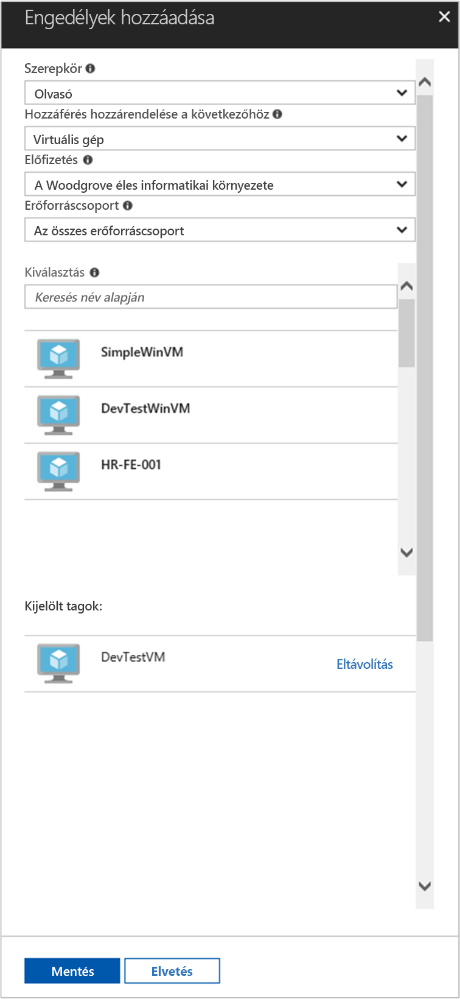

# <a name="use-a-linux-vm-managed-service-identity-msi-to-access-azure-resource-manager"></a>Azure Resource Manager eléréséhez használja egy Linux virtuális gép felügyelt szolgáltatás Identity (MSI)

[!INCLUDE[preview-notice](../../../includes/active-directory-msi-preview-notice.md)]

Ez az oktatóanyag bemutatja, hogyan engedélyezése felügyelt szolgáltatás identitásának (MSI) a Linux virtuális gépek, majd identitásukat az Azure Resource Manager API eléréséhez. Felügyelt szolgáltatás-identitások Azure automatikusan kezeli, és lehetővé teszik, hogy anélkül, hogy a hitelesítő adatokat beszúrni a kódot az Azure AD-alapú hitelesítés támogató szolgáltatások hitelesítést. Az alábbiak végrehajtásának módját ismerheti meg:

> [!div class="checklist"]
> * A Linux virtuális gépek MSI engedélyezése 
> * A virtuális gép hozzáférést biztosítson egy erőforráscsoportot az Azure Resource Manager 
> * Szereznie egy hozzáférési jogkivonatot, a virtuális gép azonosítójának használatával, és hívja az Azure Resource Manager használatával 

## <a name="prerequisites"></a>Előfeltételek

[!INCLUDE [msi-qs-configure-prereqs](../../../includes/active-directory-msi-qs-configure-prereqs.md)]

[!INCLUDE [msi-tut-prereqs](../../../includes/active-directory-msi-tut-prereqs.md)]

## <a name="sign-in-to-azure"></a>Bejelentkezés az Azure-ba

Jelentkezzen be az Azure Portalra a [https://portal.azure.com](https://portal.azure.com) webhelyen.

## <a name="create-a-linux-virtual-machine-in-a-new-resource-group"></a>Egy új erőforráscsoportot a Linux virtuális gép létrehozása

Ebben az oktatóanyagban létrehozhatunk egy új Linux virtuális Gépet. A meglévő virtuális MSI is engedélyezheti.

1. Kattintson az Azure Portal bal felső sarkában található **Erőforrás létrehozása** gombra.
2. Válassza a **Számítás**, majd az **Ubuntu Server 16.04 LTS** elemet.
3. Adja meg a virtuális gép adatait. A **hitelesítési típus**, jelölje be **nyilvános SSH-kulcs** vagy **jelszó**. A létrehozott hitelesítő adatok lehetővé teszik-e jelentkezni a virtuális gép.

    

4. Válasszon egy **előfizetés** a virtuális gép meg a legördülő listában.
5. Jelölje be egy új **erőforráscsoport** szeretne létrehozni, válassza a virtuális gép **hozzon létre új**. Amikor végzett, kattintson az **OK** gombra.
6. Adja meg a virtuális gép számára. További méretek megtekintéséhez válasszon **összes** , vagy módosítsa a lemez típusát támogatott szűrő. A Beállítások panelen hagyja változatlanul az alapértelmezett beállításokat, és kattintson az **OK** gombra.

## <a name="enable-msi-on-your-vm"></a>A virtuális Gépen lévő MSI engedélyezése

A virtuális gép MSI hozzáférési jogkivonatok beolvasása az Azure AD meg szeretne adni a kód hitelesítő adatokat igénylő nélkül teszi lehetővé. A színfalak MSI engedélyezése két dolgot eredményez: az MSI-Virtuálisgép-bővítmény a virtuális Gépet telepít, és MSI lehetővé teszi a virtuális gép számára.  

1. Válassza ki a **virtuális gép** , hogy szeretné-e engedélyezze MSI-t.
2. A bal oldali navigációs sávon kattintson **konfigurációs**.
3. Látni **Szolgáltatásidentitás felügyelt**. Regisztrálja, és engedélyezze a MSI-t, jelölje be **Igen**, ha szeretné letiltani, válassza a nem.
4. Győződjön meg arról, hogy kattintson **mentése** a konfiguráció mentéséhez.

    

5. Ha a rendszer mely bővítmények megtekintéséhez **Linux virtuális gép**, kattintson a **bővítmények**. Ha MSI engedélyezve van, a **ManagedIdentityExtensionforLinux** megtalálható a listán.

    

## <a name="grant-your-vm-access-to-a-resource-group-in-azure-resource-manager"></a>A virtuális gép hozzáférést biztosítson egy erőforráscsoportot az Azure Resource Manager 

MSI-fájl használata a kódot a hozzáférési jogkivonatok erőforrásokat, amelyek támogatják az Azure AD-alapú hitelesítés felé történő hitelesítésre kérheti le. Az Azure Resource Manager API-t az Azure AD-hitelesítését támogatja. Először azt kell hozzáférést biztosíthat a virtuális gép identitását egy erőforrást az Azure Resource Manager ebben az esetben az erőforráscsoportot, amelyben a virtuális gép található.  

1. Lépjen a lapra vonatkozó **erőforráscsoportok**.
2. Válassza ki az adott **erőforráscsoport** korábban létrehozott.
3. Ugrás a **control(IAM) hozzáférési** a bal oldali panelen.
4. Ide kattintva **Hozzáadás** a virtuális gép új szerepkör-hozzárendelés. Válasszon **szerepkör** , **olvasó**.
5. A következő legördülő **való hozzáférés hozzárendelése** az erőforrás **virtuális gép**.
6. A következő szerepel-e a megfelelő előfizetést a a **előfizetés** legördülő menüből. És a **erőforráscsoport**, jelölje be **összes erőforráscsoport**.
7. Végezetül a **válasszon** válassza ki a Linux virtuális gépet a legördülő menüből, majd kattintson a **mentése**.

    

## <a name="get-an-access-token-using-the-vms-identity-and-use-it-to-call-resource-manager"></a>Szereznie egy hozzáférési jogkivonatot, a virtuális gép azonosítójának használatával, és hívja az erőforrás-kezelő használatával 

Ezek a lépések elvégzéséhez szüksége lesz egy SSH-ügyfél. Windows használ, ha az SSH-ügyfél a használhatja a [Linux rendszerhez készült Windows alrendszer](https://msdn.microsoft.com/commandline/wsl/about). Ha az SSH-ügyfél kulcsok konfigurálása segítségre van szüksége, tekintse meg [a Windows Azure használatára SSH-kulcsok hogyan](../../virtual-machines/linux/ssh-from-windows.md), vagy [létrehozása, és az SSH nyilvános és titkos kulcsból álló kulcspárt használata a Linux virtuális gépek Azure-ban](../../virtual-machines/linux/mac-create-ssh-keys.md).

1. A portálon lépjen a Linux virtuális gépre, majd a a **áttekintése**, kattintson a **Connect**.  
2. **Csatlakozás** a virtuális géphez a az SSH-ügyfél az Ön által választott. 
3. A Terminálszolgáltatások ablakban CURL, használatával indítson egy lekérdezést a helyi MSI-végpont megszerezni egy hozzáférési jogkivonatot az Azure Resource Manager.  
 
    A CURL a hozzáférési token kérelme nem éri el.  
    
    ```bash
    curl http://localhost:50342/oauth2/token --data "resource=https://management.azure.com/" -H Metadata:true   
    ```
    
    > [!NOTE]
    > A "resource" paraméter értékének az Azure AD által várt pontosan egyeznie kell.  Esetén a Resource Manager erőforrás-azonosító meg kell adni a záró perjelet URI-n. 
    
    A válasz tartalmazza az Azure Resource Manager eléréséhez szükséges jogkivonat. 
    
    Válasz:  

    ```bash
    {"access_token":"eyJ0eXAiOi...",
    "refresh_token":"",
    "expires_in":"3599",
    "expires_on":"1504130527",
    "not_before":"1504126627",
    "resource":"https://management.azure.com",
    "token_type":"Bearer"} 
    ```
    
    Ez a jogkivonat segítségével elérni az Azure Resource Manager, például hogy olvassa el az erőforráscsoportot, amelyhez Ön korábban hozzáférést a virtuális gép adatait. Cserélje le az értékeket \<ELŐFIZETÉS-azonosító\>, \<ERŐFORRÁSCSOPORT\>, és \<ACCESS TOKEN\> korábban létrehozott frissítheti. 
    
    > [!NOTE]
    > Az URL-cím kis-és nagybetűket, ezért győződjön meg arról, ha az a pontos nagybetűket, a használt korábban az erőforráscsoportot és a nagybetűk "G" a "erőforráscsoport" nevű.  
    
    ```bash 
    curl https://management.azure.com/subscriptions/<SUBSCRIPTION ID>/resourceGroups/<RESOURCE GROUP>?api-version=2016-09-01 -H "Authorization: Bearer <ACCESS TOKEN>" 
    ```
    
    A válasz a megadott erőforráscsoport adatokkal: 
     
    ```bash
    {"id":"/subscriptions/98f51385-2edc-4b79-bed9-7718de4cb861/resourceGroups/DevTest","name":"DevTest","location":"westus","properties":{"provisioningState":"Succeeded"}} 
    ```
     
## <a name="related-content"></a>Kapcsolódó tartalom

- MSI áttekintését lásd: [Szolgáltatásidentitás felügyelete – áttekintés](overview.md). 

Az alábbi Megjegyzések szakasz segítségével visszajelzést, és segítsen pontosítsa és a tartalom.

