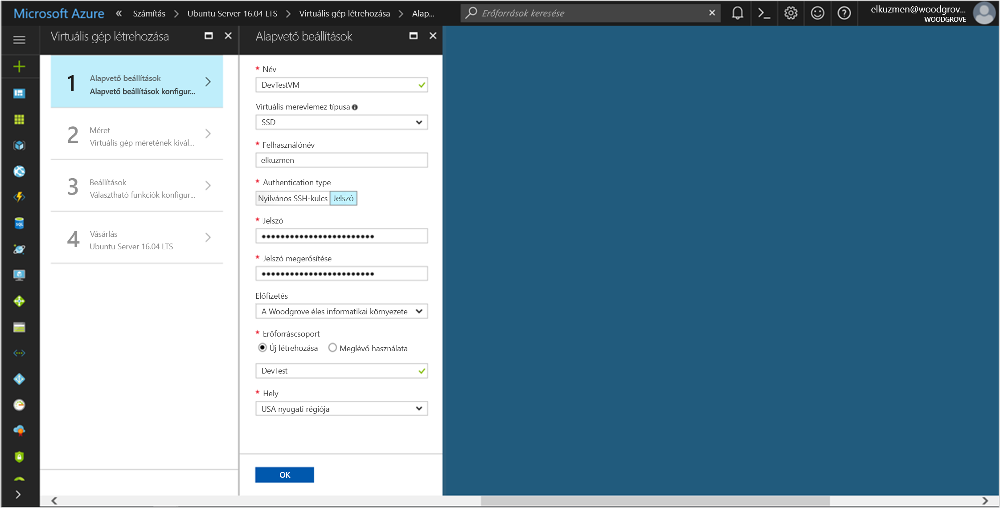

# <a name="tutorial-use-a-linux-vm-managed-service-identity-to-access-azure-key-vault"></a>Oktatóanyag: Az Azure Key Vault elérése Linux VM-beli felügyeltszolgáltatás-identitással 

[!INCLUDE[preview-notice](../../../includes/active-directory-msi-preview-notice.md)]

Az oktatóanyag bemutatja, hogyan engedélyezheti a felügyeltszolgáltatás-identitást egy Linux virtuális gépen, majd hogyan használhatja ezt az identitást az Azure Key Vault eléréséhez. A rendszerindítóként szolgáló Key Vault segítségével az ügyfélalkalmazás ezután a titkos kódot használhatja a nem az Azure Active Directory (AD) által védett erőforrások eléréséhez. A felügyeltszolgáltatás-identitások kezelését automatikusan az Azure végzi, és lehetővé teszi a hitelesítést az Azure AD-hitelesítést támogató szolgáltatásokban anélkül, hogy be kellene szúrnia a hitelesítő adatokat a kódba. 

Az alábbiak végrehajtásának módját ismerheti meg:

> [!div class="checklist"]
> * Felügyeltszolgáltatás-identitás engedélyezése Linux rendszerű virtuális gépen 
> * Hozzáférés engedélyezése a VM számára a Key Vaultban tárolt titkos kódokhoz 
> * Hozzáférési jogkivonat lekérése a VM identitásával, majd a titkos kód lekérése a Key Vaultból 
 
## <a name="prerequisites"></a>Előfeltételek

[!INCLUDE [msi-qs-configure-prereqs](../../../includes/active-directory-msi-qs-configure-prereqs.md)]

[!INCLUDE [msi-tut-prereqs](../../../includes/active-directory-msi-tut-prereqs.md)]

## <a name="sign-in-to-azure"></a>Bejelentkezés az Azure-ba
Jelentkezzen be az Azure Portalra a [https://portal.azure.com](https://portal.azure.com) webhelyen. 

## <a name="create-a-linux-virtual-machine-in-a-new-resource-group"></a>Linux rendszerű virtuális gép létrehozása új erőforráscsoportban

Ebben az oktatóanyagban egy új linuxos virtuális gépet hozunk létre. A meglévő virtuális gépeken is engedélyezheti a felügyeltszolgáltatás-identitást.

1. Kattintson az Azure Portal bal felső sarkában található **Erőforrás létrehozása** gombra.
2. Válassza a **Számítás**, majd az **Ubuntu Server 16.04 LTS** elemet.
3. Adja meg a virtuális gép adatait. A **Hitelesítés típusa** résznél válassza az **SSH nyilvános kulcs** vagy a **Jelszó** lehetőséget. A létrehozott hitelesítő adatokkal jelentkezhet be a virtuális gépre.

    

4. Válasszon ki egy **előfizetést** a legördülő menüben a virtuális gép számára.
5. Ha a virtuális gépet egy új **Erőforráscsoportban** szeretné létrehozni, válassza az **Új létrehozása** elemet. Amikor végzett, kattintson az **OK** gombra.
6. Válassza ki a virtuális gép méretét. További méretek megjelenítéséhez válassza **Az összes megtekintése** lehetőséget, vagy módosítsa a Támogatott lemeztípus szűrőt. A Beállítások lapon hagyja változatlanul az alapértelmezett beállításokat, és kattintson az **OK** gombra.

## <a name="enable-managed-service-identity-on-your-vm"></a>Felügyeltszolgáltatás-identitás engedélyezése a virtuális gépen

A virtuális gép felügyeltszolgáltatás-identitásával anélkül kérhet le hozzáférési jogkivonatokat az Azure AD-ből, hogy hitelesítő adatokat kellene a kódba illesztenie. A felügyeltszolgáltatás-identitás VM-en való engedélyezése két dolgot tesz: regisztrálja a VM-et az Azure Active Directoryban a felügyelt identitása létrehozásához, és konfigurálja az identitást a VM-en.

1. Válassza ki azt a **virtuális gépet**, amelyen engedélyezni szeretné a felügyeltszolgáltatás-identitást.
2. A bal oldali navigációs sávban kattintson a **Konfigurálás** elemre.
3. Megjelenik a **felügyeltszolgáltatás-identitás**. A felügyeltszolgáltatás-identitás regisztrálásához és engedélyezéséhez kattintson az **Igen**, a letiltásához a Nem gombra.
4. Mindenképp kattintson a **Mentés** gombra a konfiguráció mentéséhez.

    

## <a name="grant-your-vm-access-to-a-secret-stored-in-a-key-vault"></a>Hozzáférés engedélyezése a VM számára a Key Vaultban tárolt titkos kódokhoz  

A felügyeltszolgáltatás-identitás segítségével a kód hozzáférési jogkivonatokat kérhet le az olyan erőforrások felé történő hitelesítéshez, amelyek támogatják az Azure Active Directory-hitelesítést. Az Azure AD-hitelesítést azonban nem minden Azure-szolgáltatás támogatja. A felügyeltszolgáltatás-identitás ilyen szolgáltatásokkal való használatához tárolja el a szolgáltatás hitelesítő adatait az Azure Key Vaultban, és a felügyeltszolgáltatás-identitással férjen hozzá a Key Vaulthoz, hogy le tudja kérni a hitelesítő adatokat. 

Először létre kell hozni egy Key Vaultot, és gondoskodni kell róla, hogy a VM-identitás hozzá tudjon férni.   

1. A bal oldali navigációs sáv tetején válassza az **Erőforrás létrehozása** > **Biztonság + identitás** > **Key Vault** lehetőséget.  
2. Adja meg az új Key Vault **nevét**. 
3. A Key Vaultot ugyanabban az előfizetésben és erőforráscsoportban hozza létre, mint a korábban létrehozott virtuális gépet. 
4. Válassza a **Hozzáférési szabályzatok** lehetőséget, és kattintson az **Új hozzáadása** gombra. 
5. A Konfigurálás sablonból mezőben válassza a **Titkos kódok kezelése** sablont. 
6. Válassza a **Rendszerbiztonsági tag kijelölése** lehetőséget, és a keresőmezőben adja meg a korábban létrehozott virtuális gép nevét.  Válassza ki a virtuális gépet az eredménylistából, és kattintson a **Kiválasztás** gombra. 
7. Az új hozzáférési szabályzat hozzáadásának befejezéshez kattintson az **OK**, majd a hozzáférési szabályzat kiválasztásának befejezéséhez ugyanúgy az **OK** gombra. 
8. Kattintson a **Létrehozás** gombra a Key Vault létrehozásának befejezéséhez. 

    

Ezután adjon hozzá egy titkos kódot a Key Vaulthoz, hogy később le tudja kérni a VM-ben futó titkos kódot: 

1. Válassza a **Minden erőforrás** lehetőséget, majd keresse meg és válassza ki a létrehozott Key Vaultot. 
2. Válassza a **Titkos kódok** lehetőséget, és kattintson a **Hozzáadás** gombra. 
3. A **Feltöltési beállítások** mezőben válassza a **Manuális** lehetőséget. 
4. Adja meg a titkos kód nevét és értékét.  Az érték bármi lehet. 
5. Hagyja az aktiválási és a lejárati dátumot üresen, az **Engedélyezve** beállítást pedig az **Igen** értéken. 
6. A titkos kód létrehozásához kattintson a **Létrehozás** parancsra. 
 
## <a name="get-an-access-token-using-the-vms-identity-and-use-it-to-retrieve-the-secret-from-the-key-vault"></a>Hozzáférési jogkivonat lekérése a VM identitásával, majd a titkos kód lekérése a Key Vaultból  

A lépések elvégzéséhez szüksége lesz egy SSH-ügyfélre.  Windows használata esetén használhatja a [Linux Windows alrendszerében](https://msdn.microsoft.com/commandline/wsl/about) elérhető SSH-ügyfelet. Amennyiben segítségre van szüksége az SSH-ügyfél kulcsának konfigurálásához, [Az SSH-kulcsok és a Windows együttes használata az Azure-ban](../../virtual-machines/linux/ssh-from-windows.md) vagy [Nyilvános és titkos SSH-kulcspár létrehozása és használata az Azure-ban Linux rendszerű virtuális gépekhez](../../virtual-machines/linux/mac-create-ssh-keys.md) című cikkekben talál további információt.
 
1. A portálon lépjen a Linux virtuális gépre, és az **Áttekintés** területen kattintson a **Csatlakozás** gombra. 
2. **Csatlakozzon** a virtuális géphez a választott SSH-ügyféllel. 
3. A terminálablakban a CURL használatával küldjön kérést a helyi felügyeltszolgáltatás-identitás végpontra egy hozzáférési jogkivonat lekérésére az Azure Key Vaulthoz.  
 
    A hozzáférési jogkivonatra vonatkozó CURL-kérelmet alább láthatja.  
    
    ```bash
    curl 'http://169.254.169.254/metadata/identity/oauth2/token?api-version=2018-02-01&resource=https%3A%2F%2Fvault.azure.net' -H Metadata:true  
    ```
    A válasz tartalmazza a Resource Manager eléréséhez szükséges hozzáférési jogkivonatot. 
    
    Válasz:  
    
    ```bash
    {"access_token":"eyJ0eXAi...",
    "refresh_token":"",
    "expires_in":"3599",
    "expires_on":"1504130527",
    "not_before":"1504126627",
    "resource":"https://vault.azure.net",
    "token_type":"Bearer"} 
    ```
    
    A hozzáférési jogkivonat használatával hitelesíthet az Azure Key Vaultban.  A következő CURL-kérés bemutatja, hogyan lehet a Key Vaultból titkos kulcsot beolvasni a CURL és a Key Vault REST API használatával.  Szüksége lesz a Key Vault URL-címére, amely a Key Vault **Áttekintés** lapjának **Alapvető erőforrások** szakaszában található.  Szüksége lesz az előző hívásban lekért hozzáférési jogkivonatra is. 
        
    ```bash
    curl https://<YOUR-KEY-VAULT-URL>/secrets/<secret-name>?api-version=2016-10-01 -H "Authorization: Bearer <ACCESS TOKEN>" 
    ```
    
    A válasz a következőképp fog kinézni: 
    
    ```bash
    {"value":"p@ssw0rd!","id":"https://mytestkeyvault.vault.azure.net/secrets/MyTestSecret/7c2204c6093c4d859bc5b9eff8f29050","attributes":{"enabled":true,"created":1505088747,"updated":1505088747,"recoveryLevel":"Purgeable"}} 
    ```
    
Miután lekérte a titkos kódot a Key Vaultból, a használatával hitelesítést végezhet olyan szolgáltatásokban, amelyekhez név és jelszó szükséges.

## <a name="next-steps"></a>További lépések

Az oktatóanyag bemutatta, hogyan használhat felügyeltszolgáltatás-identitásokat Linux virtuális gépeken az Azure Key Vault eléréséhez.  További információ az Azure Key Vault szolgáltatásról:

> [!div class="nextstepaction"]
>[Azure Key Vault](/azure/key-vault/key-vault-whatis)


