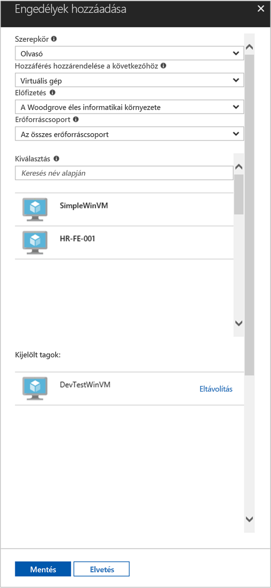

# <a name="use-a-windows-vm-managed-service-identity-msi-to-access-resource-manager"></a>Erőforrás-kezelő eléréséhez használja a Windows virtuális gép felügyelt szolgáltatás identitásának (MSI)

[!INCLUDE[preview-notice](../../../includes/active-directory-msi-preview-notice.md)]

Ez az oktatóanyag bemutatja, hogyan felügyelt szolgáltatás identitásának (MSI) engedélyezéséhez a Windows virtuális gép (VM). Az Azure Resource Manager API eléréséhez használhatja identitásukat. Felügyelt szolgáltatás-identitások Azure automatikusan kezeli, és lehetővé teszik, hogy anélkül, hogy a hitelesítő adatokat beszúrni a kódot az Azure AD-alapú hitelesítés támogató szolgáltatások hitelesítést. Az alábbiak végrehajtásának módját ismerheti meg:

> [!div class="checklist"]
> * Virtuális gép Windows MSI engedélyezése 
> * A virtuális gép hozzáférést biztosítson egy erőforráscsoportot az Azure Resource Manager 
> * Szereznie egy hozzáférési jogkivonatot, a virtuális gép azonosítójának használatával, és hívja az Azure Resource Manager használatával

## <a name="prerequisites"></a>Előfeltételek

[!INCLUDE [msi-qs-configure-prereqs](../../../includes/active-directory-msi-qs-configure-prereqs.md)]

[!INCLUDE [msi-tut-prereqs](../../../includes/active-directory-msi-tut-prereqs.md)]

## <a name="sign-in-to-azure"></a>Bejelentkezés az Azure-ba
Jelentkezzen be az Azure Portalra a [https://portal.azure.com](https://portal.azure.com) webhelyen.

## <a name="create-a-windows-virtual-machine-in-a-new-resource-group"></a>Windows virtuális gép egy új erőforráscsoport létrehozása

Ebben az oktatóanyagban azt hozzon létre egy új Windows virtuális Gépet.  A meglévő virtuális MSI is engedélyezheti.

1.  Kattintson az Azure Portal bal felső sarkában található **Erőforrás létrehozása** gombra.
2.  Válassza a **Számítás**, majd a **Windows Server 2016 Datacenter** elemet. 
3.  Adja meg a virtuális gép adatait. A **felhasználónév** és **jelszó** létrehozott itt van a hitelesítő adatok használatával jelentkezzen be a virtuális gép.
4.  Válassza ki a megfelelő **előfizetés** a virtuális gép meg a legördülő listában.
5.  Jelölje be egy új **erőforráscsoport** , amelyen a virtuális gép létrehozásához, **hozzon létre új**. Amikor végzett, kattintson az **OK** gombra.
6.  Adja meg a virtuális gép számára. További méretek megjelenítéséhez válassza **Az összes megtekintése** lehetőséget, vagy módosítsa a **Támogatott lemeztípus** szűrőt. A beállítások lapon hagyja az alapértelmezett beállításokat, majd kattintson **OK**.

    

## <a name="enable-msi-on-your-vm"></a>A virtuális Gépen lévő MSI engedélyezése 

A virtuális gép MSI hozzáférési jogkivonatok beolvasása az Azure AD meg szeretne adni a kód hitelesítő adatokat igénylő nélkül teszi lehetővé. MSI engedélyezése közli az Azure-hoz létre egy felügyelt a virtuális gép számára. A színfalak MSI engedélyezése két dolgot eredményez: az MSI-Virtuálisgép-bővítmény a virtuális Gépet telepít, és lehetővé teszi, hogy az Azure Resource Manager MSI.

1.  Válassza ki a **virtuális gép** , hogy szeretné-e engedélyezze MSI-t.  
2.  A bal oldali navigációs sávon kattintson **konfigurációs**. 
3.  Látni **Szolgáltatásidentitás felügyelt**. Regisztrálja, és engedélyezze a MSI-t, jelölje be **Igen**, ha szeretné letiltani, válassza a nem. 
4.  Győződjön meg arról, hogy kattintson **mentése** a konfiguráció mentéséhez.  
    

5. Ha szeretné ellenőrizni, és a virtuális gép mely bővítmények ellenőrizze, kattintson a **bővítmények**. Ha MSI engedélyezve van, majd **ManagedIdentityExtensionforWindows** megjelennek a listában.

    

## <a name="grant-your-vm-access-to-a-resource-group-in-resource-manager"></a>A virtuális gép hozzáférést biztosítson egy erőforráscsoportot az erőforrás-kezelőben
MSI-fájl használata a kódot a hozzáférési jogkivonatok erőforrásokat, amelyek támogatják az Azure AD-alapú hitelesítés felé történő hitelesítésre kérheti le.  Az Azure Resource Manager támogatja az Azure AD-alapú hitelesítés.  Először kell a hozzáférést a virtuális gép identitását egy erőforráshoz az erőforrás-kezelőben ebben az esetben az erőforráscsoportot, amelyben a virtuális gép található.  

1.  Lépjen a lapra vonatkozó **erőforráscsoportok**. 
2.  Válassza ki az adott **erőforráscsoport** a létrehozott a **Windows virtuális gép**. 
3.  Ugrás a **hozzáférés-vezérlés (IAM)** a bal oldali panelen. 
4.  Majd **Hozzáadás** az új szerepkör-hozzárendelés a **Windows virtuális gép**.  Válasszon **szerepkör** , **olvasó**. 
5.  A következő legördülő listán, a **való hozzáférés hozzárendelése** az erőforrás **virtuális gép**. 
6.  A következő szerepel-e a megfelelő előfizetést a a **előfizetés** legördülő menüből. És a **erőforráscsoport**, jelölje be **összes erőforráscsoport**. 
7.  Végezetül a **válasszon** adja meg a legördülő menüből, majd kattintson a Windows virtuális gép **mentése**.

    

## <a name="get-an-access-token-using-the-vm-identity-and-use-it-to-call-azure-resource-manager"></a>Szereznie egy hozzáférési jogkivonatot, a virtuális gép azonosítójának használatával, és hívja az Azure Resource Manager használatával 

Meg kell használnia **PowerShell** ezen részében.  Ha nincs telepítve, töltse le [Itt](https://docs.microsoft.com/powershell/azure/overview?view=azurermps-4.3.1). 

1.  A portálon lépjen a **virtuális gépek** és nyissa meg a Windows rendszerű virtuális gép és a a **áttekintése**, kattintson a **Connect**. 
2.  Adja meg a **felhasználónév** és **jelszó** számára, amely hozzá van, a Windows virtuális gép létrehozása után. 
3.  Most, hogy létrehozott egy **távoli asztali kapcsolat** nyissa meg a virtuális gép **PowerShell** a távoli munkamenet. 
4.  A helyi MSI-végpont megszerezni egy hozzáférési jogkivonatot az Azure Resource Manager használatával Powershell Invoke-WebRequest, indítson egy lekérdezést.

    ```powershell
       $response = Invoke-WebRequest -Uri http://localhost:50342/oauth2/token -Method GET -Body @{resource="https://management.azure.com/"} -Headers @{Metadata="true"}
    ```
    
    > [!NOTE]
    > A "resource" paraméter értékének az Azure AD által várt pontosan egyeznie kell. Az Azure Resource Manager erőforrás-azonosító használata esetén meg kell adni a záró perjelet URI-n.
    
    Ezután bontsa ki a teljes válasz, amely tárolja a $response objektum JavaScript Object Notation (JSON) formátumú karakterláncot. 
    
    ```powershell
    $content = $response.Content | ConvertFrom-Json
    ```
    Ezután bontsa ki a hozzáférési jogkivonat a választ.
    
    ```powershell
    $ArmToken = $content.access_token
    ```
    
    Végül hívja az Azure Resource Manager hozzáférési jogkivonat. Ebben a példában is használunk PowerShell Invoke-WebRequest a híváshoz az Azure Resource Manager és a hozzáférési jogkivonat szerepeljenek az Authorization fejlécet.
    
    ```powershell
    (Invoke-WebRequest -Uri https://management.azure.com/subscriptions/<SUBSCRIPTION ID>/resourceGroups/<RESOURCE GROUP>?api-version=2016-06-01 -Method GET -ContentType "application/json" -Headers @{ Authorization ="Bearer $ArmToken"}).content
    ```
    > [!NOTE] 
    > Az URL-címe: kis-és nagybetűket, ezért figyeljen oda arra, hogy használ a pontos nagybetűket használt korábban az erőforráscsoportot és a nagybetűk "G" a "resourceGroups." nevű
        
    A következő parancsot az erőforráscsoport-adatait adja vissza:

    ```powershell
    {"id":"/subscriptions/98f51385-2edc-4b79-bed9-7718de4cb861/resourceGroups/DevTest","name":"DevTest","location":"westus","properties":{"provisioningState":"Succeeded"}}
    ```

## <a name="related-content"></a>Kapcsolódó tartalom

- MSI áttekintését lásd: [Szolgáltatásidentitás felügyelete – áttekintés](overview.md).

Az alábbi Megjegyzések szakasz segítségével visszajelzést, és segítsen pontosítsa és a tartalom.

