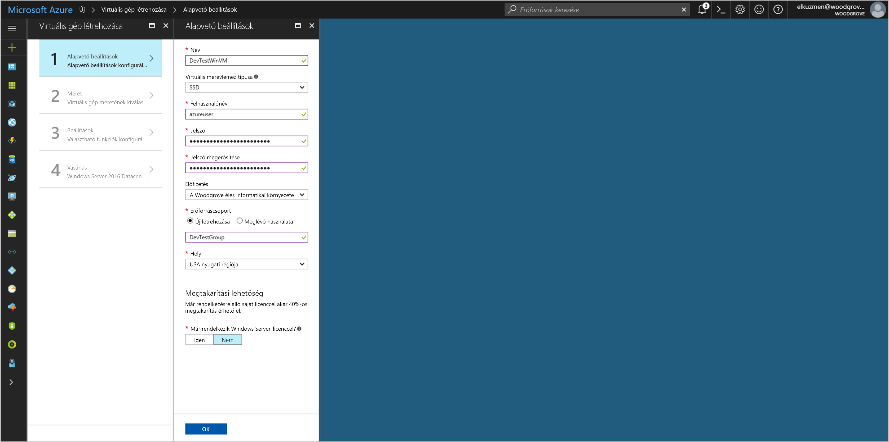
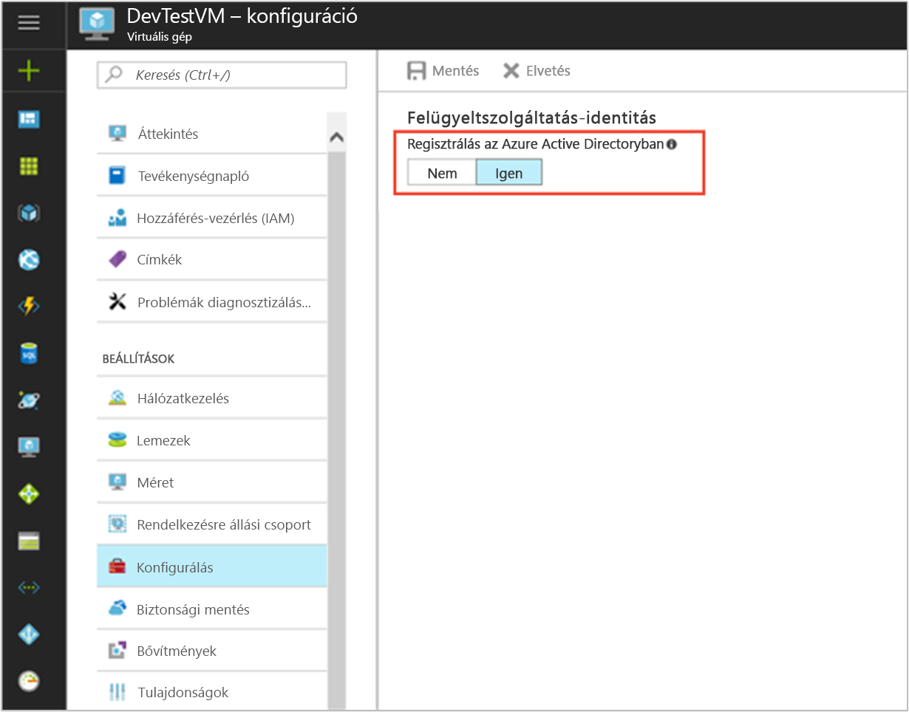

# <a name="tutorial-use-a-windows-vm-managed-service-identity-to-access-azure-storage-via-a-sas-credential"></a>Oktatóanyag: Azure Storage elérése SAS-hitelesítő adatot keresztül egy Windows virtuális gépek Felügyeltszolgáltatás-identitás segítségével

[!INCLUDE[preview-notice](../../../includes/active-directory-msi-preview-notice.md)]

Ez az oktatóanyag bemutatja, hogyan lehet engedélyezni a Felügyeltszolgáltatás-identitás (MSI) egy Windows virtuális gép esetében, akkor az MSI használata egy tároló közös hozzáférésű Jogosultságkód (SAS) hitelesítő adatok beszerzése. Pontosabban a [szolgáltatásalapú SAS-hitelesítő adatok](/azure/storage/common/storage-dotnet-shared-access-signature-part-1?toc=%2fazure%2fstorage%2fblobs%2ftoc.json#types-of-shared-access-signatures). 

A szolgáltatás SAS lehetővé teszi a korlátozott hozzáférést a storage-fiókban, korlátozott ideig objektumok és a egy adott szolgáltatás (ebben az esetben a blob szolgáltatás), anélkül, hogy a fiók hozzáférési kulcsára. Használhatja a szokásos módon ha ezzel a tárolási műveletek, például amikor a Storage SDK használatával egy SAS-hitelesítő adatot. Ebben az oktatóanyagban bemutatjuk, hogyan feltöltése és letöltése a blobok Azure Storage PowerShell-lel. Megtudhatja, hogyan lehet:


> [!div class="checklist"]
> * Windows virtuális gépen az MSI engedélyezéséhez 
> * A virtuális gép hozzáférést biztosítani a tárfiók SAS a Resource Managerben 
> * A virtuális gép identitással hozzáférési jogkivonatot kapjon, és a SAS lekérése a Resource Manager használatával 

## <a name="prerequisites"></a>Előfeltételek

[!INCLUDE [msi-qs-configure-prereqs](../../../includes/active-directory-msi-qs-configure-prereqs.md)]

[!INCLUDE [msi-tut-prereqs](../../../includes/active-directory-msi-tut-prereqs.md)]

## <a name="sign-in-to-azure"></a>Bejelentkezés az Azure-ba

Jelentkezzen be az Azure Portalra a [https://portal.azure.com](https://portal.azure.com) webhelyen.

## <a name="create-a-windows-virtual-machine-in-a-new-resource-group"></a>Windows virtuális gép egy új erőforráscsoport létrehozása

Ebben az oktatóanyagban létrehozunk egy új Windows virtuális Gépet. A meglévő virtuális gép MSI is engedélyezheti.

1.  Kattintson a **+/ hozzon létre új szolgáltatást** az Azure portal bal felső sarkában található gomb.
2.  Válassza a **Számítás**, majd a **Windows Server 2016 Datacenter** elemet. 
3.  Adja meg a virtuális gép adatait. A **felhasználónév** és **jelszó** létrehozott itt van a hitelesítő adatok használatával jelentkezzen be a virtuális gépet.
4.  Válassza ki a megfelelő **előfizetés** a virtuális gép a legördülő listában.
5.  Jelölje be egy új **erőforráscsoport** szeretne létrehozni, válassza ki a virtuális gép **hozzon létre új**. Amikor végzett, kattintson az **OK** gombra.
6.  Válassza ki a méretet a virtuális gép számára. További méretek megjelenítéséhez válassza **Az összes megtekintése** lehetőséget, vagy módosítsa a **Támogatott lemeztípus** szűrőt. A Beállítások panelen hagyja változatlanul az alapértelmezett beállításokat, és kattintson az **OK** gombra.

    

## <a name="enable-msi-on-your-vm"></a>A virtuális Gépen az MSI engedélyezéséhez

A virtuális gép MSI lehetővé teszi hozzáférési tokenek beszerzése az Azure ad-ből anélkül, hogy hitelesítő adatok üzembe a kódot kellene. Valójában MSI engedélyezéséhez két dolgot eredményez: regisztrál, a virtuális gép az Azure Active Directoryval hozhat létre a felügyelt identitást, és konfigurálja az identitás a virtuális gépen.

1. Keresse meg az erőforráscsoport, az új virtuális gépet, és válassza ki a virtuális gépet az előző lépésben létrehozott.
2. A virtuális gép "Beállítások" bal oldali panelen kattintson **konfigurációs**.
3. Regisztráljon, és az MSI engedélyezéséhez, válassza ki a **Igen**, ha szeretné letiltani, válassza a nem.
4. Győződjön meg arról, hogy kattintson **mentése** a konfiguráció mentéséhez.

    

## <a name="create-a-storage-account"></a>Tárfiók létrehozása 

Ha még nem rendelkezik egy, most már létrehozhat egy storage-fiókot. Is ezt a lépést kihagyhatja, és a egy meglévő tárfiókot SAS-hitelesítő adatot, a virtuális gép MSI hozzáférésének biztosítása. 

1. Kattintson a **+/ hozzon létre új szolgáltatást** az Azure portal bal felső sarkában található gomb.
2. Kattintson a **tárolási**, majd **Tárfiók**, és a egy új "Tárfiók létrehozása" panelen jelenik meg.
3. Adjon meg egy nevet a tárfiók, amely később fogja használni.  
4. **Üzemi modell** és **fióktípus** értékre kell állítani "Erőforrás-kezelő" és "Általános célú", illetve. 
5. Győződjön meg, hogy a **előfizetés** és **erőforráscsoport** egyeznek azokkal az előző lépésben a virtuális gép létrehozásakor megadott.
6. Kattintson a **Create** (Létrehozás) gombra.

    

## <a name="create-a-blob-container-in-the-storage-account"></a>Hozzon létre egy blobtárolót a tárfiókban

Hogy később feltöltése és fájl letöltése az új tárfiókot. Mivel a fájlok van szüksége a blob storage-ba, hozzon létre egy blobtárolót a fájl tárolására kell.

1. Lépjen vissza az újonnan létrehozott tárfiókra.
2. Kattintson a **tárolók** hivatkozásra a bal oldali panelen, a "Blob szolgáltatás."
3. Kattintson a **+ tároló** tetején az oldalon, és a egy "új tároló" panel becsúszik.
4. Adja meg a tároló nevét, válasszon egy hozzáférési szintet, majd kattintson a **OK**. A megadott név lesz az oktatóanyag későbbi részében. 

    

## <a name="grant-your-vms-msi-access-to-use-a-storage-sas"></a>Hozzáférést biztosít a virtuális gép MSI használata egy tároló SAS 

Az Azure Storage nem támogatja natív módon az Azure AD-hitelesítés.  Azonban a tároló SAS lekérése a Resource Manager egy MSI-csomag használatával, majd az SAS tároló eléréséhez.  Ebben a lépésben a virtuális gép MSI hozzáférést adhat a tárfiók SAS.   

1. Lépjen vissza az újonnan létrehozott tárfiókra.   
2. Kattintson a **hozzáférés-vezérlés (IAM)** hivatkozásra a bal oldali panelen.  
3. Kattintson a **+ Hozzáadás** az oldalra egy új szerepkör-hozzárendelés hozzáadása a virtuális gép felett
4. Állítsa be **szerepkör** a "Tárfiók-közreműködő", az oldal jobb oldalán.  
5. Állítsa be a következő legördülő **rendelhet hozzáféréseket** az erőforrás "Virtuális gép".  
6. Következő lépésként győződjön meg arról, a megfelelő előfizetés szerepel-e **előfizetés** legördülő menüből, majd állítsa be **erőforráscsoport** "Minden erőforráscsoportok".  
7. Végül **kiválasztása** a legördülő listában válassza ki a Windows virtuális gép, majd kattintson a **mentése**. 

    

## <a name="get-an-access-token-using-the-vms-identity-and-use-it-to-call-azure-resource-manager"></a>A virtuális gép identitással hozzáférési jogkivonatot kapjon, és hívja az Azure Resource Manager használatával 

Az oktatóanyag további részében hogy működik a korábban létrehozott virtuális gépről.

Ebben a részében az Azure Resource Manager PowerShell-parancsmagokat használni kell.  Ha még nincs telepítve, [a legújabb verzió letöltéséhez](https://docs.microsoft.com/powershell/azure/overview) a folytatás előtt.

1. Az Azure Portalon lépjen **virtuális gépek**, nyissa meg a Windows virtuális gépre, majd a a **áttekintése** lapon kattintson **Connect** tetején.
2. Adja meg a **felhasználónév** és **jelszó** számára, amelyhez hozzáadta a Windows virtuális gép létrehozásakor. 
3. Most, hogy létrehozott egy **távoli asztali kapcsolat** a virtuális géphez, nyissa meg a Powershellt a távoli munkamenet. 
4. A helyi MSI-végpontot a hozzáférési jogkivonat beszerzése az Azure Resource Manager Powershell Invoke-WebRequest használja, végezze el egy kérelmet.

    ```powershell
       $response = Invoke-WebRequest -Uri 'http://169.254.169.254/metadata/identity/oauth2/token?api-version=2018-02-01&resource=https%3A%2F%2Fmanagement.azure.com%2F' -Method GET -Headers @{Metadata="true"}
    ```
    
    > [!NOTE]
    > Az "erőforrás" paraméter értékét az Azure AD által várt pontos egyezésűnek kell lennie. Az Azure Resource Manager erőforrás-azonosító használata esetén meg kell adnia az URI a záró perjellel.
    
    Ezután bontsa ki a "Tartalom" elemet, amely egy JavaScript Object Notation (JSON) formátumú karakterláncot a $response objektumban van tárolva. 
    
    ```powershell
    $content = $response.Content | ConvertFrom-Json
    ```
    Ezután bontsa ki a hozzáférési jogkivonatot a válaszból.
    
    ```powershell
    $ArmToken = $content.access_token
    ```

## <a name="get-a-sas-credential-from-azure-resource-manager-to-make-storage-calls"></a>SAS-hitelesítő adatot az Azure Resource Manager-tároló hívásokhoz beolvasása 

Most már a PowerShell használatával hívja meg az előző szakaszban azt lekérése hozzáférési token használatával-tároló SAS-hitelesítő adat létrehozása a Resource Manager. Ha már rendelkezünk a SAS-hitelesítő adatot, a tárolási műveletek is nevezzük.

A kérelem használjuk a kövesse HTTP-kérelem paramétereit a SAS-hitelesítő adat létrehozása:

```JSON
{
    "canonicalizedResource":"/blob/<STORAGE ACCOUNT NAME>/<CONTAINER NAME>",
    "signedResource":"c",              // The kind of resource accessible with the SAS, in this case a container (c).
    "signedPermission":"rcw",          // Permissions for this SAS, in this case (r)ead, (c)reate, and (w)rite. Order is important.
    "signedProtocol":"https",          // Require the SAS be used on https protocol.
    "signedExpiry":"<EXPIRATION TIME>" // UTC expiration time for SAS in ISO 8601 format, for example 2017-09-22T00:06:00Z.
}
```

Ezeket a paramétereket a SAS-hitelesítő adatok kérése bejegyzés törzse tartalmazza. A paramétereket egy SAS-hitelesítő adat létrehozása a további információkért lásd: a [lista szolgáltatás SAS REST-referencia](/rest/api/storagerp/storageaccounts/listservicesas).

Először a paraméter átalakítása JSON, majd hívja a storage `listServiceSas` hitelesítőadat-végpontot, hogy a SAS létrehozása:

```powershell
$params = @{canonicalizedResource="/blob/<STORAGE-ACCOUNT-NAME>/<CONTAINER-NAME>";signedResource="c";signedPermission="rcw";signedProtocol="https";signedExpiry="2017-09-23T00:00:00Z"}
$jsonParams = $params | ConvertTo-Json
```

```powershell
$sasResponse = Invoke-WebRequest -Uri https://management.azure.com/subscriptions/<SUBSCRIPTION-ID>/resourceGroups/<RESOURCE-GROUP>/providers/Microsoft.Storage/storageAccounts/<STORAGE-ACCOUNT-NAME>/listServiceSas/?api-version=2017-06-01 -Method POST -Body $jsonParams -Headers @{Authorization="Bearer $ArmToken"}
```
> [!NOTE] 
> Az URL-címe: kis-és nagybetűket, ezért győződjön meg arról, az erőforráscsoport, többek között a "resourceGroups." nagy "G" nevű korábbi verzióiban használt azonos írásmódját használja 

Most már tudjuk kibonthatja a SAS-hitelesítő adatot a válaszból:

```powershell
$sasContent = $sasResponse.Content | ConvertFrom-Json
$sasCred = $sasContent.serviceSasToken
```

Ha, vizsgálja meg az SAS-adatok látni fogja a következőhöz hasonlóan:

```powershell
PS C:\> $sasCred
sv=2015-04-05&sr=c&spr=https&se=2017-09-23T00%3A00%3A00Z&sp=rcw&sig=JVhIWG48nmxqhTIuN0uiFBppdzhwHdehdYan1W%2F4O0E%3D
```

Ezután létrehozunk egy "teszt.txt" nevű fájlt. -Hitelesítésre használható a SAS-hitelesítő adatot a `New-AzureStorageContent` parancsmagot, a fájl feltöltése a blob-tárolóba, majd töltse le a fájlt.

```bash
echo "This is a test text file." > test.txt
```

Ügyeljen arra, hogy első lépésként telepítse az Azure Storage-parancsmagok használatával `Install-Module Azure.Storage`. Majd a most létrehozott, a blob feltöltése a `Set-AzureStorageBlobContent` PowerShell-parancsmagot:

```powershell
$ctx = New-AzureStorageContext -StorageAccountName <STORAGE-ACCOUNT-NAME> -SasToken $sasCred
Set-AzureStorageBlobContent -File test.txt -Container <CONTAINER-NAME> -Blob testblob -Context $ctx
```

Válasz:

```powershell
ICloudBlob        : Microsoft.WindowsAzure.Storage.Blob.CloudBlockBlob
BlobType          : BlockBlob
Length            : 56
ContentType       : application/octet-stream
LastModified      : 9/21/2017 6:14:25 PM +00:00
SnapshotTime      :
ContinuationToken :
Context           : Microsoft.WindowsAzure.Commands.Storage.AzureStorageContext
Name              : testblob
```

Az imént feltöltött blobot, használatával is letöltheti a `Get-AzureStorageBlobContent` PowerShell-parancsmagot:

```powershell
Get-AzureStorageBlobContent -Blob testblob -Container <CONTAINER-NAME> -Destination test2.txt -Context $ctx
```

Válasz:

```powershell
ICloudBlob        : Microsoft.WindowsAzure.Storage.Blob.CloudBlockBlob
BlobType          : BlockBlob
Length            : 56
ContentType       : application/octet-stream
LastModified      : 9/21/2017 6:14:25 PM +00:00
SnapshotTime      :
ContinuationToken :
Context           : Microsoft.WindowsAzure.Commands.Storage.AzureStorageContext
Name              : testblob
```

## <a name="next-steps"></a>További lépések

Ebben az oktatóanyagban megtudhatta, hogyan hozhat létre a Felügyeltszolgáltatás-identitását egy SAS-hitelesítő adatok használatával Azure Storage eléréséhez.  További információ az Azure Storage SAS lásd:

> [!div class="nextstepaction"]
>[Közös hozzáférésű jogosultságkódok (SAS) használata](/azure/storage/common/storage-dotnet-shared-access-signature-part-1)


