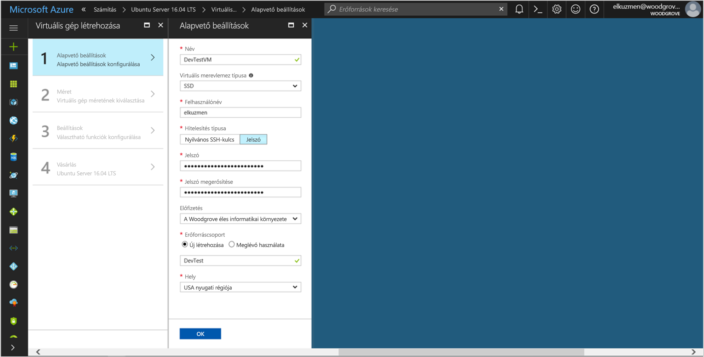

# <a name="use-a-linux-vm-managed-service-identity-to-access-azure-storage-via-access-key"></a>Azure Storage érhetnek el a hozzáférési kulcsot a Linux virtuális gép felügyelt Szolgáltatásidentitás segítségével

[!INCLUDE[preview-notice](../../includes/active-directory-msi-preview-notice.md)]

Ez az oktatóanyag bemutatja, hogyan engedélyezése felügyelt szolgáltatás identitásának (MSI) a Linux virtuális gép, majd identitásukat fiók tárelérési kulcsok beolvasása. A tárelérési kulcsokat a szokásos módon esetén a következőnek tárolási műveletek, például amikor a Storage szolgáltatás SDK használatával is használhatja. Ebben az oktatóanyagban azt le- és feltöltése blobok az Azure parancssori felület használatával. Megtudhatja, hogyan:

> [!div class="checklist"]
> * A Linux virtuális gépek MSI engedélyezése 
> * A virtuális gép hozzáférést biztosíthat a fiók tárelérési kulcsok az erőforrás-kezelőben 
> * Szereznie egy hozzáférési jogkivonatot, a virtuális gép azonosítójának használatával, és a tárelérési kulcsok beolvasása a Resource Manager használatával  

## <a name="prerequisites"></a>Előfeltételek

[!INCLUDE [msi-qs-configure-prereqs](../../includes/active-directory-msi-qs-configure-prereqs.md)]

[!INCLUDE [msi-tut-prereqs](../../includes/active-directory-msi-tut-prereqs.md)]

## <a name="sign-in-to-azure"></a>Bejelentkezés az Azure-ba
Jelentkezzen be az Azure portálon, a [https://portal.azure.com](https://portal.azure.com).


## <a name="create-a-linux-virtual-machine-in-a-new-resource-group"></a>Egy új erőforráscsoportot a Linux virtuális gép létrehozása

Ebben az oktatóanyagban létrehozhatunk egy új Linux virtuális Gépet. A meglévő virtuális MSI is engedélyezheti.

1. Kattintson a **/ hozzon létre új szolgáltatást** gomb az Azure portál bal felső sarkában található.
2. Válassza a **Számítás**, majd az **Ubuntu Server 16.04 LTS** elemet.
3. Adja meg a virtuális gép adatait. A **hitelesítési típus**, jelölje be **nyilvános SSH-kulcs** vagy **jelszó**. A létrehozott hitelesítő adatok lehetővé teszik-e jelentkezni a virtuális gép.

    

4. Válasszon egy **előfizetés** a virtuális gép meg a legördülő listában.
5. Jelölje be egy új **erőforráscsoport** szeretne létrehozni, válassza a virtuális gép **hozzon létre új**. Amikor végzett, kattintson az **OK** gombra.
6. Adja meg a virtuális gép számára. További méretek megtekintéséhez válasszon **összes** , vagy módosítsa a lemez típusát támogatott szűrő. A Beállítások panelen hagyja változatlanul az alapértelmezett beállításokat, és kattintson az **OK** gombra.

## <a name="enable-msi-on-your-vm"></a>A virtuális Gépen lévő MSI engedélyezése

A virtuális gép MSI hozzáférési jogkivonatok beolvasása az Azure AD meg szeretne adni a kód hitelesítő adatokat igénylő nélkül teszi lehetővé. A színfalak MSI engedélyezése két dolgot eredményez: az MSI-Virtuálisgép-bővítmény a virtuális Gépet telepít, és felügyelt identitás lehetővé teszi a virtuális gép számára.  

1. Keresse meg az erőforráscsoport a új virtuális gép, és válassza ki a virtuális gépet, az előző lépésben létrehozott.
2. Kattintson a virtuális gép "Beállítások" a bal oldali **konfigurációs**.
3. Regisztrálja, és engedélyezze a MSI-t, jelölje be **Igen**, ha szeretné letiltani, válassza a nem.
4. Győződjön meg arról, hogy kattintson **mentése** a konfiguráció mentéséhez.

    

5. Ha ellenőrizni szeretné mely bővítmények a virtuális Gépre, kattintson a **bővítmények**. Ha MSI engedélyezve van, a **ManagedIdentityExtensionforLinux** listájában jelenik meg.

    

## <a name="create-a-storage-account"></a>Create a storage account 

Ha még nem rendelkezik egy, most létrehoz egy tárfiókot.  Is ezt a lépést kihagyhatja, és a virtuális gép MSI hozzáférést biztosíthat a meglévő tárfiók kulcsait. 

1. Kattintson a **/ hozzon létre új szolgáltatást** gomb az Azure portál bal felső sarkában található.
2. Kattintson a **tárolási**, majd **Tárfiók**, és egy új, "Create a storage-fiók" panelen jelenik meg.
3. Adjon meg egy **neve** a tárfiók, amelyek később fogja használni.  
4. **Telepítési modell** és **fiók kind** meg "Erőforrás-kezelő" és "Általános célú", illetve. 
5. Győződjön meg arról a **előfizetés** és **erőforráscsoport** az előző lépésben a virtuális gép létrehozásakor megadott megfelelően.
6. Kattintson a **Create** (Létrehozás) gombra.

    

## <a name="create-a-blob-container-in-the-storage-account"></a>A tárfiók egy blob-tároló létrehozása

Később rendszer feltöltése és töltse le a fájlt az új tárfiókot. Mivel a szükséges blob-tároló fájlok, igazolnia kell a fájl tárolására blob tárolókat hozhat létre.

1. Lépjen vissza az újonnan létrehozott tárfiók.
2. Kattintson a **tárolók** hivatkozásra a bal oldali "Blob szolgáltatásban."
3. Kattintson a **+ tároló** tetején a lap és az "új tároló" panel diák ki.
4. Nevezze el a tároló, válassza ki a hozzáférési szintet, majd kattintson a **OK**. A megadott név az oktatóanyag későbbi részében fogja használni. 

    

## <a name="grant-your-vms-msi-access-to-use-storage-account-access-keys"></a>A virtuális gép MSI hozzáférést fiók tárelérési kulcsok használata

Az Azure Storage natív módon támogatja az Azure AD-alapú hitelesítés.  Azonban egy olyan MSI Csomaghoz használja a fiók tárelérési kulcsok beolvasása a Resource Manager, majd a kulcs segítségével érniük a tárhelyet.  Ebben a lépésben megadta a virtuális gép MSI hozzáférést a kulcsoknak a tárfiók.   

1. Lépjen vissza az újonnan létrehozott tárfiók.
2. Kattintson a **hozzáférés-vezérlés (IAM)** hivatkozás a bal oldali panelen.  
3. Kattintson a **+ Hozzáadás** fölött a lap egy új szerepkör-hozzárendelés hozzáadása a virtuális gép számára
4. Állítsa be **szerepkör** "Tárolási fiók kulcs operátor szolgáltatás szerepkörhöz", a lap jobb oldalán. 
5. A következő legördülő menüből, állítson be **való hozzáférés hozzárendelése** az erőforrás "Virtuális gép".  
6. A következő szerepel-e a megfelelő előfizetést a **előfizetés** legördülő menüből, majd állítsa be **erőforráscsoport** "Az összes erőforráscsoport" számára.  
7. Végezetül a **válasszon** meg a legördülő listában válassza ki a Linux virtuális gép, majd kattintson az **mentése**. 

    

## <a name="get-an-access-token-using-the-vms-identity-and-use-it-to-call-azure-resource-manager"></a>Szereznie egy hozzáférési jogkivonatot, a virtuális gép azonosítójának használatával, és hívja az Azure Resource Manager használatával

Az oktatóanyag a hátralévő azt fog működni a korábban létrehozott virtuális gépről.

Ezek a lépések elvégzéséhez szüksége lesz egy SSH-ügyfél. Windows használ, ha az SSH-ügyfél a használhatja a [Linux rendszerhez készült Windows alrendszer](https://msdn.microsoft.com/commandline/wsl/install_guide). Ha az SSH-ügyfél kulcsok konfigurálása segítségre van szüksége, tekintse meg [a Windows Azure használatára SSH-kulcsok hogyan](../virtual-machines/linux/ssh-from-windows.md), vagy [létrehozása, és az SSH nyilvános és titkos kulcsból álló kulcspárt használata a Linux virtuális gépek Azure-ban](../virtual-machines/linux/mac-create-ssh-keys.md).

1. Az Azure-portálon lépjen a **virtuális gépek**, keresse fel a Linux virtuális gépet, majd a a **áttekintése** kattintson **Connect** tetején. Másolja a karakterláncot, amellyel a virtuális Géphez csatlakozik. 
2. Csatlakoztassa a virtuális Gépet az SSH-ügyfél használatával.  
3. A következő kéri be a **jelszó** létrehozásakor hozzáadta a **Linux virtuális gép**. Meg kell majd lehet sikeres volt.  
4. CURL használatával szerezze be a hozzáférési tokent az Azure Resource Manager.  

    A CURL kérés- és a hozzáférési token nem éri el:
    
    ```bash
    curl http://localhost:50342/oauth2/token --data "resource=https://management.azure.com/" -H Metadata:true    
    ```
    
    > [!NOTE]
    > Az előző kérelem a "resource" paraméter értékének az Azure AD által várt pontosan egyeznie kell. Az Azure Resource Manager erőforrás-azonosító használata esetén meg kell adni a záró perjelet URI-n.
    > A következő reagálva a access_token elem szerint lettek rövidítve kivonatosan mutatja.
    
    ```bash
    {"access_token":"eyJ0eXAiOiJ...",
    "refresh_token":"",
    "expires_in":"3599",
    "expires_on":"1504130527",
    "not_before":"1504126627",
    "resource":"https://management.azure.com",
    "token_type":"Bearer"} 
     ```
    
## <a name="get-storage-account-access-keys-from-azure-resource-manager-to-make-storage-calls"></a>Fiók tárelérési kulcsok Azure Resource Manager tárolási hívásokat az beszerzése  

Mostantól a CURL használatával hívja az erőforrás-kezelőt a hozzáférési jogkivonat azt lekérése az előző szakaszban a tárelérési kulcs beolvasása. A tárelérési kulcs van, ha tárolási feltöltés/letöltés műveletet is nevezzük. Ügyeljen arra, hogy cserélje le a `<SUBSCRIPTION ID>`, `<RESOURCE GROUP>`, és `<STORAGE ACCOUNT NAME>` paraméterértékeket a saját értékekkel. Cserélje le a `<ACCESS TOKEN>` a korábban kapott hozzáférési jogkivonat értéket:

```bash 
curl https://management.azure.com/subscriptions/<SUBSCRIPTION ID>/resourceGroups/<RESOURCE GROUP>/providers/Microsoft.Storage/storageAccounts/<STORAGE ACCOUNT NAME>/listKeys?api-version=2016-12-01 –-request POST -d "" -H "Authorization: Bearer <ACCESS TOKEN>" 
```

> [!NOTE]
> Az előzetes URL-címben a szöveg kis-és nagybetűket, ezért győződjön meg arról, ha ennek megfelelően igazodjon felső-kisbetűk az erőforráscsoportok használ. Ezenkívül fontos, hogy ez egy POST kérést nem GET kérést, és adja meg egy értéket a korlát - d, amelyek NULL is lehet rögzíteni.  

A CURL válasz lehetővé teszi a listán szereplő kulcsokra:  

```bash 
{"keys":[{"keyName":"key1","permissions":"Full","value":"iqDPNt..."},{"keyName":"key2","permissions":"Full","value":"U+uI0B..."}]} 
```
Hozzon létre egy minta blob fájlt tölthet fel a blob storage tárolót. A Linux virtuális gép ehhez a következő paranccsal. 

```bash
echo "This is a test file." > test.txt
```

A következő hitelesítik magukat a CLI `az storage` parancsot a tárelérési kulcs használatával, és a fájl feltöltése a blob-tárolóhoz. Ebben a lépésben szüksége lesz a [a legújabb Azure parancssori felület telepítése](https://docs.microsoft.com/cli/azure/install-azure-cli) a virtuális gépen, ha még nem tette meg.
 

```azurecli-interactive
az storage blob upload -c <CONTAINER NAME> -n test.txt -f test.txt --account-name <STORAGE ACCOUNT NAME> --account-key <STORAGE ACCOUNT KEY>
```

Válasz: 

```JSON
Finished[#############################################################]  100.0000%
{
  "etag": "\"0x8D4F9929765C139\"",
  "lastModified": "2017-09-12T03:58:56+00:00"
}
```

Emellett letöltheti a fájlt az Azure parancssori felület használatával, és amely a hitelesítéshez a tárelérési kulcs. 

A kérelem: 

```azurecli-interactive
az storage blob download -c <CONTAINER NAME> -n test.txt -f test-download.txt --account-name <STORAGE ACCOUNT NAME> --account-key <STORAGE ACCOUNT KEY>
```

Válasz: 

```JSON
{
  "content": null,
  "metadata": {},
  "name": "test.txt",
  "properties": {
    "appendBlobCommittedBlockCount": null,
    "blobType": "BlockBlob",
    "contentLength": 21,
    "contentRange": "bytes 0-20/21",
    "contentSettings": {
      "cacheControl": null,
      "contentDisposition": null,
      "contentEncoding": null,
      "contentLanguage": null,
      "contentMd5": "LSghAvpnElYyfUdn7CO8aw==",
      "contentType": "text/plain"
    },
    "copy": {
      "completionTime": null,
      "id": null,
      "progress": null,
      "source": null,
      "status": null,
      "statusDescription": null
    },
    "etag": "\"0x8D5067F30D0C283\"",
    "lastModified": "2017-09-28T14:42:49+00:00",
    "lease": {
      "duration": null,
      "state": "available",
      "status": "unlocked"
    },
    "pageBlobSequenceNumber": null,
    "serverEncrypted": false
  },
  "snapshot": null
}
```

## <a name="next-steps"></a>Következő lépések

- MSI áttekintését lásd: [Szolgáltatásidentitás felügyelete – áttekintés](../active-directory/msi-overview.md).
- Ez a tároló SAS-hitelesítő adatok használatával ugyanezt az oktatóanyagot módjáról további tudnivalókért lásd: [egy Linux virtuális gép felügyelt szolgáltatás identitás használatával Azure Storage érhetnek el egy SAS-hitelesítő adat](msi-tutorial-linux-vm-access-storage-sas.md)
- Az Azure Storage-fiók SAS szolgáltatás kapcsolatos további információkért lásd:
  - [Közös hozzáférésű jogosultságkód (SAS) használatával](/azure/storage/common/storage-dotnet-shared-access-signature-part-1.md)
  - [A szolgáltatásalapú SAS létrehozása](/rest/api/storageservices/Constructing-a-Service-SAS.md)

Az alábbi Megjegyzések szakasz segítségével visszajelzést, és segítsen pontosítsa és a tartalom.
