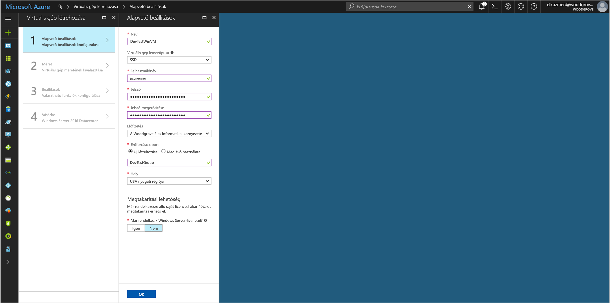
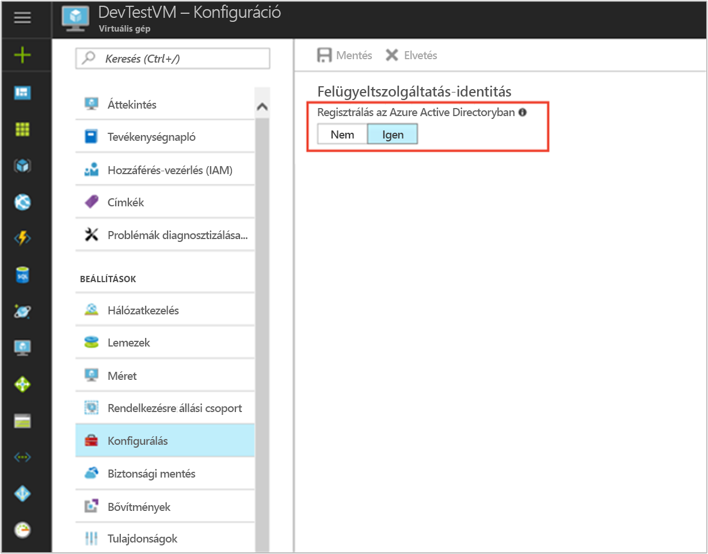

# <a name="use-a-windows-vm-managed-service-identity-msi-to-access-azure-data-lake-store"></a>Azure Data Lake Store eléréséhez használja a Windows virtuális gép felügyelt szolgáltatás identitásának (MSI)

[!INCLUDE[preview-notice](../../includes/active-directory-msi-preview-notice.md)]

Ez az oktatóanyag bemutatja, hogyan felügyelt szolgáltatás identitásának (MSI) egy Windows virtuális gép (VM) az Azure Data Lake Store elérésére használhat. Felügyelt szolgáltatás-identitások Azure automatikusan kezeli, és lehetővé teszik, hogy az Azure AD-alapú hitelesítés, anélkül, hogy a hitelesítő adatokat beszúrni a kódot támogató szolgáltatások hitelesítést. Az alábbiak végrehajtásának módját ismerheti meg:

> [!div class="checklist"]
> * Virtuális gép Windows MSI engedélyezése 
> * A virtuális gép hozzáférési jogot az Azure Data Lake Store
> * Szereznie egy hozzáférési jogkivonatot, a virtuális gép azonosítójának használatával, és az Azure Data Lake Store hozzáférhetne

## <a name="prerequisites"></a>Előfeltételek

[!INCLUDE [msi-qs-configure-prereqs](../../includes/active-directory-msi-qs-configure-prereqs.md)]

[!INCLUDE [msi-tut-prereqs](../../includes/active-directory-msi-tut-prereqs.md)]

## <a name="sign-in-to-azure"></a>Bejelentkezés az Azure-ba

Jelentkezzen be az Azure Portalra a [https://portal.azure.com](https://portal.azure.com) webhelyen.

## <a name="create-a-windows-virtual-machine-in-a-new-resource-group"></a>Windows virtuális gép egy új erőforráscsoport létrehozása

Ebben az oktatóanyagban azt hozzon létre egy új Windows virtuális Gépet.  A meglévő virtuális MSI is engedélyezheti.

1. Kattintson az Azure Portal bal felső sarkában található **Új** gombra.
2. Válassza a **Számítás**, majd a **Windows Server 2016 Datacenter** elemet. 
3. Adja meg a virtuális gép adatait. A **felhasználónév** és **jelszó** létrehozott itt van a hitelesítő adatok használatával jelentkezzen be a virtuális gép.
4. Válassza ki a megfelelő **előfizetés** a virtuális gép meg a legördülő listában.
5. Jelölje be egy új **erőforráscsoport** , amelyen a virtuális gép létrehozásához, **hozzon létre új**. Amikor végzett, kattintson az **OK** gombra.
6. Adja meg a virtuális gép számára. További méretek megjelenítéséhez válassza **Az összes megtekintése** lehetőséget, vagy módosítsa a **Támogatott lemeztípus** szűrőt. A beállítások lapon hagyja az alapértelmezett beállításokat, majd kattintson **OK**.

   

## <a name="enable-msi-on-your-vm"></a>A virtuális Gépen lévő MSI engedélyezése 

A virtuális gép MSI hozzáférési jogkivonatok beolvasása az Azure AD meg szeretne adni a kód hitelesítő adatokat igénylő nélkül teszi lehetővé. MSI engedélyezése közli az Azure-hoz létre egy felügyelt a virtuális gép számára. A színfalak MSI engedélyezése két dolgot eredményez: az MSI-Virtuálisgép-bővítmény a virtuális Gépet telepít, és lehetővé teszi, hogy az Azure Resource Manager MSI.

1. Válassza ki a **virtuális gép** , hogy szeretné-e engedélyezze MSI-t.  
2. A bal oldali navigációs sávon kattintson **konfigurációs**. 
3. Látni **Szolgáltatásidentitás felügyelt**. Regisztrálja, és engedélyezze a MSI-t, jelölje be **Igen**, ha szeretné letiltani, válassza a nem. 
4. Győződjön meg arról, hogy kattintson **mentése** a konfiguráció mentéséhez.  
   

5. Ha szeretné ellenőrizni, és a virtuális gép mely bővítmények ellenőrizze, kattintson a **bővítmények**. Ha MSI engedélyezve van, majd **ManagedIdentityExtensionforWindows** listájában jelenik meg.

   

## <a name="grant-your-vm-access-to-azure-data-lake-store"></a>A virtuális gép hozzáférési jogot az Azure Data Lake Store

Most is a virtuális gép hozzáférést a fájlokhoz és mappákhoz az az Azure Data Lake Store.  Ebben a lépésben egy meglévő Data Lake Store használatára, vagy hozzon létre egy újat.  Hozzon létre egy új Data Lake Store az Azure portál használatával, kövesse a [Azure Data Lake Store gyors üzembe helyezés](https://docs.microsoft.com/azure/data-lake-store/data-lake-store-get-started-portal). Is vannak, amelyek az Azure CLI és az Azure PowerShell quickstarts a [Azure Data Lake Store-dokumentáció](https://docs.microsoft.com/azure/data-lake-store/data-lake-store-overview).

A Data Lake Store-ban hozzon létre egy új mappát, és engedélyt ad a virtuális gép MSI olvasási, írási és futtat fájlokat abban a mappában:

1. Az Azure portálon kattintson **Data Lake Store** a bal oldali navigációs sáv.
2. Kattintson a Data Lake Store az oktatóanyag használni kívánt.
3. Kattintson a **adatkezelő** parancsra a parancssávon.
4. A Data Lake Store gyökérmappájában van kiválasztva.  Kattintson a **hozzáférés** parancsra a parancssávon.
5. Kattintson az **Add** (Hozzáadás) parancsra.  Az a **válasszon** mezőbe írja be például a virtuális gép neve **DevTestVM**.  Jelölje be a virtuális Gépet a keresési eredmények közül, majd kattintson a **válasszon**.
6. Kattintson a **engedélyként válassza**.  Válassza ki **olvasási** és **Execute**, hozzáadása **Ez a mappa**, és adja hozzá **csak olyan hozzáférési engedélyek**.  Kattintson az **OK** gombra.  Az engedély sikeresen hozzá kell adni.
7. Zárja be a **hozzáférés** panelen.
8. Ebben az oktatóanyagban hozzon létre egy új mappát.  Kattintson a **új mappa** a parancssávon, és adja meg az új mappa nevét, például **TestFolder**.  Kattintson az **OK** gombra.
9. Kattintson a létrehozott mappát, majd **hozzáférés** parancsra a parancssávon.
10. Hasonló a 5. lépésében kattintson a **hozzáadása**, a a **válassza** mezőben adja meg a virtuális gép nevét, válassza ki azt, és kattintson a **válassza**.
11. Hasonló a 6. lépés: kattintson a **Select engedélyeket**, jelölje be **olvasási**, **írási**, és **Execute**, adja hozzá **mappa**, és adja hozzá **egy hozzáférési engedélybejegyzés és egy alapértelmezett engedélybejegyzés**.  Kattintson az **OK** gombra.  Az engedély sikeresen hozzá kell adni.

A virtuális gép MSI most elvégezhetnek fájlokon létrehozott mappába.  A Data Lake Store elérését kezeléséről további információt a cikk elolvasása a [hozzáférés-vezérlés a Data Lake Store](https://docs.microsoft.com/azure/data-lake-store/data-lake-store-access-control).

## <a name="get-an-access-token-using-the-vm-msi-and-use-it-to-call-the-azure-data-lake-store-filesystem"></a>Szereznie egy hozzáférési jogkivonatot, a virtuális gép MSI-fájl használatával, és használja az Azure Data Lake Store-fájlrendszer hívása

Azure Data Lake Store natív módon támogatja az Azure AD hitelesítési, így közvetlenül elfogadása jogkivonatot kapott MSI-fájl használatával.  A Data Lake Store-fájlrendszer felé történő hitelesítésre küldése az Azure AD ki a Data Lake Store filesystem "Tulajdonosi < ACCESS_TOKEN_VALUE >" formátumú az Authorization fejlécet a végpont a hozzáférési tokent.  Az Azure AD-alapú hitelesítés Data Lake Store-támogatással kapcsolatos további tudnivalókért olvassa el a [hitelesítési a Data Lake Store az Azure Active Directoryval](https://docs.microsoft.com/azure/data-lake-store/data-lakes-store-authentication-using-azure-active-directory)

> [!NOTE]
> A Data Lake Store-fájlrendszer ügyfél SDK-k még nem támogatják a felügyelt szolgáltatás identitásának.  Ez az oktatóanyag frissítve lesz, ha támogatja az SDK-val.

Ebben az oktatóanyagban bejelentkezik a Data Lake Store-fájlrendszer REST API REST ellenőrizze a PowerShell használatával kéri. A virtuális gép MSI használnak a hitelesítéshez, meg kell a kéréseket a virtuális gépről.

1. A portálon lépjen a **virtuális gépek**, nyissa meg a Windows virtuális gépre, és a a **áttekintése** kattintson **Connect**.
2. Adja meg a **felhasználónév** és **jelszó** számára, amely hozzá van, a Windows virtuális gép létrehozása után. 
3. Most, hogy létrehozott egy **távoli asztali kapcsolat** nyissa meg a virtuális gép **PowerShell** a távoli munkamenet. 
4. A PowerShell használatával `Invoke-WebRequest`, indítson egy lekérdezést a helyi MSI-végpont az Azure Data Lake Store megszerezni az olyan hozzáférési jogkivonatot.  A Data Lake Store erőforrás-azonosító "https://datalake.azure.net/".  A Data Lake nem az erőforrás-azonosító a pontos egyezés, és a záró perjelet fontos.

   ```powershell
   $response = Invoke-WebRequest -Uri http://localhost:50342/oauth2/token -Method GET -Body @{resource="https://datalake.azure.net/"} -Headers @{Metadata="true"}
   ```
    
   A válasz egy JSON-objektumból átalakítása egy PowerShell-objektum. 
    
   ```powershell
   $content = $response.Content | ConvertFrom-Json
   ```

   Bontsa ki a hozzáférési jogkivonat a választ.
    
   ```powershell
   $AccessToken = $content.access_token
   ```

5. PowerShell "Invoke-WebRequest" használ, indítson egy lekérdezést a Data Lake Store REST-végpont a gyökérmappában található mappák listázásához.  Ez egyszerű módja ellenőrizze, hogy minden helyesen van-e állítva.  Fontos, a "Tulajdonos" karakterlánc a Authorization fejlécet tartalmaz egy nagy "B".  A Data Lake Store a neve található a **áttekintése** szakasza a Data Lake Store panelen az Azure portálon.

   ```powershell
   Invoke-WebRequest -Uri https://<YOUR_ADLS_NAME>.azuredatalakestore.net/webhdfs/v1/?op=LISTSTATUS -Headers @{Authorization="Bearer $AccessToken"}
   ```

   A sikeres válasz néz ki:

   ```powershell
   StatusCode        : 200
   StatusDescription : OK
   Content           : {"FileStatuses":{"FileStatus":[{"length":0,"pathSuffix":"TestFolder","type":"DIRECTORY", "blockSize":0,"accessTime":1507934941392, "modificationTime":1507944835699,"replication":0, "permission":"770","ow..."
   RawContent        : HTTP/1.1 200 OK
                       Pragma: no-cache
                       x-ms-request-id: b4b31e16-e968-46a1-879a-3474aa7d4528
                       x-ms-webhdfs-version: 17.04.22.00
                       Status: 0x0
                       X-Content-Type-Options: nosniff
                       Strict-Transport-Security: ma...
   Forms             : {}
   Headers           : {[Pragma, no-cache], [x-ms-request-id, b4b31e16-e968-46a1-879a-3474aa7d4528],
                       [x-ms-webhdfs-version, 17.04.22.00], [Status, 0x0]...}
   Images            : {}
   InputFields       : {}
   Links             : {}
   ParsedHtml        : System.__ComObject
   RawContentLength  : 556
   ```

6. Most megpróbálhatja, a fájl feltöltése a Data Lake Store.  Először hozzon létre a fájlt a feltöltéshez.

   ```powershell
   echo "Test file." > Test1.txt
   ```

7. A PowerShell használatával `Invoke-WebRequest`, indítson egy lekérdezést a Data Lake Store REST-végpont lehet feltölteni a fájlt a korábban létrehozott mappába.  A kérelem időt vesz igénybe, két lépésből áll.  Az első lépésben indítson egy lekérdezést, és ahol fel kell tölteni a fájlt a következő URL beolvasása.  A második lépésben a fájl ténylegesen feltöltése.  Fontos, hogy állítsa be a mappa nevét és a fájl megfelelően, ha különböző értékekkel ebben az oktatóanyagban használt. 

   ```powershell
   $HdfsRedirectResponse = Invoke-WebRequest -Uri https://<YOUR_ADLS_NAME>.azuredatalakestore.net/webhdfs/v1/TestFolder/Test1.txt?op=CREATE -Method PUT -Headers @{Authorization="Bearer $AccessToken"} -Infile Test1.txt -MaximumRedirection 0
   ```

   Ha nézze meg a értékének `$HdfsRedirectResponse` azt a következő válasz hasonlóan kell kinéznie:

   ```powershell
   PS C:\> $HdfsRedirectResponse

   StatusCode        : 307
   StatusDescription : Temporary Redirect
   Content           : {}
   RawContent        : HTTP/1.1 307 Temporary Redirect
                       Pragma: no-cache
                       x-ms-request-id: b7ab492f-b514-4483-aada-4aa0611d12b3
                       ContentLength: 0
                       x-ms-webhdfs-version: 17.04.22.00
                       Status: 0x0
                       X-Content-Type-Options: nosn...
   Headers           : {[Pragma, no-cache], [x-ms-request-id, b7ab492f-b514-4483-aada-4aa0611d12b3], 
                       [ContentLength, 0], [x-ms-webhdfs-version, 17.04.22.00]...}
   RawContentLength  : 0
   ```

   A feltöltés kérelem küldésével átirányítási végpont:

   ```powershell
   Invoke-WebRequest -Uri $HdfsRedirectResponse.Headers.Location -Method PUT -Headers @{Authorization="Bearer $AccessToken"} -Infile Test1.txt -MaximumRedirection 0
   ```

   A sikeres válasz megjelenését, például:

   ```powershell
   StatusCode        : 201
   StatusDescription : Created
   Content           : {}
   RawContent        : HTTP/1.1 201 Created
                       Pragma: no-cache
                       x-ms-request-id: 1e70f36f-ead1-4566-acfa-d0c3ec1e2307
                       ContentLength: 0
                       x-ms-webhdfs-version: 17.04.22.00
                       Status: 0x0
                       X-Content-Type-Options: nosniff
                       Strict...
   Headers           : {[Pragma, no-cache], [x-ms-request-id, 1e70f36f-ead1-4566-acfa-d0c3ec1e2307],
                       [ContentLength, 0], [x-ms-webhdfs-version, 17.04.22.00]...}
   RawContentLength  : 0
   ```

Más Data Lake Store-fájlrendszer API-k fűzze hozzá a fájlokhoz használ, töltse le a fájlokat, és több.

Gratulálunk!  A Data Lake Store-fájlrendszer használatával egy virtuális gép MSI már hitelesítve.

## <a name="related-content"></a>Kapcsolódó tartalom

- MSI áttekintését lásd: [Szolgáltatásidentitás felügyelete – áttekintés](../active-directory/msi-overview.md).
- A felügyeleti műveletek Data Lake Store az Azure Resource Managert használja.  További információk a virtuális gép MSI hitelesítésére az erőforrás-kezelő használatával, [egy Linux virtuális gép felügyelt szolgáltatás Identity (MSI) használatával férjenek hozzá a Resource Manager](https://docs.microsoft.com/azure/active-directory/msi-tutorial-linux-vm-access-arm).
- További információ [Azure Active Directory használatával a Data Lake Store hitelesítési](https://docs.microsoft.com/azure/data-lake-store/data-lakes-store-authentication-using-azure-active-directory).
- További információ [fájlrendszer-műveleteket a Azure Data Lake Store REST API használatával](https://docs.microsoft.com/azure/data-lake-store/data-lake-store-data-operations-rest-api) vagy a [WebHDFS fájlrendszer API-k](https://docs.microsoft.com/rest/api/datalakestore/webhdfs-filesystem-apis).
- További információ [hozzáférés-vezérlés a Data Lake Store](https://docs.microsoft.com/azure/data-lake-store/data-lake-store-access-control).

Az alábbi Megjegyzések szakasz segítségével visszajelzést, és segítsen pontosítsa és a tartalom.