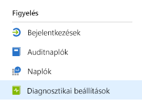
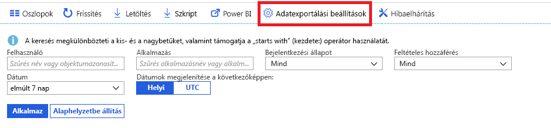

# Mit jelent az Azure Active Directory monitorozása?

Az Azure Active Directory (Azure AD) monitorozásával mostantól különböző végpontokra irányíthatja az Azure AD-tevékenységnaplókat. Ezután megőrizheti őket hosszú távú használatra, vagy külső biztonságiinformáció- és eseménykezelési (SIEM-) eszközökkel integrálva elemezheti a környezetet.

A naplókat jelenleg a következő helyekre irányíthatja:

- Egy Azure-tárfiók.
- Egy Azure-eseményközpontba, amelyen keresztül integrálhatja őket a Splunk- és Sumologic-példányokba.
- Egy Azure Log Analytics-munkaterületre, ahol elemezheti az adatokat, irányítópultokat készíthet, és riasztásokat hozhat létre a specifikus eseményekhez.

> [!VIDEO https://www.youtube.com/embed/syT-9KNfug8]

[!INCLUDE [azure-monitor-log-analytics-rebrand](../../../includes/azure-monitor-log-analytics-rebrand.md)]

## Diagnosztikai beállítások konfigurálása

Az Azure AD-tevékenységnaplók monitorozási beállításainak konfigurálásához először jelentkezzen be az [Azure Portalra](https://portal.azure.com), majd válassza az **Azure Active Directory** lehetőséget. Innen kétféleképpen érheti el a diagnosztikai beállítások konfigurációs oldalát:

* Válassza a **Diagnosztikai beállítások** lehetőséget a **Monitorozás** szakaszban.

    
    
* Válassza az **Auditnaplók** vagy a **Bejelentkezések**, majd a **Beállítások exportálása** lehetőséget. 

    

## Naplók átirányítása egy tárfiókba

Ha egy Azure-tárfiókba irányítja a naplókat, ott az [adatmegőrzési szabályzatainkban](reference-reports-data-retention.md) vázolt alapértelmezett megőrzési időtartamnál hosszabb ideig megőrizheti őket. További információ [az adatok a tárfiókokba való irányításáról](quickstart-azure-monitor-route-logs-to-storage-account.md).

## Naplók streamelése egy eseményközpontba

Ha egy Azure-eseményközpontba irányítja a naplókat, olyan külső SIEM-eszközökkel integrálhatja őket, mint a Sumologic és a Splunk. Ez az integráció lehetővé teszi, hogy az Azure AD-tevékenységek naplójának adatait kombinálja a SIEM által kezelt egyéb adatszolgáltatásokkal, így a környezet mélyebb betekintést biztosít. További információ [a naplók eseményközpontokba való streameléséről](tutorial-azure-monitor-stream-logs-to-event-hub.md).

## Naplók elküldése Azure Monitor naplókba

[Azure monitor a naplók](https://docs.microsoft.com/azure/log-analytics/log-analytics-overview) egy olyan megoldás, amely összevonta a különböző forrásokból származó megfigyelési adatok mennyiségét, és olyan lekérdezési nyelvet és elemzési motort biztosít, amely betekintést nyújt az alkalmazások és erőforrások működésére. Az Azure AD-tevékenység naplófájljainak Azure Monitor naplókba küldésével gyorsan lekérheti, figyelheti és riasztást gyűjthet az összegyűjtött adatokról. Megtudhatja, hogyan [küldhet adatküldést Azure monitor naplókba](howto-integrate-activity-logs-with-log-analytics.md).

Az Azure AD előre elkészített nézeteinek telepítésével monitorozhatja az olyan gyakori eseményeket, mint a bejelentkezések vagy a naplóesemények. Ismerje meg, hogyan [telepítheti és használhatja a log Analytics-nézeteket az Azure ad-tevékenységek naplóihoz](howto-install-use-log-analytics-views.md).

## További lépések

* [Tevékenységnaplók az Azure Monitorban](concept-activity-logs-azure-monitor.md)
* [Naplók streamelése egy eseményközpontba](tutorial-azure-monitor-stream-logs-to-event-hub.md)
* [Naplók elküldése Azure Monitor naplókba](howto-integrate-activity-logs-with-log-analytics.md)