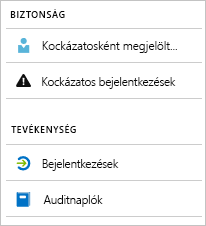

# Mi az Azure Active Directory-jelentés?

Az Azure Active Directory jelentésekkel betekintést nyerhet a környezet működésébe.  
A megadott adatokkal a következőket teheti:

- Meghatározhatja, hogy a felhasználók hogyan használják az alkalmazásokat és szolgáltatásokat
- Észlelheti a környezet állapotát befolyásoló lehetséges kockázatokat
- Elháríthatja azokat a hibákat, amelyek megakadályozzák a felhasználók munkavégzését  

A jelentéskészítési architektúra két alappillérre támaszkodik:

- Biztonsági jelentések
- Tevékenységjelentések

## Biztonsági jelentések

Az Azure Active Directory biztonsági jelentései segítenek a szervezet identitásainak védelmében.  
Az Azure Active Directoryban két típusú biztonsági jelentés létezik:

- **Kockázatosként megjelölt felhasználók** – A [kockázatosként megjelölt felhasználók biztonsági jelentésben](concept-user-at-risk.md) azon felhasználói fiókok áttekintését találja, amelyek biztonsága esetleg sérült.

- **Kockázatos bejelentkezések** – A [kockázatos bejelentkezés biztonsági jelentés](concept-risky-sign-ins.md) olyan bejelentkezési kísérleteket jelöl, amelyeket elképzelhető, hogy olyan személy hajtott végre, aki nem a felhasználói fiókok jogos tulajdonosa. 

**Milyen Azure AD-licencre van szükség a biztonsági jelentések eléréséhez?**  

Az Azure Active Directory minden kiadása biztosítja a kockázatosként megjelölt felhasználók és a kockázatos bejelentkezések jelentéseit.  
A jelentések részletességi szintje azonban különbözik a kiadások között: 

- Már az **Azure Active Directory ingyenes és alapszintű kiadásaiban** is szerepel a kockázatosként megjelölt felhasználók és a kockázatos bejelentkezések listája. 

- Az **Azure Active Directory 1. prémium** kiadása kibővíti ezt a modellt, mert lehetővé teszi azt is, hogy megvizsgáljon néhány, az egyes jelentésekhez észlelt mögöttes kockázatos eseményt. 

- Az **Azure Active Directory 2. prémium** kiadása nyújtja a legrészletesebb információkat a mögöttes kockázatos eseményekről, és lehetővé teszi olyan biztonsági házirendek konfigurálását, amelyek automatikusan, a konfigurált kockázati szinteknek megfelelően válaszolnak.

## Tevékenységjelentések

Az Azure Active Directoryban két típusú tevékenységjelentés létezik:

- **Naplók** – A [naplók tevékenységjelentés](concept-audit-logs.md) hozzáférést nyújt a bérlőn elvégzett összes feladat előzményeihez.

- **Bejelentkezések** – A [bejelentkezések tevékenységjelentéssel](concept-sign-ins.md) meghatározhatja, hogy ki hajtotta végre a naplók jelentés által jelentett feladatokat.

A **naplók jelentés** a rendszertevékenységek rekordjait tartalmazza megfelelőségi célokból. Ezek az adatok lehetővé teszik például a következő gyakori helyzetek kezelését:

- A bérlőmben valaki hozzáfért egy rendszergazdai csoporthoz. Ki biztosított neki hozzáférést? 

- Tudni szeretném az egy adott alkalmazásba bejelentkező felhasználók listáját, mert nemrég helyeztem üzembe az alkalmazást, és látni szeretném, hogy jól működik-e

- Tudni szeretném, hogy hány jelszó-visszaállítás történik a bérlőmön

**Milyen Azure AD-licencre van szükség a naplójelentéshez való hozzáféréshez?**  

A naplójelentés olyan szolgáltatásokhoz érhető el, amelyekhez licenccel rendelkezik. Ha rendelkezik licenccel egy adott szolgáltatáshoz, annak naplóinformációihoz is hozzáfér.

További részleteket az [Azure Active Directory funkciók és képességek](https://www.microsoft.com/cloud-platform/azure-active-directory-features) fejezet **Az ingyenes, alapszintű és prémium kiadások általánosan elérhető szolgáltatásainak összehasonlítása** szakaszában talál.   

A **bejelentkezési tevékenységjelentéssel** például a következő kérdésekre talál választ:

- Milyen egy adott felhasználó bejelentkezési mintázata?
- Hány felhasználó jelentkezett be egy adott héten?
- Milyen állapotúak ezek a bejelentkezések?

**Milyen Azure AD-licencre van szükség a bejelentkezési tevékenységjelentéshez való hozzáféréshez?**  

A bejelentkezési tevékenységjelentés eléréséhez a bérlőnek prémium szintű Azure AD-licenccel kell rendelkeznie.

## Szoftveres hozzáférés

A felhasználói felület mellett az Azure Active Directory jelentéskészítés a jelentésadatok [szoftveres hozzáférését](concept-reporting-api.md) is biztosítja. Ezen jelentések adatai nagyon hasznosak lehetnek az alkalmazások számára, például a SIEM rendszerekhez, a naplózáshoz és az üzleti intelligencia eszközökhöz. Az Azure AD-jelentéskészítés API-k REST-alapú API-kon keresztül biztosítják az adatok szoftveres hozzáférését. Különböző programnyelvekkel és eszközökkel hívhatja ezeket az API-kat. 

## További lépések

- [Kockázatos bejelentkezések jelentés](concept-risky-sign-ins.md)
- [Naplók jelentés](concept-audit-logs.md)
- [Bejelentkezési naplók jelentés](concept-sign-ins.md)