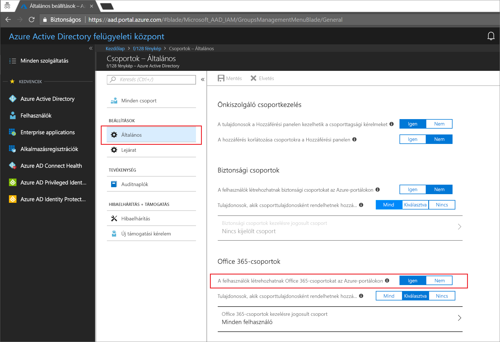
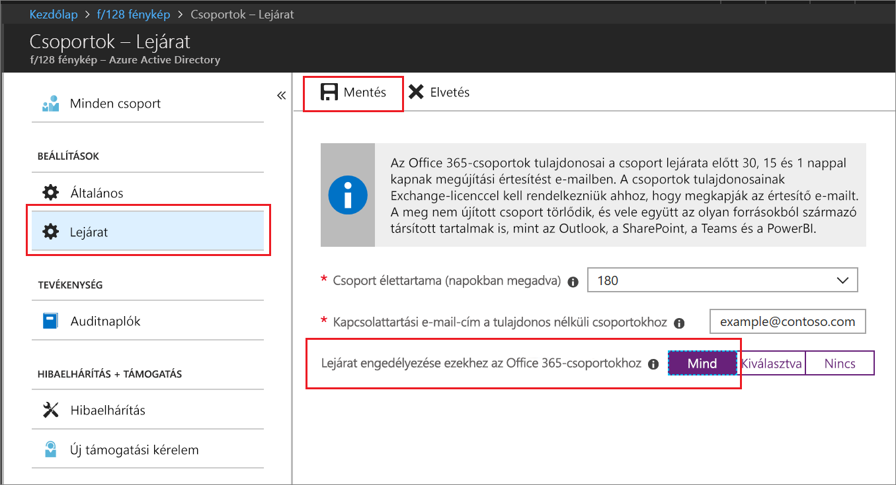

# Rövid útmutató: Az Office 365-csoportok elévülési idejének beállítása az Azure Active Directoryban

Ennek a rövid útmutatónak a segítségével beállíthatja az Office 365-csoportjainak elévülési szabályzatát. Ha a felhasználók beállíthatják a saját csoportjaikat, megsokszorozódhatnak a nem használt csoportok. A nem használt csoportok kezelésének egy módja, ha elévülési időt állít be hozzájuk, ezzel csökkentve a csoportok manuális törléséhez szükséges karbantartási időt.

Az elévülési szabályzat nem bonyolult:

* A csoporttulajdonosok értesítést kapnak, hogy újítsák meg az elévülő csoportjukat
* A meg nem újított csoport törlődik
* A törölt Office 365-csoportot a csoporttulajdonosok vagy az Azure AD-rendszergazdák 30 napig még visszaállíthatják.

Ha nem rendelkezik Azure-előfizetéssel, [hozzon létre egy ingyenes fiókot](https://azure.microsoft.com/free/) a feladatok megkezdése előtt.

## Előfeltétel

A csoportok elévülési idejének beállításához globális rendszergazdának vagy a felhasználói fiók adminisztrátorának kell lennie a bérlőben.

## Felhasználói létrehozás bekapcsolása a csoportokhoz

1. Jelentkezzen be az [Azure Portalra](https://portal.azure.com) egy olyan fiókkal, amely a címtár globális rendszergazdája vagy a felhasználói fiók adminisztrátora.

2. Válassza a **Csoportok**, majd az **Általános** elemet.
  
  

3. Állítsa **A felhasználók létrehozhatnak Office 365-csoportokat** elemet **Igen** értékűre.

4. Ha elkészült, a csoportbeállítások mentéséhez kattintson a **Mentés** gombra.

## Csoportok elévülésének beállítása

1. Az [Azure Portalon](https://portal.azure.com) válassza az **Azure Active Directory** > **Csoportok** >  **Elévülés** lehetőséget az elévülési beállítások megnyitásához.
  
  

2. Állítsa be az elévülési intervallumot. Válasszon ki egy előre beállított értéket, vagy adjon meg egy 31 napon túli egyéni értéket. 

3. Adjon meg egy e-mail-címet, ahova a rendszer az elévülési értesítéseket küldheti, ha egy csoportnak nincs tulajdonosa.

4. Ebben az útmutatóban állítsa be az **Elévülési idő engedélyezése ezekhez az Office 365-csoportokhoz** elemet **Mind** értékűre.

5. Ha elkészült, az elévülési beállítások mentéséhez kattintson a **Mentés** gombra.

Ennyi az egész! Ebben a rövid útmutatóban sikeresen beállította az elévülési szabályzatot a kijelölt Office 365-csoportokhoz.

## Az erőforrások eltávolítása

**Az elévülési szabályzat eltávolítása**

1. Győződjön meg arról, hogy be van jelentkezve az [Azure Portalra](https://portal.azure.com) a bérlő globális rendszergazdai fiókjával.
2. Válassza az **Azure Active Directory** > **Csoportok** > **Elévülés** elemet.
3. Állítsa az **Elévülési idő engedélyezése ezekhez az Office 365-csoportokhoz** elemet **Egyik sem** értékűre.

**Felhasználói létrehozás kikapcsolása a csoportokhoz**

1. Válassza az **Azure Active Directory** > **Csoportok** > **Általános** elemet. 
2. Állítsa be **A felhasználók létrehozhatnak Office 365-csoportokat az Azure-portálokon** elemet **Nem**értékűre.

## További lépések

Az elévüléssel kapcsolatos további információért, többek között a technikai korlátozásokról, az egyéni letiltott szavak listájának hozzáadásáról és az Office 365-alkalmazások végfelhasználói élményéről tekintse meg a következő cikket, amely az elévülési szabályzat részleteiről ad tájékoztatást:

> [!div class="nextstepaction"]
> [Az elévülési szabályzat részletei](groups-lifecycle.md)