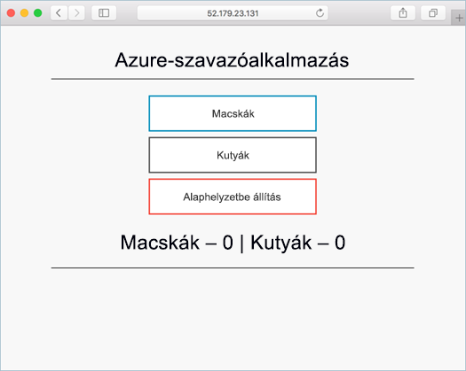
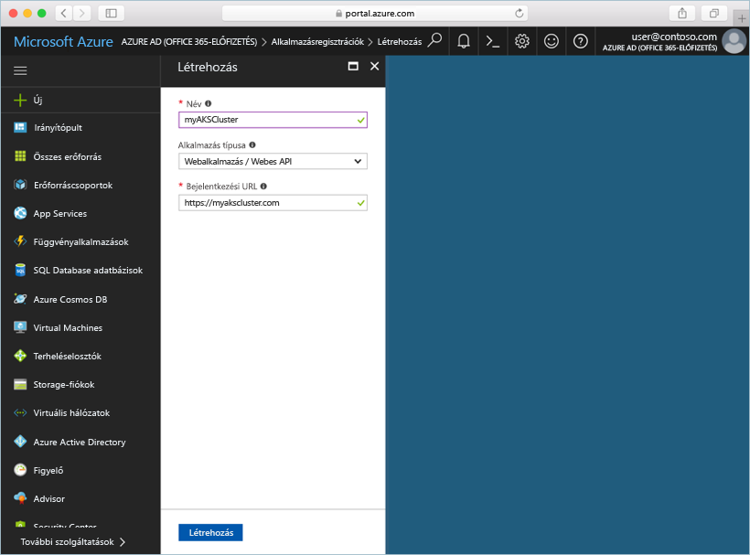
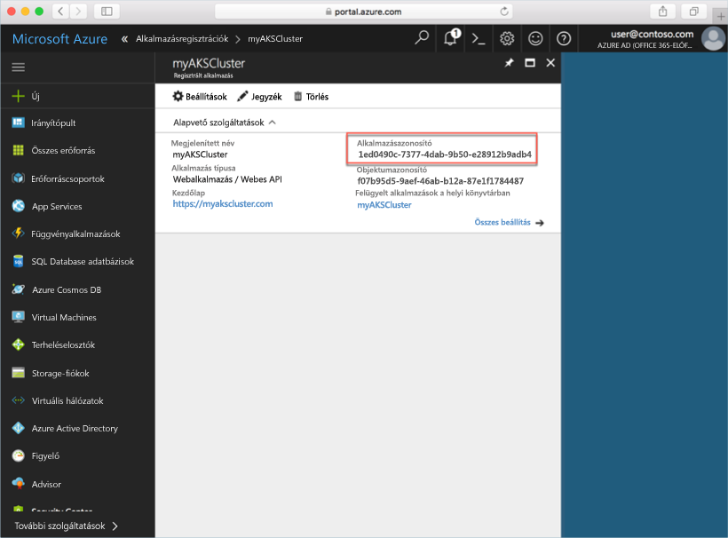
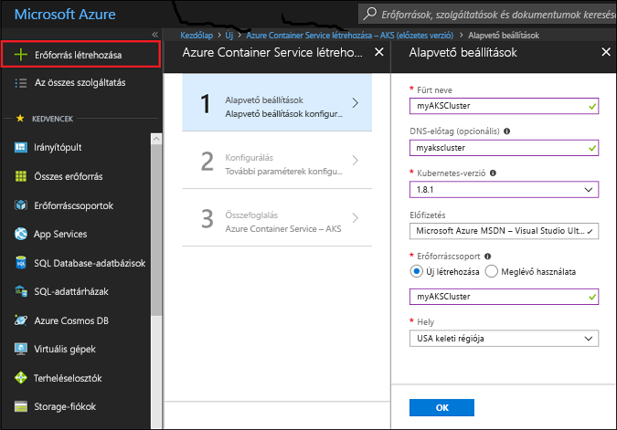
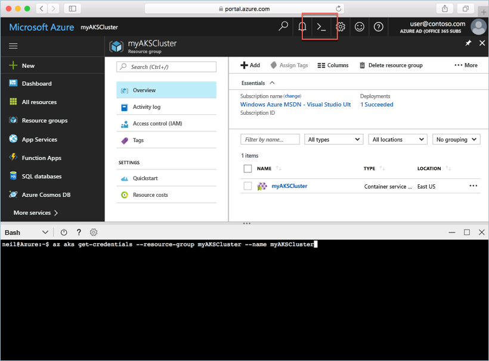

# <a name="deploy-an-azure-container-service-aks-cluster"></a>Azure Container Service- (AKS-) fürt üzembe helyezése

Ebben a rövid útmutatóban egy AKS-fürtöt helyezünk üzembe az Azure Portal használatával. Ezután egy webes előtérrendszert és egy Redis-példányt magában foglaló többtárolós alkalmazást futtatunk a fürtön. Miután végeztünk ezzel, az alkalmazás elérhető lesz az interneten.



A rövid útmutató feltételezi, hogy rendelkezik a Kubernetes használatára vonatkozó alapvető ismeretekkel. A Kubernetesszel kapcsolatos részletes információkért lásd a [Kubernetes dokumentációját][kubernetes-documentation].

## <a name="sign-in-to-azure"></a>Bejelentkezés az Azure-ba

Jelentkezzen be az Azure Portalra a http://portal.azure.com. webhelyen.

## <a name="create-service-principal"></a>Egyszerű szolgáltatás létrehozása

Mielőtt létrehozná az AKS-fürtöt az Azure Portalon, létre kell hoznia egy egyszerű szolgáltatást. Az Azure ezzel az egyszerű szolgáltatással kezeli az AKS-fürthöz társított infrastruktúrát.

Válassza az **Azure Active Directory** > **Alkalmazásregisztrációk** > **Új alkalmazás regisztrálása** lehetőséget.

Adjon egy nevet az alkalmazásnak. Ez bármilyen érték lehet. Válassza a **Webalkalmazás/API** lehetőséget az alkalmazás típusaként. Adjon egy értéket a **Bejelentkezési URL** beállításnál. Ez bármilyen, érvényes URL-formátumú érték lehet, de nem feltétlenül kell valódi végpontnak lennie.

Miután végzett, válassza a **Létrehozás** lehetőséget.



Válassza ki az újonnan létrehozott alkalmazásregisztrációt, és jegyezze fel az alkalmazás azonosítóját. Erre az értékre akkor lesz szükség, amikor az AKS-fürtöt létrehozza.



Ezt követően egy jelszót kell létrehozni az egyszerű szolgáltatás számára. Válassza ki az **Összes beállítás** > **Kulcsok** lehetőséget, és adjon meg bármilyen értéket a kulcs leírásánál. Válasszon ki egy időtartamot, amely alatt az egyszerű szolgáltatás érvényes.

Kattintson a **Mentés** parancsra, és jegyezze fel a jelszó értékét. Erre a jelszóra akkor lesz szüksége, amikor egy AKS-fürtöt hoz létre.


## <a name="create-aks-cluster"></a>AKS-fürt létrehozása

Válassza ki az **Új** > **Tárolók** > **Azure Container Service – AKS (előzetes verzió)** lehetőséget.

Adjon meg egy fürtnevet, egy DNS-előtagot, egy erőforráscsoport-nevet, egy helyet és egy Kubernetes-verziót a fürt számára. Jegyezze fel a fürt nevét és az erőforráscsoport nevét, mert ezekre szüksége lesz, amikor a fürthöz kapcsolódik.

Válassza az **OK** gombot, ha elkészült.



Adja meg a következőt a konfigurációs űrlapon:

- Felhasználónév – a fürtcsomópontokon található rendszergazdai fiókoknak adott név.
- Nyilvános SSH-kulcs – ahhoz a kulcshoz van társítva, amelyik a fürtcsomópontok elérésére szolgál.
- Egyszerű szolgáltatás ügyfél-azonosítója – az egyszerű szolgáltatás alkalmazásazonosítója, amelyet korábban hozott létre, a jelen dokumentum útmutatásai alapján.
- Egyszerű szolgáltatási titkos ügyfélkódja – az egyszerű szolgáltatás jelszava, amelyet korábban hozott lére, a jelen dokumentum útmutatásai alapján.
- Csomópontok száma – a létrehozandó AKS-csomópontok száma.
- A csomópont virtuális gépének mérete – virtuálisgép-méret az AKS-csomópontok számára.
- Rendszerlemez mérete – operációsrendszer-lemezméret az AKS-csomópontok számára.

Válassza az **OK** gombot, ha elkészült, és ha az ellenőrzés befejeződött, ismét az **OK** gombot.


Rövid várakozás után a rendszer üzembe helyezi a használatra kész AKS-fürtöt.

## <a name="connect-to-the-cluster"></a>Csatlakozás a fürthöz

Kubernetes-fürtök kezeléséhez használja a [kubectl][kubectl] eszközt, a Kubernetes parancssori ügyfelét. A kubectl-ügyfél előzetesen már telepítve van az Azure Cloud Shellben.

Nyissa meg a Cloud Shellt az Azure Portal jobb felső sarkában található gomb használatával.



Az [az aks get-credentials][az-aks-get-credentials] paranccsal konfigurálhatja a kubectl-t a Kubernetes-fürthöz való csatlakozásra.

Másolja és illessze be a következő parancsot a Cloud Shellbe. Ha szükséges, módosítsa az erőforráscsoport és a fürt nevét.

```azurecli-interactive
az aks get-credentials --resource-group myAKSCluster --name myAKSCluster
```

A fürthöz való csatlakozás ellenőrzéséhez használja a [kubectl get][kubectl-get] parancsot a fürtcsomópontok listájának lekéréséhez.

```azurecli-interactive
kubectl get nodes
```

Kimenet:

```
NAME                       STATUS    ROLES     AGE       VERSION
aks-agentpool-14693408-0   Ready     agent     6m        v1.8.1
aks-agentpool-14693408-1   Ready     agent     6m        v1.8.1
aks-agentpool-14693408-2   Ready     agent     7m        v1.8.1
```

## <a name="run-the-application"></a>Az alkalmazás futtatása

A Kubernetes-jegyzékfájl meghatározza a fürt célállapotát, például azt, hogy milyen tárolórendszerképeknek kell futniuk. Ebben a példában egy jegyzékfájlt használunk az Azure Vote alkalmazás futtatásához szükséges összes objektum létrehozásához.

Hozzon létre egy `azure-vote.yaml` nevű fájlt, és másolja bele a következő YAML-kódot. Ha az Azure Cloud Shellben dolgozik, ez a fájl a vi vagy a Nano segítségével hozható létre, ugyanúgy, mint egy virtuális vagy fizikai rendszeren.

```yaml
apiVersion: apps/v1beta1
kind: Deployment
metadata:
  name: azure-vote-back
spec:
  replicas: 1
  template:
    metadata:
      labels:
        app: azure-vote-back
    spec:
      containers:
      - name: azure-vote-back
        image: redis
        ports:
        - containerPort: 6379
          name: redis
---
apiVersion: v1
kind: Service
metadata:
  name: azure-vote-back
spec:
  ports:
  - port: 6379
  selector:
    app: azure-vote-back
---
apiVersion: apps/v1beta1
kind: Deployment
metadata:
  name: azure-vote-front
spec:
  replicas: 1
  template:
    metadata:
      labels:
        app: azure-vote-front
    spec:
      containers:
      - name: azure-vote-front
        image: microsoft/azure-vote-front:redis-v1
        ports:
        - containerPort: 80
        env:
        - name: REDIS
          value: "azure-vote-back"
---
apiVersion: v1
kind: Service
metadata:
  name: azure-vote-front
spec:
  type: LoadBalancer
  ports:
  - port: 80
  selector:
    app: azure-vote-front
```

Az alkalmazást a [kubectl create][kubectl-create] paranccsal futtathatja.

```azurecli-interactive
kubectl create -f azure-vote.yaml
```

Kimenet:

```
deployment "azure-vote-back" created
service "azure-vote-back" created
deployment "azure-vote-front" created
service "azure-vote-front" created
```

## <a name="test-the-application"></a>Az alkalmazás tesztelése

Az alkalmazás futtatásakor a rendszer létrehoz egy [Kubernetes-szolgáltatást][kubernetes-service], amely közzéteszi az alkalmazás-előteret az interneten. A folyamat eltarthat pár percig.

A folyamat állapotának monitorozásához használja [kubectl get service][kubectl-get] parancsot a `--watch` argumentummal.

```azurecli-interactive
kubectl get service azure-vote-front --watch
```

Kezdetben az *azure-vote-front* szolgáltatás *EXTERNAL-IP* értéke *pending* állapotú.

```
NAME               TYPE           CLUSTER-IP   EXTERNAL-IP   PORT(S)        AGE
azure-vote-front   LoadBalancer   10.0.37.27   <pending>     80:30572/TCP   6s
```

Miután az *EXTERNAL-IP* cím *pending* állapotról egy *IP-címre* változik, a `CTRL-C` billentyűparanccsal állítsa le a kubectl figyelési folyamatát.

```
azure-vote-front   LoadBalancer   10.0.37.27   52.179.23.131   80:30572/TCP   2m
```

Most a külső IP-címre léphet az Azure Vote alkalmazás megtekintéséhez.


## <a name="delete-cluster"></a>A fürt törlése

Ha a fürtre már nincs szükség, törölheti az erőforráscsoportot. Ezzel törli az összes társított erőforrást is. Ezt a műveletet az Azure Portalon végezheti el, ha kiválasztja az erőforráscsoportot, és a törlés gombra kattint. Ezenkívül az [az group delete][az-group-delete] parancsot is használhatja a Cloud Shellben.

```azurecli-interactive
az group delete --name myAKSCluster --no-wait
```

## <a name="get-the-code"></a>A kód letöltése

Ebben a rövid útmutatóban előre elkészített tárolórendszerképekkel hoztunk létre egy üzemelő Kubernetes-példányt. A kapcsolódó alkalmazáskód, Docker-fájl és Kubernetes-jegyzékfájl a GitHubon érhetőek el.

[https://github.com/Azure-Samples/azure-voting-app-redis][azure-vote-app]

## <a name="next-steps"></a>További lépések

Ebben a rövid útmutatóban egy Kubernetes-fürtöt és azon egy többtárolós alkalmazást helyezett üzembe.

Az AKS-sel kapcsolatos további információkért és a kódtól az üzembe helyezésig terjedő teljes útmutatóért folytassa a Kubernetes-fürtöket bemutató oktatóanyaggal.

> [!div class="nextstepaction"]
> [AKS-fürt kezelése][aks-tutorial]

<!-- LINKS - external -->
[azure-vote-app]: https://github.com/Azure-Samples/azure-voting-app-redis.git
[kubectl]: https://kubernetes.io/docs/user-guide/kubectl/
[kubectl-create]: https://kubernetes.io/docs/reference/generated/kubectl/kubectl-commands#create
[kubectl-get]: https://kubernetes.io/docs/reference/generated/kubectl/kubectl-commands#get
[kubernetes-documentation]: https://kubernetes.io/docs/home/
[kubernetes-service]: https://kubernetes.io/docs/concepts/services-networking/service/

<!-- LINKS - internal -->
[az-aks-get-credentials]: /cli/azure/aks?view=azure-cli-latest#az_aks_get_credentials
[az-group-delete]: /cli/azure/group#delete
[aks-tutorial]: ./tutorial-kubernetes-prepare-app.md


